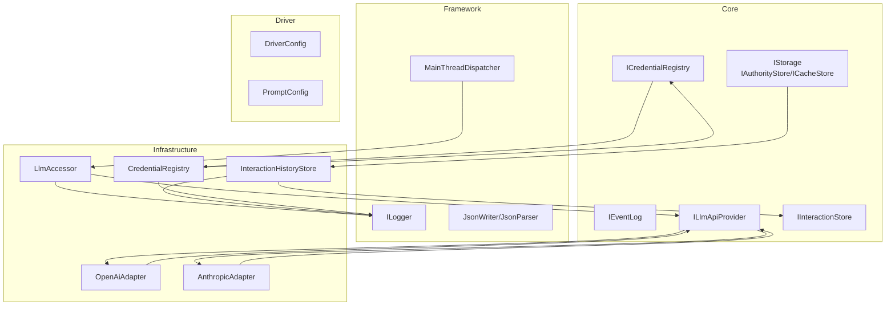
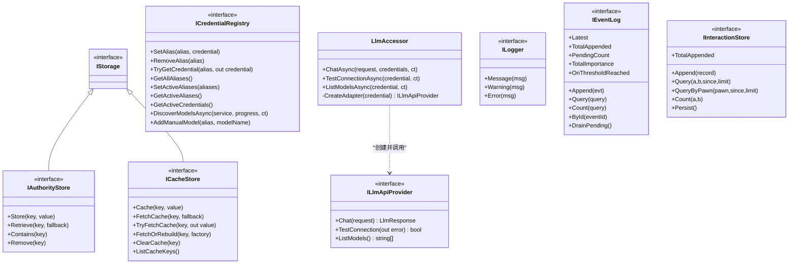
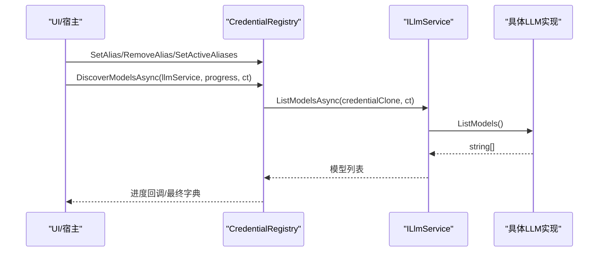
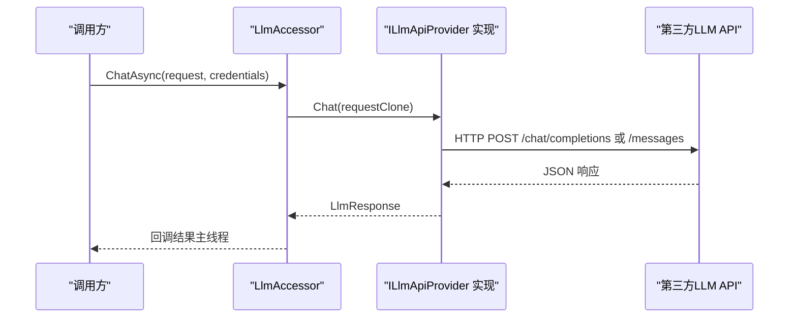
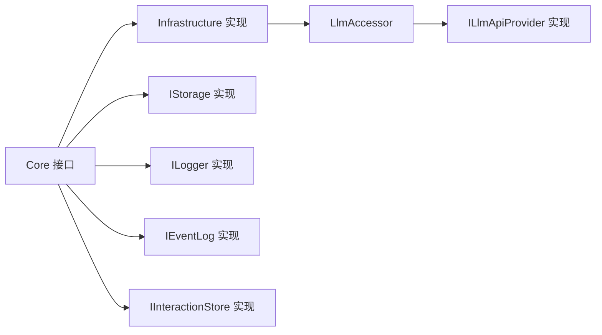

# 适配器开发指南

<cite>
**本文档引用的文件**
- [IStorage.cs](file://src/NPCLife/Core/IStorage.cs)
- [ICredentialRegistry.cs](file://src/NPCLife/Core/ICredentialRegistry.cs)
- [IEventLog.cs](file://src/NPCLife/Core/IEventLog.cs)
- [ILlmApiProvider.cs](file://src/NPCLife/Core/ILlmApiProvider.cs)
- [ILogger.cs](file://src/NPCLife/Framework/ILogger.cs)
- [CredentialRegistry.cs](file://src/NPCLife/Infrastructure/Llm/CredentialRegistry.cs)
- [OpenAiAdapter.cs](file://src/NPCLife/Infrastructure/Llm/OpenAiAdapter.cs)
- [AnthropicAdapter.cs](file://src/NPCLife/Infrastructure/Llm/AnthropicAdapter.cs)
- [LlmAccessor.cs](file://src/NPCLife/Infrastructure/Llm/LlmAccessor.cs)
- [LlmCredential.cs](file://src/NPCLife/Framework/Llm/LlmCredential.cs)
- [InteractionHistoryStore.cs](file://src/NPCLife/Infrastructure/InteractionHistoryStore.cs)
- [IInteractionStore.cs](file://src/NPCLife/Core/IInteractionStore.cs)
- [MainThreadDispatcher.cs](file://src/NPCLife/Framework/MainThreadDispatcher.cs)
- [README.md](file://README.md)
</cite>

## 目录
1. [简介](#简介)
2. [项目结构](#项目结构)
3. [核心组件](#核心组件)
4. [架构总览](#架构总览)
5. [详细组件分析](#详细组件分析)
6. [依赖关系分析](#依赖关系分析)
7. [性能考量](#性能考量)
8. [故障排查指南](#故障排查指南)
9. [结论](#结论)
10. [附录](#附录)

## 简介
本指南面向希望为 NPCLife 开发适配器的工程师，系统讲解以下适配器接口的设计原理与实现方法：
- 存储适配器（IAuthorityStore、ICacheStore）
- 凭证注册表适配器（ICredentialRegistry）
- 日志适配器（ILogger）
- LLM 适配器（ILlmApiProvider）
同时提供适配器注册与配置的最佳实践，以及对系统性能的影响与优化策略。

## 项目结构
NPCLife 采用清晰的分层与职责分离设计：
- Core 层：定义核心抽象接口（存储、事件日志、LLM、凭证注册表等）
- Framework 层：提供通用工具与基础设施（日志、主线程调度、JSON 工具等）
- Infrastructure 层：提供具体实现（LLM 适配器、凭证注册表、交互历史存储等）
- Driver 层：驱动配置与提示词配置
- Workspace 层：工作空间与角色协作
- Cards 层：卡牌与事件数据结构
- Tests：单元测试覆盖核心路径

**图表来源**
- [IStorage.cs:10-51](file://src/NPCLife/Core/IStorage.cs#L10-L51)
- [ICredentialRegistry.cs:20-100](file://src/NPCLife/Core/ICredentialRegistry.cs#L20-L100)
- [IEventLog.cs:12-50](file://src/NPCLife/Core/IEventLog.cs#L12-L50)
- [ILlmApiProvider.cs:12-35](file://src/NPCLife/Core/ILlmApiProvider.cs#L12-L35)
- [ILogger.cs:8-18](file://src/NPCLife/Framework/ILogger.cs#L8-L18)
- [LlmAccessor.cs:26-331](file://src/NPCLife/Infrastructure/Llm/LlmAccessor.cs#L26-L331)
- [OpenAiAdapter.cs:18-392](file://src/NPCLife/Infrastructure/Llm/OpenAiAdapter.cs#L18-L392)
- [AnthropicAdapter.cs:23-434](file://src/NPCLife/Infrastructure/Llm/AnthropicAdapter.cs#L23-L434)
- [CredentialRegistry.cs:20-327](file://src/NPCLife/Infrastructure/Llm/CredentialRegistry.cs#L20-L327)
- [InteractionHistoryStore.cs:16-185](file://src/NPCLife/Infrastructure/InteractionHistoryStore.cs#L16-L185)

**章节来源**
- [README.md:69-78](file://README.md#L69-L78)

## 核心组件
本节概述关键接口与实现，帮助快速定位适配器开发入口。

- 存储接口族
  - IAuthorityStore：权威存储（存档文件），数据不可丢失，缺失视为异常
  - ICacheStore：缓存存储（本地文件），数据可再生，缺失属正常情况
- 凭证注册表接口 ICredentialRegistry：管理“模型代号 → API 凭证三元组”的映射，支持别名、激活顺序、模型发现与持久化
- LLM 接口族
  - ILlmApiProvider：内部统一的 LLM API 提供者接口，负责请求格式转换与响应解析
  - ILlmService：对外暴露的 LLM 服务接口（LlmAccessor 实现）
  - LlmCredential：纯数据凭证对象，包含 baseUrl、apiKey、modelName、ProviderType、ExtraHeaders、TimeoutSeconds
- 日志接口 ILogger：统一日志输出接口，零外部依赖
- 事件日志接口 IEventLog：事件池的追加、查询与阈值激活能力
- 交互历史存储 IInteractionStore：交互流水的追加、查询与持久化

**章节来源**
- [IStorage.cs:10-51](file://src/NPCLife/Core/IStorage.cs#L10-L51)
- [ICredentialRegistry.cs:20-100](file://src/NPCLife/Core/ICredentialRegistry.cs#L20-L100)
- [ILlmApiProvider.cs:12-35](file://src/NPCLife/Core/ILlmApiProvider.cs#L12-L35)
- [ILogger.cs:8-18](file://src/NPCLife/Framework/ILogger.cs#L8-L18)
- [IEventLog.cs:12-50](file://src/NPCLife/Core/IEventLog.cs#L12-L50)
- [IInteractionStore.cs:11-51](file://src/NPCLife/Core/IInteractionStore.cs#L11-L51)
- [LlmCredential.cs:12-82](file://src/NPCLife/Framework/Llm/LlmCredential.cs#L12-L82)

## 架构总览
NPCLife 的适配器体系围绕“抽象接口 + 具体实现 + 访问器”三层展开：
- 抽象接口定义稳定契约，确保宿主可替换实现
- 具体实现封装第三方 API 差异（如 OpenAI 与 Anthropic）
- 访问器负责线程调度、多凭证回退、错误处理与回调派发

**图表来源**
- [IStorage.cs:10-51](file://src/NPCLife/Core/IStorage.cs#L10-L51)
- [ICredentialRegistry.cs:20-100](file://src/NPCLife/Core/ICredentialRegistry.cs#L20-L100)
- [ILlmApiProvider.cs:12-35](file://src/NPCLife/Core/ILlmApiProvider.cs#L12-L35)
- [LlmAccessor.cs:26-331](file://src/NPCLife/Infrastructure/Llm/LlmAccessor.cs#L26-L331)
- [ILogger.cs:8-18](file://src/NPCLife/Framework/ILogger.cs#L8-L18)
- [IEventLog.cs:12-50](file://src/NPCLife/Core/IEventLog.cs#L12-L50)
- [IInteractionStore.cs:11-51](file://src/NPCLife/Core/IInteractionStore.cs#L11-L51)

## 详细组件分析

### 存储适配器开发指南（IAuthorityStore、ICacheStore）
- 设计原则
  - 权威存储（IAuthorityStore）：数据不可丢失，缺失视为异常；适合存档文件
  - 缓存存储（ICacheStore）：数据可再生，缺失属正常；适合本地临时文件
- 数据持久化策略
  - 权威存储：严格错误处理，缺失即异常；实现应确保原子写入与一致性
  - 缓存存储：提供重建入口（FetchOrRebuild），降低冷启动成本
- 缓存机制
  - 支持命中/未命中判断（TryFetchCache）
  - 支持键枚举（ListCacheKeys）便于清理
  - 支持按需重建（factory），减少重复计算
- 实现建议
  - 使用二进制或紧凑 JSON 存储权威数据
  - 缓存数据可采用压缩与版本标记，避免脏读
  - 提供迁移与降级策略，保障升级兼容

**章节来源**
- [IStorage.cs:10-51](file://src/NPCLife/Core/IStorage.cs#L10-L51)

### 凭证注册表适配器（ICredentialRegistry）开发指南
- 职责边界
  - 别名管理：设置/移除/查找代号
  - 激活顺序：定义回退链路（Set/GetActiveAliases）
  - 模型发现：异步查询可用模型，支持进度回调
  - 持久化：Load/Save 由实现方决定存储后端
- 安全考虑
  - 凭证对象（LlmCredential）为纯数据，避免在内存中长期驻留敏感信息
  - 持久化时避免明文存储，必要时进行加密或哈希标识
  - 并发安全：使用锁保护内部状态，持久化动作异步执行
- 模型发现流程
  - 遍历激活的代号，逐一调用 ILlmService.ListModelsAsync
  - 过滤无效或不可用的代号，返回字典结构
- 手动模型注册
  - 针对不支持列表查询的 API（如 Anthropic），允许手动设置 modelName

**图表来源**
- [ICredentialRegistry.cs:89-92](file://src/NPCLife/Core/ICredentialRegistry.cs#L89-L92)
- [CredentialRegistry.cs:159-209](file://src/NPCLife/Infrastructure/Llm/CredentialRegistry.cs#L159-L209)

**章节来源**
- [ICredentialRegistry.cs:20-100](file://src/NPCLife/Core/ICredentialRegistry.cs#L20-L100)
- [CredentialRegistry.cs:20-327](file://src/NPCLife/Infrastructure/Llm/CredentialRegistry.cs#L20-L327)
- [LlmCredential.cs:12-82](file://src/NPCLife/Framework/Llm/LlmCredential.cs#L12-L82)

### 日志适配器开发指南（ILogger）
- 接口职责
  - 提供信息、警告、错误三个级别的日志输出
  - 零外部依赖，便于宿主注入具体实现
- 日志级别管理
  - Message：常规运行信息
  - Warning：潜在问题或回退路径
  - Error：异常或失败
- 最佳实践
  - 在关键路径（如 LLM 回退、持久化失败）使用 Warning/Error
  - 控制日志量，避免高频噪声
  - 与 MainThreadDispatcher 协同，避免 UI 线程阻塞

**章节来源**
- [ILogger.cs:8-18](file://src/NPCLife/Framework/ILogger.cs#L8-L18)
- [MainThreadDispatcher.cs:13-147](file://src/NPCLife/Framework/MainThreadDispatcher.cs#L13-L147)

### LLM 适配器开发模式（ILlmApiProvider）
- 设计模式
  - 每种 API 格式（OpenAI / Anthropic / 本地兼容）实现 ILlmApiProvider
  - 所有方法在工作线程中同步调用，由 LlmAccessor 管理线程调度
  - 对外暴露使用 ILlmService（LlmAccessor 实现）
- 请求格式转换
  - Chat：将内部统一格式转换为目标 API 的请求 JSON
  - OpenAI：标准 chat/completions；Anthropic：messages API，系统提示与工具调用格式不同
- 响应解析
  - 统一解析 choices/content/tool_calls/usage 等字段
  - 错误响应统一映射为 LlmResponse.Error
- 连接测试与模型列表
  - TestConnection：最小请求验证连通性
  - ListModels：部分 API 不支持，返回空数组

**图表来源**
- [LlmAccessor.cs:47-191](file://src/NPCLife/Infrastructure/Llm/LlmAccessor.cs#L47-L191)
- [OpenAiAdapter.cs:38-74](file://src/NPCLife/Infrastructure/Llm/OpenAiAdapter.cs#L38-L74)
- [AnthropicAdapter.cs:43-68](file://src/NPCLife/Infrastructure/Llm/AnthropicAdapter.cs#L43-L68)

**章节来源**
- [ILlmApiProvider.cs:12-35](file://src/NPCLife/Core/ILlmApiProvider.cs#L12-L35)
- [LlmAccessor.cs:26-331](file://src/NPCLife/Infrastructure/Llm/LlmAccessor.cs#L26-L331)
- [OpenAiAdapter.cs:18-392](file://src/NPCLife/Infrastructure/Llm/OpenAiAdapter.cs#L18-L392)
- [AnthropicAdapter.cs:23-434](file://src/NPCLife/Infrastructure/Llm/AnthropicAdapter.cs#L23-L434)

### 事件日志适配器（IEventLog）
- 语义
  - append-only 写入、按条件查询、pending 缓冲区阈值激活
  - 用于 AgentLoop 获取待处理事件并订阅激活通知
- 实现要点
  - 提供 Query/Count/Latest/ById 等查询能力
  - 支持 PendingCount/TotalImportance/DrainPending 的池化语义
  - OnThresholdReached 事件驱动被动激活

**章节来源**
- [IEventLog.cs:12-50](file://src/NPCLife/Core/IEventLog.cs#L12-L50)

### 交互历史存储适配器（IInteractionStore）
- 语义
  - append-only 流水，自然膨胀不裁剪，持久化到存档文件
  - 语义层 KV 由上层按需触发计算，写入 CacheStore
- 实现要点
  - Append/Query/QueryByPawn/Count/Persist
  - 持久化采用 AuthorityStore，序列化为 JSON 数组
  - 错误处理：加载/保存失败时记录 Warning

**章节来源**
- [IInteractionStore.cs:11-51](file://src/NPCLife/Core/IInteractionStore.cs#L11-L51)
- [InteractionHistoryStore.cs:16-185](file://src/NPCLife/Infrastructure/InteractionHistoryStore.cs#L16-L185)

## 依赖关系分析
- 低耦合高内聚
  - Core 接口定义稳定，Infrastructure 实现可替换
  - LlmAccessor 通过 ProviderType 动态选择适配器，避免硬编码
- 线程与回调
  - LlmAccessor 在后台线程执行，通过 MainThreadDispatcher 回调主线程
  - MainThreadDispatcher 限制队列大小，防止阻塞
- 持久化与缓存
  - AuthorityStore 用于存档级数据，ICacheStore 用于可再生缓存
  - CredentialRegistry 与 InteractionHistoryStore 分别承担凭证与交互历史的持久化

**图表来源**
- [LlmAccessor.cs:290-303](file://src/NPCLife/Infrastructure/Llm/LlmAccessor.cs#L290-L303)
- [MainThreadDispatcher.cs:46-108](file://src/NPCLife/Framework/MainThreadDispatcher.cs#L46-L108)
- [InteractionHistoryStore.cs:97-141](file://src/NPCLife/Infrastructure/InteractionHistoryStore.cs#L97-L141)

**章节来源**
- [LlmAccessor.cs:26-331](file://src/NPCLife/Infrastructure/Llm/LlmAccessor.cs#L26-L331)
- [MainThreadDispatcher.cs:13-147](file://src/NPCLife/Framework/MainThreadDispatcher.cs#L13-L147)

## 性能考量
- 线程与并发
  - LLM 调用在后台线程执行，避免阻塞 UI；通过 MainThreadDispatcher 回调主线程
  - 凭证注册表与交互历史存储使用锁保护，持久化异步执行
- 缓存与重建
  - ICacheStore 的 FetchOrRebuild 降低冷启动成本，避免重复计算
  - AuthorityStore 仅存放关键存档数据，减少 IO 压力
- 回退策略
  - LlmAccessor 支持多凭证回退，提升可用性与稳定性
- 日志开销
  - ILogger 仅在必要路径输出，避免高频噪声影响性能

**章节来源**
- [LlmAccessor.cs:114-191](file://src/NPCLife/Infrastructure/Llm/LlmAccessor.cs#L114-L191)
- [CredentialRegistry.cs:232-247](file://src/NPCLife/Infrastructure/Llm/CredentialRegistry.cs#L232-L247)
- [InteractionHistoryStore.cs:97-141](file://src/NPCLife/Infrastructure/InteractionHistoryStore.cs#L97-L141)
- [MainThreadDispatcher.cs:46-108](file://src/NPCLife/Framework/MainThreadDispatcher.cs#L46-L108)

## 故障排查指南
- LLM 连接失败
  - 使用 LlmAccessor.TestConnectionAsync 进行最小请求验证
  - 检查凭证（BaseUrl/ApiKey/ModelName）与 ProviderType
  - 查看适配器日志（Message/Warning/Error）定位错误
- 凭证持久化失败
  - CredentialRegistry 的 Persist 采用 try-catch，失败不影响运行
  - 检查存储后端（IAuthorityStore）是否可用
- 交互历史加载/保存失败
  - InteractionHistoryStore 在加载/保存异常时记录 Warning
  - 检查 AuthorityStore 的数据完整性与权限
- 主线程调度异常
  - MainThreadDispatcher 仅允许在主线程调用 DrainQueue
  - 超过队列上限会记录 Warning，注意控制回调频率

**章节来源**
- [LlmAccessor.cs:196-240](file://src/NPCLife/Infrastructure/Llm/LlmAccessor.cs#L196-L240)
- [CredentialRegistry.cs:232-247](file://src/NPCLife/Infrastructure/Llm/CredentialRegistry.cs#L232-L247)
- [InteractionHistoryStore.cs:113-140](file://src/NPCLife/Infrastructure/InteractionHistoryStore.cs#L113-L140)
- [MainThreadDispatcher.cs:62-108](file://src/NPCLife/Framework/MainThreadDispatcher.cs#L62-L108)

## 结论
通过抽象接口与访问器模式，NPCLife 将第三方 LLM、存储与日志等外部依赖解耦，使适配器开发具备高度可插拔性。开发者应重点关注：
- 严格遵循接口契约，确保线程安全与错误处理
- 合理设计持久化与缓存策略，平衡可靠性与性能
- 在适配器中做好请求/响应格式转换与错误映射
- 通过回退链路与日志体系提升系统的鲁棒性

## 附录
- 适配器注册与配置最佳实践
  - 在宿主初始化阶段注入 ILogger、IStorage、ILlmService 等实现
  - 凭证注册表通过 UI/配置向导设置别名与激活顺序
  - LLM 服务通过 LlmAccessor.ChatAsync 暴露统一调用入口
- 事件阈值与成本控制
  - 利用 IEventLog 的阈值激活减少不必要的 LLM 调用
  - 合理设置温度与工具调用，平衡创造性与稳定性

**章节来源**
- [README.md:69-78](file://README.md#L69-L78)
- [LlmAccessor.cs:47-71](file://src/NPCLife/Infrastructure/Llm/LlmAccessor.cs#L47-L71)
- [IEventLog.cs:34-49](file://src/NPCLife/Core/IEventLog.cs#L34-L49)