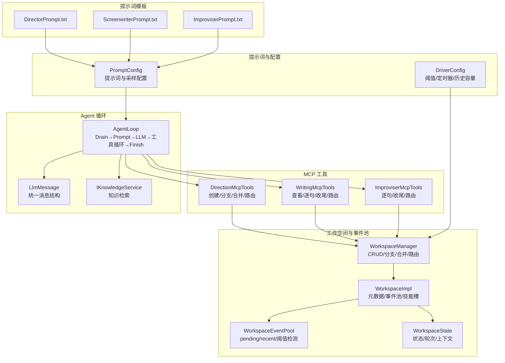
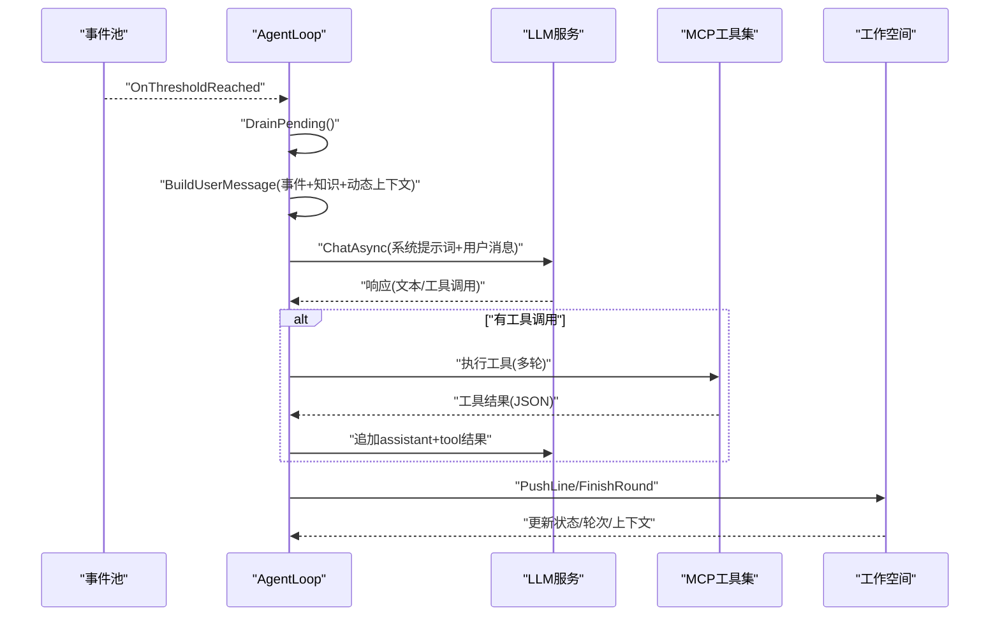
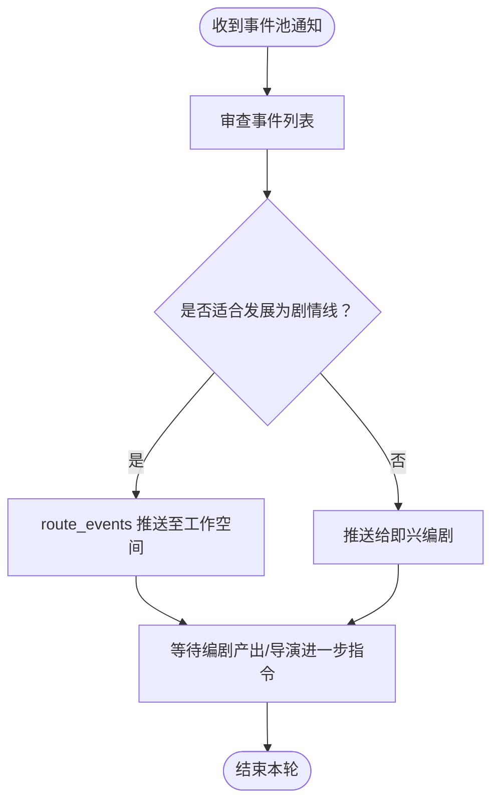
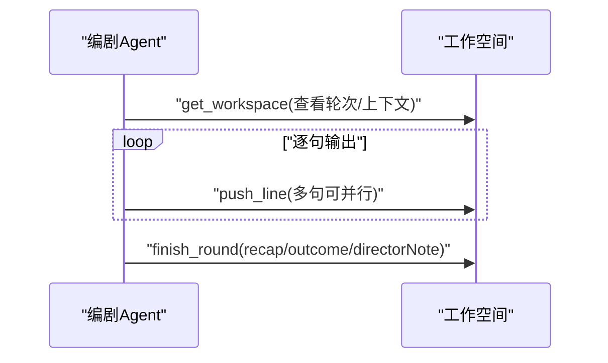
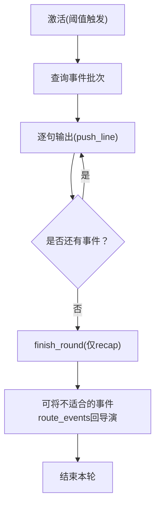
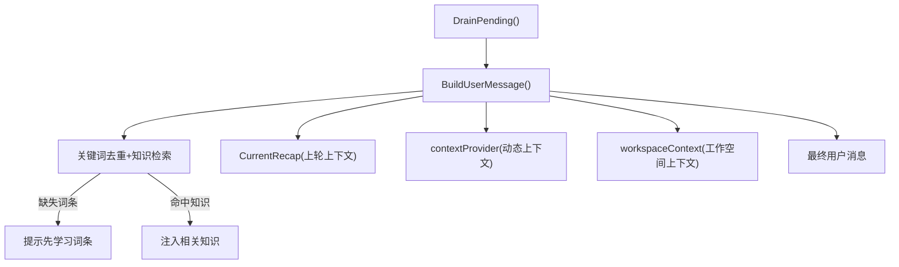
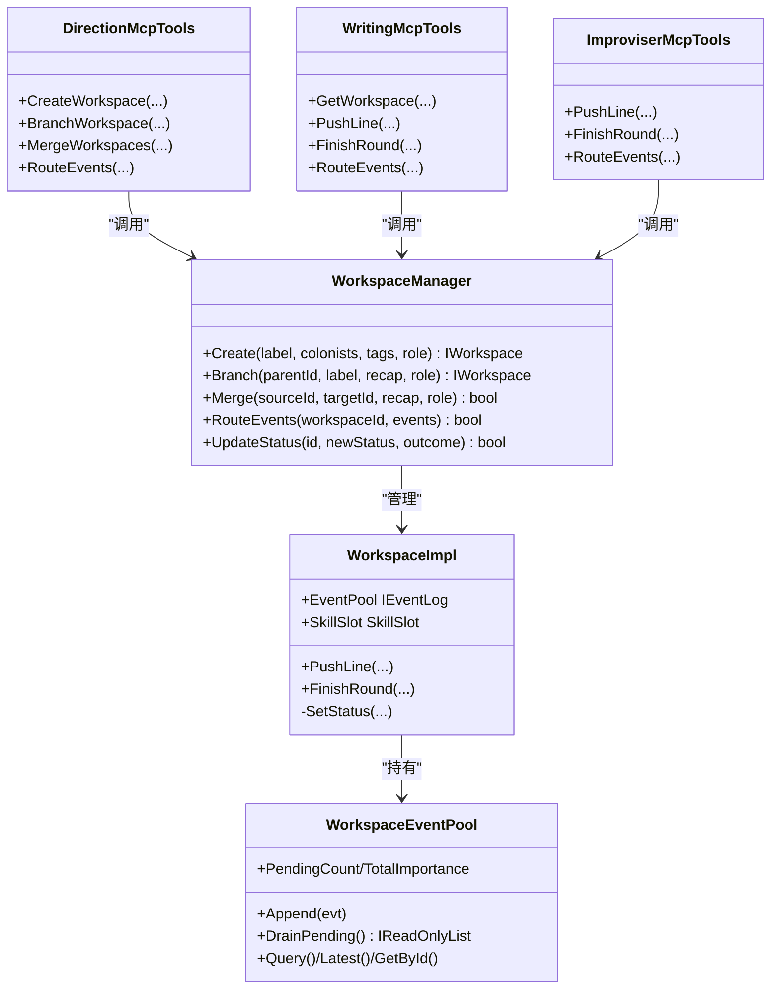
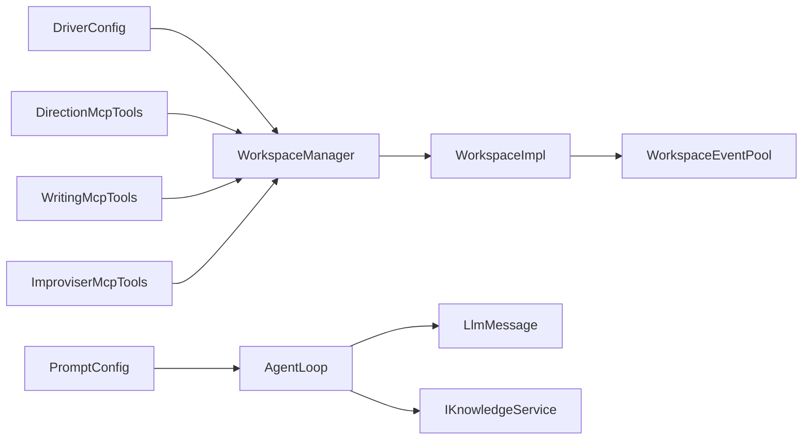

# 提示词系统

<cite>
**本文引用的文件**
- [DirectorPrompt.txt](file://src/NPCLife/Prompts/DirectorPrompt.txt)
- [ScreenwriterPrompt.txt](file://src/NPCLife/Prompts/ScreenwriterPrompt.txt)
- [ImproviserPrompt.txt](file://src/NPCLife/Prompts/ImproviserPrompt.txt)
- [PromptConfig.cs](file://src/NPCLife/Driver/PromptConfig.cs)
- [DriverConfig.cs](file://src/NPCLife/Driver/DriverConfig.cs)
- [WorkspaceManager.cs](file://src/NPCLife/Workspace/WorkspaceManager.cs)
- [WorkspaceImpl.cs](file://src/NPCLife/Workspace/WorkspaceImpl.cs)
- [WorkspaceState.cs](file://src/NPCLife/Workspace/WorkspaceState.cs)
- [WorkspaceEventPool.cs](file://src/NPCLife/Workspace/WorkspaceEventPool.cs)
- [DirectionMcpTools.cs](file://src/NPCLife/Workspace/DirectionMcpTools.cs)
- [WritingMcpTools.cs](file://src/NPCLife/Workspace/WritingMcpTools.cs)
- [ImproviserMcpTools.cs](file://src/NPCLife/Workspace/ImproviserMcpTools.cs)
- [RoleSkillProfile.cs](file://src/NPCLife/Workspace/RoleSkillProfile.cs)
- [AgentLoop.cs](file://src/NPCLife/Agent/AgentLoop.cs)
- [LlmMessage.cs](file://src/NPCLife/Framework/Llm/LlmMessage.cs)
- [IKnowledgeService.cs](file://src/NPCLife/Core/IKnowledgeService.cs)
</cite>

## 更新摘要
**所做更改**
- 更新了提示词模板文件引用，将 FreelancerPrompt.txt 更名为 WriterPrompt.txt
- 更新了临时编剧角色的提示词模板，强调叙事沉浸感而非临时任务概念
- 移除了 GetWorkspace 相关上下文管理，改为通过 AgentLoop 的 workspaceContext 参数注入
- 更新了即兴编剧（临时编剧）的工具集描述，移除了 get_workspace 工具调用需求
- 更新了工作空间状态管理，从 FocusCharacterIds 和 Tags 改为 ColonistIds

## 目录
1. [引言](#引言)
2. [项目结构](#项目结构)
3. [核心组件](#核心组件)
4. [架构总览](#架构总览)
5. [详细组件分析](#详细组件分析)
6. [依赖分析](#依赖分析)
7. [性能考虑](#性能考虑)
8. [故障排查指南](#故障排查指南)
9. [结论](#结论)
10. [附录](#附录)

## 引言
本文件系统化梳理 NPCLife 的提示词系统，围绕"导演""编剧""即兴编剧"三大 AI 角色，解释提示词设计原理、动态上下文注入机制、工作空间状态注入与历史事件回顾流程，并给出提示词优化方法论与实验验证流程，以及面向不同游戏类型的定制指南与质量评估改进策略。

**更新** 本次更新反映了提示词系统的重大变更：FreelancerPrompt.txt 重命名为 WriterPrompt.txt，强调叙事沉浸感而非临时任务概念，同时移除了 GetWorkspace 相关上下文管理，改为通过 AgentLoop 的 workspaceContext 参数进行动态注入。

## 项目结构
提示词系统由"提示词模板 + 配置 + 工作空间 + MCP 工具 + Agent 循环 + 知识服务"构成，形成"事件驱动 + 工具调用 + 叙事产出"的闭环。

**图表来源**
- [PromptConfig.cs:14-162](file://src/NPCLife/Driver/PromptConfig.cs#L14-L162)
- [DriverConfig.cs:9-106](file://src/NPCLife/Driver/DriverConfig.cs#L9-L106)
- [WorkspaceManager.cs:19-615](file://src/NPCLife/Workspace/WorkspaceManager.cs#L19-L615)
- [WorkspaceImpl.cs:16-196](file://src/NPCLife/Workspace/WorkspaceImpl.cs#L16-L196)
- [WorkspaceState.cs:94-151](file://src/NPCLife/Workspace/WorkspaceState.cs#L94-L151)
- [WorkspaceEventPool.cs:21-185](file://src/NPCLife/Workspace/WorkspaceEventPool.cs#L21-L185)
- [DirectionMcpTools.cs:16-459](file://src/NPCLife/Workspace/DirectionMcpTools.cs#L16-L459)
- [WritingMcpTools.cs:16-312](file://src/NPCLife/Workspace/WritingMcpTools.cs#L16-L312)
- [ImproviserMcpTools.cs:21-273](file://src/NPCLife/Workspace/ImproviserMcpTools.cs#L21-L273)
- [AgentLoop.cs:43-580](file://src/NPCLife/Agent/AgentLoop.cs#L43-L580)
- [LlmMessage.cs:8-62](file://src/NPCLife/Framework/Llm/LlmMessage.cs#L8-L62)
- [IKnowledgeService.cs:12-35](file://src/NPCLife/Core/IKnowledgeService.cs#L12-L35)

**章节来源**
- [PromptConfig.cs:14-162](file://src/NPCLife/Driver/PromptConfig.cs#L14-L162)
- [DriverConfig.cs:9-106](file://src/NPCLife/Driver/DriverConfig.cs#L9-L106)
- [WorkspaceManager.cs:19-615](file://src/NPCLife/Workspace/WorkspaceManager.cs#L19-L615)
- [WorkspaceImpl.cs:16-196](file://src/NPCLife/Workspace/WorkspaceImpl.cs#L16-L196)
- [WorkspaceState.cs:94-151](file://src/NPCLife/Workspace/WorkspaceState.cs#L94-L151)
- [WorkspaceEventPool.cs:21-185](file://src/NPCLife/Workspace/WorkspaceEventPool.cs#L21-L185)
- [DirectionMcpTools.cs:16-459](file://src/NPCLife/Workspace/DirectionMcpTools.cs#L16-L459)
- [WritingMcpTools.cs:16-312](file://src/NPCLife/Workspace/WritingMcpTools.cs#L16-L312)
- [ImproviserMcpTools.cs:21-273](file://src/NPCLife/Workspace/ImproviserMcpTools.cs#L21-L273)
- [AgentLoop.cs:43-580](file://src/NPCLife/Agent/AgentLoop.cs#L43-L580)
- [LlmMessage.cs:8-62](file://src/NPCLife/Framework/Llm/LlmMessage.cs#L8-L62)
- [IKnowledgeService.cs:12-35](file://src/NPCLife/Core/IKnowledgeService.cs#L12-L35)

## 核心组件
- 提示词与采样配置：集中管理三类角色的系统提示词与全局风格指令、采样温度，支持默认值回滚与 JSON 序列化。
- 工作空间与事件池：统一的上下文容器，承载事件、轮次、前情提要、状态与阈值触发；支持分支/合并/路由。
- MCP 工具：导演/编剧/即兴编剧各自专属工具集，提供结构化操作与叙事输出。
- Agent 循环：被动激活（阈值触发）、事件 Drain、动态上下文拼接、LLM 请求与工具调用循环、最终 Finish。
- 知识服务：关键词去重检索，缺失词条提示与相关知识注入，增强提示词的动态上下文。

**更新** 即兴编剧（临时编剧）工具集已更新为 ImproviserMcpTools，移除了 get_workspace 工具调用，改为通过 AgentLoop 的 workspaceContext 参数自动注入工作空间上下文。

**章节来源**
- [PromptConfig.cs:14-162](file://src/NPCLife/Driver/PromptConfig.cs#L14-L162)
- [WorkspaceManager.cs:19-615](file://src/NPCLife/Workspace/WorkspaceManager.cs#L19-L615)
- [WorkspaceEventPool.cs:21-185](file://src/NPCLife/Workspace/WorkspaceEventPool.cs#L21-L185)
- [DirectionMcpTools.cs:16-459](file://src/NPCLife/Workspace/DirectionMcpTools.cs#L16-L459)
- [WritingMcpTools.cs:16-312](file://src/NPCLife/Workspace/WritingMcpTools.cs#L16-L312)
- [ImproviserMcpTools.cs:21-273](file://src/NPCLife/Workspace/ImproviserMcpTools.cs#L21-L273)
- [AgentLoop.cs:43-580](file://src/NPCLife/Agent/AgentLoop.cs#L43-L580)
- [IKnowledgeService.cs:12-35](file://src/NPCLife/Core/IKnowledgeService.cs#L12-L35)

## 架构总览
提示词系统以"事件池阈值触发 + 动态上下文 + 工具调用 + 叙事产出"为核心流，三类角色通过不同的提示词与工具集协作，形成"结构决策（导演）→ 叙事创作（编剧）→ 快速响应（即兴编剧）"的流水线。

**图表来源**
- [AgentLoop.cs:171-337](file://src/NPCLife/Agent/AgentLoop.cs#L171-L337)
- [WorkspaceImpl.cs:83-182](file://src/NPCLife/Workspace/WorkspaceImpl.cs#L83-L182)
- [WritingMcpTools.cs:77-152](file://src/NPCLife/Workspace/WritingMcpTools.cs#L77-L152)
- [ImproviserMcpTools.cs:87-154](file://src/NPCLife/Workspace/ImproviserMcpTools.cs#L87-L154)

## 详细组件分析

### 导演提示词模板与设计要点
- 角色职责：审查事件、选择主线、路由到工作空间、必要时创建/分支/合并。
- 决策原则：事件相关性合并、参考编剧留言、无因果事件交给即兴编剧、可用分支/合并维持结构清晰。
- 事件路由：使用 route_events 将事件推送到目标工作空间；无合适空间则先 create_workspace 再推送。
- 关键要素：明确的结构管理边界、对"临时事件"的识别与分流、对"已有工作空间"的再利用策略。

**图表来源**
- [DirectorPrompt.txt:1-18](file://src/NPCLife/Prompts/DirectorPrompt.txt#L1-L18)
- [DirectionMcpTools.cs:291-361](file://src/NPCLife/Workspace/DirectionMcpTools.cs#L291-L361)

**章节来源**
- [DirectorPrompt.txt:1-18](file://src/NPCLife/Prompts/DirectorPrompt.txt#L1-L18)
- [DirectionMcpTools.cs:16-459](file://src/NPCLife/Workspace/DirectionMcpTools.cs#L16-L459)

### 编剧提示词模板与设计要点
- 角色职责：审查事件、调用查询工具获取上下文、逐句撰写台词、完成后 finish_round。
- 工作原则：优先 push_line 降低等待延迟；可并行多句减少往返；必须调用 finish_round；recap/ outcome/directorNote 必填；每次激活只推送 1 轮次。
- 关键要素：强调"逐句输出"的交互体验与"轮次收尾"的完整性；通过 directorNote 与导演沟通后续方向。

**图表来源**
- [ScreenwriterPrompt.txt:1-17](file://src/NPCLife/Prompts/ScreenwriterPrompt.txt#L1-L17)
- [WritingMcpTools.cs:48-152](file://src/NPCLife/Workspace/WritingMcpTools.cs#L48-L152)
- [WorkspaceImpl.cs:125-182](file://src/NPCLife/Workspace/WorkspaceImpl.cs#L125-L182)

**章节来源**
- [ScreenwriterPrompt.txt:1-17](file://src/NPCLife/Prompts/ScreenwriterPrompt.txt#L1-L17)
- [WritingMcpTools.cs:16-312](file://src/NPCLife/Workspace/WritingMcpTools.cs#L16-L312)
- [WorkspaceImpl.cs:83-182](file://src/NPCLife/Workspace/WorkspaceImpl.cs#L83-L182)

### 即兴编剧提示词模板与设计要点
- 角色职责：处理突发性、独立性事件；无需维护跨轮次剧情上下文；逐句输出后 finish_round。
- 工作原则：每次激活独立任务；叙事风格轻快、即兴；recap 只总结本次事件批次；可并行多句；完成后 finish_round；如事件更适合剧情线，用 route_events 推回导演。
- 关键要素：强调"轻量化""快速响应"，避免深度剧情绑定。
- **更新** 移除了 get_workspace 工具调用需求，改为通过 AgentLoop 的 workspaceContext 参数自动注入工作空间上下文。

**图表来源**
- [ImproviserPrompt.txt:1-16](file://src/NPCLife/Prompts/ImproviserPrompt.txt#L1-L16)
- [ImproviserMcpTools.cs:55-154](file://src/NPCLife/Workspace/ImproviserMcpTools.cs#L55-L154)

**章节来源**
- [ImproviserPrompt.txt:1-16](file://src/NPCLife/Prompts/ImproviserPrompt.txt#L1-L16)
- [ImproviserMcpTools.cs:21-273](file://src/NPCLife/Workspace/ImproviserMcpTools.cs#L21-L273)

### 动态上下文提供机制
- 事件与知识注入：AgentLoop 在构建用户消息时，将事件序列化、关键词去重后查询知识服务，缺失词条与相关知识一并注入提示词。
- 动态上下文回调：支持外部 contextProvider 回调，将额外状态注入到用户消息末尾。
- 工作空间状态注入：当前轮次的 CurrentRecap 作为"唯一上下文窗口"注入下一轮提示词，确保叙事连贯性。
- 历史事件回顾：事件池 recent 缓存支持按标签、角色、重要度、时间范围等条件查询，便于 Agent 选择性回顾。
- **更新** 移除了 GetWorkspace 相关上下文管理，改为通过 workspaceContext 参数注入工作空间元数据，消除不必要的 API 往返。

**图表来源**
- [AgentLoop.cs:455-539](file://src/NPCLife/Agent/AgentLoop.cs#L455-L539)
- [WorkspaceState.cs:123-124](file://src/NPCLife/Workspace/WorkspaceState.cs#L123-L124)
- [WorkspaceEventPool.cs:96-154](file://src/NPCLife/Workspace/WorkspaceEventPool.cs#L96-L154)
- [IKnowledgeService.cs:12-35](file://src/NPCLife/Core/IKnowledgeService.cs#L12-L35)

**章节来源**
- [AgentLoop.cs:455-539](file://src/NPCLife/Agent/AgentLoop.cs#L455-L539)
- [WorkspaceState.cs:123-124](file://src/NPCLife/Workspace/WorkspaceState.cs#L123-L124)
- [WorkspaceEventPool.cs:96-154](file://src/NPCLife/Workspace/WorkspaceEventPool.cs#L96-L154)
- [IKnowledgeService.cs:12-35](file://src/NPCLife/Core/IKnowledgeService.cs#L12-L35)

### 工作空间与事件路由
- 工作空间管理：支持创建、分支、合并、生命周期管理；状态机严格控制流转；支持 DirectorMessage 作为编剧对导演的反馈。
- 事件路由：支持源工作空间到目标工作空间的事件转移，可附加留言与关键词；路由后事件从源池移除，目标池接收并触发阈值。
- 阈值与定时器：分角色的事件数量与重要度阈值，以及导演/即兴编剧的定时器脉冲，共同决定 Agent 的激活时机。
- **更新** 工作空间状态从 FocusCharacterIds 和 Tags 改为 ColonistIds，简化了角色管理和事件聚焦机制。

**图表来源**
- [WorkspaceManager.cs:19-615](file://src/NPCLife/Workspace/WorkspaceManager.cs#L19-L615)
- [WorkspaceImpl.cs:16-196](file://src/NPCLife/Workspace/WorkspaceImpl.cs#L16-L196)
- [WorkspaceEventPool.cs:21-185](file://src/NPCLife/Workspace/WorkspaceEventPool.cs#L21-L185)
- [DirectionMcpTools.cs:16-459](file://src/NPCLife/Workspace/DirectionMcpTools.cs#L16-L459)
- [WritingMcpTools.cs:16-312](file://src/NPCLife/Workspace/WritingMcpTools.cs#L16-L312)
- [ImproviserMcpTools.cs:21-273](file://src/NPCLife/Workspace/ImproviserMcpTools.cs#L21-L273)

**章节来源**
- [WorkspaceManager.cs:19-615](file://src/NPCLife/Workspace/WorkspaceManager.cs#L19-L615)
- [WorkspaceImpl.cs:16-196](file://src/NPCLife/Workspace/WorkspaceImpl.cs#L16-L196)
- [WorkspaceEventPool.cs:21-185](file://src/NPCLife/Workspace/WorkspaceEventPool.cs#L21-L185)
- [DirectionMcpTools.cs:16-459](file://src/NPCLife/Workspace/DirectionMcpTools.cs#L16-L459)
- [WritingMcpTools.cs:16-312](file://src/NPCLife/Workspace/WritingMcpTools.cs#L16-L312)
- [ImproviserMcpTools.cs:21-273](file://src/NPCLife/Workspace/ImproviserMcpTools.cs#L21-L273)

### 提示词优化方法论与实验验证流程
- 方法论
  - A/B 测试：对比默认提示词与优化版本在"产出质量/轮次长度/导演满意度"指标上的差异。
  - 关键词注入：验证"缺失词条提示 + 相关知识注入"对叙事一致性与可信度的提升。
  - 温度与轮次：在 PromptConfig 中调整 Temperature 与 DriverConfig.MaxAgentRounds，观察稳定性与创造性平衡。
  - 角色分工校准：根据实际业务反馈，微调导演/编剧/即兴编剧的职责边界与工具可用性。
- 实验流程
  - 准备对照组：默认提示词 + 默认配置；实验组：优化提示词 + 适当参数调整。
  - 数据采集：轮次数、每轮工具调用次数、Finish 指令成功率、DirectorMessage 评分、玩家反馈。
  - 统计分析：t检验/效应量，结合定性评价（剧本流畅度、角色一致性、节奏感）。
  - 迭代闭环：基于实验结果回写提示词与配置，持续收敛。

### 针对不同游戏类型的提示词定制指南
- 策略/战争类：强调"事件因果链""阵营关系""战术影响"。提示词中增加"冲突升级/联盟破裂/资源争夺"等关键词引导，配合导演的分支/合并能力拆解复杂战局。
- 生存/基地类：强调"生存压力""资源分配""角色心理"。提示词中突出"饥饿/疾病/设施损坏"等事件的重要性阈值，编剧侧重角色情感与日常细节。
- 恋爱/社交类：强调"关系弧线""个人动机""社交博弈"。提示词中加入"好感度/立场/秘密"等维度，即兴编剧负责日常互动的即兴与轻快节奏。
- 冒险/探索类：强调"未知事件""探索发现""团队分歧"。提示词中鼓励"不确定性""多结局""角色成长"，导演负责主线与支线的平衡。

### 提示词质量对叙事生成效果的影响与改进策略
- 影响因素
  - 角色边界清晰度：角色职责越明确，工具调用越精准，叙事质量越稳定。
  - 上下文窗口有效性：CurrentRecap 与知识注入的质量直接影响 LLM 的连贯性与准确性。
  - 工具可用性：技能集与阈值设置决定 Agent 的"能做什么"和"何时做"。
- 改进策略
  - 定期审计提示词：基于实验数据与反馈，迭代角色职责与原则表述。
  - 强化知识闭环：完善缺失词条提示与知识入库流程，减少"无知识可依"的场景。
  - 参数稳健性：在高负载/不稳定网络下，适度提高 MaxAgentRounds 与温度，保障完成率。

## 依赖分析
提示词系统的关键依赖关系如下：

**图表来源**
- [PromptConfig.cs:14-162](file://src/NPCLife/Driver/PromptConfig.cs#L14-L162)
- [DriverConfig.cs:9-106](file://src/NPCLife/Driver/DriverConfig.cs#L9-L106)
- [AgentLoop.cs:43-580](file://src/NPCLife/Agent/AgentLoop.cs#L43-L580)
- [WorkspaceManager.cs:19-615](file://src/NPCLife/Workspace/WorkspaceManager.cs#L19-L615)
- [WorkspaceImpl.cs:16-196](file://src/NPCLife/Workspace/WorkspaceImpl.cs#L16-L196)
- [WorkspaceEventPool.cs:21-185](file://src/NPCLife/Workspace/WorkspaceEventPool.cs#L21-L185)
- [LlmMessage.cs:8-62](file://src/NPCLife/Framework/Llm/LlmMessage.cs#L8-L62)
- [IKnowledgeService.cs:12-35](file://src/NPCLife/Core/IKnowledgeService.cs#L12-L35)
- [DirectionMcpTools.cs:16-459](file://src/NPCLife/Workspace/DirectionMcpTools.cs#L16-L459)
- [WritingMcpTools.cs:16-312](file://src/NPCLife/Workspace/WritingMcpTools.cs#L16-L312)
- [ImproviserMcpTools.cs:21-273](file://src/NPCLife/Workspace/ImproviserMcpTools.cs#L21-L273)

**章节来源**
- [PromptConfig.cs:14-162](file://src/NPCLife/Driver/PromptConfig.cs#L14-L162)
- [DriverConfig.cs:9-106](file://src/NPCLife/Driver/DriverConfig.cs#L9-L106)
- [AgentLoop.cs:43-580](file://src/NPCLife/Agent/AgentLoop.cs#L43-L580)
- [WorkspaceManager.cs:19-615](file://src/NPCLife/Workspace/WorkspaceManager.cs#L19-L615)
- [WorkspaceImpl.cs:16-196](file://src/NPCLife/Workspace/WorkspaceImpl.cs#L16-L196)
- [WorkspaceEventPool.cs:21-185](file://src/NPCLife/Workspace/WorkspaceEventPool.cs#L21-L185)
- [LlmMessage.cs:8-62](file://src/NPCLife/Framework/Llm/LlmMessage.cs#L8-L62)
- [IKnowledgeService.cs:12-35](file://src/NPCLife/Core/IKnowledgeService.cs#L12-L35)
- [DirectionMcpTools.cs:16-459](file://src/NPCLife/Workspace/DirectionMcpTools.cs#L16-L459)
- [WritingMcpTools.cs:16-312](file://src/NPCLife/Workspace/WritingMcpTools.cs#L16-L312)
- [ImproviserMcpTools.cs:21-273](file://src/NPCLife/Workspace/ImproviserMcpTools.cs#L21-L273)

## 性能考虑
- 事件池阈值：合理设置分角色阈值与定时器脉冲，避免过早/过晚激活导致的延迟或资源浪费。
- 工具调用批量化：编剧/即兴编剧可并行调用多句 push_line，减少往返；注意 LLM 上下文长度限制。
- 知识检索成本：关键词去重与批量查询可显著降低重复检索；缺失词条提示有助于减少无效查询。
- 最大轮次限制：防止长链路工具调用导致的超时与资源占用，保障系统稳定性。
- **更新** 移除 GetWorkspace 工具调用减少了 API 往返开销，提升了整体性能。

## 故障排查指南
- AgentLoop 状态异常
  - 症状：长时间处于 DrainingEvents/CallingLlm 等状态。
  - 排查：检查凭证注册表是否为空、工具调用是否被拦截、消息历史是否通过 TranscriptValidator 校验。
- 事件未被消费
  - 症状：事件池 PendingCount 持续增长。
  - 排查：确认阈值是否满足、OnThresholdReached 是否触发、工作空间是否处于 Active 状态。
- 工具调用失败
  - 症状：工具返回错误或被拦截。
  - 排查：检查工具名与参数、MCP 注册表、AgentPipeline 拦截器状态。
- 叙事产出异常
  - 症状：FinishRound 后上下文未更新或轮次缺失。
  - 排查：确认 WorkspaceImpl 的 FinishRound 调用路径、事件路由是否正确、DirectorMessage 是否按要求填写。
- **更新** 即兴编剧工具集故障排查：确认 workspaceContext 参数是否正确注入工作空间元数据，检查 push_line 和 finish_round 调用是否符合新的角色职责。

**章节来源**
- [AgentLoop.cs:171-396](file://src/NPCLife/Agent/AgentLoop.cs#L171-L396)
- [WorkspaceImpl.cs:125-182](file://src/NPCLife/Workspace/WorkspaceImpl.cs#L125-L182)
- [WorkspaceManager.cs:382-392](file://src/NPCLife/Workspace/WorkspaceManager.cs#L382-L392)

## 结论
提示词系统通过"角色化提示词 + 动态上下文 + 工具调用 + 工作空间状态"实现了从事件到叙事的高效闭环。导演负责结构与路由，编剧专注叙事细节，即兴编剧承担即兴与日常事件。通过 PromptConfig 与 DriverConfig 的可配置性，以及知识服务与事件池的协同，系统具备良好的扩展性与可调优空间。

**更新** 本次重大更新将 FreelancerPrompt.txt 重命名为 WriterPrompt.txt，强调叙事沉浸感而非临时任务概念，同时移除了 GetWorkspace 相关上下文管理，改为通过 AgentLoop 的 workspaceContext 参数进行动态注入。即兴编剧工具集已更新为 ImproviserMcpTools，移除了 get_workspace 工具调用，简化了工作流程并提升了性能。建议在实际应用中建立持续的 A/B 实验与质量评估机制，以不断提升叙事质量与用户体验。

## 附录
- 角色技能预设：导演侧重全局与结构，编剧具备完整上下文查询能力，即兴编剧聚焦轻量查询与快速输出。
- 提示词恢复：PromptConfig 支持将任意角色或全部提示词恢复为默认值，便于快速回滚与基准测试。
- **更新** 文件重命名：FreelancerPrompt.txt 已重命名为 WriterPrompt.txt，对应即兴编剧角色的职责调整。

**章节来源**
- [RoleSkillProfile.cs:13-73](file://src/NPCLife/Workspace/RoleSkillProfile.cs#L13-L73)
- [PromptConfig.cs:79-109](file://src/NPCLife/Driver/PromptConfig.cs#L79-L109)