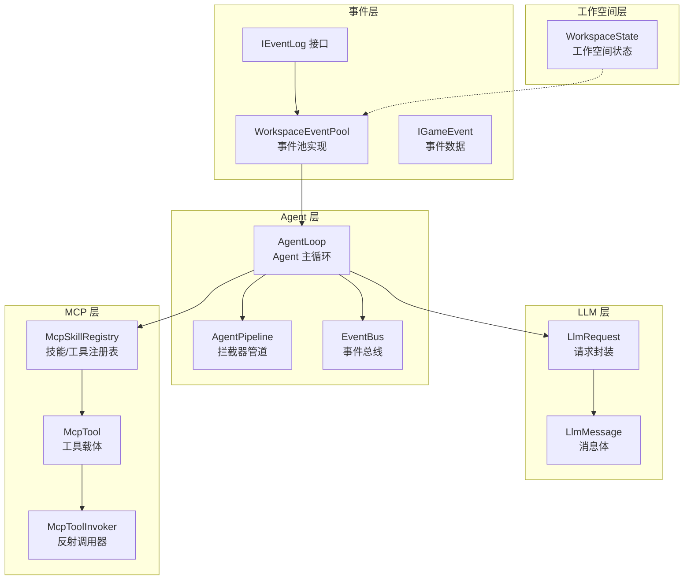
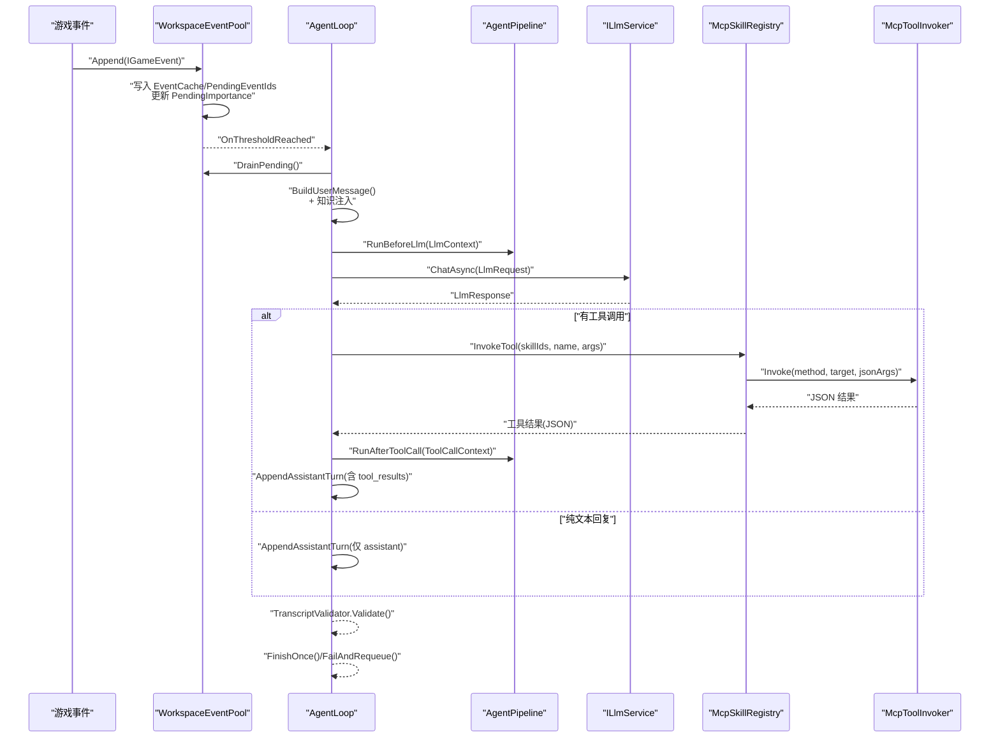
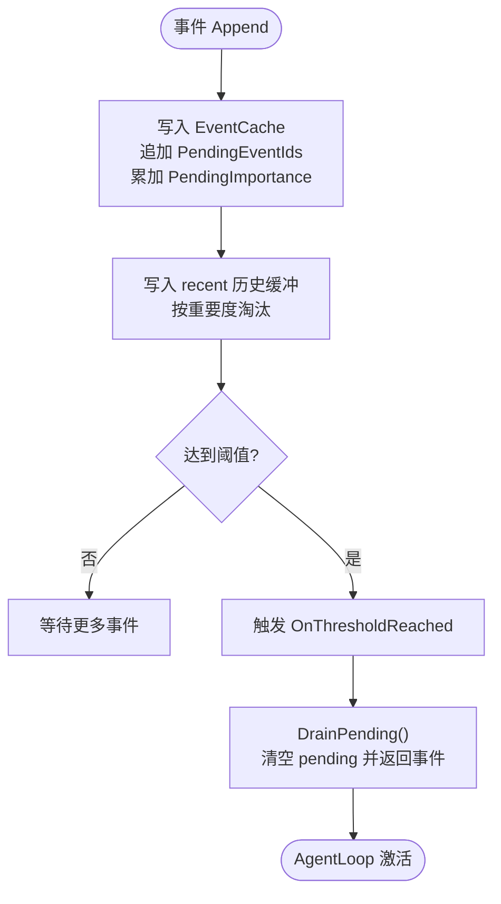
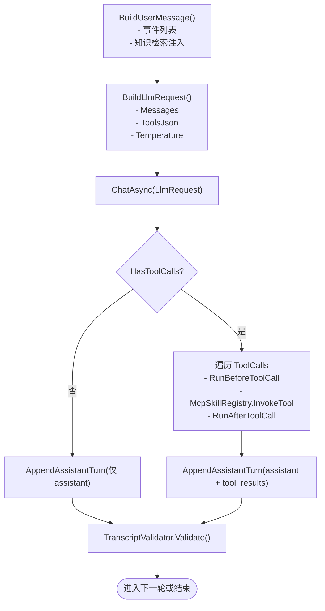
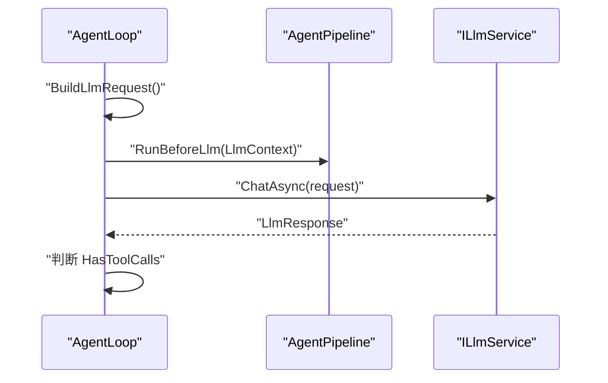
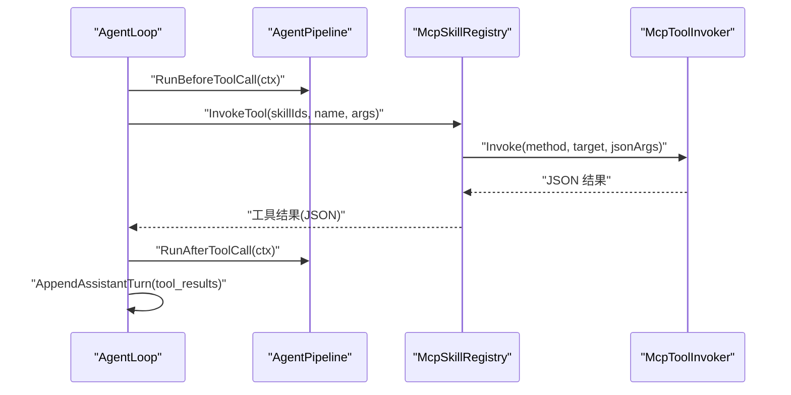
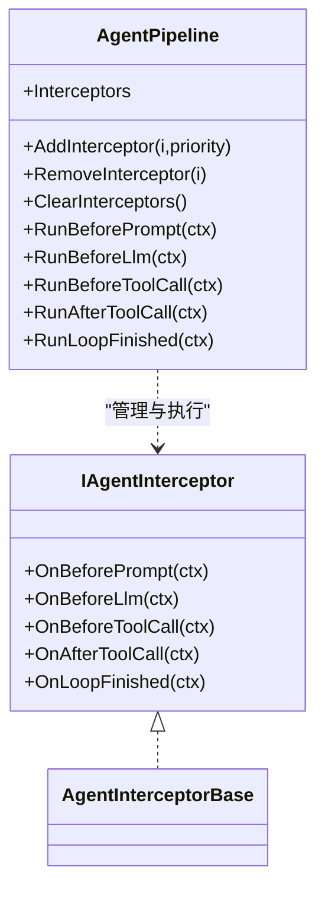
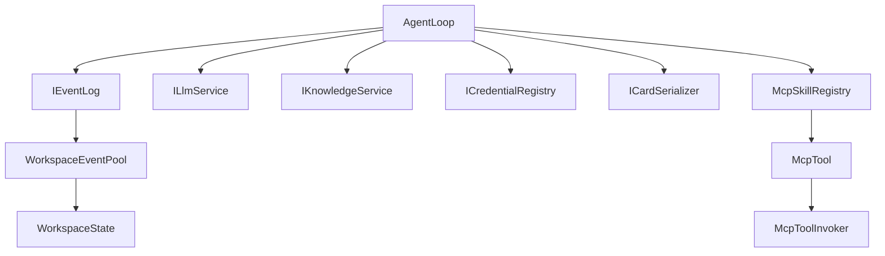

# 数据流设计

<cite>
**本文引用的文件**
- [AgentLoop.cs](file://src/NPCLife/Agent/AgentLoop.cs)
- [AgentPipeline.cs](file://src/NPCLife/Framework/AgentPipeline.cs)
- [EventBus.cs](file://src/NPCLife/Framework/EventBus.cs)
- [WorkspaceEventPool.cs](file://src/NPCLife/Workspace/WorkspaceEventPool.cs)
- [IEventLog.cs](file://src/NPCLife/Core/IEventLog.cs)
- [LlmRequest.cs](file://src/NPCLife/Framework/Llm/LlmRequest.cs)
- [LlmMessage.cs](file://src/NPCLife/Framework/Llm/LlmMessage.cs)
- [McpToolInvoker.cs](file://src/NPCLife/Framework/Mcp/McpToolInvoker.cs)
- [McpTool.cs](file://src/NPCLife/Framework/Mcp/McpTool.cs)
- [McpSkillRegistry.cs](file://src/NPCLife/Framework/Mcp/McpSkillRegistry.cs)
- [EventCard.cs](file://src/NPCLife/Cards/EventCard.cs)
- [EventQuery.cs](file://src/NPCLife/Core/EventQuery.cs)
- [WorkspaceState.cs](file://src/NPCLife/Workspace/WorkspaceState.cs)
- [InteractionHistoryStore.cs](file://src/NPCLife/Infrastructure/InteractionHistoryStore.cs)
</cite>

## 目录
1. [简介](#简介)
2. [项目结构](#项目结构)
3. [核心组件](#核心组件)
4. [架构总览](#架构总览)
5. [详细组件分析](#详细组件分析)
6. [依赖分析](#依赖分析)
7. [性能考虑](#性能考虑)
8. [故障排查指南](#故障排查指南)
9. [结论](#结论)
10. [附录](#附录)

## 简介
本文件面向 NPCLife 的数据流设计，系统性描述从“游戏事件上报”到“NPC 台词输出”的完整数据流转过程。重点涵盖：
- 事件池的 Drain 机制与阈值触发
- 消息历史的构建与校验
- LLM 请求的构建与响应处理
- 工具调用往返数据流（含 MCP 工具参数传递与结果返回）
- 事件总线在组件间通信中的作用
- AgentPipeline 在数据处理管道中的位置与拦截点
- 数据结构演进、缓存策略与性能优化点
- 提供数据流图与时序图帮助理解

## 项目结构
NPCLife 采用分层与职责分离的设计：
- 事件层：IGameEvent、EventCard、WorkspaceEventPool、IEventLog
- Agent 层：AgentLoop、AgentPipeline（拦截器）、EventBus（事件总线）
- LLM 层：LlmRequest、LlmMessage、ILlmService（适配器）
- MCP 层：McpTool、McpToolInvoker、McpSkillRegistry、IMcpHookProvider
- 工作空间层：WorkspaceState、WorkspaceEventPool（持久化 KV + 内存 recent）
- 基础设施：InteractionHistoryStore（交互历史持久化）

图表来源
- [AgentLoop.cs:1-581](file://src/NPCLife/Agent/AgentLoop.cs#L1-L581)
- [AgentPipeline.cs:1-248](file://src/NPCLife/Framework/AgentPipeline.cs#L1-L248)
- [EventBus.cs:1-243](file://src/NPCLife/Framework/EventBus.cs#L1-L243)
- [WorkspaceEventPool.cs:1-186](file://src/NPCLife/Workspace/WorkspaceEventPool.cs#L1-L186)
- [IEventLog.cs:1-52](file://src/NPCLife/Core/IEventLog.cs#L1-L52)
- [LlmRequest.cs:1-46](file://src/NPCLife/Framework/Llm/LlmRequest.cs#L1-L46)
- [LlmMessage.cs:1-63](file://src/NPCLife/Framework/Llm/LlmMessage.cs#L1-L63)
- [McpTool.cs:1-40](file://src/NPCLife/Framework/Mcp/McpTool.cs#L1-L40)
- [McpToolInvoker.cs:1-238](file://src/NPCLife/Framework/Mcp/McpToolInvoker.cs#L1-L238)
- [McpSkillRegistry.cs:1-470](file://src/NPCLife/Framework/Mcp/McpSkillRegistry.cs#L1-L470)
- [WorkspaceState.cs:1-152](file://src/NPCLife/Workspace/WorkspaceState.cs#L1-L152)

章节来源
- [AgentLoop.cs:1-581](file://src/NPCLife/Agent/AgentLoop.cs#L1-L581)
- [WorkspaceEventPool.cs:1-186](file://src/NPCLife/Workspace/WorkspaceEventPool.cs#L1-L186)
- [IEventLog.cs:1-52](file://src/NPCLife/Core/IEventLog.cs#L1-L52)
- [EventBus.cs:1-243](file://src/NPCLife/Framework/EventBus.cs#L1-L243)
- [LlmRequest.cs:1-46](file://src/NPCLife/Framework/Llm/LlmRequest.cs#L1-L46)
- [LlmMessage.cs:1-63](file://src/NPCLife/Framework/Llm/LlmMessage.cs#L1-L63)
- [McpTool.cs:1-40](file://src/NPCLife/Framework/Mcp/McpTool.cs#L1-L40)
- [McpToolInvoker.cs:1-238](file://src/NPCLife/Framework/Mcp/McpToolInvoker.cs#L1-L238)
- [McpSkillRegistry.cs:1-470](file://src/NPCLife/Framework/Mcp/McpSkillRegistry.cs#L1-L470)
- [WorkspaceState.cs:1-152](file://src/NPCLife/Workspace/WorkspaceState.cs#L1-L152)

## 核心组件
- 事件池与事件日志
  - IEventLog 抽象事件写入、查询与阈值激活能力；WorkspaceEventPool 实现双层结构：持久化的 pending 缓冲区与仅内存的 recent 历史缓冲，并在每次 Append 后评估阈值触发 OnThresholdReached。
- AgentLoop
  - 基于 IEventLog.OnThresholdReached 被动激活，显式状态机驱动：DrainingEvents → BuildingRequest → CallingLlm → ExecutingTools → AppendingToolResults → Finishing；贯穿 Transcript 校验、事件回灌、错误处理与事件总线发布。
- AgentPipeline
  - 拦截器接口 IAgentInterceptor 与静态 AgentPipeline 管理器，提供 OnBeforePrompt、OnBeforeLlm、OnBeforeToolCall、OnAfterToolCall、OnLoopFinished 五阶段拦截，支持优先级排序与零开销默认实现。
- 事件总线 EventBus
  - 提供命名空间事件名、优先级排序、错误隔离与日志记录；AgentLoop 与 MCP 工具调用均通过 EventBus 发布事件，便于观测与解耦。
- LLM 请求与消息
  - LlmRequest 统一封装模型名、消息列表、工具定义 JSON、采样温度；LlmMessage 支持 system/user/assistant/tool 四种角色与工具调用请求/结果。
- MCP 工具链
  - McpTool 封装工具定义与调用委托；McpToolInvoker 通过反射将 JSON 参数字符串转换为目标方法参数并序列化返回值；McpSkillRegistry 管理技能与工具注册、按激活技能聚合工具定义、调用工具并发布工具调用前后事件。

章节来源
- [IEventLog.cs:1-52](file://src/NPCLife/Core/IEventLog.cs#L1-L52)
- [WorkspaceEventPool.cs:1-186](file://src/NPCLife/Workspace/WorkspaceEventPool.cs#L1-L186)
- [AgentLoop.cs:1-581](file://src/NPCLife/Agent/AgentLoop.cs#L1-L581)
- [AgentPipeline.cs:1-248](file://src/NPCLife/Framework/AgentPipeline.cs#L1-L248)
- [EventBus.cs:1-243](file://src/NPCLife/Framework/EventBus.cs#L1-L243)
- [LlmRequest.cs:1-46](file://src/NPCLife/Framework/Llm/LlmRequest.cs#L1-L46)
- [LlmMessage.cs:1-63](file://src/NPCLife/Framework/Llm/LlmMessage.cs#L1-L63)
- [McpTool.cs:1-40](file://src/NPCLife/Framework/Mcp/McpTool.cs#L1-L40)
- [McpToolInvoker.cs:1-238](file://src/NPCLife/Framework/Mcp/McpToolInvoker.cs#L1-L238)
- [McpSkillRegistry.cs:1-470](file://src/NPCLife/Framework/Mcp/McpSkillRegistry.cs#L1-L470)

## 架构总览
NPCLife 的数据流以“事件驱动 + 管道拦截 + 工具调用”为核心，形成如下闭环：
- 游戏事件经 IGameEvent 与 EventCard 抽象进入 WorkspaceEventPool，写入持久化 KV 与内存 recent，并在阈值达到时触发 OnThresholdReached。
- AgentLoop 订阅阈值事件，DrainPending 取出事件，构建用户消息与知识注入，随后构造 LlmRequest 并调用 ILlmService。
- LLM 返回后，若包含工具调用，则进入工具调用循环：McpSkillRegistry 查找工具、McpToolInvoker 反射调用、AgentPipeline 拦截器可修改参数与结果，再将工具结果追加到消息历史。
- 最终消息历史经 TranscriptValidator 校验后，由 ScriptDeliveryService 推送 NPC 台词到游戏侧。

图表来源
- [WorkspaceEventPool.cs:166-183](file://src/NPCLife/Workspace/WorkspaceEventPool.cs#L166-L183)
- [AgentLoop.cs:171-337](file://src/NPCLife/Agent/AgentLoop.cs#L171-L337)
- [AgentPipeline.cs:179-236](file://src/NPCLife/Framework/AgentPipeline.cs#L179-L236)
- [McpSkillRegistry.cs:361-437](file://src/NPCLife/Framework/Mcp/McpSkillRegistry.cs#L361-L437)
- [McpToolInvoker.cs:24-72](file://src/NPCLife/Framework/Mcp/McpToolInvoker.cs#L24-L72)
- [LlmRequest.cs:9-44](file://src/NPCLife/Framework/Llm/LlmRequest.cs#L9-L44)

## 详细组件分析

### 事件池与 Drains 机制
- 双层结构
  - pending 缓冲区：持久化到 WorkspaceState 的 KV（EventCache）与队列（PendingEventIds），随存档持久化；TotalImportance 累加用于阈值评估。
  - recent 历史缓冲：仅内存，按重要度淘汰策略维持容量上限，支持 Query/GetById/Latest 等查询。
- 阈值触发
  - Append 后根据当前角色计算有效阈值，任一达到即触发 OnThresholdReached，AgentLoop 订阅该事件并进入 RunOnceAsync。
- DrainPending
  - 将 pending 事件反序列化并清空 pending 队列与重要度，返回事件列表交由 AgentLoop 使用。

图表来源
- [WorkspaceEventPool.cs:49-90](file://src/NPCLife/Workspace/WorkspaceEventPool.cs#L49-L90)
- [WorkspaceEventPool.cs:166-183](file://src/NPCLife/Workspace/WorkspaceEventPool.cs#L166-L183)
- [IEventLog.cs:42-49](file://src/NPCLife/Core/IEventLog.cs#L42-L49)

章节来源
- [WorkspaceEventPool.cs:1-186](file://src/NPCLife/Workspace/WorkspaceEventPool.cs#L1-L186)
- [IEventLog.cs:1-52](file://src/NPCLife/Core/IEventLog.cs#L1-L52)
- [WorkspaceState.cs:135-142](file://src/NPCLife/Workspace/WorkspaceState.cs#L135-L142)

### 消息历史构建与 Transcript 校验
- 用户消息构建
  - AgentLoop.BuildUserMessage 将事件序列化为用户消息正文，并基于事件关键词调用 IKnowledgeService 执行知识检索，缺失词条与相关知识分别注入提示词。
- Assistant Turn 追加
  - AppendAssistantTurn 将 LLM 响应追加为 assistant 消息；若有工具调用，assistant 消息携带 tool_calls，随后依次追加每条 tool 的 tool_result 消息，保证单轮多工具调用的结构完整性。
- Transcript 校验
  - 每轮 LLM 调用前调用 TranscriptValidator.Validate，确保消息历史结构符合要求，否则抛出异常中断。

图表来源
- [AgentLoop.cs:455-539](file://src/NPCLife/Agent/AgentLoop.cs#L455-L539)
- [AgentLoop.cs:407-435](file://src/NPCLife/Agent/AgentLoop.cs#L407-L435)
- [AgentLoop.cs:215-219](file://src/NPCLife/Agent/AgentLoop.cs#L215-L219)
- [LlmRequest.cs:9-44](file://src/NPCLife/Framework/Llm/LlmRequest.cs#L9-L44)

章节来源
- [AgentLoop.cs:171-337](file://src/NPCLife/Agent/AgentLoop.cs#L171-L337)
- [LlmMessage.cs:1-63](file://src/NPCLife/Framework/Llm/LlmMessage.cs#L1-L63)

### LLM 请求构建与响应处理
- 请求构建
  - BuildLlmRequest 从当前消息历史复制 Messages，注入 ToolsJson（来自 McpSkillRegistry.GetActiveToolsJson），并设置 Temperature。
- 响应处理
  - ChatAsync 返回 LlmResponse；若 HasToolCalls 为真，进入工具调用循环；否则直接追加 assistant 文本回复并结束。
- 事件总线
  - 发送请求与收到响应时发布 LlmRequestSent/LlmResponseReceived 事件，便于监控与审计。

图表来源
- [AgentLoop.cs:223-248](file://src/NPCLife/Agent/AgentLoop.cs#L223-L248)
- [AgentPipeline.cs:191-199](file://src/NPCLife/Framework/AgentPipeline.cs#L191-L199)
- [LlmRequest.cs:9-44](file://src/NPCLife/Framework/Llm/LlmRequest.cs#L9-L44)

章节来源
- [AgentLoop.cs:223-248](file://src/NPCLife/Agent/AgentLoop.cs#L223-L248)
- [LlmRequest.cs:1-46](file://src/NPCLife/Framework/Llm/LlmRequest.cs#L1-L46)

### 工具调用往返数据流（MCP）
- 工具定位与调用
  - McpSkillRegistry.InvokeTool 在激活技能范围内查找工具定义，若未找到则回退至 system 技能；调用时发布 ToolInvoking/ToolInvoked 事件。
- 反射调用与参数转换
  - McpToolInvoker.Invoke 将 JSON 参数字符串解析为字典，依据方法签名与 McpParamAttribute 映射参数名，进行类型转换（含布尔宽松解析、数组/集合转换、枚举解析），调用目标方法后序列化返回值。
- 拦截器介入
  - AgentPipeline.RunBeforeToolCall/RunAfterToolCall 分别允许拦截器修改参数或改写结果，支持取消本次工具调用。

图表来源
- [AgentLoop.cs:274-305](file://src/NPCLife/Agent/AgentLoop.cs#L274-L305)
- [AgentPipeline.cs:202-225](file://src/NPCLife/Framework/AgentPipeline.cs#L202-L225)
- [McpSkillRegistry.cs:361-437](file://src/NPCLife/Framework/Mcp/McpSkillRegistry.cs#L361-L437)
- [McpToolInvoker.cs:24-72](file://src/NPCLife/Framework/Mcp/McpToolInvoker.cs#L24-L72)

章节来源
- [McpTool.cs:1-40](file://src/NPCLife/Framework/Mcp/McpTool.cs#L1-L40)
- [McpToolInvoker.cs:1-238](file://src/NPCLife/Framework/Mcp/McpToolInvoker.cs#L1-L238)
- [McpSkillRegistry.cs:1-470](file://src/NPCLife/Framework/Mcp/McpSkillRegistry.cs#L1-L470)

### AgentPipeline 拦截器与事件总线
- 拦截器链
  - AgentPipeline 提供五阶段拦截：OnBeforePrompt、OnBeforeLlm、OnBeforeToolCall、OnAfterToolCall、OnLoopFinished；按优先级排序执行，异常被隔离并记录。
- 事件总线
  - AgentLoop 在关键节点发布 FrameworkEvents（如 AgentActivated、LlmRequestSent、ToolInvoking、AgentRoundComplete、AgentLoopFinished 等），便于外部观察与集成。

图表来源
- [AgentPipeline.cs:18-57](file://src/NPCLife/Framework/AgentPipeline.cs#L18-L57)
- [AgentPipeline.cs:120-246](file://src/NPCLife/Framework/AgentPipeline.cs#L120-L246)

章节来源
- [AgentPipeline.cs:1-248](file://src/NPCLife/Framework/AgentPipeline.cs#L1-L248)
- [EventBus.cs:1-243](file://src/NPCLife/Framework/EventBus.cs#L1-L243)

### 数据结构演进与缓存策略
- 事件数据演进
  - IGameEvent 为纯 DTO 接口，EventCardData 为其可序列化实现，支持深拷贝与扩展字段，便于事件缓存与跨模块传输。
- 事件池缓存
  - EventCache（KV）持久化事件 JSON，PendingEventIds 维护 FIFO 顺序，PendingImportance 避免每次反序列化重算重要度。
- 近期历史缓存
  - recent 列表按重要度淘汰，维持固定容量，支持高效查询与 GetById。
- 交互历史持久化
  - InteractionHistoryStore 以 append-only 方式持久化交互记录，序列化为 JSON 数组字符串，便于后续统计与分析。

章节来源
- [EventCard.cs:11-84](file://src/NPCLife/Cards/EventCard.cs#L11-L84)
- [WorkspaceEventPool.cs:27-74](file://src/NPCLife/Workspace/WorkspaceEventPool.cs#L27-L74)
- [WorkspaceState.cs:135-142](file://src/NPCLife/Workspace/WorkspaceState.cs#L135-L142)
- [InteractionHistoryStore.cs:16-185](file://src/NPCLife/Infrastructure/InteractionHistoryStore.cs#L16-L185)

## 依赖分析
- 组件耦合
  - AgentLoop 依赖 IEventLog、ILlmService、ICredentialRegistry、IKnowledgeService、ILogger、ICardSerializer；通过事件总线与 MCP 注册表解耦。
  - WorkspaceEventPool 实现 IEventLog，依赖 DriverConfig 与 ICardSerializer；与 WorkspaceState 共享 KV 缓存。
  - McpSkillRegistry 依赖 McpToolGenerator 与 JsonHelper/JsonParser，提供工具定义聚合与调用。
- 外部依赖
  - LLM 适配器（AnthropicAdapter/OpenAiAdapter）通过 ILlmService 接口注入，AgentLoop 无需关心具体实现。
  - MCP Hook 提供者通过 IMcpHookProvider 注册工具，McpSkillRegistry 动态聚合。

图表来源
- [AgentLoop.cs:43-116](file://src/NPCLife/Agent/AgentLoop.cs#L43-L116)
- [WorkspaceEventPool.cs:21-43](file://src/NPCLife/Workspace/WorkspaceEventPool.cs#L21-L43)
- [McpSkillRegistry.cs:22-470](file://src/NPCLife/Framework/Mcp/McpSkillRegistry.cs#L22-L470)

章节来源
- [AgentLoop.cs:1-581](file://src/NPCLife/Agent/AgentLoop.cs#L1-L581)
- [WorkspaceEventPool.cs:1-186](file://src/NPCLife/Workspace/WorkspaceEventPool.cs#L1-L186)
- [McpSkillRegistry.cs:1-470](file://src/NPCLife/Framework/Mcp/McpSkillRegistry.cs#L1-L470)

## 性能考虑
- 事件池容量控制
  - recent 历史按重要度淘汰，避免无限增长；DriverConfig 控制阈值与容量，减少无效查询成本。
- 消息历史结构
  - AppendAssistantTurn 一次性复制历史并追加，避免多次扩容；TranscriptValidator 在每轮前校验，尽早失败降低后续开销。
- 工具调用
  - McpToolInvoker 参数转换与类型映射在反射调用前完成，减少异常开销；拦截器链按优先级执行，异常隔离避免阻断。
- 缓存与持久化
  - EventCache 与 InteractionHistoryStore 采用 JSON 序列化，批量写入；WorkspaceState 的 KV 字段随存档持久化，减少冷启动重建成本。

## 故障排查指南
- AgentLoop 错误处理
  - 运行时捕获 OperationCanceledException 与通用异常，调用 FailAndRequeue 将已 drain 的事件回灌到事件池，同时发布 AgentLoopFinished 事件，便于外部观察。
- 事件总线事件
  - 关键事件（如 LlmRequestSent、LlmResponseReceived、ToolInvoking、ToolInvoked、AgentRoundComplete、AgentLoopFinished）可用于诊断与审计。
- 工具调用异常
  - McpToolInvoker 捕获 TargetInvocationException 并解包内部异常，返回包含错误信息的 JSON；McpSkillRegistry 记录错误并返回标准错误 JSON。

章节来源
- [AgentLoop.cs:323-396](file://src/NPCLife/Agent/AgentLoop.cs#L323-L396)
- [EventBus.cs:86-113](file://src/NPCLife/Framework/EventBus.cs#L86-L113)
- [McpToolInvoker.cs:62-71](file://src/NPCLife/Framework/Mcp/McpToolInvoker.cs#L62-L71)
- [McpSkillRegistry.cs:404-431](file://src/NPCLife/Framework/Mcp/McpSkillRegistry.cs#L404-L431)

## 结论
NPCLife 的数据流设计以事件驱动为核心，通过事件池阈值触发、AgentPipeline 拦截器、MCP 工具链与事件总线实现高内聚、低耦合的 NPC 台词生成与工作空间管理。消息历史的严格结构与 Transcript 校验保障了 LLM 交互的稳定性；工具调用的反射与参数转换提供了强大的扩展能力；缓存与持久化策略兼顾性能与可靠性。整体架构清晰、可观测性强，适合在复杂叙事场景中持续演进。

## 附录
- 关键查询与过滤
  - EventQuery 支持标签 OR/AND、时间范围、Actor 过滤、重要度过滤与分页，配合 WorkspaceEventPool.Query 实现灵活检索。
- 台词交付
  - AgentLoop 最终生成的消息历史经 TranscriptValidator 校验后，由 ScriptDeliveryService 推送 NPC 台词到游戏侧（详见 Framework 层脚本相关组件）。

章节来源
- [EventQuery.cs:1-48](file://src/NPCLife/Core/EventQuery.cs#L1-L48)
- [WorkspaceEventPool.cs:96-154](file://src/NPCLife/Workspace/WorkspaceEventPool.cs#L96-L154)