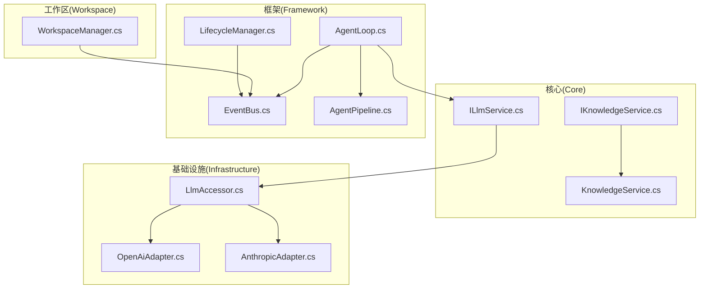
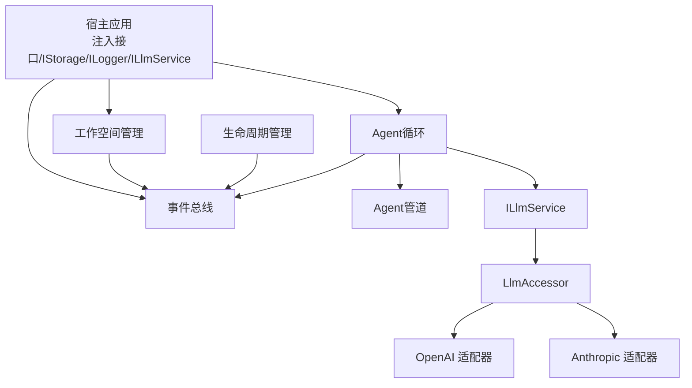
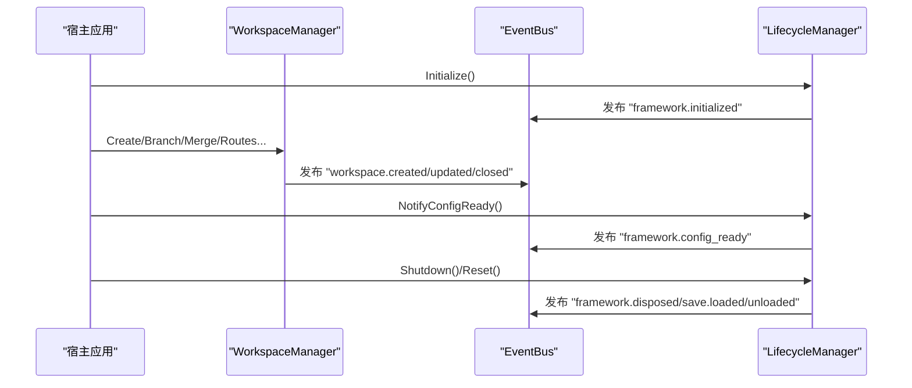
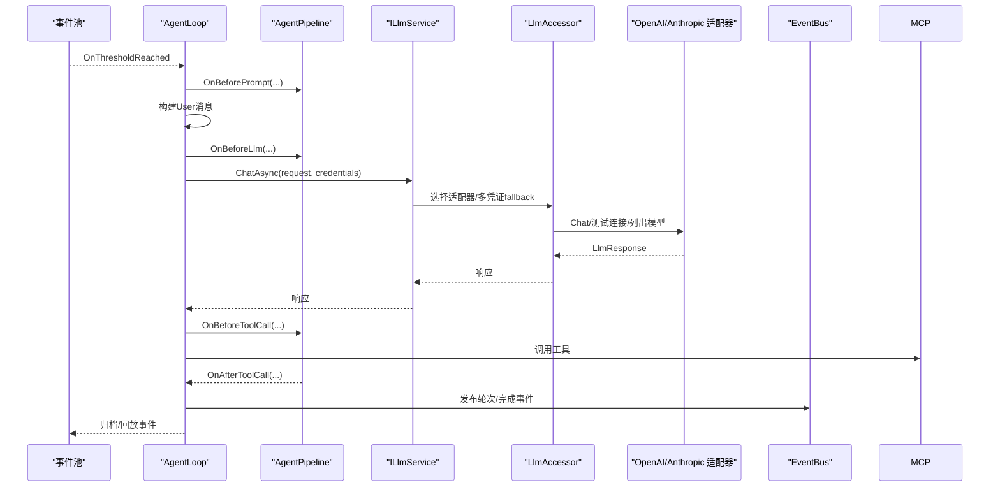
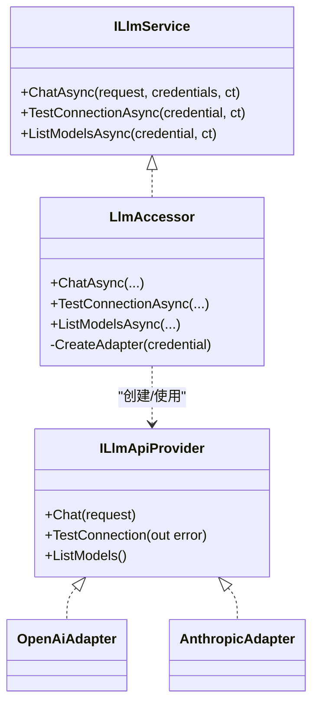
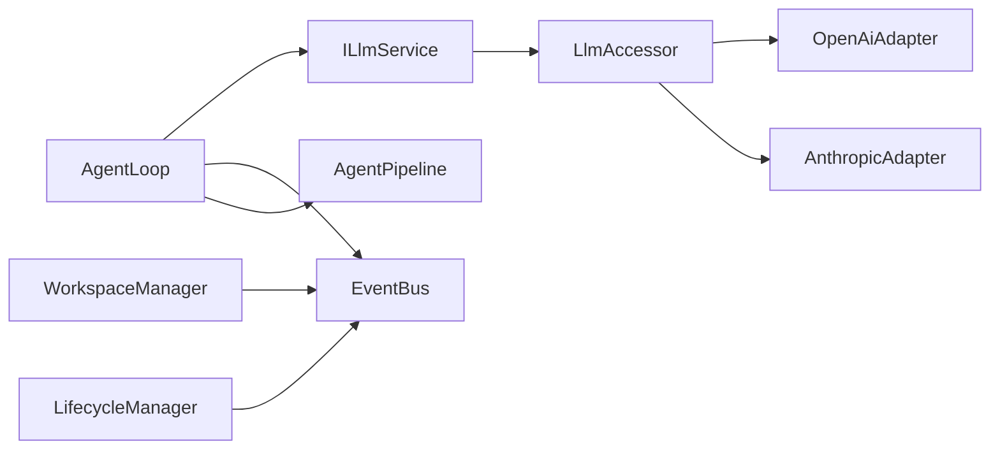

# 整体架构模式

<cite>
**本文引用的文件**
- [NPCLife.csproj](file://src/NPCLife/NPCLife.csproj)
- [README.md](file://README.md)
- [IKnowledgeService.cs](file://src/NPCLife/Core/IKnowledgeService.cs)
- [KnowledgeService.cs](file://src/NPCLife/Core/KnowledgeService.cs)
- [ILlmService.cs](file://src/NPCLife/Core/ILlmService.cs)
- [LlmAccessor.cs](file://src/NPCLife/Infrastructure/Llm/LlmAccessor.cs)
- [AnthropicAdapter.cs](file://src/NPCLife/Infrastructure/Llm/AnthropicAdapter.cs)
- [OpenAiAdapter.cs](file://src/NPCLife/Infrastructure/Llm/OpenAiAdapter.cs)
- [EventBus.cs](file://src/NPCLife/Framework/EventBus.cs)
- [AgentPipeline.cs](file://src/NPCLife/Framework/AgentPipeline.cs)
- [AgentLoop.cs](file://src/NPCLife/Agent/AgentLoop.cs)
- [WorkspaceManager.cs](file://src/NPCLife/Workspace/WorkspaceManager.cs)
- [LifecycleManager.cs](file://src/NPCLife/Framework/LifecycleManager.cs)
</cite>

## 目录
1. [引言](#引言)
2. [项目结构](#项目结构)
3. [核心组件](#核心组件)
4. [架构总览](#架构总览)
5. [详细组件分析](#详细组件分析)
6. [依赖分析](#依赖分析)
7. [性能考量](#性能考量)
8. [故障排查指南](#故障排查指南)
9. [结论](#结论)
10. [附录](#附录)

## 引言
本文件面向NPCLife的整体架构模式，系统化阐述其分层架构、事件驱动机制、适配器与工厂模式的应用、接口抽象与依赖注入理念，并结合实际代码文件进行可视化展示与技术权衡分析。目标读者既包括希望快速理解系统的开发者，也包括需要把握扩展点与集成方式的宿主方工程人员。

## 项目结构
NPCLife采用按“领域/层次”混合的目录组织方式：
- Core：领域接口与默认实现（知识服务、LLM服务契约等）
- Framework：通用基础设施（事件总线、生命周期、拦截器管道、日志、调度等）
- Infrastructure：具体实现（LLM适配器、MCP提供者、存储与脚本投递等）
- Agent：角色驱动的Agent循环
- Workspace：工作空间管理与故事线分支/合并
- Driver：驱动配置与提示词配置
- Cards：卡牌与事件数据结构
- Prompts：提示词模板

图示来源
- [IKnowledgeService.cs:1-36](file://src/NPCLife/Core/IKnowledgeService.cs#L1-L36)
- [KnowledgeService.cs:1-66](file://src/NPCLife/Core/KnowledgeService.cs#L1-L66)
- [ILlmService.cs:1-51](file://src/NPCLife/Core/ILlmService.cs#L1-L51)
- [LlmAccessor.cs:1-331](file://src/NPCLife/Infrastructure/Llm/LlmAccessor.cs#L1-L331)
- [OpenAiAdapter.cs:1-392](file://src/NPCLife/Infrastructure/Llm/OpenAiAdapter.cs#L1-L392)
- [AnthropicAdapter.cs:1-434](file://src/NPCLife/Infrastructure/Llm/AnthropicAdapter.cs#L1-L434)
- [AgentLoop.cs:1-581](file://src/NPCLife/Agent/AgentLoop.cs#L1-L581)
- [EventBus.cs:1-243](file://src/NPCLife/Framework/EventBus.cs#L1-L243)
- [AgentPipeline.cs:1-248](file://src/NPCLife/Framework/AgentPipeline.cs#L1-L248)
- [WorkspaceManager.cs:1-616](file://src/NPCLife/Workspace/WorkspaceManager.cs#L1-L616)
- [LifecycleManager.cs:1-264](file://src/NPCLife/Framework/LifecycleManager.cs#L1-L264)

章节来源
- [README.md:1-93](file://README.md#L1-L93)
- [NPCLife.csproj:1-38](file://src/NPCLife/NPCLife.csproj#L1-L38)

## 核心组件
- 事件总线（EventBus）：提供命名空间事件名、优先级排序、错误隔离、日志注入的发布/订阅机制，贯穿框架生命周期、Agent循环、LLM调用、工具调用、工作空间更新等。
- Agent管道（AgentPipeline）：在Agent循环的关键阶段（提示构造前、LLM请求前、工具调用前/后、循环结束）注入拦截器，支持优先级与取消。
- Agent循环（AgentLoop）：基于事件阈值被动激活，驱动事件池Drain、构建提示词、调用LLM、执行MCP工具、追加工具结果、最终完成归档与事件发布。
- 工作空间管理（WorkspaceManager）：负责工作空间的CRUD、分支/合并、事件路由、持久化与状态变更事件发布。
- 知识服务（IKnowledgeService/KnowledgeService）：统一查询入口，聚合本地缓存与外部知识源，支持精确/标签/前缀检索。
- LLM服务（ILlmService/LlmAccessor）：统一异步LLM调用契约，内部按凭证顺序fallback，适配不同提供商（OpenAI/Anthropic），屏蔽HTTP细节。
- 生命周期管理（LifecycleManager）：集中注册/销毁组件、初始化/配置就绪/销毁钩子、事件发布，支持存档切换Reset。

章节来源
- [EventBus.cs:1-243](file://src/NPCLife/Framework/EventBus.cs#L1-L243)
- [AgentPipeline.cs:1-248](file://src/NPCLife/Framework/AgentPipeline.cs#L1-L248)
- [AgentLoop.cs:1-581](file://src/NPCLife/Agent/AgentLoop.cs#L1-L581)
- [WorkspaceManager.cs:1-616](file://src/NPCLife/Workspace/WorkspaceManager.cs#L1-L616)
- [IKnowledgeService.cs:1-36](file://src/NPCLife/Core/IKnowledgeService.cs#L1-L36)
- [KnowledgeService.cs:1-66](file://src/NPCLife/Core/KnowledgeService.cs#L1-L66)
- [ILlmService.cs:1-51](file://src/NPCLife/Core/ILlmService.cs#L1-L51)
- [LlmAccessor.cs:1-331](file://src/NPCLife/Infrastructure/Llm/LlmAccessor.cs#L1-L331)
- [LifecycleManager.cs:1-264](file://src/NPCLife/Framework/LifecycleManager.cs#L1-L264)

## 架构总览
NPCLife采用“分层+事件驱动”的混合架构：
- 表示层（宿主侧）：通过注入IStorage/ILogger/ILlmService等接口接入框架，发布/订阅框架事件，驱动Agent与工作空间。
- 业务逻辑层（Agent/Workspace）：以AgentLoop为核心编排事件、提示词、LLM与工具调用；以WorkspaceManager管理故事线生命周期。
- 数据访问层（Infrastructure）：提供LLM适配器、MCP提供者、存储与脚本投递等实现。
- 基础设施层（Framework）：事件总线、生命周期、拦截器管道、日志、调度等通用能力。

图示来源
- [AgentLoop.cs:1-581](file://src/NPCLife/Agent/AgentLoop.cs#L1-L581)
- [WorkspaceManager.cs:1-616](file://src/NPCLife/Workspace/WorkspaceManager.cs#L1-L616)
- [EventBus.cs:1-243](file://src/NPCLife/Framework/EventBus.cs#L1-L243)
- [AgentPipeline.cs:1-248](file://src/NPCLife/Framework/AgentPipeline.cs#L1-L248)
- [ILlmService.cs:1-51](file://src/NPCLife/Core/ILlmService.cs#L1-L51)
- [LlmAccessor.cs:1-331](file://src/NPCLife/Infrastructure/Llm/LlmAccessor.cs#L1-L331)
- [OpenAiAdapter.cs:1-392](file://src/NPCLife/Infrastructure/Llm/OpenAiAdapter.cs#L1-L392)
- [AnthropicAdapter.cs:1-434](file://src/NPCLife/Infrastructure/Llm/AnthropicAdapter.cs#L1-L434)
- [LifecycleManager.cs:1-264](file://src/NPCLife/Framework/LifecycleManager.cs#L1-L264)

## 详细组件分析

### 事件驱动架构与观察者/发布-订阅
- 事件总线（EventBus）提供静态发布/订阅、优先级排序、错误隔离与日志注入，事件名采用“模块.动作”的命名空间约定，便于跨组件解耦通信。
- 生命周期管理（LifecycleManager）在Initialize/NotifyConfigReady/Shutdown/Reset等节点发布框架事件，形成统一的生命周期信号流。
- AgentLoop在激活、每轮工具调用前后、LLM请求/响应、循环结束等节点发布事件，便于外部监听与可观测性。
- WorkspaceManager在工作空间创建、关闭、更新等节点发布事件，支撑UI与存档系统联动。

图示来源
- [EventBus.cs:1-243](file://src/NPCLife/Framework/EventBus.cs#L1-L243)
- [LifecycleManager.cs:1-264](file://src/NPCLife/Framework/LifecycleManager.cs#L1-L264)
- [WorkspaceManager.cs:1-616](file://src/NPCLife/Workspace/WorkspaceManager.cs#L1-L616)

章节来源
- [EventBus.cs:1-243](file://src/NPCLife/Framework/EventBus.cs#L1-L243)
- [LifecycleManager.cs:1-264](file://src/NPCLife/Framework/LifecycleManager.cs#L1-L264)
- [WorkspaceManager.cs:1-616](file://src/NPCLife/Workspace/WorkspaceManager.cs#L1-L616)
- [AgentLoop.cs:1-581](file://src/NPCLife/Agent/AgentLoop.cs#L1-L581)

### Agent循环与拦截器管道
- AgentLoop基于事件阈值被动激活，显式状态机控制Drain、构建提示词、调用LLM、工具调用循环、追加结果与完成归档。
- AgentPipeline在关键阶段注入拦截器（BeforePrompt/BeforeLlm/BeforeToolCall/AfterToolCall/LoopFinished），支持优先级与取消，实现横切关注点（审计、限流、参数校验、结果改写等）。
- TranscriptValidator保障消息历史结构合法性，防止错误的assistant/tool消息序列导致后续工具调用失败。

图示来源
- [AgentLoop.cs:1-581](file://src/NPCLife/Agent/AgentLoop.cs#L1-L581)
- [AgentPipeline.cs:1-248](file://src/NPCLife/Framework/AgentPipeline.cs#L1-L248)
- [ILlmService.cs:1-51](file://src/NPCLife/Core/ILlmService.cs#L1-L51)
- [LlmAccessor.cs:1-331](file://src/NPCLife/Infrastructure/Llm/LlmAccessor.cs#L1-L331)
- [OpenAiAdapter.cs:1-392](file://src/NPCLife/Infrastructure/Llm/OpenAiAdapter.cs#L1-L392)
- [AnthropicAdapter.cs:1-434](file://src/NPCLife/Infrastructure/Llm/AnthropicAdapter.cs#L1-L434)
- [EventBus.cs:1-243](file://src/NPCLife/Framework/EventBus.cs#L1-L243)

章节来源
- [AgentLoop.cs:1-581](file://src/NPCLife/Agent/AgentLoop.cs#L1-L581)
- [AgentPipeline.cs:1-248](file://src/NPCLife/Framework/AgentPipeline.cs#L1-L248)

### 适配器模式在LLM提供商集成中的作用
- LlmAccessor作为无状态服务，依据LlmCredential.ProviderType动态创建具体适配器实例（OpenAI/Anthropic），并在每次调用后即弃，避免共享状态带来的复杂性。
- 适配器负责将统一的LlmRequest/LlmResponse映射到不同提供商的API格式，包括系统提示位置、工具调用结构、响应字段差异等。
- 通过适配器模式，框架对上层保持统一契约，对下层屏蔽差异，便于新增/替换提供商。

图示来源
- [ILlmService.cs:1-51](file://src/NPCLife/Core/ILlmService.cs#L1-L51)
- [LlmAccessor.cs:1-331](file://src/NPCLife/Infrastructure/Llm/LlmAccessor.cs#L1-L331)
- [OpenAiAdapter.cs:1-392](file://src/NPCLife/Infrastructure/Llm/OpenAiAdapter.cs#L1-L392)
- [AnthropicAdapter.cs:1-434](file://src/NPCLife/Infrastructure/Llm/AnthropicAdapter.cs#L1-L434)

章节来源
- [LlmAccessor.cs:1-331](file://src/NPCLife/Infrastructure/Llm/LlmAccessor.cs#L1-L331)
- [OpenAiAdapter.cs:1-392](file://src/NPCLife/Infrastructure/Llm/OpenAiAdapter.cs#L1-L392)
- [AnthropicAdapter.cs:1-434](file://src/NPCLife/Infrastructure/Llm/AnthropicAdapter.cs#L1-L434)

### 工厂模式在组件创建中的使用
- LlmAccessor在运行时根据凭证类型创建对应适配器实例，体现简单工厂模式：将“创建对象”与“使用对象”的职责分离，便于扩展新的提供商。
- WorkspaceManager在创建/分支/合并工作空间时，封装状态对象与组件组合，形成工作空间工厂式的统一入口。
- AgentLoop在激活时组合多个依赖（事件池、LLM服务、凭证注册表、序列化器、知识服务等），体现构造器注入与工厂式装配。

章节来源
- [LlmAccessor.cs:1-331](file://src/NPCLife/Infrastructure/Llm/LlmAccessor.cs#L1-L331)
- [WorkspaceManager.cs:1-616](file://src/NPCLife/Workspace/WorkspaceManager.cs#L1-L616)
- [AgentLoop.cs:1-581](file://src/NPCLife/Agent/AgentLoop.cs#L1-L581)

### 依赖注入与接口抽象
- 框架通过接口抽象与注入点实现“可插拔”能力：
  - IStorage：持久化工作空间状态
  - ILogger：日志输出
  - ILlmService：LLM服务统一契约
  - IKnowledgeService：知识查询/存储
  - ICardSerializer：卡牌序列化
  - ICredentialRegistry：凭证注册与选择
- 事件总线、生命周期管理、拦截器管道等基础设施均为静态/无外部依赖设计，便于在宿主环境中按需注入日志与回调。

章节来源
- [README.md:69-87](file://README.md#L69-L87)
- [IKnowledgeService.cs:1-36](file://src/NPCLife/Core/IKnowledgeService.cs#L1-L36)
- [ILlmService.cs:1-51](file://src/NPCLife/Core/ILlmService.cs#L1-L51)
- [EventBus.cs:1-243](file://src/NPCLife/Framework/EventBus.cs#L1-L243)
- [LifecycleManager.cs:1-264](file://src/NPCLife/Framework/LifecycleManager.cs#L1-L264)
- [AgentPipeline.cs:1-248](file://src/NPCLife/Framework/AgentPipeline.cs#L1-L248)

## 依赖分析
- 组件内聚与耦合
  - AgentLoop高度依赖事件池、LLM服务、凭证注册表、序列化器、知识服务与事件总线；通过接口解耦，降低对具体实现的耦合。
  - LlmAccessor与适配器之间为“使用”关系，无强绑定；通过工厂方法创建适配器，便于扩展。
  - WorkspaceManager与事件总线、存储、序列化器耦合，但通过接口抽象隔离具体实现。
- 外部依赖
  - System.Net.Http用于HTTP调用
  - System.Threading/Task用于异步与线程调度
- 循环依赖
  - 未发现直接循环依赖；事件总线与生命周期管理为单向广播，不引入循环。

图示来源
- [AgentLoop.cs:1-581](file://src/NPCLife/Agent/AgentLoop.cs#L1-L581)
- [LlmAccessor.cs:1-331](file://src/NPCLife/Infrastructure/Llm/LlmAccessor.cs#L1-L331)
- [OpenAiAdapter.cs:1-392](file://src/NPCLife/Infrastructure/Llm/OpenAiAdapter.cs#L1-L392)
- [AnthropicAdapter.cs:1-434](file://src/NPCLife/Infrastructure/Llm/AnthropicAdapter.cs#L1-L434)
- [WorkspaceManager.cs:1-616](file://src/NPCLife/Workspace/WorkspaceManager.cs#L1-L616)
- [EventBus.cs:1-243](file://src/NPCLife/Framework/EventBus.cs#L1-L243)
- [LifecycleManager.cs:1-264](file://src/NPCLife/Framework/LifecycleManager.cs#L1-L264)

章节来源
- [AgentLoop.cs:1-581](file://src/NPCLife/Agent/AgentLoop.cs#L1-L581)
- [LlmAccessor.cs:1-331](file://src/NPCLife/Infrastructure/Llm/LlmAccessor.cs#L1-L331)
- [WorkspaceManager.cs:1-616](file://src/NPCLife/Workspace/WorkspaceManager.cs#L1-L616)
- [EventBus.cs:1-243](file://src/NPCLife/Framework/EventBus.cs#L1-L243)
- [LifecycleManager.cs:1-264](file://src/NPCLife/Framework/LifecycleManager.cs#L1-L264)

## 性能考量
- 事件阈值触发：通过事件池阈值控制LLM调用频率，避免高频API调用与成本过高。
- 异步与线程模型：LlmAccessor在后台线程发起HTTP请求，完成后通过主线程调度器回调，避免阻塞UI。
- 多凭证fallback：按顺序尝试，首个成功即返回，减少失败重试成本；失败路径记录警告日志，便于诊断。
- 适配器即用即弃：避免长生命周期共享状态，降低锁竞争与上下文污染风险。
- 拦截器零开销：默认无拦截器时，拦截器链为零开销，仅在启用时产生性能影响。
- 序列化与日志：提供JsonWriter/JsonParser等轻量工具，日志按需输出，避免不必要的字符串拼接与IO。

## 故障排查指南
- LLM调用失败
  - 检查凭证配置（ProviderType、BaseUrl、ApiKey、ModelName）与连通性测试
  - 查看EventBus发布的“llm.error/request_sent/response_received”事件
  - 使用LifecycleManager的钩子与日志定位问题
- Agent循环异常
  - 关注“agent.activated/round_complete/loop_finished”事件
  - 检查TranscriptValidator约束与工具调用返回结构
  - 通过AgentPipeline拦截器捕获BeforeToolCall/AfterToolCall阶段的异常
- 工作空间状态异常
  - 关注“workspace.created/updated/closed”事件
  - 检查WorkspaceManager的分支/合并逻辑与状态转换有效性
- 生命周期问题
  - 使用LifecycleManager.RegisterDisposable与OnConfigReady/OnDestroy钩子
  - Reset流程会先发布“save.unloaded”，再Shutdown与Initialize，最后发布“save.loaded”

章节来源
- [LlmAccessor.cs:1-331](file://src/NPCLife/Infrastructure/Llm/LlmAccessor.cs#L1-L331)
- [AgentLoop.cs:1-581](file://src/NPCLife/Agent/AgentLoop.cs#L1-L581)
- [WorkspaceManager.cs:1-616](file://src/NPCLife/Workspace/WorkspaceManager.cs#L1-L616)
- [EventBus.cs:1-243](file://src/NPCLife/Framework/EventBus.cs#L1-L243)
- [LifecycleManager.cs:1-264](file://src/NPCLife/Framework/LifecycleManager.cs#L1-L264)

## 结论
NPCLife通过清晰的分层与事件驱动，实现了低耦合、高扩展的叙事驱动框架。适配器与工厂模式保证了LLM提供商的可插拔性；拦截器管道与事件总线提供了强大的横切与可观测能力；接口抽象与依赖注入使宿主可灵活注入存储、日志与服务实现。在性能方面，事件阈值触发、异步线程模型与零拦截器开销设计兼顾了成本与效率。建议在生产环境中配合完善的日志与事件监控体系，以获得最佳的可运维性与可扩展性。

## 附录
- 术语
  - 事件阈值：事件池积累到一定数量或重要度时触发Agent循环
  - 工作空间：独立的剧情线容器，支持分支/合并与独立生命周期
  - MCP工具：由Agent调用的外部能力，用于查询/感知/修改上下文
- 最佳实践
  - 为关键事件订阅监听器，建立可观测性
  - 合理设置Agent最大轮次与温度参数，平衡质量与成本
  - 使用知识服务进行上下文增强，提升叙事一致性
  - 在存档切换时使用LifecycleManager.Reset，确保状态一致性