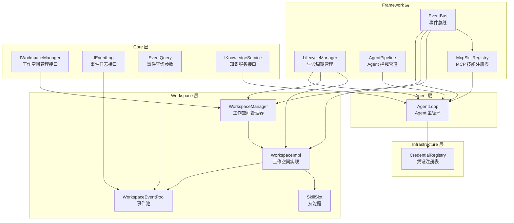
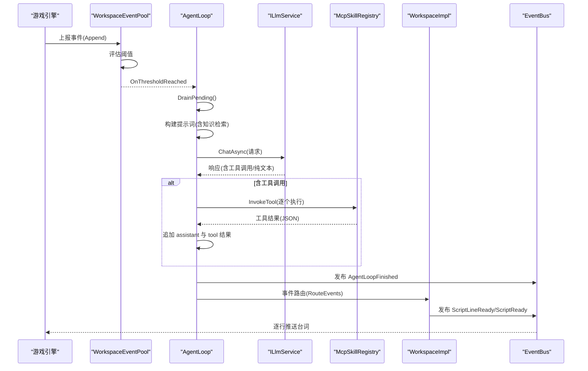
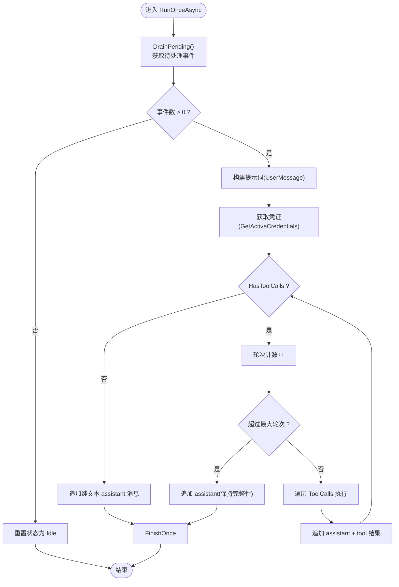
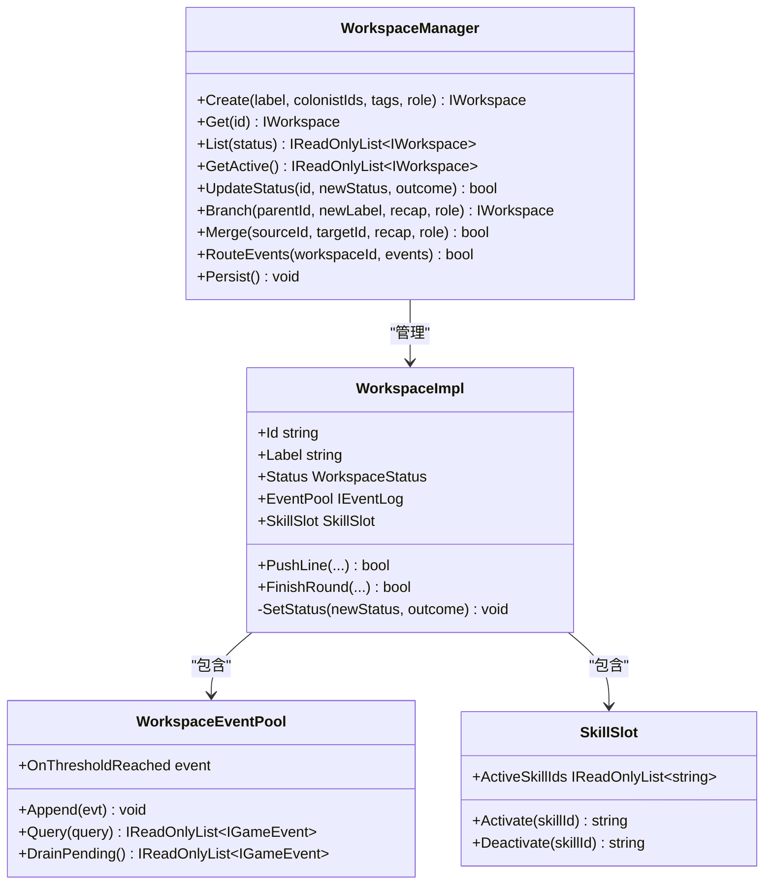
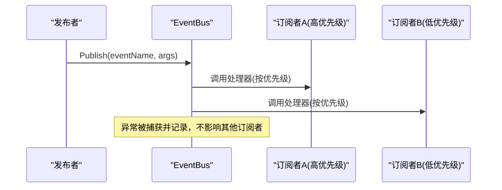
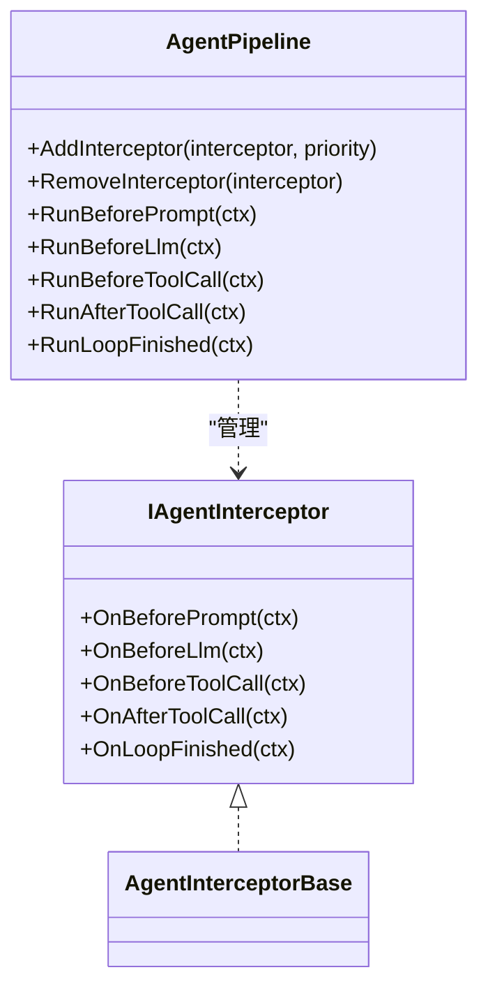
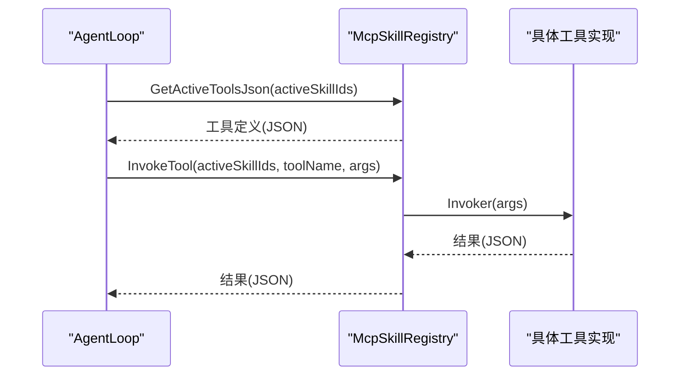
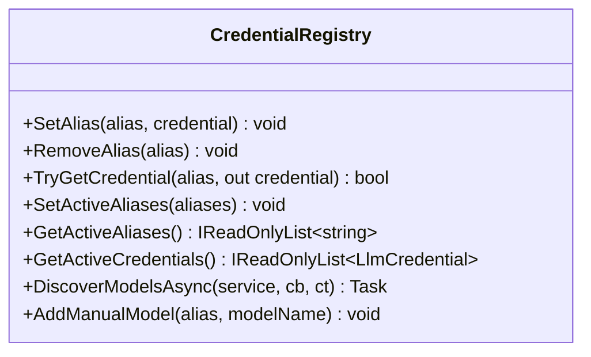
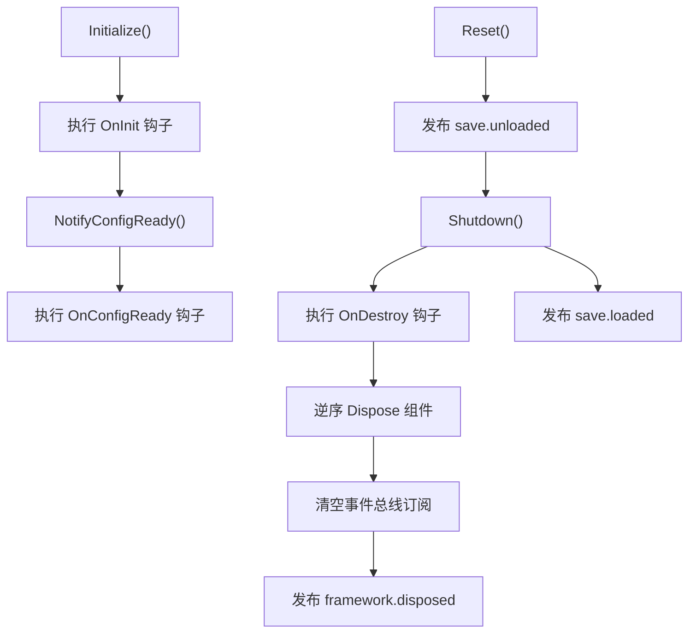
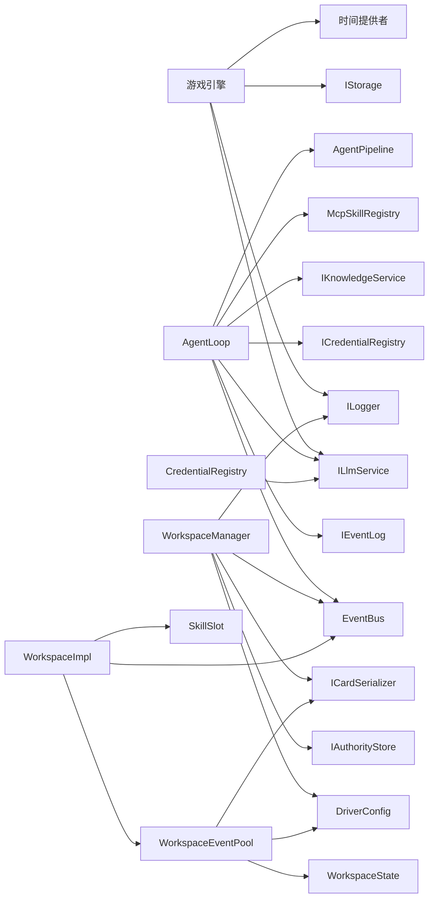

# 架构设计

<cite>
**本文引用的文件**
- [AgentLoop.cs](file://src/NPCLife/Agent/AgentLoop.cs)
- [WorkspaceManager.cs](file://src/NPCLife/Workspace/WorkspaceManager.cs)
- [EventBus.cs](file://src/NPCLife/Framework/EventBus.cs)
- [AgentPipeline.cs](file://src/NPCLife/Framework/AgentPipeline.cs)
- [IWorkspaceManager.cs](file://src/NPCLife/Core/IWorkspaceManager.cs)
- [IKnowledgeService.cs](file://src/NPCLife/Core/IKnowledgeService.cs)
- [McpSkillRegistry.cs](file://src/NPCLife/Framework/Mcp/McpSkillRegistry.cs)
- [CredentialRegistry.cs](file://src/NPCLife/Infrastructure/Llm/CredentialRegistry.cs)
- [WorkspaceImpl.cs](file://src/NPCLife/Workspace/WorkspaceImpl.cs)
- [EventQuery.cs](file://src/NPCLife/Core/EventQuery.cs)
- [IEventLog.cs](file://src/NPCLife/Core/IEventLog.cs)
- [LifecycleManager.cs](file://src/NPCLife/Framework/LifecycleManager.cs)
- [WorkspaceEventPool.cs](file://src/NPCLife/Workspace/WorkspaceEventPool.cs)
- [SkillSlot.cs](file://src/NPCLife/Workspace/SkillSlot.cs)
- [README.md](file://README.md)
</cite>

## 目录
1. [引言](#引言)
2. [项目结构](#项目结构)
3. [核心组件](#核心组件)
4. [架构总览](#架构总览)
5. [详细组件分析](#详细组件分析)
6. [依赖关系分析](#依赖关系分析)
7. [性能考虑](#性能考虑)
8. [故障排查指南](#故障排查指南)
9. [结论](#结论)
10. [附录](#附录)

## 引言
本架构设计文档面向 NPCLife 项目，聚焦高层设计理念与整体架构模式，包括分层架构、事件驱动设计与适配器模式的应用。文档重点阐述核心组件之间的交互关系，如 AgentLoop、WorkspaceManager、EventBus 等关键组件的职责分工；解释从游戏事件上报到最终 NPC 台词输出的完整数据流与控制流；明确系统边界与集成点，说明如何与游戏引擎及其他外部系统交互；并给出架构决策的技术考量、权衡因素与约束条件。

## 项目结构
NPCLife 采用清晰的分层与领域划分：
- Framework 层：提供通用基础设施（事件总线、生命周期管理、MCP 工具注册、拦截管道等），不依赖游戏引擎。
- Core 层：定义核心接口与领域模型（事件、工作空间、知识服务、事件查询等），作为框架与业务的契约。
- Workspace 层：工作空间的实现与事件池、技能槽等子组件，负责事件路由与叙事推进。
- Agent 层：AI 主体循环 AgentLoop，负责事件池激活、提示词构建、LLM 调用、工具调用与结果整合。
- Infrastructure 层：具体实现（凭证注册表、LLM 适配器、知识库、脚本投递等）。
- Driver 层：驱动配置与提示词模板。
- Tests：单元测试覆盖核心组件。

图表来源
- [EventBus.cs:1-243](file://src/NPCLife/Framework/EventBus.cs#L1-L243)
- [LifecycleManager.cs:1-264](file://src/NPCLife/Framework/LifecycleManager.cs#L1-L264)
- [AgentPipeline.cs:1-248](file://src/NPCLife/Framework/AgentPipeline.cs#L1-L248)
- [McpSkillRegistry.cs:1-470](file://src/NPCLife/Framework/Mcp/McpSkillRegistry.cs#L1-L470)
- [IWorkspaceManager.cs:1-58](file://src/NPCLife/Core/IWorkspaceManager.cs#L1-L58)
- [IEventLog.cs:1-52](file://src/NPCLife/Core/IEventLog.cs#L1-L52)
- [EventQuery.cs:1-48](file://src/NPCLife/Core/EventQuery.cs#L1-L48)
- [IKnowledgeService.cs:1-36](file://src/NPCLife/Core/IKnowledgeService.cs#L1-L36)
- [WorkspaceImpl.cs:1-197](file://src/NPCLife/Workspace/WorkspaceImpl.cs#L1-L197)
- [WorkspaceEventPool.cs:1-186](file://src/NPCLife/Workspace/WorkspaceEventPool.cs#L1-L186)
- [SkillSlot.cs:1-61](file://src/NPCLife/Workspace/SkillSlot.cs#L1-L61)
- [WorkspaceManager.cs:1-616](file://src/NPCLife/Workspace/WorkspaceManager.cs#L1-L616)
- [AgentLoop.cs:1-581](file://src/NPCLife/Agent/AgentLoop.cs#L1-L581)
- [CredentialRegistry.cs:1-327](file://src/NPCLife/Infrastructure/Llm/CredentialRegistry.cs#L1-L327)

章节来源
- [README.md:1-93](file://README.md#L1-L93)

## 核心组件
- AgentLoop：AI 主循环，基于事件池阈值被动激活，构建提示词，调用 LLM，执行 MCP 工具，整合结果并发布事件。
- WorkspaceManager：工作空间管理器，负责工作空间的 CRUD、分支/合并、事件路由与持久化。
- WorkspaceImpl：工作空间实现，封装事件池、技能槽，暴露叙事操作（推送台词、完成轮次）。
- WorkspaceEventPool：工作空间内部事件池，双缓冲结构（pending 持久化 + recent 内存），阈值触发。
- SkillSlot：技能槽，管理激活技能集合并与 MCP 注册表交互。
- EventBus：通用事件总线，支持命名空间事件名、优先级排序与错误隔离。
- AgentPipeline：Agent 拦截管道，提供多阶段拦截点（提示前、LLM 前、工具调用前后、循环结束）。
- McpSkillRegistry：MCP 技能注册表，管理技能与工具元数据，提供工具定义与调用。
- CredentialRegistry：凭证注册表，管理“模型别名 → API 凭证”映射，支持发现模型与持久化。
- LifecycleManager：生命周期管理器，统一初始化、配置就绪通知、销毁与重置。
- IWorkspaceManager/IEventLog/IKnowledgeService/EventQuery：核心接口与查询参数，定义契约。

章节来源
- [AgentLoop.cs:43-581](file://src/NPCLife/Agent/AgentLoop.cs#L43-L581)
- [WorkspaceManager.cs:19-616](file://src/NPCLife/Workspace/WorkspaceManager.cs#L19-L616)
- [WorkspaceImpl.cs:16-197](file://src/NPCLife/Workspace/WorkspaceImpl.cs#L16-L197)
- [WorkspaceEventPool.cs:21-186](file://src/NPCLife/Workspace/WorkspaceEventPool.cs#L21-L186)
- [SkillSlot.cs:11-61](file://src/NPCLife/Workspace/SkillSlot.cs#L11-L61)
- [EventBus.cs:17-243](file://src/NPCLife/Framework/EventBus.cs#L17-L243)
- [AgentPipeline.cs:18-248](file://src/NPCLife/Framework/AgentPipeline.cs#L18-L248)
- [McpSkillRegistry.cs:22-470](file://src/NPCLife/Framework/Mcp/McpSkillRegistry.cs#L22-L470)
- [CredentialRegistry.cs:20-327](file://src/NPCLife/Infrastructure/Llm/CredentialRegistry.cs#L20-L327)
- [IWorkspaceManager.cs:14-58](file://src/NPCLife/Core/IWorkspaceManager.cs#L14-L58)
- [IEventLog.cs:12-52](file://src/NPCLife/Core/IEventLog.cs#L12-L52)
- [IKnowledgeService.cs:12-36](file://src/NPCLife/Core/IKnowledgeService.cs#L12-L36)
- [EventQuery.cs:9-48](file://src/NPCLife/Core/EventQuery.cs#L9-L48)
- [LifecycleManager.cs:23-264](file://src/NPCLife/Framework/LifecycleManager.cs#L23-L264)

## 架构总览
NPCLife 采用分层架构与事件驱动设计，结合适配器模式对接外部系统（LLM、存储、日志等）。核心控制流如下：
- 游戏侧上报事件 → WorkspaceEventPool 写入并评估阈值 → 触发 AgentLoop → 构建提示词 → LLM 请求 → 工具调用 → 结果整合 → 发布事件 → Workspace 推送台词 → 游戏侧显示。

图表来源
- [WorkspaceEventPool.cs:49-90](file://src/NPCLife/Workspace/WorkspaceEventPool.cs#L49-L90)
- [AgentLoop.cs:171-337](file://src/NPCLife/Agent/AgentLoop.cs#L171-L337)
- [McpSkillRegistry.cs:361-437](file://src/NPCLife/Framework/Mcp/McpSkillRegistry.cs#L361-L437)
- [WorkspaceImpl.cs:83-182](file://src/NPCLife/Workspace/WorkspaceImpl.cs#L83-L182)
- [EventBus.cs:86-113](file://src/NPCLife/Framework/EventBus.cs#L86-L113)

## 详细组件分析

### AgentLoop 分析
- 职责：被动激活（订阅事件池阈值）、显式状态机驱动的主循环、提示词构建、LLM 请求拦截、工具调用与结果整合、统一成功/失败路径。
- 状态机：Idle → DrainingEvents → BuildingRequest → CallingLlm → ExecutingTools → AppendingToolResults → Finishing/Error。
- 关键机制：信号量防重入、取消令牌贯穿、Transcript 验证、最大轮次保护、失败回灌事件池。
- 与框架交互：使用 EventBus 发布 Agent 生命周期事件；通过 AgentPipeline 注入拦截器；通过 McpSkillRegistry 获取工具定义与调用工具；通过 KnowledgeService 进行关键词检索与知识注入。

图表来源
- [AgentLoop.cs:171-337](file://src/NPCLife/Agent/AgentLoop.cs#L171-L337)

章节来源
- [AgentLoop.cs:43-581](file://src/NPCLife/Agent/AgentLoop.cs#L43-L581)

### WorkspaceManager 分析
- 职责：工作空间 CRUD、分支/合并、事件路由、持久化。
- 并发：读写锁保护内存集合；序列化为 JSON 列表持久化。
- 状态机：Active/Suspended/Completed/Abandoned，严格的状态转换校验。
- 事件发布：创建、关闭、更新均通过 EventBus 发布相应事件。

图表来源
- [WorkspaceManager.cs:19-616](file://src/NPCLife/Workspace/WorkspaceManager.cs#L19-L616)
- [WorkspaceImpl.cs:16-197](file://src/NPCLife/Workspace/WorkspaceImpl.cs#L16-L197)
- [WorkspaceEventPool.cs:21-186](file://src/NPCLife/Workspace/WorkspaceEventPool.cs#L21-L186)
- [SkillSlot.cs:11-61](file://src/NPCLife/Workspace/SkillSlot.cs#L11-L61)

章节来源
- [WorkspaceManager.cs:19-616](file://src/NPCLife/Workspace/WorkspaceManager.cs#L19-L616)
- [WorkspaceImpl.cs:16-197](file://src/NPCLife/Workspace/WorkspaceImpl.cs#L16-L197)
- [WorkspaceEventPool.cs:21-186](file://src/NPCLife/Workspace/WorkspaceEventPool.cs#L21-L186)
- [SkillSlot.cs:11-61](file://src/NPCLife/Workspace/SkillSlot.cs#L11-L61)

### 事件总线 EventBus 分析
- 特性：命名空间事件名、优先级排序、错误隔离、静态无依赖。
- 使用：AgentLoop、WorkspaceManager、McpSkillRegistry 等在关键节点发布事件，订阅者按优先级执行。
- 事件命名：遵循模块.动作（如 agent.activated、workspace.created、tool.invoking、llm.request_sent 等）。

图表来源
- [EventBus.cs:86-113](file://src/NPCLife/Framework/EventBus.cs#L86-L113)

章节来源
- [EventBus.cs:17-243](file://src/NPCLife/Framework/EventBus.cs#L17-L243)

### AgentPipeline 拦截管道分析
- 拦截点：BeforePrompt → BeforeLlm → BeforeToolCall → AfterToolCall → LoopFinished。
- 作用：在 Agent 循环的关键阶段注入行为（修改提示词、请求、工具参数、结果），支持统计与审计。
- 优先级：按 priority 升序执行；BeforeToolCall 支持取消工具调用。

图表来源
- [AgentPipeline.cs:18-248](file://src/NPCLife/Framework/AgentPipeline.cs#L18-L248)

章节来源
- [AgentPipeline.cs:18-248](file://src/NPCLife/Framework/AgentPipeline.cs#L18-L248)

### MCP 技能注册表 McpSkillRegistry 分析
- 职责：技能元数据管理、工具注册、工具定义 JSON 生成、工具调用（含 fallback 到 system 技能）。
- 使用：AgentLoop 构建 LLM 请求时获取工具定义；工具调用时在激活技能范围内查找并执行。
- 事件：工具调用前后发布事件，便于监控与审计。

图表来源
- [McpSkillRegistry.cs:249-437](file://src/NPCLife/Framework/Mcp/McpSkillRegistry.cs#L249-L437)
- [AgentLoop.cs:266-318](file://src/NPCLife/Agent/AgentLoop.cs#L266-L318)

章节来源
- [McpSkillRegistry.cs:22-470](file://src/NPCLife/Framework/Mcp/McpSkillRegistry.cs#L22-L470)
- [AgentLoop.cs:266-318](file://src/NPCLife/Agent/AgentLoop.cs#L266-L318)

### 凭证注册表 CredentialRegistry 分析
- 职责：管理“模型别名 → API 凭证”映射，支持激活顺序、模型发现、持久化。
- 与 AgentLoop 集成：AgentLoop 通过 GetActiveCredentials 获取可用凭证，保障 LLM 调用可用性。

图表来源
- [CredentialRegistry.cs:20-327](file://src/NPCLife/Infrastructure/Llm/CredentialRegistry.cs#L20-L327)
- [AgentLoop.cs:205-208](file://src/NPCLife/Agent/AgentLoop.cs#L205-L208)

章节来源
- [CredentialRegistry.cs:20-327](file://src/NPCLife/Infrastructure/Llm/CredentialRegistry.cs#L20-L327)
- [AgentLoop.cs:205-208](file://src/NPCLife/Agent/AgentLoop.cs#L205-L208)

### 生命周期管理 LifecycleManager 分析
- 职责：注册组件、初始化回调、配置就绪回调、销毁回调、统一 Shutdown/Reset。
- 与 EventBus：发布 framework.initialized、framework.config_ready、framework.disposed 等事件。

图表来源
- [LifecycleManager.cs:159-241](file://src/NPCLife/Framework/LifecycleManager.cs#L159-L241)
- [EventBus.cs:86-113](file://src/NPCLife/Framework/EventBus.cs#L86-L113)

章节来源
- [LifecycleManager.cs:23-264](file://src/NPCLife/Framework/LifecycleManager.cs#L23-L264)

## 依赖关系分析
- 组件耦合：
  - AgentLoop 依赖 IEventLog、ILlmService、ICredentialRegistry、IKnowledgeService、McpSkillRegistry、EventBus、AgentPipeline。
  - WorkspaceManager 依赖 IAuthorityStore、ILogger、DriverConfig、ICardSerializer、EventBus。
  - WorkspaceImpl 依赖 WorkspaceState、DriverConfig、ICardSerializer、EventBus、SkillSlot、WorkspaceEventPool。
  - WorkspaceEventPool 依赖 WorkspaceState、DriverConfig、ICardSerializer、EventBus。
  - SkillSlot 依赖 McpSkillRegistry。
  - McpSkillRegistry 依赖 EventBus。
  - CredentialRegistry 依赖 ILlmService（模型发现）。
- 外部依赖：
  - 游戏引擎提供 IStorage、ILogger、ILlmService、时间提供者。
  - 可注入自定义 MCP 工具，增强叙事能力。

图表来源
- [AgentLoop.cs:45-116](file://src/NPCLife/Agent/AgentLoop.cs#L45-L116)
- [WorkspaceManager.cs:21-40](file://src/NPCLife/Workspace/WorkspaceManager.cs#L21-L40)
- [WorkspaceImpl.cs:25-46](file://src/NPCLife/Workspace/WorkspaceImpl.cs#L25-L46)
- [WorkspaceEventPool.cs:32-43](file://src/NPCLife/Workspace/WorkspaceEventPool.cs#L32-L43)
- [CredentialRegistry.cs:40-52](file://src/NPCLife/Infrastructure/Llm/CredentialRegistry.cs#L40-L52)

章节来源
- [AgentLoop.cs:45-116](file://src/NPCLife/Agent/AgentLoop.cs#L45-L116)
- [WorkspaceManager.cs:21-40](file://src/NPCLife/Workspace/WorkspaceManager.cs#L21-L40)
- [WorkspaceImpl.cs:25-46](file://src/NPCLife/Workspace/WorkspaceImpl.cs#L25-L46)
- [WorkspaceEventPool.cs:32-43](file://src/NPCLife/Workspace/WorkspaceEventPool.cs#L32-L43)
- [CredentialRegistry.cs:40-52](file://src/NPCLife/Infrastructure/Llm/CredentialRegistry.cs#L40-L52)

## 性能考虑
- 事件阈值触发：通过数量阈值与累计重要度阈值控制 LLM 调用频率，降低 API 成本与延迟。
- 双缓冲事件池：pending 持久化 + recent 内存缓冲，减少频繁 IO，同时保证查询效率。
- 状态机与并发：AgentLoop 使用信号量防重入，WorkspaceManager 使用读写锁，提升并发安全性。
- 工具调用轮次限制：防止无限工具调用循环，保障稳定性。
- 序列化与缓存：事件池使用 JSON 缓存，减少解析开销；技能工具定义按需生成。

## 故障排查指南
- AgentLoop 失败路径：
  - 触发取消或异常时，FailAndRequeue 将已 drain 的事件回灌至事件池，避免丢失。
  - 统一错误上报与日志记录，便于定位问题。
- 事件池未触发：
  - 检查阈值配置（数量/重要度）与事件池 Append 是否正确执行。
  - 确认 OnThresholdReached 订阅是否生效。
- 工具调用失败：
  - 检查 McpSkillRegistry 中工具是否注册、激活技能是否包含对应工具。
  - 查看工具调用前后拦截器是否取消或修改参数。
- 凭证问题：
  - 确认 CredentialRegistry 中已设置并激活有效别名，且凭证具备聊天权限。
- 生命周期问题：
  - 确认 LifecycleManager Initialize/Shutdown/Reset 调用顺序正确，避免重复初始化或未释放资源。

章节来源
- [AgentLoop.cs:370-396](file://src/NPCLife/Agent/AgentLoop.cs#L370-L396)
- [WorkspaceEventPool.cs:81-90](file://src/NPCLife/Workspace/WorkspaceEventPool.cs#L81-L90)
- [McpSkillRegistry.cs:361-437](file://src/NPCLife/Framework/Mcp/McpSkillRegistry.cs#L361-L437)
- [CredentialRegistry.cs:139-153](file://src/NPCLife/Infrastructure/Llm/CredentialRegistry.cs#L139-L153)
- [LifecycleManager.cs:159-241](file://src/NPCLife/Framework/LifecycleManager.cs#L159-L241)

## 结论
NPCLife 通过分层架构与事件驱动设计，实现了从游戏事件到 NPC 台词输出的自动化叙事管线。AgentLoop 作为核心控制器，结合 WorkspaceManager 的工作空间编排、EventBus 的解耦通信、AgentPipeline 的可插拔拦截与 McpSkillRegistry 的工具生态，形成高内聚、低耦合的系统。适配器模式使 LLM、存储、日志等外部系统可灵活接入，满足不同游戏引擎的集成需求。通过阈值触发、并发控制与错误回灌等机制，系统在性能与可靠性之间取得平衡。

## 附录
- 系统边界与集成点：
  - 游戏引擎需提供 IStorage、ILogger、ILlmService、时间提供者。
  - 可注入自定义 MCP 工具，扩展角色查询、环境感知、关系网络等功能。
- 事件命名规范：模块.动作（如 agent.activated、workspace.created、tool.invoking、llm.request_sent 等）。
- 最佳实践：
  - 合理设置事件阈值，避免过度触发 LLM。
  - 使用 AgentPipeline 注入审计与统计拦截器。
  - 为不同角色配置默认技能集，提升叙事质量。
  - 在存档切换时调用 LifecycleManager.Reset，确保状态一致性。