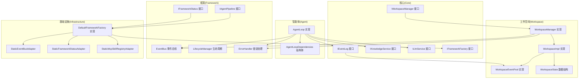
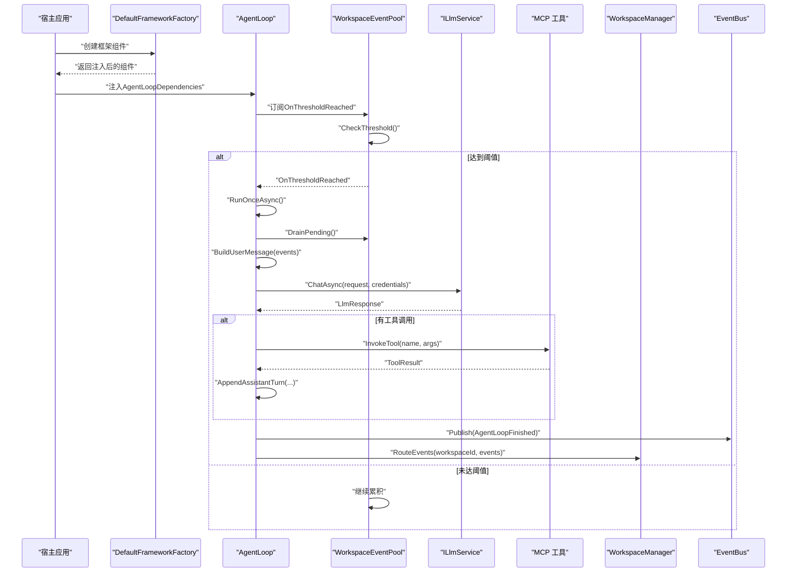
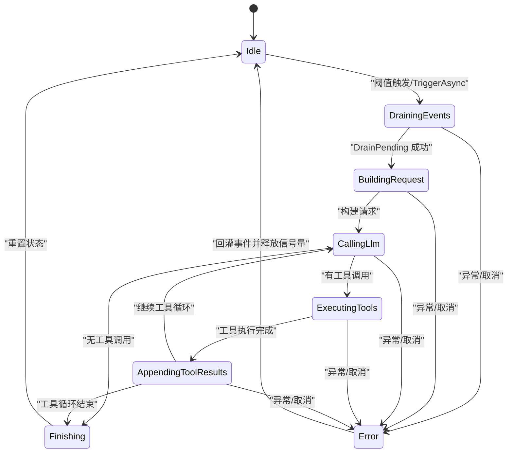
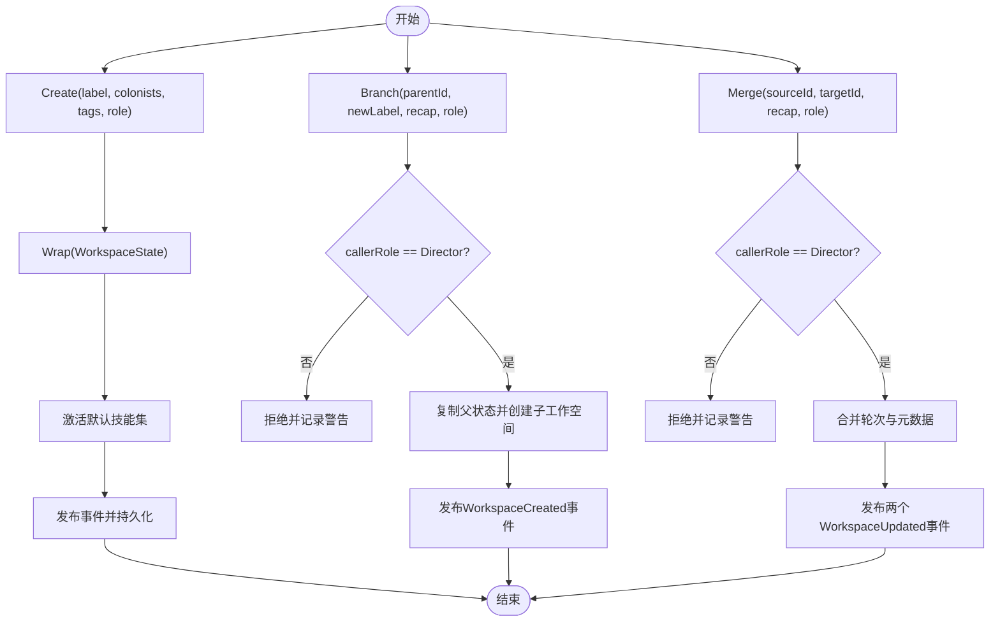
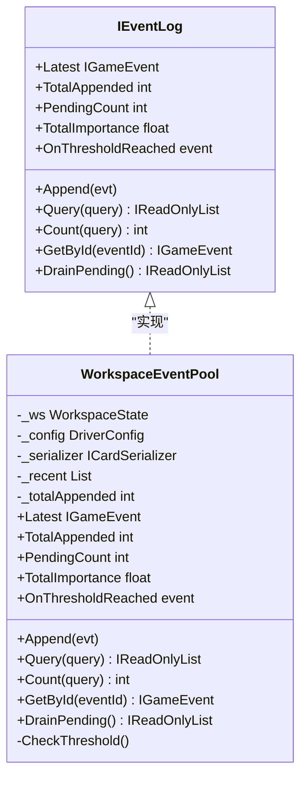
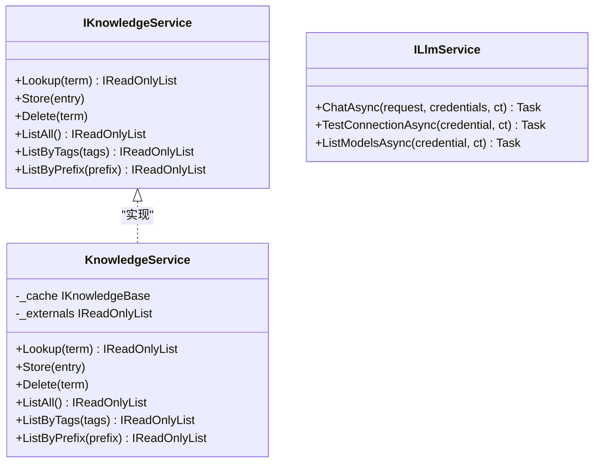
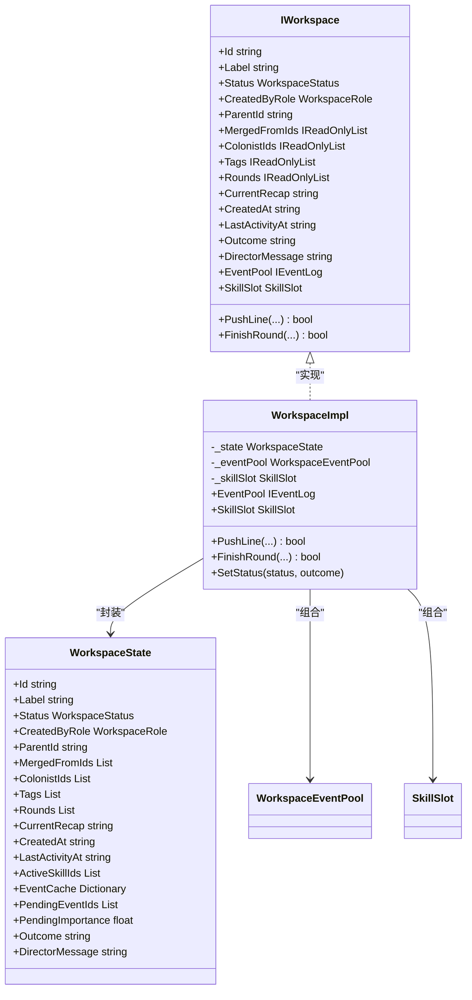
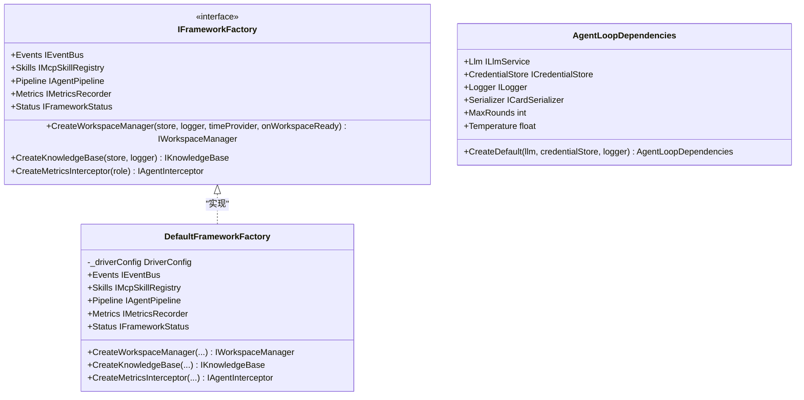
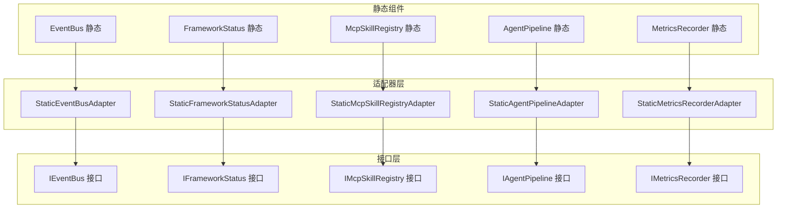
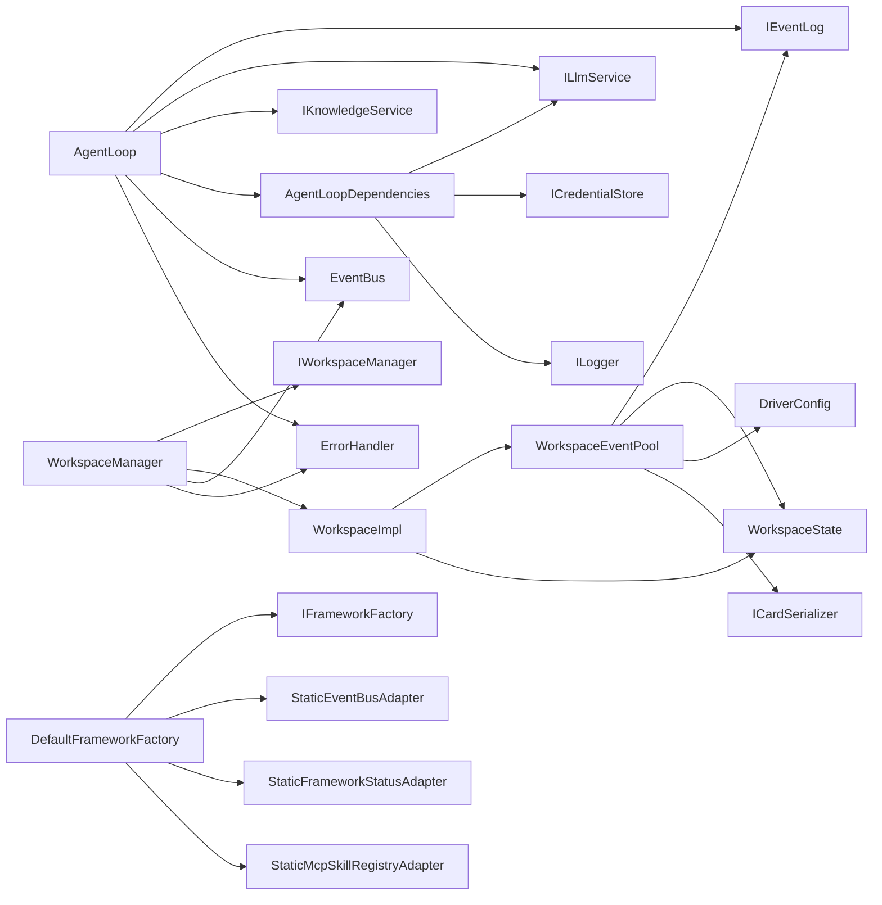

# 核心组件设计

<cite>
**本文引用的文件**
- [AgentLoop.cs](file://src/NPCLife/Agent/AgentLoop.cs)
- [AgentLoopDependencies.cs](file://src/NPCLife/Agent/AgentLoopDependencies.cs)
- [WorkspaceManager.cs](file://src/NPCLife/Workspace/WorkspaceManager.cs)
- [IFrameworkFactory.cs](file://src/NPCLife/Core/IFrameworkFactory.cs)
- [DefaultFrameworkFactory.cs](file://src/NPCLife/Infrastructure/DefaultFrameworkFactory.cs)
- [IEventLog.cs](file://src/NPCLife/Core/IEventLog.cs)
- [IKnowledgeService.cs](file://src/NPCLife/Core/IKnowledgeService.cs)
- [ILlmService.cs](file://src/NPCLife/Core/ILlmService.cs)
- [IWorkspaceManager.cs](file://src/NPCLife/Core/IWorkspaceManager.cs)
- [IWorkspace.cs](file://src/NPCLife/Workspace/IWorkspace.cs)
- [WorkspaceImpl.cs](file://src/NPCLife/Workspace/WorkspaceImpl.cs)
- [WorkspaceState.cs](file://src/NPCLife/Workspace/WorkspaceState.cs)
- [WorkspaceEventPool.cs](file://src/NPCLife/Workspace/WorkspaceEventPool.cs)
- [KnowledgeService.cs](file://src/NPCLife/Core/KnowledgeService.cs)
- [LifecycleManager.cs](file://src/NPCLife/Framework/LifecycleManager.cs)
- [EventBus.cs](file://src/NPCLife/Framework/EventBus.cs)
- [ErrorHandler.cs](file://src/NPCLife/Framework/ErrorHandler.cs)
- [IFrameworkStatus.cs](file://src/NPCLife/Framework/IFrameworkStatus.cs)
- [FrameworkStatus.cs](file://src/NPCLife/Framework/FrameworkStatus.cs)
- [IAgentPipeline.cs](file://src/NPCLife/Framework/IAgentPipeline.cs)
- [StaticEventBusAdapter.cs](file://src/NPCLife/Infrastructure/StaticEventBusAdapter.cs)
- [StaticFrameworkStatusAdapter.cs](file://src/NPCLife/Infrastructure/StaticFrameworkStatusAdapter.cs)
- [StaticMcpSkillRegistryAdapter.cs](file://src/NPCLife/Infrastructure/StaticMcpSkillRegistryAdapter.cs)
</cite>

## 更新摘要
**所做更改**
- 新增框架工厂模式和依赖注入架构章节
- 更新AgentLoop依赖注入设计
- 新增IFrameworkFactory接口和DefaultFrameworkFactory实现
- 新增AgentLoopDependencies结构体
- 新增静态适配器模式介绍
- 更新组件交互图以反映新的依赖注入架构

## 目录
1. [简介](#简介)
2. [项目结构](#项目结构)
3. [核心组件](#核心组件)
4. [架构概览](#架构概览)
5. [详细组件分析](#详细组件分析)
6. [依赖注入架构](#依赖注入架构)
7. [静态适配器模式](#静态适配器模式)
8. [依赖关系分析](#依赖关系分析)
9. [性能考量](#性能考量)
10. [故障排查指南](#故障排查指南)
11. [结论](#结论)

## 简介
本文件面向NPCLife的核心组件，围绕以下目标展开：
- AgentLoop作为多智能体协调中心的设计原理：状态机实现、异步处理机制与错误恢复策略
- WorkspaceManager的工作空间管理机制：CRUD、事件路由与生命周期管理
- IEventLog事件日志接口的设计模式及其在事件阈值触发中的作用
- IKnowledgeService与ILlmService等核心接口的抽象设计
- **新增**：框架工厂模式和依赖注入架构的设计原理
- **新增**：AgentLoopDependencies结构体的依赖注入设计
- **新增**：静态适配器模式在基础设施服务中的应用
- 组件间依赖关系、接口契约与实现细节
- 组件交互序列图与状态转换图

## 项目结构
NPCLife采用清晰的分层与模块化组织，现已引入依赖注入架构：
- Core层：核心接口与服务抽象（如IEventLog、IKnowledgeService、ILlmService、IWorkspaceManager、IFrameworkFactory）
- Workspace层：工作空间实体与事件池（WorkspaceState、WorkspaceImpl、WorkspaceEventPool、WorkspaceManager）
- Agent层：智能体循环（AgentLoop）及依赖注入（AgentLoopDependencies）
- Framework层：通用基础设施（EventBus、LifecycleManager、ErrorHandler、IFrameworkStatus、IAgentPipeline）
- Infrastructure层：具体实现（DefaultFrameworkFactory、静态适配器等）

**图表来源**
- [IFrameworkFactory.cs:15-61](file://src/NPCLife/Core/IFrameworkFactory.cs#L15-L61)
- [DefaultFrameworkFactory.cs:15-72](file://src/NPCLife/Infrastructure/DefaultFrameworkFactory.cs#L15-L72)
- [AgentLoopDependencies.cs:11-49](file://src/NPCLife/Agent/AgentLoopDependencies.cs#L11-L49)
- [StaticEventBusAdapter.cs:6-20](file://src/NPCLife/Infrastructure/StaticEventBusAdapter.cs#L6-L20)
- [StaticFrameworkStatusAdapter.cs:8-19](file://src/NPCLife/Infrastructure/StaticFrameworkStatusAdapter.cs#L8-L19)
- [StaticMcpSkillRegistryAdapter.cs:9-33](file://src/NPCLife/Infrastructure/StaticMcpSkillRegistryAdapter.cs#L9-L33)

**章节来源**
- [WorkspaceManager.cs:19-40](file://src/NPCLife/Workspace/WorkspaceManager.cs#L19-L40)
- [AgentLoop.cs:43-116](file://src/NPCLife/Agent/AgentLoop.cs#L43-L116)
- [IFrameworkFactory.cs:15-61](file://src/NPCLife/Core/IFrameworkFactory.cs#L15-L61)
- [DefaultFrameworkFactory.cs:15-72](file://src/NPCLife/Infrastructure/DefaultFrameworkFactory.cs#L15-L72)

## 核心组件
本节聚焦五个关键组件的职责、接口契约与实现要点。

- AgentLoop
  - 职责：基于事件池阈值被动激活，构建提示词，调用LLM，执行MCP工具，追加结果，统一收尾与错误恢复
  - **更新**：现在通过AgentLoopDependencies注入基础设施依赖，支持更灵活的配置
  - 关键接口：IEventLog（事件池）、ILlmService（LLM调用）、ICredentialStore（凭证）、IKnowledgeService（知识检索）
  - 特性：显式状态机、信号量防重入、CancellationToken贯穿、事件总线与错误追踪

- **新增**：AgentLoopDependencies
  - 职责：集中管理AgentLoop的基础设施依赖与行为配置，替代原有的多参数构造函数
  - 支持：LLM服务、凭证存储、日志接口、Card序列化器、最大轮数、采样温度等配置
  - 设计：提供CreateDefault静态方法，简化生产环境配置

- WorkspaceManager
  - 职责：工作空间的CRUD、分支/合并、事件路由；持久化与加载
  - 关键接口：IWorkspaceManager、IWorkspace、IEventLog
  - 特性：读写锁保护、序列化/反序列化、状态机校验、事件发布

- IEventLog
  - 职责：事件池抽象，支持阈值触发、DrainPending、查询与最近事件
  - 实现：WorkspaceEventPool（双缓冲：pending持久化 + recent内存）

- IKnowledgeService
  - 职责：知识查询、存储、删除、列表与标签/前缀筛选
  - 默认实现：KnowledgeService（聚合本地缓存与外部源）

- ILlmService
  - 职责：异步聊天、凭证连通性测试、模型列表查询
  - 设计：完全无状态，调用方提供凭证列表，内部顺序尝试

**章节来源**
- [AgentLoop.cs:43-116](file://src/NPCLife/Agent/AgentLoop.cs#L43-L116)
- [AgentLoopDependencies.cs:11-49](file://src/NPCLife/Agent/AgentLoopDependencies.cs#L11-L49)
- [WorkspaceManager.cs:19-40](file://src/NPCLife/Workspace/WorkspaceManager.cs#L19-L40)
- [IEventLog.cs:12-50](file://src/NPCLife/Core/IEventLog.cs#L12-L50)
- [IKnowledgeService.cs:12-34](file://src/NPCLife/Core/IKnowledgeService.cs#L12-L34)
- [ILlmService.cs:17-49](file://src/NPCLife/Core/ILlmService.cs#L17-L49)

## 架构概览
NPCLife采用"事件驱动 + 工作空间隔离 + 依赖注入"的多智能体架构：
- 事件从游戏侧进入WorkspaceEventPool（pending缓冲区持久化，recent缓冲区内存）
- 当阈值达到时，IEventLog.OnThresholdReached触发AgentLoop.RunOnceAsync
- **新增**：AgentLoop通过AgentLoopDependencies注入LLM服务、凭证存储、日志等基础设施依赖
- AgentLoop构建提示词，调用ILlmService，执行MCP工具，将结果注入消息历史
- WorkspaceManager负责工作空间的CRUD、分支/合并与事件路由，同时发布事件总线事件
- **新增**：DefaultFrameworkFactory提供框架组件工厂，统一管理基础设施服务
- LifecycleManager统一管理组件生命周期，EventBus提供跨模块解耦通信，ErrorHandler提供统一错误处理与追踪

**图表来源**
- [DefaultFrameworkFactory.cs:35-55](file://src/NPCLife/Infrastructure/DefaultFrameworkFactory.cs#L35-L55)
- [AgentLoopDependencies.cs:34-48](file://src/NPCLife/Agent/AgentLoopDependencies.cs#L34-L48)
- [WorkspaceEventPool.cs:81-90](file://src/NPCLife/Workspace/WorkspaceEventPool.cs#L81-L90)
- [AgentLoop.cs:171-337](file://src/NPCLife/Agent/AgentLoop.cs#L171-L337)
- [WorkspaceManager.cs:382-392](file://src/NPCLife/Workspace/WorkspaceManager.cs#L382-L392)
- [EventBus.cs:86-113](file://src/NPCLife/Framework/EventBus.cs#L86-L113)

## 详细组件分析

### AgentLoop：多智能体协调中心
- 状态机设计
  - 状态枚举：Idle、DrainingEvents、BuildingRequest、CallingLlm、ExecutingTools、AppendingToolResults、Finishing、Error
  - 显式状态流转：每个阶段对应明确职责，便于可观测与调试
  - 防重入：SemaphoreSlim保证同一时刻仅有一个RunOnceAsync在执行
  - 取消令牌：贯穿整个链路，支持外部取消

- **更新**：依赖注入设计
  - 现在通过AgentLoopDependencies注入基础设施依赖，包括LLM服务、凭证存储、日志接口等
  - 支持可选配置：Card序列化器、最大轮数、采样温度等
  - 提供CreateDefault静态方法，简化生产环境配置

- 异步处理机制
  - 主循环：RunOnceAsync内包含Drain、构建请求、LLM调用、工具调用循环、追加结果、收尾
  - 工具调用：逐个工具执行，支持拦截器（Before/After）与结果回传
  - 传输验证：每轮LLM调用前进行TranscriptValidator校验，确保消息历史结构正确

- 错误恢复策略
  - 成功路径：FinishOnce，发布AgentLoopFinished事件，清理资源
  - 失败路径：FailAndRequeue，将已drain事件回灌至池，发布AgentLoopFinished事件，记录错误
  - 统一追踪：BeginTrace/EndTrace与ErrorHandler配合，记录traceId与上下文

**图表来源**
- [AgentLoop.cs:19-29](file://src/NPCLife/Agent/AgentLoop.cs#L19-L29)
- [AgentLoop.cs:171-337](file://src/NPCLife/Agent/AgentLoop.cs#L171-L337)

**章节来源**
- [AgentLoop.cs:43-116](file://src/NPCLife/Agent/AgentLoop.cs#L43-L116)
- [AgentLoop.cs:171-337](file://src/NPCLife/Agent/AgentLoop.cs#L171-L337)
- [AgentLoop.cs:343-396](file://src/NPCLife/Agent/AgentLoop.cs#L343-L396)
- [AgentLoop.cs:407-435](file://src/NPCLife/Agent/AgentLoop.cs#L407-L435)

### WorkspaceManager：工作空间管理机制
- CRUD操作
  - Create：创建新工作空间，自动激活默认技能集，发布WorkspaceCreated事件
  - Get/List/GetActive：按ID查询、按状态过滤、获取活跃集合
  - UpdateStatus：状态机校验（Active/Suspended可转Active/Suspended/Completed/Abandoned；Completed/Abandoned不可逆）

- 分支/合并结构操作
  - Branch：仅Director可操作，复制父工作空间状态，创建子工作空间，发布WorkspaceCreated事件
  - Merge：仅Director可操作，合并源工作空间的轮次与元数据，更新目标工作空间状态，发布两个WorkspaceUpdated事件

- 事件路由
  - RouteEvents：将事件写入指定工作空间的EventPool（仅转发，实际写入由EventPool完成）

- 生命周期管理
  - 持久化：Persist将内存中所有工作空间序列化保存；LoadFromStore从存储加载
  - 读写锁：ReaderWriterLockSlim保护并发读写
  - Ready回调：加载完成后对Active工作空间触发onWorkspaceReady

**图表来源**
- [WorkspaceManager.cs:91-138](file://src/NPCLife/Workspace/WorkspaceManager.cs#L91-L138)
- [WorkspaceManager.cs:193-263](file://src/NPCLife/Workspace/WorkspaceManager.cs#L193-L263)
- [WorkspaceManager.cs:269-376](file://src/NPCLife/Workspace/WorkspaceManager.cs#L269-L376)

**章节来源**
- [WorkspaceManager.cs:19-40](file://src/NPCLife/Workspace/WorkspaceManager.cs#L19-L40)
- [WorkspaceManager.cs:91-138](file://src/NPCLife/Workspace/WorkspaceManager.cs#L91-L138)
- [WorkspaceManager.cs:165-187](file://src/NPCLife/Workspace/WorkspaceManager.cs#L165-L187)
- [WorkspaceManager.cs:193-263](file://src/NPCLife/Workspace/WorkspaceManager.cs#L193-L263)
- [WorkspaceManager.cs:269-376](file://src/NPCLife/Workspace/WorkspaceManager.cs#L269-L376)
- [WorkspaceManager.cs:429-457](file://src/NPCLife/Workspace/WorkspaceManager.cs#L429-L457)

### IEventLog：事件日志接口与阈值触发
- 接口职责
  - 写入：Append(IGameEvent)
  - 查询：Query(EventQuery)、Count(EventQuery)、Latest、GetById(string)
  - 池语义：TotalAppended、PendingCount、TotalImportance、DrainPending()
  - 激活：OnThresholdReached事件

- 实现：WorkspaceEventPool
  - 双层缓冲：pending（持久化）+ recent（内存）
  - 阈值检测：根据WorkspaceRole配置的有效计数与重要度阈值判断
  - DrainPending：取出所有pending事件并清空缓冲区，返回事件所有权

**图表来源**
- [IEventLog.cs:12-50](file://src/NPCLife/Core/IEventLog.cs#L12-L50)
- [WorkspaceEventPool.cs:21-43](file://src/NPCLife/Workspace/WorkspaceEventPool.cs#L21-L43)
- [WorkspaceEventPool.cs:49-90](file://src/NPCLife/Workspace/WorkspaceEventPool.cs#L49-L90)
- [WorkspaceEventPool.cs:166-183](file://src/NPCLife/Workspace/WorkspaceEventPool.cs#L166-L183)

**章节来源**
- [IEventLog.cs:12-50](file://src/NPCLife/Core/IEventLog.cs#L12-L50)
- [WorkspaceEventPool.cs:21-43](file://src/NPCLife/Workspace/WorkspaceEventPool.cs#L21-L43)
- [WorkspaceEventPool.cs:49-90](file://src/NPCLife/Workspace/WorkspaceEventPool.cs#L49-L90)
- [WorkspaceEventPool.cs:166-183](file://src/NPCLife/Workspace/WorkspaceEventPool.cs#L166-L183)

### IKnowledgeService与ILlmService：核心接口抽象
- IKnowledgeService
  - 职责：词条查询、存储、删除、列表与筛选
  - 默认实现：KnowledgeService，聚合本地缓存与外部只读源，支持并行查询

- ILlmService
  - 职责：异步聊天、连通性测试、模型列表查询
  - 设计：完全无状态，调用方提供凭证列表，内部顺序尝试

**图表来源**
- [IKnowledgeService.cs:12-34](file://src/NPCLife/Core/IKnowledgeService.cs#L12-L34)
- [KnowledgeService.cs:13-64](file://src/NPCLife/Core/KnowledgeService.cs#L13-L64)
- [ILlmService.cs:17-49](file://src/NPCLife/Core/ILlmService.cs#L17-L49)

**章节来源**
- [IKnowledgeService.cs:12-34](file://src/NPCLife/Core/IKnowledgeService.cs#L12-L34)
- [KnowledgeService.cs:13-64](file://src/NPCLife/Core/KnowledgeService.cs#L13-L64)
- [ILlmService.cs:17-49](file://src/NPCLife/Core/ILlmService.cs#L17-L49)

### WorkspaceImpl与WorkspaceState：工作空间实体
- WorkspaceImpl
  - 作为IWorkspace实现，封装WorkspaceState，暴露EventPool与SkillSlot
  - PushLine与FinishRound操作：前者立即发布ScriptLineReady事件，后者发布ScriptReady事件
  - SetStatus：由WorkspaceManager调用，更新状态与时间戳

- WorkspaceState
  - 数据结构：包含工作空间元数据、轮次列表、事件缓存、待处理事件ID与重要度等
  - WorkspaceRole与WorkspaceStatus枚举定义角色与状态机

**图表来源**
- [IWorkspace.cs:11-50](file://src/NPCLife/Workspace/IWorkspace.cs#L11-L50)
- [WorkspaceImpl.cs:16-46](file://src/NPCLife/Workspace/WorkspaceImpl.cs#L16-L46)
- [WorkspaceImpl.cs:83-182](file://src/NPCLife/Workspace/WorkspaceImpl.cs#L83-L182)
- [WorkspaceState.cs:94-150](file://src/NPCLife/Workspace/WorkspaceState.cs#L94-L150)

**章节来源**
- [IWorkspace.cs:11-50](file://src/NPCLife/Workspace/IWorkspace.cs#L11-L50)
- [WorkspaceImpl.cs:16-46](file://src/NPCLife/Workspace/WorkspaceImpl.cs#L16-L46)
- [WorkspaceImpl.cs:83-182](file://src/NPCLife/Workspace/WorkspaceImpl.cs#L83-L182)
- [WorkspaceState.cs:94-150](file://src/NPCLife/Workspace/WorkspaceState.cs#L94-L150)

## 依赖注入架构

### IFrameworkFactory：框架工厂接口
- 设计目的：将WorkspaceManager、BuiltInKnowledgeBase、MetricsInterceptor等具体类的创建抽象化
- 依赖注入：使宿主（如RimLife）不直接依赖构造签名，支持运行时替换实现
- 核心方法：
  - CreateWorkspaceManager：创建工作空间管理器，注入序列化器、DriverConfig等框架级依赖
  - CreateKnowledgeBase：创建内置知识库，注入缓存存储和日志接口
  - CreateMetricsInterceptor：创建度量拦截器，支持不同Agent角色
  - 基础设施服务：Events、Skills、Pipeline、Metrics、Status等单例服务

### DefaultFrameworkFactory：默认工厂实现
- 设计特点：持有框架级默认配置（DriverConfig、CardSerializer），封装具体类的构造细节
- 实现细节：
  - 支持自定义DriverConfig或使用默认配置
  - 通过静态适配器提供基础设施服务的单例实例
  - 统一管理框架组件的创建和依赖注入

### AgentLoopDependencies：依赖注入结构体
- 设计目的：将AgentLoop构造函数中的全局不变项收归一处，由宿主统一注入
- 必需依赖：ILlmService、ICredentialStore、ILogger
- 可选配置：ICardSerializer、MaxRounds、Temperature
- 工厂方法：CreateDefault静态方法，简化生产环境配置

**图表来源**
- [IFrameworkFactory.cs:15-61](file://src/NPCLife/Core/IFrameworkFactory.cs#L15-L61)
- [DefaultFrameworkFactory.cs:15-72](file://src/NPCLife/Infrastructure/DefaultFrameworkFactory.cs#L15-L72)
- [AgentLoopDependencies.cs:11-49](file://src/NPCLife/Agent/AgentLoopDependencies.cs#L11-L49)

**章节来源**
- [IFrameworkFactory.cs:15-61](file://src/NPCLife/Core/IFrameworkFactory.cs#L15-L61)
- [DefaultFrameworkFactory.cs:15-72](file://src/NPCLife/Infrastructure/DefaultFrameworkFactory.cs#L15-L72)
- [AgentLoopDependencies.cs:11-49](file://src/NPCLife/Agent/AgentLoopDependencies.cs#L11-L49)

## 静态适配器模式

### 设计理念
NPCLife采用静态适配器模式，将静态框架组件（如EventBus、FrameworkStatus、McpSkillRegistry）适配为可注入接口，实现依赖注入与静态访问的双重优势。

### 适配器实现
- **StaticEventBusAdapter**：委托到静态EventBus，提供标准IEventBus接口
- **StaticFrameworkStatusAdapter**：委托到静态FrameworkStatus，提供IFrameworkStatus接口
- **StaticMcpSkillRegistryAdapter**：委托到静态McpSkillRegistry，提供IMcpSkillRegistry接口
- **StaticAgentPipelineAdapter**：委托到静态AgentPipeline，提供IAgentPipeline接口
- **StaticMetricsRecorderAdapter**：委托到静态MetricsRecorder，提供IMetricsRecorder接口

### 优势特性
- **向后兼容**：原有静态API保持不变，新代码可通过接口注入
- **测试友好**：支持Mock和Dependency Injection
- **框架内聚**：DefaultFrameworkFactory统一管理适配器实例
- **运行时替换**：支持在不同宿主环境中替换实现

**图表来源**
- [StaticEventBusAdapter.cs:6-20](file://src/NPCLife/Infrastructure/StaticEventBusAdapter.cs#L6-L20)
- [StaticFrameworkStatusAdapter.cs:8-19](file://src/NPCLife/Infrastructure/StaticFrameworkStatusAdapter.cs#L8-L19)
- [StaticMcpSkillRegistryAdapter.cs:9-33](file://src/NPCLife/Infrastructure/StaticMcpSkillRegistryAdapter.cs#L9-L33)

**章节来源**
- [StaticEventBusAdapter.cs:6-20](file://src/NPCLife/Infrastructure/StaticEventBusAdapter.cs#L6-L20)
- [StaticFrameworkStatusAdapter.cs:8-19](file://src/NPCLife/Infrastructure/StaticFrameworkStatusAdapter.cs#L8-L19)
- [StaticMcpSkillRegistryAdapter.cs:9-33](file://src/NPCLife/Infrastructure/StaticMcpSkillRegistryAdapter.cs#L9-L33)

## 依赖关系分析
- 组件耦合
  - AgentLoop依赖IEventLog、ILlmService、ICredentialStore、IKnowledgeService、ILogger
  - **新增**：AgentLoop通过AgentLoopDependencies注入基础设施依赖
  - WorkspaceManager依赖IAuthorityStore、ILogger、DriverConfig、ICardSerializer、IWorkspace
  - **新增**：DefaultFrameworkFactory提供框架组件工厂，统一管理依赖注入
  - WorkspaceImpl依赖WorkspaceState、WorkspaceEventPool、SkillSlot
  - WorkspaceEventPool依赖WorkspaceState、DriverConfig、ICardSerializer
- **新增**：静态适配器模式
  - DefaultFrameworkFactory依赖静态适配器类，提供可注入的基础设施服务
  - 静态适配器委托到对应的静态框架组件
- 事件总线与生命周期
  - EventBus提供跨模块解耦通信，LifecycleManager统一管理组件生命周期
  - ErrorHandler提供统一错误处理与追踪，贯穿AgentLoop与WorkspaceManager

**图表来源**
- [AgentLoop.cs:45-57](file://src/NPCLife/Agent/AgentLoop.cs#L45-L57)
- [AgentLoopDependencies.cs:14-20](file://src/NPCLife/Agent/AgentLoopDependencies.cs#L14-L20)
- [WorkspaceManager.cs:21-28](file://src/NPCLife/Workspace/WorkspaceManager.cs#L21-L28)
- [WorkspaceImpl.cs:18-24](file://src/NPCLife/Workspace/WorkspaceImpl.cs#L18-L24)
- [WorkspaceEventPool.cs:23-26](file://src/NPCLife/Workspace/WorkspaceEventPool.cs#L23-L26)
- [IFrameworkFactory.cs:15-61](file://src/NPCLife/Core/IFrameworkFactory.cs#L15-L61)
- [DefaultFrameworkFactory.cs:15-72](file://src/NPCLife/Infrastructure/DefaultFrameworkFactory.cs#L15-L72)
- [StaticEventBusAdapter.cs:6-20](file://src/NPCLife/Infrastructure/StaticEventBusAdapter.cs#L6-L20)
- [StaticFrameworkStatusAdapter.cs:8-19](file://src/NPCLife/Infrastructure/StaticFrameworkStatusAdapter.cs#L8-L19)
- [StaticMcpSkillRegistryAdapter.cs:9-33](file://src/NPCLife/Infrastructure/StaticMcpSkillRegistryAdapter.cs#L9-L33)

**章节来源**
- [AgentLoop.cs:45-57](file://src/NPCLife/Agent/AgentLoop.cs#L45-L57)
- [AgentLoopDependencies.cs:14-20](file://src/NPCLife/Agent/AgentLoopDependencies.cs#L14-L20)
- [WorkspaceManager.cs:21-28](file://src/NPCLife/Workspace/WorkspaceManager.cs#L21-L28)
- [WorkspaceImpl.cs:18-24](file://src/NPCLife/Workspace/WorkspaceImpl.cs#L18-L24)
- [WorkspaceEventPool.cs:23-26](file://src/NPCLife/Workspace/WorkspaceEventPool.cs#L23-L26)

## 性能考量
- 并发控制
  - AgentLoop使用SemaphoreSlim防重入，避免并发RunOnceAsync
  - WorkspaceManager使用ReaderWriterLockSlim保护读写，减少锁竞争
- 缓冲策略
  - WorkspaceEventPool采用双缓冲：pending持久化、recent内存，降低序列化开销
  - 最近事件移除策略按最小重要度淘汰，平衡内存占用与查询效率
- 异步与取消
  - 所有网络调用均异步，支持CancellationToken，避免阻塞UI线程
- 事件总线
  - Handler异常隔离，避免单个订阅者失败影响整体事件流
- **新增**：依赖注入优化
  - DefaultFrameworkFactory缓存静态适配器实例，避免重复创建
  - AgentLoopDependencies提供默认配置，减少重复参数传递
  - 静态适配器模式支持懒加载，按需创建基础设施服务

## 故障排查指南
- 错误处理与追踪
  - BeginTrace/EndTrace：在AgentLoop入口与收尾处建立请求链路追踪
  - ErrorHandler：统一错误上报、事件发布与处理器回调
  - AgentLoop.FailAndRequeue：异常时回灌事件，确保幂等性
- 生命周期管理
  - LifecycleManager：Initialize/NotifyConfigReady/Shutdown/Reset，确保组件有序初始化与销毁
- 事件总线
  - Subscribe/Unsubscribe/Publish：支持优先级与错误隔离，便于定位问题
- **新增**：依赖注入故障排查
  - 检查IFrameworkFactory实现是否正确注册基础设施服务
  - 验证AgentLoopDependencies配置是否完整
  - 确认静态适配器是否正确委托到静态框架组件
  - 使用IFrameworkStatus.HealthCheck进行框架健康检查

**章节来源**
- [AgentLoop.cs:323-396](file://src/NPCLife/Agent/AgentLoop.cs#L323-L396)
- [ErrorHandler.cs:55-71](file://src/NPCLife/Framework/ErrorHandler.cs#L55-L71)
- [LifecycleManager.cs:159-240](file://src/NPCLife/Framework/LifecycleManager.cs#L159-L240)
- [EventBus.cs:46-113](file://src/NPCLife/Framework/EventBus.cs#L46-L113)
- [IFrameworkStatus.cs:9-22](file://src/NPCLife/Framework/IFrameworkStatus.cs#L9-L22)

## 结论
NPCLife的核心组件通过清晰的接口抽象、模块化设计和新增的依赖注入架构，实现了事件驱动的多智能体协作：
- AgentLoop以显式状态机与统一错误恢复策略保障稳定性
- **新增**：AgentLoopDependencies提供灵活的依赖注入配置
- WorkspaceManager以工作空间为中心，提供CRUD、分支/合并与事件路由
- IEventLog/IKnowledgeService/ILlmService等接口抽象确保了可插拔与可扩展性
- **新增**：IFrameworkFactory和DefaultFrameworkFactory实现框架工厂模式，支持运行时替换实现
- **新增**：静态适配器模式实现依赖注入与静态访问的双重优势
- EventBus与LifecycleManager提供了可靠的解耦通信与生命周期管理
- WorkspaceEventPool的双缓冲与阈值触发机制有效平衡了性能与一致性
- **新增**：依赖注入架构提升了系统的可测试性和可维护性