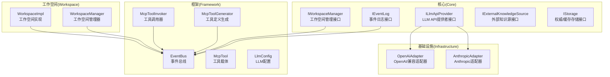
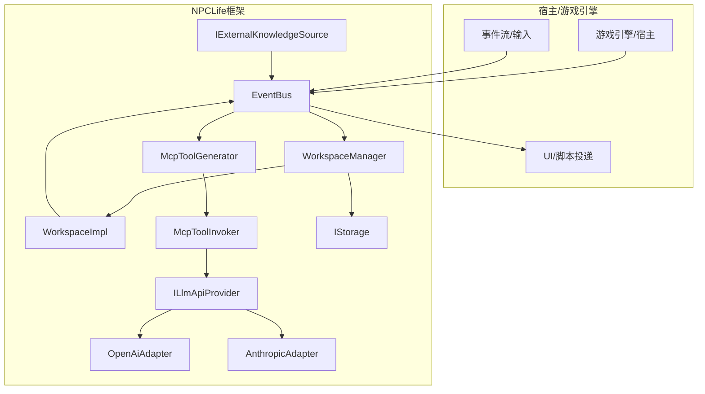
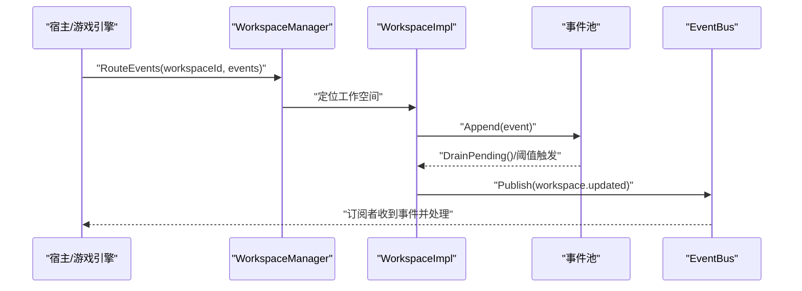
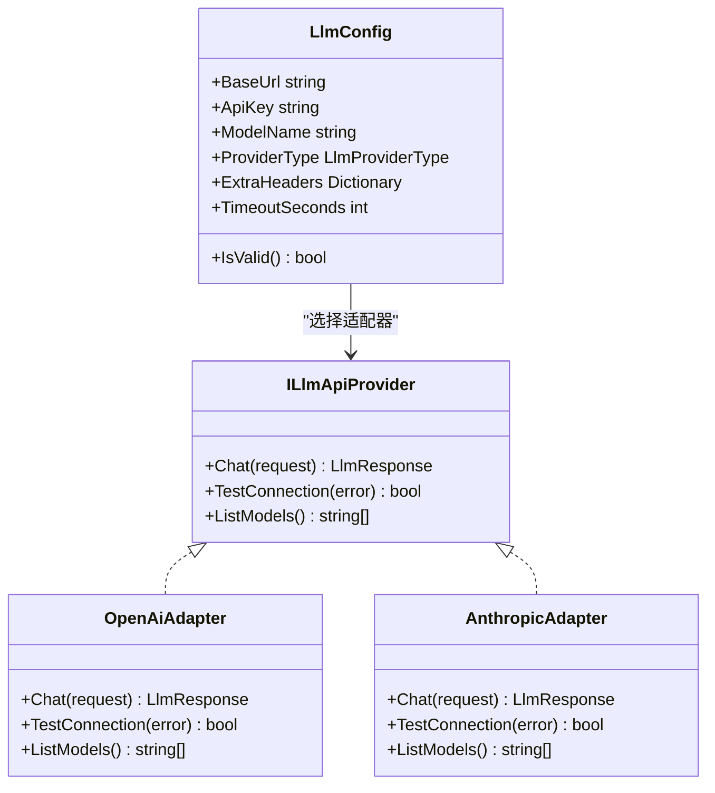
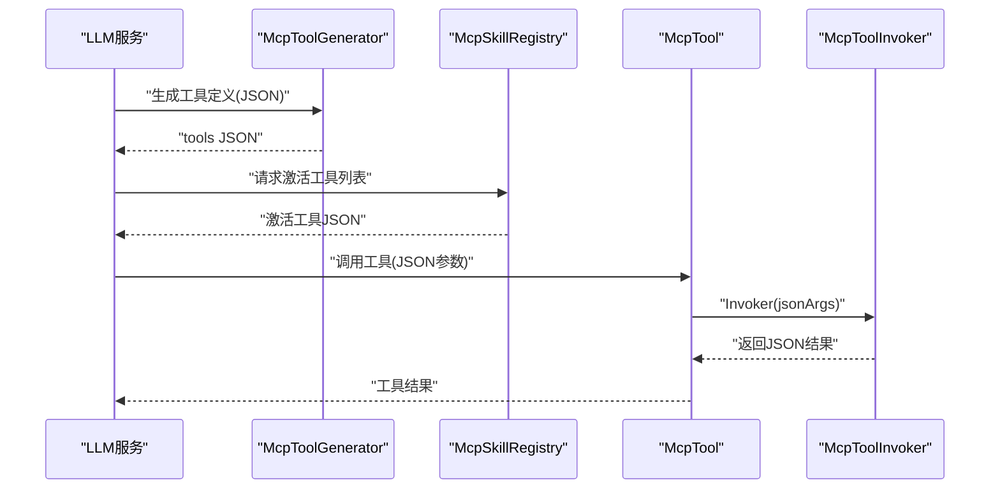
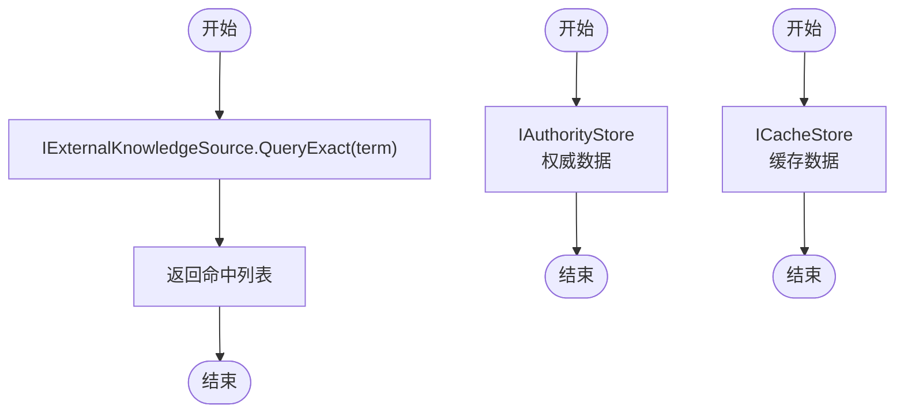
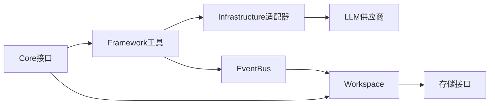

# 集成架构

<cite>
**本文引用的文件**
- [NPCLife.csproj](file://src/NPCLife/NPCLife.csproj)
- [README.md](file://README.md)
- [IEventLog.cs](file://src/NPCLife/Core/IEventLog.cs)
- [IWorkspaceManager.cs](file://src/NPCLife/Core/IWorkspaceManager.cs)
- [ILlmApiProvider.cs](file://src/NPCLife/Core/ILlmApiProvider.cs)
- [IExternalKnowledgeSource.cs](file://src/NPCLife/Core/IExternalKnowledgeSource.cs)
- [IStorage.cs](file://src/NPCLife/Core/IStorage.cs)
- [EventBus.cs](file://src/NPCLife/Framework/EventBus.cs)
- [LlmConfig.cs](file://src/NPCLife/Framework/Llm/LlmConfig.cs)
- [McpTool.cs](file://src/NPCLife/Framework/Mcp/McpTool.cs)
- [McpToolGenerator.cs](file://src/NPCLife/Framework/Mcp/McpToolGenerator.cs)
- [McpToolInvoker.cs](file://src/NPCLife/Framework/Mcp/McpToolInvoker.cs)
- [OpenAiAdapter.cs](file://src/NPCLife/Infrastructure/Llm/OpenAiAdapter.cs)
- [AnthropicAdapter.cs](file://src/NPCLife/Infrastructure/Llm/AnthropicAdapter.cs)
- [WorkspaceManager.cs](file://src/NPCLife/Workspace/WorkspaceManager.cs)
- [WorkspaceImpl.cs](file://src/NPCLife/Workspace/WorkspaceImpl.cs)
</cite>

## 目录
1. [引言](#引言)
2. [项目结构](#项目结构)
3. [核心组件](#核心组件)
4. [架构总览](#架构总览)
5. [详细组件分析](#详细组件分析)
6. [依赖分析](#依赖分析)
7. [性能考量](#性能考量)
8. [故障排查指南](#故障排查指南)
9. [结论](#结论)
10. [附录](#附录)

## 引言
本文件面向NPCLife的集成架构，聚焦以下目标：
- 游戏引擎集成接口设计：事件上报机制、工作空间查询与状态同步
- LLM提供商集成方案：OpenAI与Anthropic适配器
- MCP协议集成：工具注册、发现与调用
- 外部知识源集成与存储系统适配器模式
- 配置管理、版本兼容性与扩展性
- 系统边界与集成关系可视化

本架构以“适配器+事件总线+工作空间”为核心，通过统一的LLM请求/响应模型对接不同供应商，并以MCP工具体系承载业务能力的动态发现与调用。

## 项目结构
NPCLife采用分层与领域驱动的组织方式：
- Core：领域接口与核心数据结构（事件、工作空间、知识、存储、LLM接口）
- Framework：跨领域公共设施（事件总线、MCP工具链、JSON编解码、配置等）
- Infrastructure：具体实现（LLM适配器、知识库、脚本投递、交互历史存储）
- Workspace：工作空间生命周期与叙事编排
- Driver：驱动层配置（提示词、驱动配置）

图表来源
- [IEventLog.cs:12-50](file://src/NPCLife/Core/IEventLog.cs#L12-L50)
- [IWorkspaceManager.cs:14-56](file://src/NPCLife/Core/IWorkspaceManager.cs#L14-L56)
- [ILlmApiProvider.cs:12-35](file://src/NPCLife/Core/ILlmApiProvider.cs#L12-L35)
- [IExternalKnowledgeSource.cs:9-19](file://src/NPCLife/Core/IExternalKnowledgeSource.cs#L9-L19)
- [IStorage.cs:10-51](file://src/NPCLife/Core/IStorage.cs#L10-L51)
- [EventBus.cs:17-155](file://src/NPCLife/Framework/EventBus.cs#L17-L155)
- [McpTool.cs:14-38](file://src/NPCLife/Framework/Mcp/McpTool.cs#L14-L38)
- [McpToolGenerator.cs:12-78](file://src/NPCLife/Framework/Mcp/McpToolGenerator.cs#L12-L78)
- [McpToolInvoker.cs:14-72](file://src/NPCLife/Framework/Mcp/McpToolInvoker.cs#L14-L72)
- [LlmConfig.cs:23-66](file://src/NPCLife/Framework/Llm/LlmConfig.cs#L23-L66)
- [OpenAiAdapter.cs:18-74](file://src/NPCLife/Infrastructure/Llm/OpenAiAdapter.cs#L18-L74)
- [AnthropicAdapter.cs:23-68](file://src/NPCLife/Infrastructure/Llm/AnthropicAdapter.cs#L23-L68)
- [WorkspaceManager.cs:19-40](file://src/NPCLife/Workspace/WorkspaceManager.cs#L19-L40)
- [WorkspaceImpl.cs:16-46](file://src/NPCLife/Workspace/WorkspaceImpl.cs#L16-L46)

章节来源
- [NPCLife.csproj:1-38](file://src/NPCLife/NPCLife.csproj#L1-L38)
- [README.md](file://README.md)

## 核心组件
- 事件总线：提供命名空间事件名、优先级排序、错误隔离与日志注入，支撑框架内各模块解耦通信。
- 工作空间管理：提供工作空间的CRUD、分支/合并、事件路由与持久化，统一状态与叙事推进。
- LLM适配器：统一请求/响应模型，屏蔽OpenAI与Anthropic差异，支持连接测试与模型列举。
- MCP工具链：通过特性标注与反射生成工具定义，统一调用入口，支持工具发现与调用。
- 存储与知识：权威存储与缓存存储分离，外部知识源抽象，便于接入GameDef、Wiki或RAG。

章节来源
- [EventBus.cs:17-155](file://src/NPCLife/Framework/EventBus.cs#L17-L155)
- [WorkspaceManager.cs:19-40](file://src/NPCLife/Workspace/WorkspaceManager.cs#L19-L40)
- [OpenAiAdapter.cs:18-74](file://src/NPCLife/Infrastructure/Llm/OpenAiAdapter.cs#L18-L74)
- [AnthropicAdapter.cs:23-68](file://src/NPCLife/Infrastructure/Llm/AnthropicAdapter.cs#L23-L68)
- [McpToolGenerator.cs:12-78](file://src/NPCLife/Framework/Mcp/McpToolGenerator.cs#L12-L78)
- [IStorage.cs:10-51](file://src/NPCLife/Core/IStorage.cs#L10-L51)
- [IExternalKnowledgeSource.cs:9-19](file://src/NPCLife/Core/IExternalKnowledgeSource.cs#L9-L19)

## 架构总览
NPCLife以“事件驱动 + 工作空间 + MCP工具 + LLM适配器”的组合实现多Agent叙事管线。系统边界如下：

图表来源
- [EventBus.cs:17-155](file://src/NPCLife/Framework/EventBus.cs#L17-L155)
- [WorkspaceManager.cs:19-40](file://src/NPCLife/Workspace/WorkspaceManager.cs#L19-L40)
- [WorkspaceImpl.cs:16-46](file://src/NPCLife/Workspace/WorkspaceImpl.cs#L16-L46)
- [McpToolGenerator.cs:12-78](file://src/NPCLife/Framework/Mcp/McpToolGenerator.cs#L12-L78)
- [McpToolInvoker.cs:14-72](file://src/NPCLife/Framework/Mcp/McpToolInvoker.cs#L14-L72)
- [ILlmApiProvider.cs:12-35](file://src/NPCLife/Core/ILlmApiProvider.cs#L12-L35)
- [OpenAiAdapter.cs:18-74](file://src/NPCLife/Infrastructure/Llm/OpenAiAdapter.cs#L18-L74)
- [AnthropicAdapter.cs:23-68](file://src/NPCLife/Infrastructure/Llm/AnthropicAdapter.cs#L23-L68)
- [IStorage.cs:10-51](file://src/NPCLife/Core/IStorage.cs#L10-L51)
- [IExternalKnowledgeSource.cs:9-19](file://src/NPCLife/Core/IExternalKnowledgeSource.cs#L9-L19)

## 详细组件分析

### 事件上报与工作空间状态同步
- 事件上报：通过事件总线发布命名空间事件（如工作空间更新、脚本就绪、工具调用前后等），订阅者按优先级执行，错误隔离。
- 工作空间状态同步：WorkspaceManager维护内存状态并通过IAuthorityStore持久化；WorkspaceImpl封装事件池与技能槽，推动状态变更与事件传播。

图表来源
- [WorkspaceManager.cs:382-392](file://src/NPCLife/Workspace/WorkspaceManager.cs#L382-L392)
- [WorkspaceImpl.cs:114-120](file://src/NPCLife/Workspace/WorkspaceImpl.cs#L114-L120)
- [IEventLog.cs:42-49](file://src/NPCLife/Core/IEventLog.cs#L42-L49)
- [EventBus.cs:86-113](file://src/NPCLife/Framework/EventBus.cs#L86-L113)

章节来源
- [IEventLog.cs:12-50](file://src/NPCLife/Core/IEventLog.cs#L12-L50)
- [IWorkspaceManager.cs:14-56](file://src/NPCLife/Core/IWorkspaceManager.cs#L14-L56)
- [WorkspaceManager.cs:19-40](file://src/NPCLife/Workspace/WorkspaceManager.cs#L19-L40)
- [WorkspaceImpl.cs:16-46](file://src/NPCLife/Workspace/WorkspaceImpl.cs#L16-L46)
- [EventBus.cs:17-155](file://src/NPCLife/Framework/EventBus.cs#L17-L155)

### LLM提供商集成（OpenAI与Anthropic）
- 统一接口：ILlmApiProvider定义Chat、连接测试、模型列举，适配器在工作线程同步调用。
- OpenAI适配器：遵循OpenAI Chat Completions格式，支持工具调用、用量统计与错误映射。
- Anthropic适配器：遵循Messages API，处理system提示、tool_use内容块与用量字段映射。
- 配置：LlmConfig提供BaseUrl、ApiKey、ModelName、ProviderType、ExtraHeaders与超时控制。

图表来源
- [ILlmApiProvider.cs:12-35](file://src/NPCLife/Core/ILlmApiProvider.cs#L12-L35)
- [OpenAiAdapter.cs:18-74](file://src/NPCLife/Infrastructure/Llm/OpenAiAdapter.cs#L18-L74)
- [AnthropicAdapter.cs:23-68](file://src/NPCLife/Infrastructure/Llm/AnthropicAdapter.cs#L23-L68)
- [LlmConfig.cs:23-66](file://src/NPCLife/Framework/Llm/LlmConfig.cs#L23-L66)

章节来源
- [ILlmApiProvider.cs:12-35](file://src/NPCLife/Core/ILlmApiProvider.cs#L12-L35)
- [OpenAiAdapter.cs:18-74](file://src/NPCLife/Infrastructure/Llm/OpenAiAdapter.cs#L18-L74)
- [AnthropicAdapter.cs:23-68](file://src/NPCLife/Infrastructure/Llm/AnthropicAdapter.cs#L23-L68)
- [LlmConfig.cs:23-66](file://src/NPCLife/Framework/Llm/LlmConfig.cs#L23-L66)

### MCP协议集成（工具注册、发现与调用）
- 工具注册：通过特性标注方法（McpTool、McpParam），McpToolGenerator基于反射生成工具定义（含名称、描述、参数Schema）。
- 工具发现：SerializeAllFrom(Type)扫描类型上的工具方法，SerializeAllActiveTools根据激活技能ID聚合工具定义。
- 工具调用：McpToolInvoker将JSON参数反序列化为强类型参数，反射调用目标方法，序列化返回值；对异常进行包装与返回。

图表来源
- [McpToolGenerator.cs:12-78](file://src/NPCLife/Framework/Mcp/McpToolGenerator.cs#L12-L78)
- [McpToolGenerator.cs:126-146](file://src/NPCLife/Framework/Mcp/McpToolGenerator.cs#L126-L146)
- [McpToolGenerator.cs:153-166](file://src/NPCLife/Framework/Mcp/McpToolGenerator.cs#L153-L166)
- [McpTool.cs:14-38](file://src/NPCLife/Framework/Mcp/McpTool.cs#L14-L38)
- [McpToolInvoker.cs:14-72](file://src/NPCLife/Framework/Mcp/McpToolInvoker.cs#L14-L72)

章节来源
- [McpTool.cs:14-38](file://src/NPCLife/Framework/Mcp/McpTool.cs#L14-L38)
- [McpToolGenerator.cs:12-78](file://src/NPCLife/Framework/Mcp/McpToolGenerator.cs#L12-L78)
- [McpToolInvoker.cs:14-72](file://src/NPCLife/Framework/Mcp/McpToolInvoker.cs#L14-L72)

### 外部知识源与存储系统
- 外部知识源：IExternalKnowledgeSource提供精确查询接口，SourceName用于标注来源，便于溯源与归因。
- 存储系统：IStorage分离权威存储（IAuthorityStore）与缓存存储（ICacheStore），分别用于不可丢失数据与可再生数据，降低持久化压力并提升性能。

图表来源
- [IExternalKnowledgeSource.cs:9-19](file://src/NPCLife/Core/IExternalKnowledgeSource.cs#L9-L19)
- [IStorage.cs:10-51](file://src/NPCLife/Core/IStorage.cs#L10-L51)

章节来源
- [IExternalKnowledgeSource.cs:9-19](file://src/NPCLife/Core/IExternalKnowledgeSource.cs#L9-L19)
- [IStorage.cs:10-51](file://src/NPCLife/Core/IStorage.cs#L10-L51)

## 依赖分析
- 模块内聚：Core接口定义清晰，Framework提供纯函数与工具类，Infrastructure实现具体适配器，Workspace负责状态与叙事，Driver提供配置。
- 耦合关系：EventBus作为低耦合通信中枢；WorkspaceManager依赖存储接口；MCP工具链依赖反射与JSON编解码；LLM适配器依赖统一请求/响应模型。
- 外部依赖：System.Net.Http用于网络请求；System.Text.Json用于JSON处理（通过JsonWriter/JsonParser间接使用）。

图表来源
- [NPCLife.csproj:23-29](file://src/NPCLife/NPCLife.csproj#L23-L29)
- [EventBus.cs:17-155](file://src/NPCLife/Framework/EventBus.cs#L17-L155)
- [WorkspaceManager.cs:19-40](file://src/NPCLife/Workspace/WorkspaceManager.cs#L19-L40)
- [OpenAiAdapter.cs:18-74](file://src/NPCLife/Infrastructure/Llm/OpenAiAdapter.cs#L18-L74)
- [AnthropicAdapter.cs:23-68](file://src/NPCLife/Infrastructure/Llm/AnthropicAdapter.cs#L23-L68)

章节来源
- [NPCLife.csproj:23-29](file://src/NPCLife/NPCLife.csproj#L23-L29)

## 性能考量
- 事件总线：订阅者数量与优先级排序影响发布开销；建议按模块拆分事件域，避免过度订阅。
- 工作空间：读写锁保护状态变更；批量持久化减少IO次数；事件池阈值激活避免频繁唤醒。
- MCP工具：反射调用成本较高，建议对热点工具进行缓存与预热；参数/返回值序列化需避免大对象拷贝。
- LLM适配器：HTTP同步调用在工作线程执行，注意超时与重试策略；工具调用与消息流控结合，避免峰值拥塞。

## 故障排查指南
- LLM连接问题：使用适配器的连接测试方法，检查BaseUrl、ApiKey、模型名与超时设置；关注HTTP状态码与错误响应体。
- MCP工具调用异常：确认工具定义生成正确（参数必填、类型映射），检查Invoker的参数转换与返回值序列化；查看异常包装信息。
- 工作空间状态异常：核对状态机迁移合法性；检查持久化失败日志与恢复流程。
- 事件未到达：确认事件名拼写与命名空间；检查订阅优先级与错误隔离导致的吞异常。

章节来源
- [OpenAiAdapter.cs:79-112](file://src/NPCLife/Infrastructure/Llm/OpenAiAdapter.cs#L79-L112)
- [AnthropicAdapter.cs:70-92](file://src/NPCLife/Infrastructure/Llm/AnthropicAdapter.cs#L70-L92)
- [McpToolInvoker.cs:62-71](file://src/NPCLife/Framework/Mcp/McpToolInvoker.cs#L62-L71)
- [WorkspaceManager.cs:406-423](file://src/NPCLife/Workspace/WorkspaceManager.cs#L406-L423)
- [EventBus.cs:104-112](file://src/NPCLife/Framework/EventBus.cs#L104-L112)

## 结论
NPCLife通过清晰的接口分层与事件驱动机制，实现了与游戏引擎的松耦合集成；以适配器模式统一LLM提供商差异，以MCP工具链实现业务能力的动态发现与调用；以工作空间为中心的状态与叙事编排，支撑多Agent叙事管线。该架构具备良好的扩展性与可维护性，适合在不同宿主环境中部署与演进。

## 附录
- 配置管理：LlmConfig集中管理API基础地址、密钥、模型与超时；可通过缓存存储持久化，支持配置向导与热更新。
- 版本兼容性：适配器层隔离供应商差异；事件总线与MCP工具链保持稳定的契约；存储接口支持未来替换实现。
- 扩展性建议：新增LLM供应商只需实现ILlmApiProvider；新增MCP工具通过特性标注即可自动发现；新增外部知识源实现IExternalKnowledgeSource即可接入。