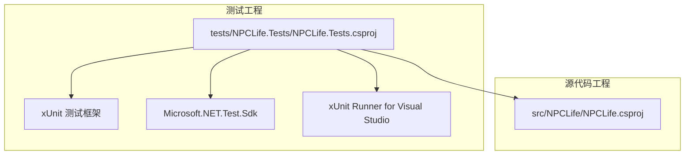
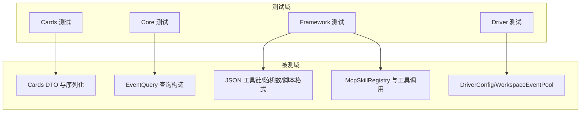
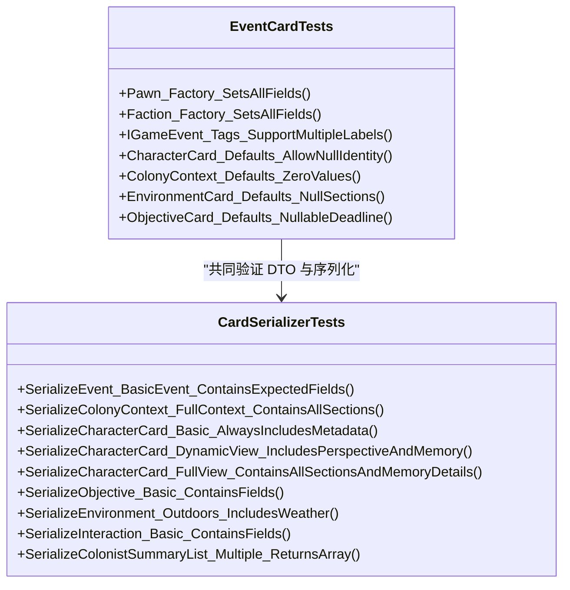
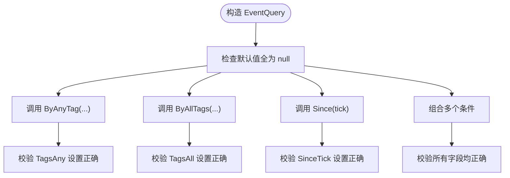
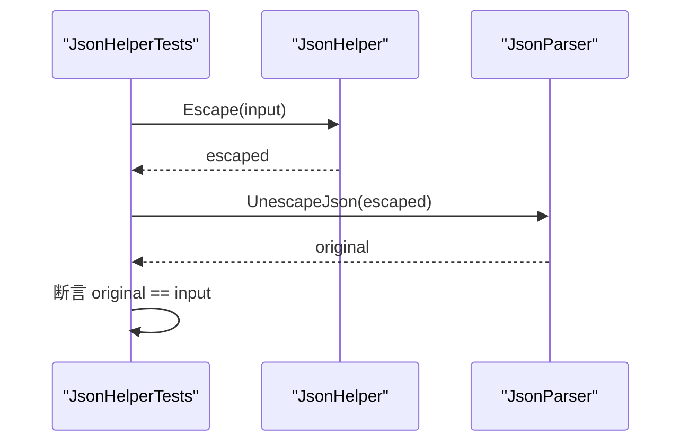
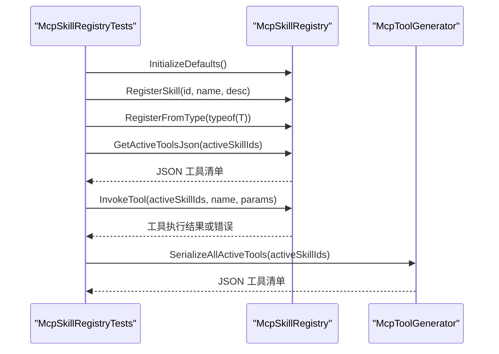
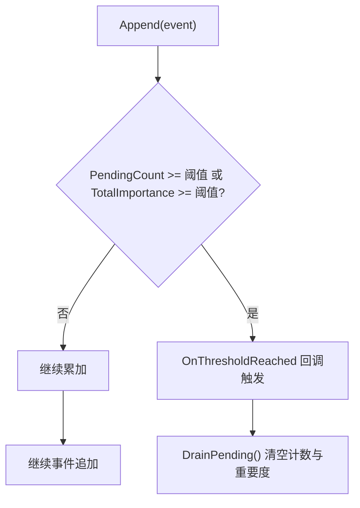
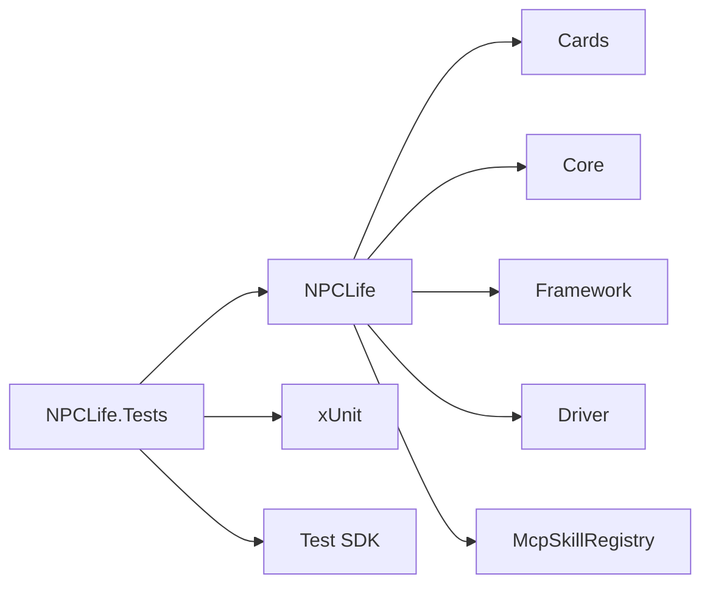

# 测试策略

<cite>
**本文引用的文件**
- [NPCLife.Tests.csproj](file://tests/NPCLife.Tests/NPCLife.Tests.csproj)
- [NPCLife.csproj](file://src/NPCLife/NPCLife.csproj)
- [README.md](file://README.md)
- [LogTestBase.cs](file://tests/NPCLife.Tests/Helpers/LogTestBase.cs)
- [EventCardTests.cs](file://tests/NPCLife.Tests/Cards/EventCardTests.cs)
- [EventQueryTests.cs](file://tests/NPCLife.Tests/Core/EventQueryTests.cs)
- [CardSerializerTests.cs](file://tests/NPCLife.Tests/Framework/CardSerializerTests.cs)
- [McpSkillRegistryTests.cs](file://tests/NPCLife.Tests/Framework/McpSkillRegistryTests.cs)
- [JsonHelperTests.cs](file://tests/NPCLife.Tests/Framework/JsonHelperTests.cs)
- [JsonParserTests.cs](file://tests/NPCLife.Tests/Framework/JsonParserTests.cs)
- [JsonWriterTests.cs](file://tests/NPCLife.Tests/Framework/JsonWriterTests.cs)
- [DriverConfigTests.cs](file://tests/NPCLife.Tests/Driver/DriverConfigTests.cs)
- [WorkspaceEventPoolTests.cs](file://tests/NPCLife.Tests/Driver/WorkspaceEventPoolTests.cs)
- [RandomIntTests.cs](file://tests/NPCLife.Tests/Framework/RandomIntTests.cs)
- [ScriptFormatTests.cs](file://tests/NPCLife.Tests/Framework/ScriptFormatTests.cs)
</cite>

## 目录
1. [引言](#引言)
2. [项目结构](#项目结构)
3. [核心组件](#核心组件)
4. [架构总览](#架构总览)
5. [详细组件分析](#详细组件分析)
6. [依赖分析](#依赖分析)
7. [性能考虑](#性能考虑)
8. [故障排查指南](#故障排查指南)
9. [结论](#结论)
10. [附录](#附录)

## 引言
本文件面向 NPCLife 项目的测试策略与实践，系统阐述测试架构、框架选择、单元测试设计原则与实现方法、集成测试覆盖范围与场景、测试用例设计模式与编写指南、测试数据准备与管理策略、测试自动化与持续集成配置建议、测试覆盖率分析与质量评估方法，以及测试在系统稳定性保障中的作用。目标是帮助开发者与测试工程师高效、可靠地验证框架的正确性与鲁棒性。

## 项目结构
NPCLife 采用“源代码 + 测试项目”的双工程组织方式，测试项目以 xUnit 作为测试框架，直接引用源工程进行编译期耦合与运行期验证。源工程通过 InternalsVisibleTo 将内部成员暴露给测试项目，确保测试对关键实现细节的可达性。

图表来源
- [NPCLife.Tests.csproj:1-23](file://tests/NPCLife.Tests/NPCLife.Tests.csproj#L1-L23)
- [NPCLife.csproj:32-35](file://src/NPCLife/NPCLife.csproj#L32-L35)

章节来源
- [NPCLife.Tests.csproj:1-23](file://tests/NPCLife.Tests/NPCLife.Tests.csproj#L1-L23)
- [NPCLife.csproj:1-38](file://src/NPCLife/NPCLife.csproj#L1-L38)

## 核心组件
- 测试框架与运行时
  - xUnit 2.9.3：提供断言、理论参数化、Fact/Theory 等能力，支持并发执行与并行测试集。
  - Microsoft.NET.Test.Sdk 17.13.0：统一的测试平台与 MSBuild 集成。
  - xUnit.Runner.VisualStudio 3.0.2：VS 内置测试运行器。
- 测试项目配置
  - 目标框架：net48；语言版本：C# 12；测试项目标识 IsTestProject=true。
  - 与源工程强耦合：通过项目引用与 InternalsVisibleTo，测试可访问内部类型。
- 日志与可读性
  - LogTestBase：提供结构化日志输出、步骤计数、断言通过/失败标记、日志累积器等，便于复杂流程的人在回路观测与调试。

章节来源
- [NPCLife.Tests.csproj:1-23](file://tests/NPCLife.Tests/NPCLife.Tests.csproj#L1-L23)
- [NPCLife.csproj:32-35](file://src/NPCLife/NPCLife.csproj#L32-L35)
- [LogTestBase.cs:1-154](file://tests/NPCLife.Tests/Helpers/LogTestBase.cs#L1-L154)

## 架构总览
测试架构围绕“纯逻辑断言 + 关键路径自检 + 场景化集成验证”展开，覆盖数据传输对象（DTO）、查询构造器、序列化器、MCP 技能注册表、JSON 工具链、随机数生成、脚本格式解析、驱动配置与事件池等模块。

图表来源
- [EventCardTests.cs:1-180](file://tests/NPCLife.Tests/Cards/EventCardTests.cs#L1-L180)
- [EventQueryTests.cs:1-105](file://tests/NPCLife.Tests/Core/EventQueryTests.cs#L1-L105)
- [CardSerializerTests.cs:1-453](file://tests/NPCLife.Tests/Framework/CardSerializerTests.cs#L1-L453)
- [McpSkillRegistryTests.cs:1-296](file://tests/NPCLife.Tests/Framework/McpSkillRegistryTests.cs#L1-L296)
- [JsonHelperTests.cs:1-92](file://tests/NPCLife.Tests/Framework/JsonHelperTests.cs#L1-L92)
- [JsonParserTests.cs:1-268](file://tests/NPCLife.Tests/Framework/JsonParserTests.cs#L1-L268)
- [JsonWriterTests.cs:1-204](file://tests/NPCLife.Tests/Framework/JsonWriterTests.cs#L1-L204)
- [DriverConfigTests.cs:1-57](file://tests/NPCLife.Tests/Driver/DriverConfigTests.cs#L1-L57)
- [WorkspaceEventPoolTests.cs:1-352](file://tests/NPCLife.Tests/Driver/WorkspaceEventPoolTests.cs#L1-L352)
- [RandomIntTests.cs:1-128](file://tests/NPCLife.Tests/Framework/RandomIntTests.cs#L1-L128)
- [ScriptFormatTests.cs:1-281](file://tests/NPCLife.Tests/Framework/ScriptFormatTests.cs#L1-L281)

## 详细组件分析

### 数据传输对象（DTO）与序列化自检
- 覆盖范围
  - EventActorRef、IGameEvent 标签、CharacterCard、ColonyContext、EnvironmentCard、ObjectiveCard、InteractionRecord、ColonistSummary 等。
- 设计要点
  - 默认值与空值处理：验证零值/空集合/空字符串的正确性。
  - 值语义与工厂方法：确保构造参数与派生字段一致。
  - 序列化路径：CardSerializer 对各类 DTO 的序列化输出包含预期字段，视图模式（static/dynamic/full）差异清晰。
- 测试模式
  - 使用 Fact 验证确定性字段；使用 Theory 参数化常见边界与特殊字符。
  - 使用辅助类（MockContentProvider/TestGameEvent）构造最小可验证输入。

图表来源
- [EventCardTests.cs:1-180](file://tests/NPCLife.Tests/Cards/EventCardTests.cs#L1-L180)
- [CardSerializerTests.cs:1-453](file://tests/NPCLife.Tests/Framework/CardSerializerTests.cs#L1-L453)

章节来源
- [EventCardTests.cs:1-180](file://tests/NPCLife.Tests/Cards/EventCardTests.cs#L1-L180)
- [CardSerializerTests.cs:1-453](file://tests/NPCLife.Tests/Framework/CardSerializerTests.cs#L1-L453)

### 查询构造器 EventQuery
- 覆盖范围
  - 默认值、工厂方法、组合过滤器（标签 Any/All、时间窗、角色、重要度、分页）。
- 设计要点
  - 所有属性均为可空，组合时仅设置相关字段，避免污染其他条件。
- 测试模式
  - 使用 Fact 验证单一条件；使用组合构造器验证多条件聚合。

图表来源
- [EventQueryTests.cs:1-105](file://tests/NPCLife.Tests/Core/EventQueryTests.cs#L1-L105)

章节来源
- [EventQueryTests.cs:1-105](file://tests/NPCLife.Tests/Core/EventQueryTests.cs#L1-L105)

### JSON 工具链（Escape/Quote/Parse/Serialize/Unescape）
- 覆盖范围
  - 转义规则（控制字符、引号、换行符等）、引号包裹、解析字典/数组、反转义、序列化原语与文化无关格式。
- 设计要点
  - 特殊字符编码策略与 Unicode 转义一致性；解析时保留嵌套对象/数组为原始 JSON 字符串；序列化遵循不变式文化。
- 测试模式
  - 参数化测试覆盖常见转义组合；Round-trip 测试保证序列化/反序列化一致性。

图表来源
- [JsonHelperTests.cs:1-92](file://tests/NPCLife.Tests/Framework/JsonHelperTests.cs#L1-L92)
- [JsonParserTests.cs:1-268](file://tests/NPCLife.Tests/Framework/JsonParserTests.cs#L1-L268)

章节来源
- [JsonHelperTests.cs:1-92](file://tests/NPCLife.Tests/Framework/JsonHelperTests.cs#L1-L92)
- [JsonParserTests.cs:1-268](file://tests/NPCLife.Tests/Framework/JsonParserTests.cs#L1-L268)

### JSON 写入器（JsonWriter）
- 覆盖范围
  - 属性写入（字符串/布尔/整数/浮点/格式化浮点）、数组写入、原始 JSON 嵌入、键/值特殊字符转义、链式调用完整性。
- 设计要点
  - 忽略空值字段；保持 JSON 结构闭合；支持 ToString 截断输出以便拼接。
- 测试模式
  - 链式调用组合断言；边界值与特殊字符断言；空/空数组/空原始 JSON 的跳过策略。

章节来源
- [JsonWriterTests.cs:1-204](file://tests/NPCLife.Tests/Framework/JsonWriterTests.cs#L1-L204)

### MCP 技能注册表与工具调用
- 覆盖范围
  - 默认技能初始化数量、技能元数据查询、工具注册与筛选、活动工具 JSON 生成、技能列表 JSON、按技能查询工具、工具调用（含系统工具回退）、错误结果构造、与工具生成器的集成。
- 设计要点
  - 无状态注册表，激活状态由调用方提供；孤儿工具不会被激活；系统技能始终激活。
- 测试模式
  - 使用特性标注工具（McpSkill/McpTool/McpParam）；通过注册表 API 验证纯函数行为；工具调用返回值以包含关键字或非空为断言条件。

图表来源
- [McpSkillRegistryTests.cs:1-296](file://tests/NPCLife.Tests/Framework/McpSkillRegistryTests.cs#L1-L296)

章节来源
- [McpSkillRegistryTests.cs:1-296](file://tests/NPCLife.Tests/Framework/McpSkillRegistryTests.cs#L1-L296)

### 驱动配置与事件池（事件阈值触发）
- 覆盖范围
  - 配置默认值与按角色的有效阈值查询；事件池 Append/Drain 生命周期；阈值回调 OnThresholdReached；激活条件（数量阈值或重要度阈值任一满足即触发）；多工作空间独立性与跨池隔离。
- 设计要点
  - 事件池无定时器，纯事件驱动；阈值计算累加；Drain 后状态清空；多工作空间彼此隔离。
- 测试模式
  - 构造最小事件模型（TestGameEvent）；设置不同阈值组合；验证回调触发次数与条件；验证跨工作空间不交叉触发。

图表来源
- [DriverConfigTests.cs:1-57](file://tests/NPCLife.Tests/Driver/DriverConfigTests.cs#L1-L57)
- [WorkspaceEventPoolTests.cs:1-352](file://tests/NPCLife.Tests/Driver/WorkspaceEventPoolTests.cs#L1-L352)

章节来源
- [DriverConfigTests.cs:1-57](file://tests/NPCLife.Tests/Driver/DriverConfigTests.cs#L1-L57)
- [WorkspaceEventPoolTests.cs:1-352](file://tests/NPCLife.Tests/Driver/WorkspaceEventPoolTests.cs#L1-L352)

### 随机数生成（RandomInt）
- 覆盖范围
  - 种子行为（0 使用默认种子；非0使用指定种子）、确定性序列、范围边界、异常条件（min=max 或 min>max）、分布近似均匀性。
- 设计要点
  - 固定种子下的完全可重复序列，适合断言；大样本分布统计验证均匀性。
- 测试模式
  - 相同种子产生相同序列；不同种子序列差异显著；边界与异常路径断言。

章节来源
- [RandomIntTests.cs:1-128](file://tests/NPCLife.Tests/Framework/RandomIntTests.cs#L1-L128)

### 脚本格式解析（ScriptFormat）
- 覆盖范围
  - 解析多种行类型（对话/旁白/动作/停顿）、默认值策略、容错（未知字段/非法类型/非法延迟）、Schema 一致性（GetFormatSpec 与 Parse 的字段与提示词匹配）、示例格式的往返解析。
- 设计要点
  - 缺省字段采用安全默认；非法输入返回空或默认；类型解析大小写不敏感。
- 测试模式
  - 参数化解析与类型断言；Schema 文本一致性断言；示例格式往返解析。

章节来源
- [ScriptFormatTests.cs:1-281](file://tests/NPCLife.Tests/Framework/ScriptFormatTests.cs#L1-L281)

## 依赖分析
- 测试项目对源项目的依赖
  - 通过项目引用直接编译期依赖，确保测试与被测代码在同一构建上下文中。
  - 通过 InternalsVisibleTo 暴露内部成员，使测试可访问内部类型与方法，提升测试粒度。
- 组件间耦合
  - DTO 与序列化器紧密耦合，测试覆盖双向契约。
  - JSON 工具链为通用基础能力，被多个模块复用。
  - MCP 注册表与工具生成器存在协作关系，测试关注接口契约与纯函数行为。
  - 事件池与驱动配置强关联，测试验证阈值策略与回调隔离。

图表来源
- [NPCLife.Tests.csproj:18-20](file://tests/NPCLife.Tests/NPCLife.Tests.csproj#L18-L20)
- [NPCLife.csproj:32-35](file://src/NPCLife/NPCLife.csproj#L32-L35)

章节来源
- [NPCLife.Tests.csproj:18-20](file://tests/NPCLife.Tests/NPCLife.Tests.csproj#L18-L20)
- [NPCLife.csproj:32-35](file://src/NPCLife/NPCLife.csproj#L32-L35)

## 性能考虑
- 测试执行性能
  - xUnit 支持并行执行测试集，建议将无共享状态的测试拆分为独立集，减少锁竞争。
  - 避免在测试中进行外部 I/O（网络/磁盘）；如需，使用内存替身或本地模拟。
- 序列化与解析性能
  - JSON 工具链测试已覆盖边界与容错，实际性能可通过基准测试补充（建议在 CI 中引入）。
- 随机性与可重复性
  - RandomInt 使用固定种子保证可重复，适合断言；若需性能测试，建议在专用基准测试集中进行。

## 故障排查指南
- 常见问题定位
  - DTO 字段缺失：检查序列化器对空值/空集合的处理策略；参考 CardSerializerTests 的断言模式。
  - JSON 解析失败：确认输入是否为合法 JSON；参考 JsonParserTests 的容错断言。
  - 工具调用失败：确认工具名与技能激活列表匹配；参考 McpSkillRegistryTests 的工具查找与回退策略。
  - 事件池未触发：核对阈值配置与事件重要度累加；参考 WorkspaceEventPoolTests 的阈值与回调断言。
- 日志与可观测性
  - 使用 LogTestBase 的结构化日志输出，分节打印、步骤编号、对象 Dump，便于快速定位问题。
- 回归测试建议
  - 对修复缺陷的补丁，新增针对性测试用例，覆盖边界与异常路径。

章节来源
- [LogTestBase.cs:1-154](file://tests/NPCLife.Tests/Helpers/LogTestBase.cs#L1-L154)
- [CardSerializerTests.cs:1-453](file://tests/NPCLife.Tests/Framework/CardSerializerTests.cs#L1-L453)
- [JsonParserTests.cs:1-268](file://tests/NPCLife.Tests/Framework/JsonParserTests.cs#L1-L268)
- [McpSkillRegistryTests.cs:1-296](file://tests/NPCLife.Tests/Framework/McpSkillRegistryTests.cs#L1-L296)
- [WorkspaceEventPoolTests.cs:1-352](file://tests/NPCLife.Tests/Driver/WorkspaceEventPoolTests.cs#L1-L352)

## 结论
NPCLife 的测试策略以 xUnit 为核心，结合 InternalsVisibleTo 与结构化日志基类，实现了对关键路径的全面自检与场景化验证。测试覆盖了数据契约、查询构造、序列化、JSON 工具链、MCP 注册与调用、驱动配置与事件池、随机数与脚本格式等模块。通过明确的测试设计原则与编写指南，测试不仅保障了功能正确性，也为系统的稳定性与可维护性提供了坚实支撑。

## 附录

### 单元测试设计原则与实现方法
- 原则
  - 一个断言一条事实；使用 Fact/Theory 明确意图；避免在测试中进行外部 I/O。
  - 使用最小可验证输入（如 TestGameEvent/MockContentProvider）；保持测试独立与可重复。
- 实现
  - 对纯函数与值对象使用 Fact；对多输入场景使用 Theory；
  - 对序列化/解析使用往返测试；对随机性使用固定种子断言确定性。

章节来源
- [EventCardTests.cs:1-180](file://tests/NPCLife.Tests/Cards/EventCardTests.cs#L1-L180)
- [EventQueryTests.cs:1-105](file://tests/NPCLife.Tests/Core/EventQueryTests.cs#L1-L105)
- [CardSerializerTests.cs:1-453](file://tests/NPCLife.Tests/Framework/CardSerializerTests.cs#L1-L453)
- [JsonHelperTests.cs:1-92](file://tests/NPCLife.Tests/Framework/JsonHelperTests.cs#L1-L92)
- [JsonParserTests.cs:1-268](file://tests/NPCLife.Tests/Framework/JsonParserTests.cs#L1-L268)
- [JsonWriterTests.cs:1-204](file://tests/NPCLife.Tests/Framework/JsonWriterTests.cs#L1-L204)
- [RandomIntTests.cs:1-128](file://tests/NPCLife.Tests/Framework/RandomIntTests.cs#L1-L128)
- [ScriptFormatTests.cs:1-281](file://tests/NPCLife.Tests/Framework/ScriptFormatTests.cs#L1-L281)

### 集成测试覆盖范围与场景
- 覆盖范围
  - 事件池与驱动配置的端到端交互；MCP 技能注册与工具调用的完整链路；脚本格式解析与生成的一致性。
- 场景建议
  - 多工作空间并发事件池；跨技能工具调用；系统工具回退路径；事件阈值触发与回调隔离。

章节来源
- [WorkspaceEventPoolTests.cs:1-352](file://tests/NPCLife.Tests/Driver/WorkspaceEventPoolTests.cs#L1-L352)
- [McpSkillRegistryTests.cs:1-296](file://tests/NPCLife.Tests/Framework/McpSkillRegistryTests.cs#L1-L296)
- [ScriptFormatTests.cs:1-281](file://tests/NPCLife.Tests/Framework/ScriptFormatTests.cs#L1-L281)

### 测试用例设计模式与编写指南
- 模式
  - 自检测试：覆盖所有公开 API 的默认值、边界与错误路径。
  - 场景测试：构造典型输入与期望输出，验证流程闭环。
  - 容错测试：验证非法输入的默认行为与忽略策略。
- 指南
  - 使用 LogTestBase 提升可读性；为复杂流程提供分节与步骤编号；对关键断言提供明确信息。

章节来源
- [LogTestBase.cs:1-154](file://tests/NPCLife.Tests/Helpers/LogTestBase.cs#L1-L154)
- [EventCardTests.cs:1-180](file://tests/NPCLife.Tests/Cards/EventCardTests.cs#L1-L180)
- [CardSerializerTests.cs:1-453](file://tests/NPCLife.Tests/Framework/CardSerializerTests.cs#L1-L453)
- [JsonParserTests.cs:1-268](file://tests/NPCLife.Tests/Framework/JsonParserTests.cs#L1-L268)

### 测试数据准备与管理策略
- 策略
  - 使用内联构造器（如 MakeEvent/CreatePool）生成最小输入；对随机性使用固定种子；对外部依赖使用替身或内存实现。
  - 对 JSON/序列化测试，优先使用示例格式与 Schema 保持一致性。
- 管理
  - 将公共构造器抽取为静态方法；将测试数据封装为只读集合；避免在测试间共享可变状态。

章节来源
- [WorkspaceEventPoolTests.cs:19-67](file://tests/NPCLife.Tests/Driver/WorkspaceEventPoolTests.cs#L19-L67)
- [CardSerializerTests.cs:407-451](file://tests/NPCLife.Tests/Framework/CardSerializerTests.cs#L407-L451)
- [JsonHelperTests.cs:1-92](file://tests/NPCLife.Tests/Framework/JsonHelperTests.cs#L1-L92)

### 测试自动化与持续集成配置
- 建议
  - 在 CI 中启用并行测试执行；对关键模块增加基准测试；对序列化/解析/随机性等模块增加压力测试。
  - 使用 Test SDK 与 xUnit Runner 在本地与 CI 中统一执行；对失败用例输出结构化日志。
- 配置要点
  - 目标框架与语言版本与源工程一致；InternalsVisibleTo 保证测试可达性；测试项目引用源工程。

章节来源
- [NPCLife.Tests.csproj:1-23](file://tests/NPCLife.Tests/NPCLife.Tests.csproj#L1-L23)
- [NPCLife.csproj:32-35](file://src/NPCLife/NPCLife.csproj#L32-L35)

### 测试覆盖率分析与质量评估方法
- 方法
  - 在 CI 中收集测试覆盖率报告（建议使用 Coverlet 或同类工具）；对关键模块（序列化、JSON 工具链、MCP 注册表、事件池）设定覆盖率门槛。
  - 对回归用例与边界用例进行重点监控；对失败率与执行时长建立告警。
- 质量指标
  - 语句/分支/方法/类覆盖率；关键路径覆盖率；随机性与解析稳定性指标。

章节来源
- [README.md:1-93](file://README.md#L1-L93)

### 测试在系统稳定性保障中的作用
- 作用
  - 通过自检测试与场景化验证，确保数据契约与核心算法的正确性；通过事件池与 MCP 工具链测试，保障异步协作与工具调用的可靠性；通过 JSON 工具链测试，降低序列化/解析错误带来的风险。
- 建议
  - 持续扩展边界与异常路径测试；在发布前执行全量回归；对关键路径增加基准测试与压力测试。

章节来源
- [README.md:1-93](file://README.md#L1-L93)