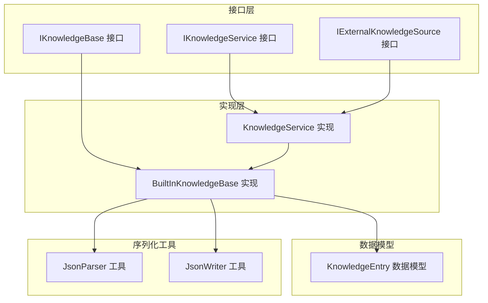
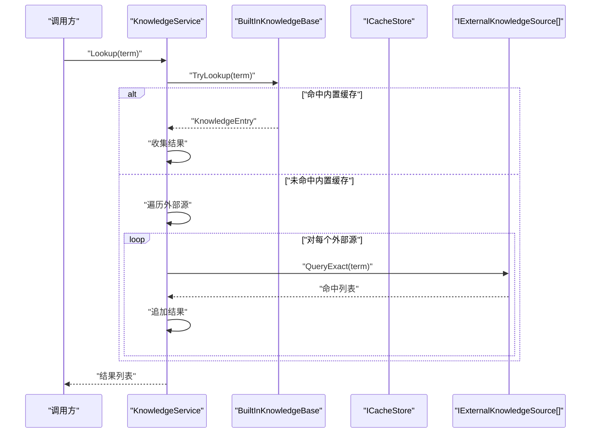
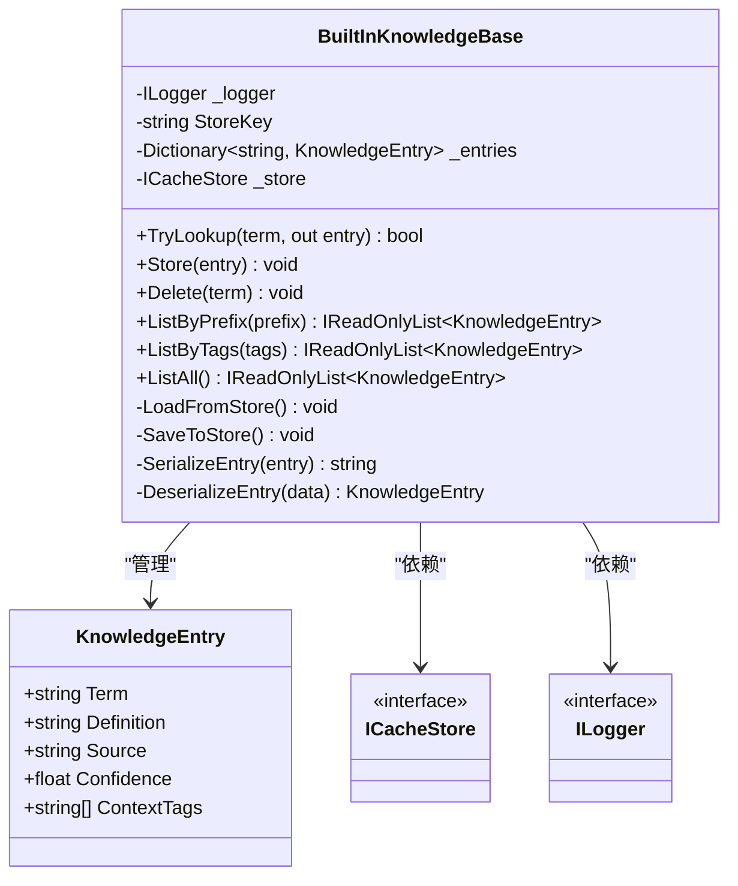
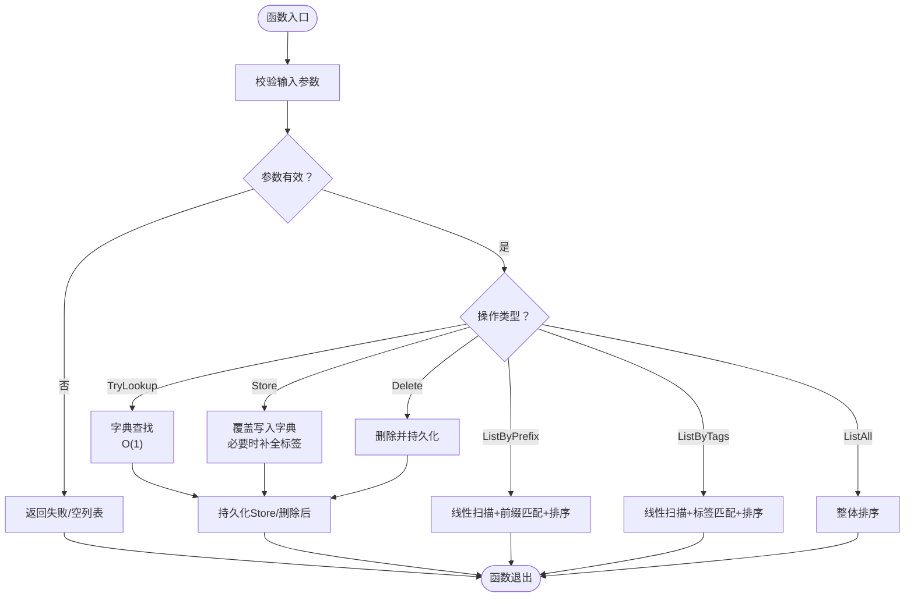
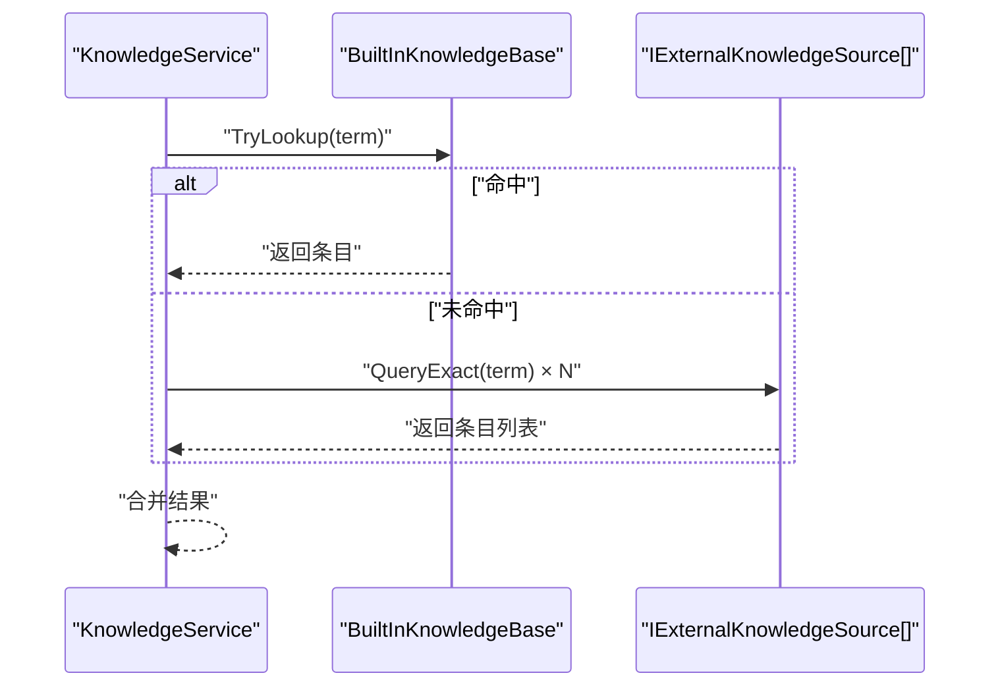
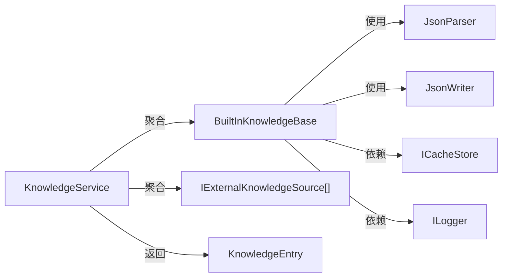

# 内置知识库

<cite>
**本文引用的文件**
- [BuiltInKnowledgeBase.cs](file://src/NPCLife/Infrastructure/Knowledge/BuiltInKnowledgeBase.cs)
- [KnowledgeEntry.cs](file://src/NPCLife/Core/KnowledgeEntry.cs)
- [IKnowledgeBase.cs](file://src/NPCLife/Core/IKnowledgeBase.cs)
- [IKnowledgeService.cs](file://src/NPCLife/Core/IKnowledgeService.cs)
- [KnowledgeService.cs](file://src/NPCLife/Core/KnowledgeService.cs)
- [IExternalKnowledgeSource.cs](file://src/NPCLife/Core/IExternalKnowledgeSource.cs)
- [JsonParser.cs](file://src/NPCLife/Framework/JsonParser.cs)
- [JsonWriter.cs](file://src/NPCLife/Framework/JsonWriter.cs)
</cite>

## 目录
1. [简介](#简介)
2. [项目结构](#项目结构)
3. [核心组件](#核心组件)
4. [架构总览](#架构总览)
5. [详细组件分析](#详细组件分析)
6. [依赖关系分析](#依赖关系分析)
7. [性能考量](#性能考量)
8. [故障排查指南](#故障排查指南)
9. [结论](#结论)
10. [附录](#附录)

## 简介
内置知识库是框架中唯一可写的本地缓存型知识库实现，负责以键值形式存储词条，并通过持久化存储进行加载与保存。它采用字典作为主索引，提供基于词条名的 O(1) 查找、基于前缀与标签的线性筛选、以及每次写入后即时持久化的策略。内置知识库不参与淘汰与容量控制，适合存放需要快速访问且可由上层服务统一管理的知识。

## 项目结构
与内置知识库直接相关的模块分布如下：
- 接口层：IKnowledgeBase 定义知识库能力；IKnowledgeService 抽象知识服务；IExternalKnowledgeSource 抽象外部只读知识源。
- 实现层：BuiltInKnowledgeBase 是 IKnowledgeBase 的具体实现；KnowledgeService 聚合内置缓存与外部只读源，提供统一查询入口。
- 数据模型：KnowledgeEntry 表示单条知识条目。
- 序列化工具：JsonParser 与 JsonWriter 提供轻量 JSON 解析与写入，支撑持久化。

图表来源
- [IKnowledgeBase.cs:1-53](file://src/NPCLife/Core/IKnowledgeBase.cs#L1-L53)
- [IKnowledgeService.cs:1-36](file://src/NPCLife/Core/IKnowledgeService.cs#L1-L36)
- [IExternalKnowledgeSource.cs:1-21](file://src/NPCLife/Core/IExternalKnowledgeSource.cs#L1-L21)
- [BuiltInKnowledgeBase.cs:13-206](file://src/NPCLife/Infrastructure/Knowledge/BuiltInKnowledgeBase.cs#L13-L206)
- [KnowledgeService.cs:13-66](file://src/NPCLife/Core/KnowledgeService.cs#L13-L66)
- [KnowledgeEntry.cs:9-27](file://src/NPCLife/Core/KnowledgeEntry.cs#L9-L27)
- [JsonParser.cs:13-268](file://src/NPCLife/Framework/JsonParser.cs#L13-L268)
- [JsonWriter.cs:11-136](file://src/NPCLife/Framework/JsonWriter.cs#L11-L136)

章节来源
- [IKnowledgeBase.cs:1-53](file://src/NPCLife/Core/IKnowledgeBase.cs#L1-L53)
- [IKnowledgeService.cs:1-36](file://src/NPCLife/Core/IKnowledgeService.cs#L1-L36)
- [IExternalKnowledgeSource.cs:1-21](file://src/NPCLife/Core/IExternalKnowledgeSource.cs#L1-L21)
- [BuiltInKnowledgeBase.cs:13-206](file://src/NPCLife/Infrastructure/Knowledge/BuiltInKnowledgeBase.cs#L13-L206)
- [KnowledgeService.cs:13-66](file://src/NPCLife/Core/KnowledgeService.cs#L13-L66)
- [KnowledgeEntry.cs:9-27](file://src/NPCLife/Core/KnowledgeEntry.cs#L9-L27)
- [JsonParser.cs:13-268](file://src/NPCLife/Framework/JsonParser.cs#L13-L268)
- [JsonWriter.cs:11-136](file://src/NPCLife/Framework/JsonWriter.cs#L11-L136)

## 核心组件
- 内置知识库 BuiltInKnowledgeBase
  - 主索引：词条名（Term）作为字典键，大小写不敏感比较。
  - 存储介质：通过 ICacheStore 进行持久化读写，键固定为“rimlife_knowledge”，值为 JSON 数组。
  - 写入策略：每次 Store/Delete 后立即保存，保证一致性但带来频繁 IO。
  - 查询能力：TryLookup O(1)；ListByPrefix/ListByTags/ListAll 基于线性扫描与 LINQ 过滤。
- 知识服务 KnowledgeService
  - 组合模式：聚合 IKnowledgeBase（可写）与 IExternalKnowledgeSource[]（只读）。
  - 查询流程：先查内置缓存，再并行查询所有外部源，汇总返回。
  - 写操作：直接委托给 IKnowledgeBase。
- 数据模型 KnowledgeEntry
  - 字段：Term、Definition、Source、Confidence、ContextTags。
  - 用途：作为知识条目的载体，支持序列化与持久化。

章节来源
- [BuiltInKnowledgeBase.cs:13-206](file://src/NPCLife/Infrastructure/Knowledge/BuiltInKnowledgeBase.cs#L13-L206)
- [KnowledgeService.cs:13-66](file://src/NPCLife/Core/KnowledgeService.cs#L13-L66)
- [KnowledgeEntry.cs:9-27](file://src/NPCLife/Core/KnowledgeEntry.cs#L9-L27)

## 架构总览
内置知识库位于知识服务之下，作为可写缓存与外部只读源并行查询的组合体之一。其职责是：
- 以 O(1) 的字典查找提供快速检索；
- 以 JSON 数组持久化保存，便于跨会话恢复；
- 为上层 Agent、MCP 提供稳定的基础知识来源。

图表来源
- [KnowledgeService.cs:28-48](file://src/NPCLife/Core/KnowledgeService.cs#L28-L48)
- [IKnowledgeBase.cs:17-17](file://src/NPCLife/Core/IKnowledgeBase.cs#L17-L17)
- [IExternalKnowledgeSource.cs:18-18](file://src/NPCLife/Core/IExternalKnowledgeSource.cs#L18-L18)

## 详细组件分析

### BuiltInKnowledgeBase 类设计与实现
- 关键字段与构造
  - 使用字典维护词条，键为词条名，大小写不敏感；构造时从持久化存储加载。
  - 依赖 ICacheStore 与 ILogger，确保可恢复与可观测性。
- 核心方法
  - TryLookup：O(1) 字典查找，大小写不敏感。
  - Store：覆盖式写入，必要时补全 ContextTags，随后立即持久化。
  - Delete：删除词条并持久化。
  - ListByPrefix：前缀匹配（大小写不敏感），排序后返回。
  - ListByTags：按标签集合筛选（任一标签命中），排序后返回。
  - ListAll：整体排序返回。
- 持久化策略
  - 加载：从键“rimlife_knowledge”读取 JSON 数组，逐项反序列化并填充字典。
  - 保存：将字典内所有条目序列化为 JSON 数组，写回同一键。
- 序列化与反序列化
  - 使用 JsonWriter 将条目属性写入 JSON 对象；使用 JsonParser 解析数组与字符串数组。

图表来源
- [BuiltInKnowledgeBase.cs:13-206](file://src/NPCLife/Infrastructure/Knowledge/BuiltInKnowledgeBase.cs#L13-L206)
- [KnowledgeEntry.cs:9-27](file://src/NPCLife/Core/KnowledgeEntry.cs#L9-L27)

章节来源
- [BuiltInKnowledgeBase.cs:13-206](file://src/NPCLife/Infrastructure/Knowledge/BuiltInKnowledgeBase.cs#L13-L206)
- [JsonParser.cs:97-125](file://src/NPCLife/Framework/JsonParser.cs#L97-L125)
- [JsonWriter.cs:16-136](file://src/NPCLife/Framework/JsonWriter.cs#L16-L136)

### 查询流程与算法
- TryLookup
  - 输入：词条名（大小写不敏感）。
  - 输出：是否命中及对应条目。
  - 复杂度：O(1)。
- Store
  - 输入：知识条目（Term 非空）。
  - 行为：若 ContextTags 为空则初始化为空列表；覆盖写入字典；立即持久化。
  - 复杂度：O(1) 字典写入 + O(n) 序列化与持久化。
- Delete
  - 输入：词条名。
  - 行为：移除并持久化。
  - 复杂度：O(1) 字典删除 + O(n) 序列化与持久化。
- ListByPrefix
  - 输入：前缀（可空）。
  - 行为：空前缀等价于 ListAll；否则筛选并排序。
  - 复杂度：O(n) 线性扫描 + O(k log k) 排序。
- ListByTags
  - 输入：标签集合（可空）。
  - 行为：空集合等价于 ListAll；否则按任一标签命中筛选并排序。
  - 复杂度：O(n) 线性扫描 + O(k log k) 排序。
- ListAll
  - 行为：整体排序返回。
  - 复杂度：O(n log n)。

图表来源
- [BuiltInKnowledgeBase.cs:38-104](file://src/NPCLife/Infrastructure/Knowledge/BuiltInKnowledgeBase.cs#L38-L104)
- [BuiltInKnowledgeBase.cs:134-157](file://src/NPCLife/Infrastructure/Knowledge/BuiltInKnowledgeBase.cs#L134-L157)

章节来源
- [BuiltInKnowledgeBase.cs:38-104](file://src/NPCLife/Infrastructure/Knowledge/BuiltInKnowledgeBase.cs#L38-L104)
- [BuiltInKnowledgeBase.cs:110-157](file://src/NPCLife/Infrastructure/Knowledge/BuiltInKnowledgeBase.cs#L110-L157)

### 知识服务集成点
- Lookup 并行查询
  - 先查内置缓存，再对每个外部源调用 QueryExact 并合并结果。
- 写操作代理
  - Store/Delete/List* 直接委托内置缓存，保持上层接口一致性。
- 结果来源标注
  - 外部源返回的条目 Source 字段应与 SourceName 一致，便于区分来源。

图表来源
- [KnowledgeService.cs:28-48](file://src/NPCLife/Core/KnowledgeService.cs#L28-L48)
- [IExternalKnowledgeSource.cs:18-18](file://src/NPCLife/Core/IExternalKnowledgeSource.cs#L18-L18)

章节来源
- [KnowledgeService.cs:13-66](file://src/NPCLife/Core/KnowledgeService.cs#L13-L66)
- [IExternalKnowledgeSource.cs:9-21](file://src/NPCLife/Core/IExternalKnowledgeSource.cs#L9-L21)

## 依赖关系分析
- 内置知识库依赖
  - ICacheStore：提供键值持久化能力。
  - ILogger：记录加载/保存异常与统计信息。
  - JsonParser/JsonWriter：JSON 解析与序列化。
- 知识服务依赖
  - IKnowledgeBase：可写缓存。
  - IExternalKnowledgeSource[]：多个只读外部源。
- 数据模型
  - KnowledgeEntry：纯 DTO，零外部依赖，字段清晰，便于序列化与跨层传递。

图表来源
- [BuiltInKnowledgeBase.cs:13-206](file://src/NPCLife/Infrastructure/Knowledge/BuiltInKnowledgeBase.cs#L13-L206)
- [KnowledgeService.cs:13-66](file://src/NPCLife/Core/KnowledgeService.cs#L13-L66)
- [JsonParser.cs:13-268](file://src/NPCLife/Framework/JsonParser.cs#L13-L268)
- [JsonWriter.cs:11-136](file://src/NPCLife/Framework/JsonWriter.cs#L11-L136)

章节来源
- [BuiltInKnowledgeBase.cs:13-206](file://src/NPCLife/Infrastructure/Knowledge/BuiltInKnowledgeBase.cs#L13-L206)
- [KnowledgeService.cs:13-66](file://src/NPCLife/Core/KnowledgeService.cs#L13-L66)
- [JsonParser.cs:13-268](file://src/NPCLife/Framework/JsonParser.cs#L13-L268)
- [JsonWriter.cs:11-136](file://src/NPCLife/Framework/JsonWriter.cs#L11-L136)

## 性能考量
- 时间复杂度
  - TryLookup：O(1)，字典查找。
  - Store/Delete：O(1) 字典操作 + O(n) 序列化与持久化。
  - ListByPrefix/ListByTags：O(n) 线性扫描 + O(k log k) 排序。
  - ListAll：O(n log n)。
- 空间复杂度
  - 字典占用 O(n)；序列化字符串构建使用 StringBuilder，避免多次分配。
- I/O 特性
  - 每次写入均触发持久化，适合小规模高频更新场景；大规模批量写入建议合并后再持久化。
- 可扩展性
  - 当前实现无容量限制与淘汰策略，适合小型到中型知识库；超大规模时建议引入分页、LRU 或外部数据库。

[本节为通用性能讨论，不直接分析具体文件]

## 故障排查指南
- 加载失败
  - 现象：启动时日志提示加载失败或仅加载部分条目。
  - 排查：确认 ICacheStore 键“rimlife_knowledge”的值为合法 JSON 数组；检查 JsonParser 解析逻辑是否被破坏。
- 保存失败
  - 现象：写入后重启丢失。
  - 排查：检查 SaveToStore 异常分支的日志；确认 JsonWriter 输出格式正确。
- 查询不到结果
  - 现象：Lookup 返回空。
  - 排查：确认 Term 大小写不敏感匹配；检查外部源 SourceName 是否与条目 Source 一致；验证 ListByTags 的标签大小写与内容。
- 性能问题
  - 现象：List* 操作卡顿。
  - 排查：评估条目数量与排序开销；考虑减少频繁持久化或引入分页/缓存。

章节来源
- [BuiltInKnowledgeBase.cs:110-132](file://src/NPCLife/Infrastructure/Knowledge/BuiltInKnowledgeBase.cs#L110-L132)
- [BuiltInKnowledgeBase.cs:134-157](file://src/NPCLife/Infrastructure/Knowledge/BuiltInKnowledgeBase.cs#L134-L157)
- [JsonParser.cs:97-125](file://src/NPCLife/Framework/JsonParser.cs#L97-L125)
- [JsonWriter.cs:16-136](file://src/NPCLife/Framework/JsonWriter.cs#L16-L136)

## 结论
内置知识库以简洁的字典索引与 JSON 持久化实现了可写、可恢复的知识缓存。其优势在于查询高效、实现简单、易于集成；局限在于无容量控制与淘汰策略，适合中小规模知识管理。配合知识服务的并行查询机制，可在 Agent 与 MCP 场景中提供稳定的基础知识来源。

[本节为总结性内容，不直接分析具体文件]

## 附录

### 知识条目存储格式与序列化
- 存储键：固定为“rimlife_knowledge”。
- 存储格式：JSON 数组，数组元素为对象，包含字段：term、definition、source、confidence、contextTags（可选）。
- 反序列化兼容：若缺少 source 或 contextTags，将赋予默认值或空列表。

章节来源
- [BuiltInKnowledgeBase.cs:17-17](file://src/NPCLife/Infrastructure/Knowledge/BuiltInKnowledgeBase.cs#L17-L17)
- [BuiltInKnowledgeBase.cs:163-203](file://src/NPCLife/Infrastructure/Knowledge/BuiltInKnowledgeBase.cs#L163-L203)
- [JsonParser.cs:97-125](file://src/NPCLife/Framework/JsonParser.cs#L97-L125)
- [JsonWriter.cs:16-136](file://src/NPCLife/Framework/JsonWriter.cs#L16-L136)

### 核心方法实现要点
- TryLookup
  - 输入校验与字典查找，O(1)。
- Store
  - 覆盖写入并补全标签，随后持久化。
- Delete
  - 移除并持久化。
- ListByPrefix/ListByTags/ListAll
  - 线性扫描 + 过滤 + 排序。

章节来源
- [BuiltInKnowledgeBase.cs:38-104](file://src/NPCLife/Infrastructure/Knowledge/BuiltInKnowledgeBase.cs#L38-L104)
- [BuiltInKnowledgeBase.cs:110-157](file://src/NPCLife/Infrastructure/Knowledge/BuiltInKnowledgeBase.cs#L110-L157)

### 在知识服务中的角色与限制
- 角色：作为可写缓存，提供快速检索与持久化能力；与外部只读源并行查询，统一对外暴露。
- 限制：无容量上限与淘汰策略；频繁写入带来持续 I/O 开销；前缀/标签筛选为线性扫描，不适合超大规模。

章节来源
- [IKnowledgeService.cs:12-36](file://src/NPCLife/Core/IKnowledgeService.cs#L12-L36)
- [KnowledgeService.cs:13-66](file://src/NPCLife/Core/KnowledgeService.cs#L13-L66)
- [IExternalKnowledgeSource.cs:9-21](file://src/NPCLife/Core/IExternalKnowledgeSource.cs#L9-L21)

### 使用示例与最佳实践
- 示例场景
  - Agent 初始化后加载内置知识库，随后通过知识服务查询术语；当获得新知识时调用 Store 覆盖写入并持久化。
  - 使用 ListByPrefix 快速探索已知术语范围；使用 ListByTags 按领域过滤。
- 最佳实践
  - 控制写入频率，合并多次更新后再持久化。
  - 为常用术语设置合理标签，提升筛选效率。
  - 对超大规模知识库考虑引入外部存储或分片策略。

[本节为概念性指导，不直接分析具体文件]