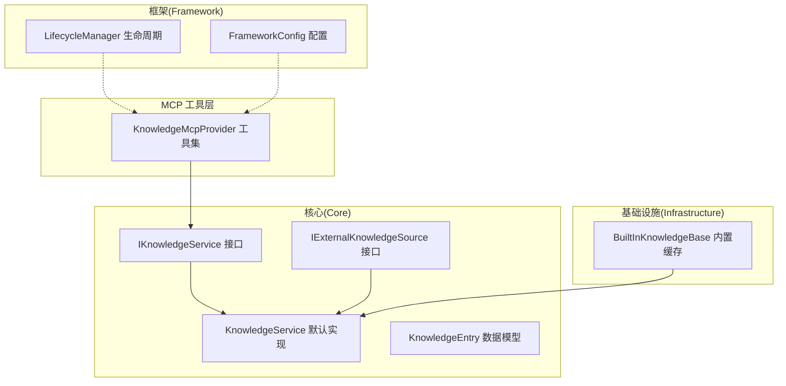
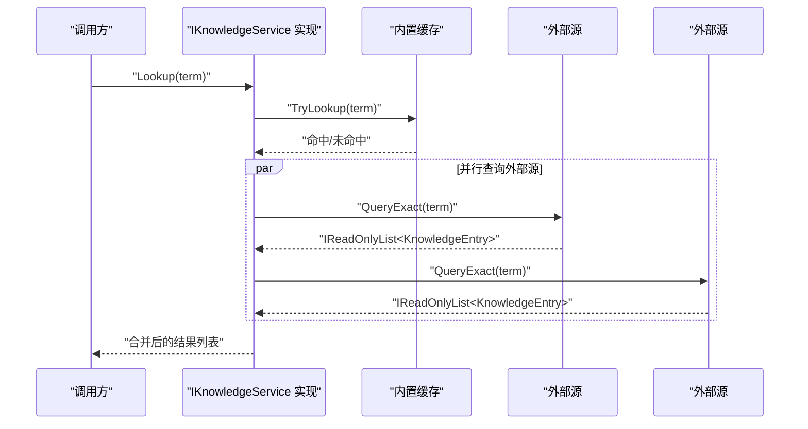
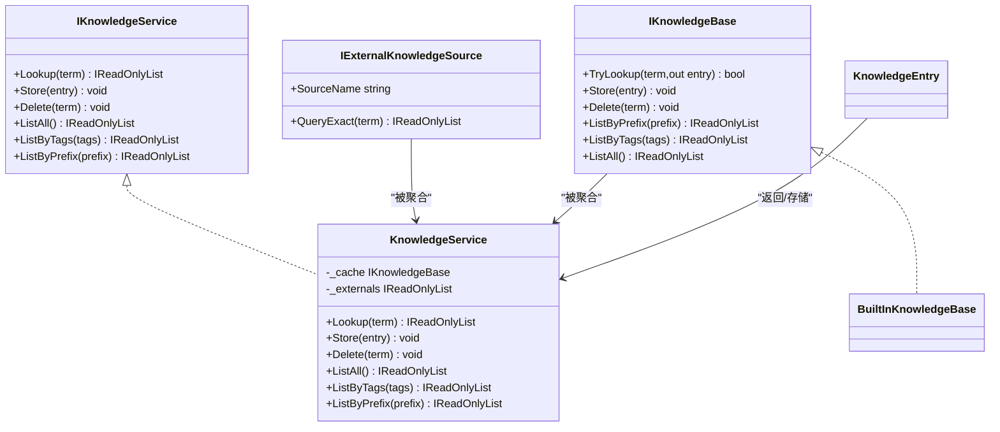

# 外部知识源集成

<cite>
**本文引用的文件**
- [IExternalKnowledgeSource.cs](file://src/NPCLife/Core/IExternalKnowledgeSource.cs)
- [IKnowledgeService.cs](file://src/NPCLife/Core/IKnowledgeService.cs)
- [KnowledgeService.cs](file://src/NPCLife/Core/KnowledgeService.cs)
- [KnowledgeEntry.cs](file://src/NPCLife/Core/KnowledgeEntry.cs)
- [BuiltInKnowledgeBase.cs](file://src/NPCLife/Infrastructure/Knowledge/BuiltInKnowledgeBase.cs)
- [KnowledgeMcpProvider.cs](file://src/NPCLife/Infrastructure/Mcp/KnowledgeMcpProvider.cs)
- [LifecycleManager.cs](file://src/NPCLife/Framework/LifecycleManager.cs)
- [FrameworkConfig.cs](file://src/NPCLife/Framework/FrameworkConfig.cs)
- [KnowledgeModule.md](file://docs/KnowledgeModule.md)
- [README.md](file://README.md)
</cite>

## 目录
1. [简介](#简介)
2. [项目结构](#项目结构)
3. [核心组件](#核心组件)
4. [架构总览](#架构总览)
5. [详细组件分析](#详细组件分析)
6. [依赖分析](#依赖分析)
7. [性能考量](#性能考量)
8. [故障排除指南](#故障排除指南)
9. [结论](#结论)
10. [附录](#附录)

## 简介
本文件面向“外部知识源集成”的设计与实现，围绕 IExternalKnowledgeSource 接口展开，系统阐述外部知识源的注册、查询与管理机制，给出标准化知识条目格式与数据转换规则，分析并发查询与结果去重策略，并提供自定义外部知识源的开发指南与最佳实践。

## 项目结构
- 核心接口与默认实现位于 Core 层：IExternalKnowledgeSource、IKnowledgeService、KnowledgeService、KnowledgeEntry。
- 内置可写缓存位于 Infrastructure 层：BuiltInKnowledgeBase。
- MCP 工具层通过 KnowledgeMcpProvider 暴露知识库查询、学习、列举、删除与统计能力。
- 生命周期与配置由 Framework 层的 LifecycleManager、FrameworkConfig 提供支撑。
- 文档 KnowledgeModule.md 对整体架构与契约进行了权威说明。

图表来源
- [IKnowledgeService.cs:12-34](file://src/NPCLife/Core/IKnowledgeService.cs#L12-L34)
- [IExternalKnowledgeSource.cs:9-19](file://src/NPCLife/Core/IExternalKnowledgeSource.cs#L9-L19)
- [KnowledgeService.cs:13-64](file://src/NPCLife/Core/KnowledgeService.cs#L13-L64)
- [KnowledgeEntry.cs:9-25](file://src/NPCLife/Core/KnowledgeEntry.cs#L9-L25)
- [BuiltInKnowledgeBase.cs:13-205](file://src/NPCLife/Infrastructure/Knowledge/BuiltInKnowledgeBase.cs#L13-L205)
- [KnowledgeMcpProvider.cs:15-355](file://src/NPCLife/Infrastructure/Mcp/KnowledgeMcpProvider.cs#L15-L355)
- [LifecycleManager.cs:23-264](file://src/NPCLife/Framework/LifecycleManager.cs#L23-L264)
- [FrameworkConfig.cs:17-248](file://src/NPCLife/Framework/FrameworkConfig.cs#L17-L248)

章节来源
- [README.md:1-93](file://README.md#L1-L93)
- [KnowledgeModule.md:1-244](file://docs/KnowledgeModule.md#L1-L244)

## 核心组件
- IExternalKnowledgeSource：只读外部知识源抽象，负责“精确查询”词条并返回标准化知识条目列表，同时标注来源名。
- IKnowledgeService：知识服务公共接口，统一暴露查询、存储、删除、列举等能力，屏蔽底层实现差异。
- KnowledgeService：默认实现，聚合内置可写缓存与多个外部只读源，提供并行查询与结果拼接。
- KnowledgeEntry：知识条目数据模型，包含词条名、释义、来源、信心度与语义标签。
- BuiltInKnowledgeBase：内置可写缓存，基于内存字典与持久化存储，提供 O(1) 查找与标签/前缀过滤。
- KnowledgeMcpProvider：MCP 工具集，封装查询、学习、列举、删除、统计等操作，统一序列化输出。

章节来源
- [IExternalKnowledgeSource.cs:9-19](file://src/NPCLife/Core/IExternalKnowledgeSource.cs#L9-L19)
- [IKnowledgeService.cs:12-34](file://src/NPCLife/Core/IKnowledgeService.cs#L12-L34)
- [KnowledgeService.cs:13-64](file://src/NPCLife/Core/KnowledgeService.cs#L13-L64)
- [KnowledgeEntry.cs:9-25](file://src/NPCLife/Core/KnowledgeEntry.cs#L9-L25)
- [BuiltInKnowledgeBase.cs:13-205](file://src/NPCLife/Infrastructure/Knowledge/BuiltInKnowledgeBase.cs#L13-L205)
- [KnowledgeMcpProvider.cs:15-355](file://src/NPCLife/Infrastructure/Mcp/KnowledgeMcpProvider.cs#L15-L355)

## 架构总览
外部知识源通过 IExternalKnowledgeSource 接口接入，默认实现 KnowledgeService 将内置缓存与若干外部源并行查询，最终返回同一词条在不同来源的所有释义。MCP 工具层通过 IKnowledgeService 暴露统一查询入口，便于外部系统以工具形式调用。

图表来源
- [KnowledgeService.cs:28-48](file://src/NPCLife/Core/KnowledgeService.cs#L28-L48)
- [IKnowledgeService.cs:18](file://src/NPCLife/Core/IKnowledgeService.cs#L18)
- [IExternalKnowledgeSource.cs:18](file://src/NPCLife/Core/IExternalKnowledgeSource.cs#L18)

## 详细组件分析

### IExternalKnowledgeSource 接口设计与实现要求
- 设计目标
  - 抽象只读外部知识源，实现者可为 GameDef 数据库、Wiki、RAG 等。
  - 框架不关心匹配策略（精确/模糊），由外部源自行决定。
- 关键约定
  - SourceName：用于标注查询结果的来源名。
  - QueryExact(term)：返回命中列表（可能为空），返回的条目 Source 字段应与 SourceName 保持一致。
- 实现要点
  - 结果去重：同一词条在不同来源的释义应分别返回，Source 字段必须准确。
  - 错误处理：实现内部应捕获异常并返回空列表，确保不影响其他源的查询。
  - 性能：尽量使用高效索引或缓存，避免阻塞主流程。

章节来源
- [IExternalKnowledgeSource.cs:5-19](file://src/NPCLife/Core/IExternalKnowledgeSource.cs#L5-L19)
- [KnowledgeModule.md:100-112](file://docs/KnowledgeModule.md#L100-L112)

### 外部知识源注册、查询与管理机制
- 注册
  - 通过构造函数注入 IExternalKnowledgeSource 列表到 KnowledgeService。
  - 支持零个或多个外部源，实现按需扩展。
- 查询
  - Lookup(term)：先查询内置缓存，再并行查询所有外部源，最后合并结果。
  - 结果顺序：内置缓存优先，随后按外部源注册顺序追加。
- 管理
  - 写入与列举：委托给内置可写缓存，外部源为只读。
  - 生命周期：由 LifecycleManager 统一管理组件注册与销毁，确保资源正确释放。

章节来源
- [KnowledgeService.cs:18-64](file://src/NPCLife/Core/KnowledgeService.cs#L18-L64)
- [LifecycleManager.cs:77-97](file://src/NPCLife/Framework/LifecycleManager.cs#L77-L97)

### 知识条目标准化格式与数据转换规则
- 数据模型
  - Term：词条名（索引键，大小写不敏感）。
  - Definition：释义文本，空或 null 表示已建立索引但尚未学习释义。
  - Source：知识来源名称（如 LLM、GameDef、AgentDeduction、Wiki、RAG）。
  - Confidence：信心度 0.0~1.0，GameDef 来源天然为 1.0，LLM 来源通常 0.6~0.9。
  - ContextTags：语义标签列表，用于按领域过滤。
- 序列化/反序列化
  - BuiltInKnowledgeBase 使用 JsonWriter/JsonParser 进行条目序列化与持久化。
  - 兼容旧版缓存：缺失字段采用默认值，Source 缺失时回退为 LegacyCache。
- 输出规范
  - KnowledgeMcpProvider 对查询结果进行统一序列化，单条与多条结果采用不同 JSON 形态，便于前端/工具消费。

章节来源
- [KnowledgeEntry.cs:9-25](file://src/NPCLife/Core/KnowledgeEntry.cs#L9-L25)
- [BuiltInKnowledgeBase.cs:163-203](file://src/NPCLife/Infrastructure/Knowledge/BuiltInKnowledgeBase.cs#L163-L203)
- [KnowledgeMcpProvider.cs:235-332](file://src/NPCLife/Infrastructure/Mcp/KnowledgeMcpProvider.cs#L235-L332)

### 并发查询与结果去重机制
- 并发策略
  - KnowledgeService 并行查询内置缓存与所有外部源，避免串行阻塞。
- 去重策略
  - 默认实现不进行跨源去重，同一词条在不同来源的释义均保留，调用方依据 Source 字段区分可信度。
  - 如需去重，可在上层业务逻辑中按 Term 去重并保留最高 Confidence 的条目。
- 错误隔离
  - 外部源异常被捕获并忽略，不影响其他源的查询结果。

章节来源
- [KnowledgeService.cs:28-48](file://src/NPCLife/Core/KnowledgeService.cs#L28-L48)
- [KnowledgeModule.md:67-75](file://docs/KnowledgeModule.md#L67-L75)

### 自定义外部知识源开发指南与实现示例
- 开发步骤
  - 实现 IExternalKnowledgeSource，提供 SourceName 与 QueryExact。
  - 返回的 KnowledgeEntry.Source 必须与 SourceName 一致。
  - 对外暴露的查询方法应快速、稳定，必要时引入缓存。
- 示例模式
  - 基于内存字典的 GameDef 源：返回固定信心度与标签。
  - RAG 源：语义检索并按阈值筛选，返回相似度作为信心度。
- 替换默认实现
  - 如需完全自定义知识库架构，可直接实现 IKnowledgeService，无需依赖内置缓存与外部源接口。

章节来源
- [IExternalKnowledgeSource.cs:9-19](file://src/NPCLife/Core/IExternalKnowledgeSource.cs#L9-L19)
- [KnowledgeModule.md:176-218](file://docs/KnowledgeModule.md#L176-L218)
- [IKnowledgeService.cs:9-11](file://src/NPCLife/Core/IKnowledgeService.cs#L9-L11)

### MCP 工具与外部系统集成
- 工具清单
  - lookup_term：并行查询内部缓存与外部源，返回全部命中。
  - learn_term：主动学习并存储到内部缓存。
  - list_known_terms：按前缀或标签列举内部缓存。
  - forget_term：删除内部缓存中的词条。
  - get_term_stats：获取词条的元数据（来源、信心度、标签）。
- 错误处理
  - 工具内部对异常进行捕获并返回结构化错误信息，避免崩溃。
- 配置与生命周期
  - 通过 FrameworkConfig 控制功能开关与日志级别。
  - LifecycleManager 负责组件注册与销毁，确保资源回收。

章节来源
- [KnowledgeMcpProvider.cs:30-355](file://src/NPCLife/Infrastructure/Mcp/KnowledgeMcpProvider.cs#L30-L355)
- [FrameworkConfig.cs:17-248](file://src/NPCLife/Framework/FrameworkConfig.cs#L17-L248)
- [LifecycleManager.cs:23-264](file://src/NPCLife/Framework/LifecycleManager.cs#L23-L264)

## 依赖分析
- 组件耦合
  - 框架组件（如 AgentLoop、KnowledgeMcpProvider）仅依赖 IKnowledgeService，解耦底层实现。
  - KnowledgeService 内部依赖 IKnowledgeBase（可写）与 IExternalKnowledgeSource[]（只读）。
- 外部依赖
  - BuiltInKnowledgeBase 依赖 ICacheStore 与 JsonHelper/JsonParser 进行持久化与序列化。
- 循环依赖
  - 未发现循环依赖，接口边界清晰。

图表来源
- [IKnowledgeService.cs:12-34](file://src/NPCLife/Core/IKnowledgeService.cs#L12-L34)
- [KnowledgeService.cs:13-64](file://src/NPCLife/Core/KnowledgeService.cs#L13-L64)
- [IExternalKnowledgeSource.cs:9-19](file://src/NPCLife/Core/IExternalKnowledgeSource.cs#L9-L19)
- [BuiltInKnowledgeBase.cs:13-205](file://src/NPCLife/Infrastructure/Knowledge/BuiltInKnowledgeBase.cs#L13-L205)
- [KnowledgeEntry.cs:9-25](file://src/NPCLife/Core/KnowledgeEntry.cs#L9-L25)

## 性能考量
- 查询路径
  - 内置缓存采用字典查找，O(1) 时间复杂度；外部源查询建议并行执行。
- 结果拼接
  - 合并内置与外部结果时避免重复遍历，保持线性复杂度。
- 序列化与持久化
  - BuiltInKnowledgeBase 使用批量序列化减少字符串拼接开销。
- 信心度与标签
  - 通过 Confidence 与 ContextTags 支持上层快速筛选高质量结果与领域相关条目。
- 并发与超时
  - 建议为外部源查询设置合理超时与重试策略，防止阻塞主流程。

章节来源
- [BuiltInKnowledgeBase.cs:35-104](file://src/NPCLife/Infrastructure/Knowledge/BuiltInKnowledgeBase.cs#L35-L104)
- [KnowledgeService.cs:28-48](file://src/NPCLife/Core/KnowledgeService.cs#L28-L48)

## 故障排除指南
- 常见问题
  - 外部源无返回：检查 QueryExact 参数与内部异常捕获，确认返回列表非 null。
  - 来源名不一致：确保返回的 KnowledgeEntry.Source 与 SourceName 一致。
  - 结果未去重：如需去重，请在上层按 Term 去重并保留最高 Confidence。
  - MCP 工具报错：查看工具内部异常捕获与日志输出，定位具体失败原因。
- 资源清理
  - 使用 LifecycleManager.RegisterDisposable 注册组件，确保 Shutdown 时正确 Dispose。
- 配置校验
  - 通过 FrameworkConfig.Validate() 校验关键阈值与开关配置，避免运行期异常。

章节来源
- [IExternalKnowledgeSource.cs:11-18](file://src/NPCLife/Core/IExternalKnowledgeSource.cs#L11-L18)
- [KnowledgeMcpProvider.cs:54-75](file://src/NPCLife/Infrastructure/Mcp/KnowledgeMcpProvider.cs#L54-L75)
- [LifecycleManager.cs:77-97](file://src/NPCLife/Framework/LifecycleManager.cs#L77-L97)
- [FrameworkConfig.cs:56-75](file://src/NPCLife/Framework/FrameworkConfig.cs#L56-L75)

## 结论
通过 IExternalKnowledgeSource 与 IKnowledgeService 的清晰分离，框架实现了对外部知识源的灵活接入与统一查询。默认实现 KnowledgeService 提供并行查询与结果聚合能力，结合 BuiltInKnowledgeBase 的可写缓存与 MCP 工具集，形成从数据模型到外部集成的完整闭环。开发者可按需扩展外部源或完全自定义知识服务实现，满足多样化的知识管理需求。

## 附录
- 最佳实践
  - 明确 SourceName 与返回条目 Source 的一致性。
  - 为外部源查询设置超时与重试，保障稳定性。
  - 使用 ContextTags 与 Confidence 进行结果筛选与排序。
  - 在上层实现去重与合并策略，提升用户体验。
- 参考文档
  - KnowledgeModule.md 对接口契约与典型接入方式提供了权威说明。

章节来源
- [KnowledgeModule.md:1-244](file://docs/KnowledgeModule.md#L1-L244)