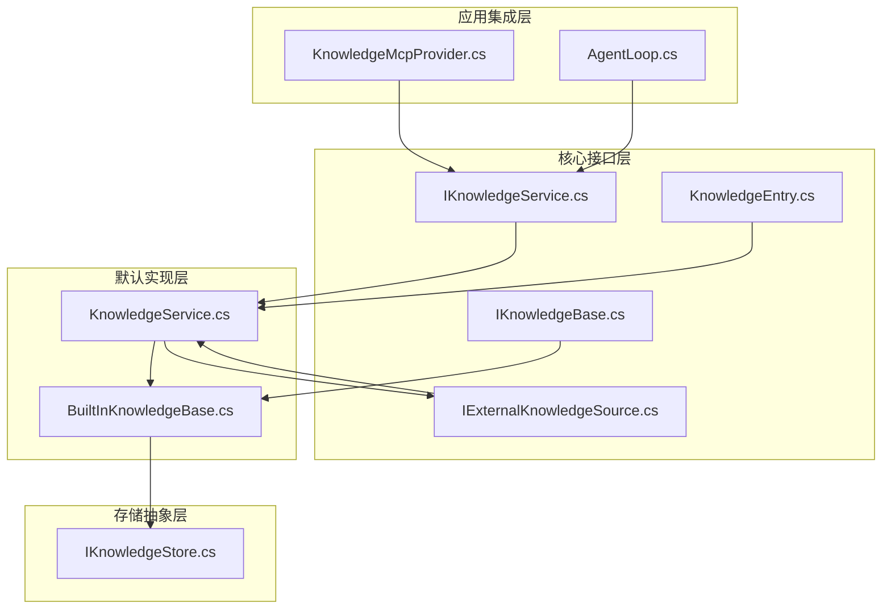
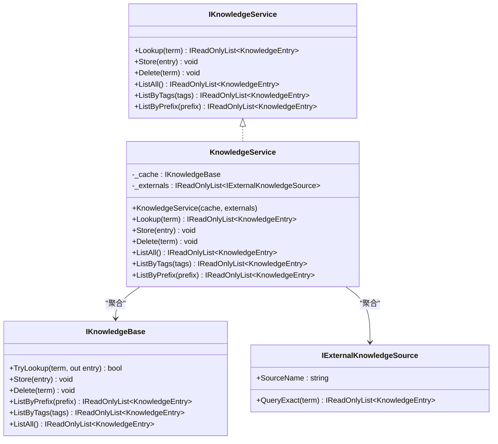
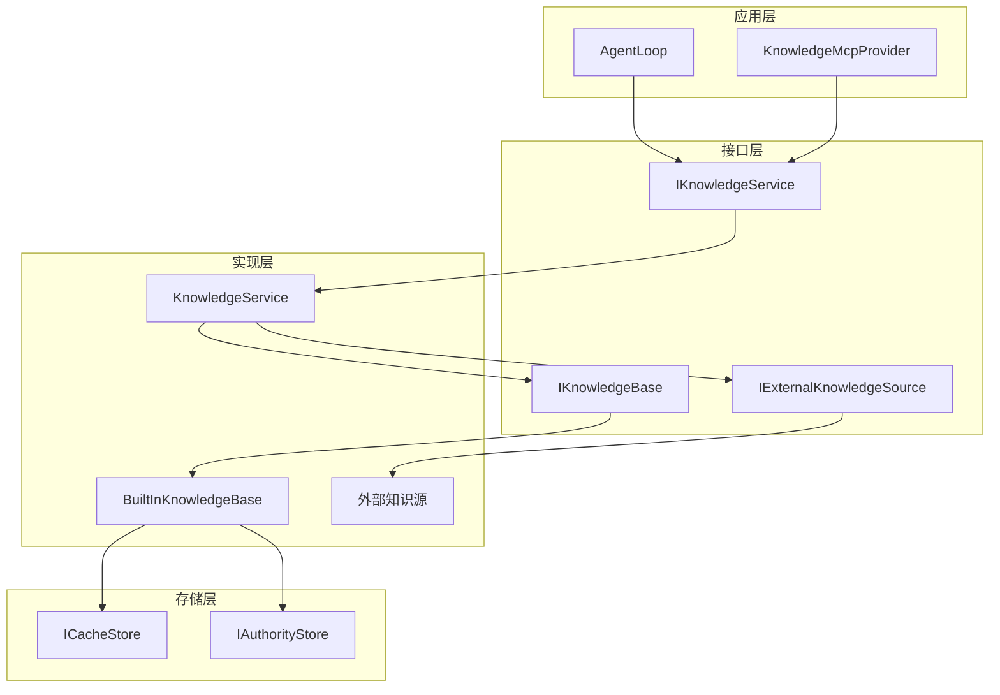
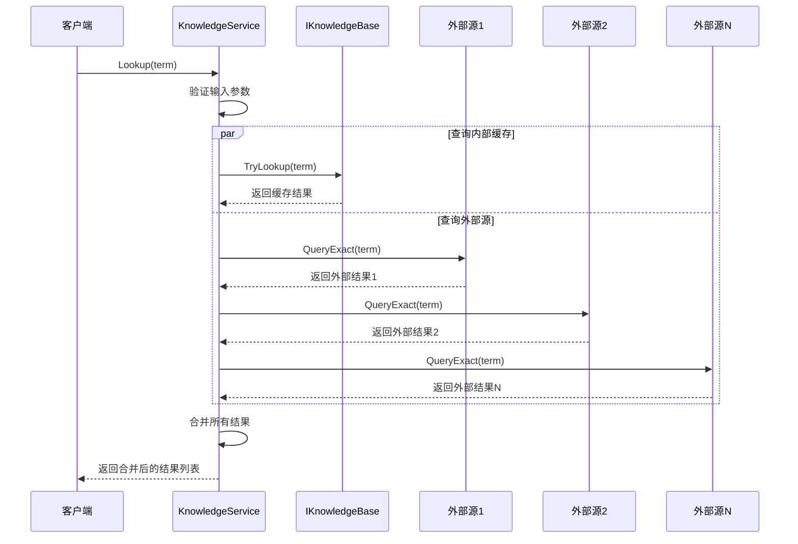
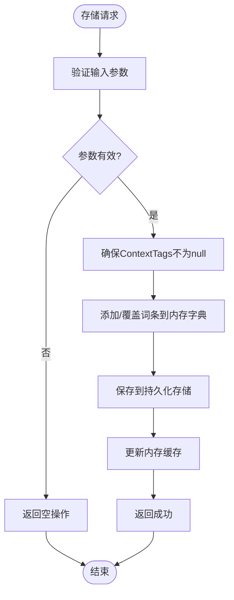
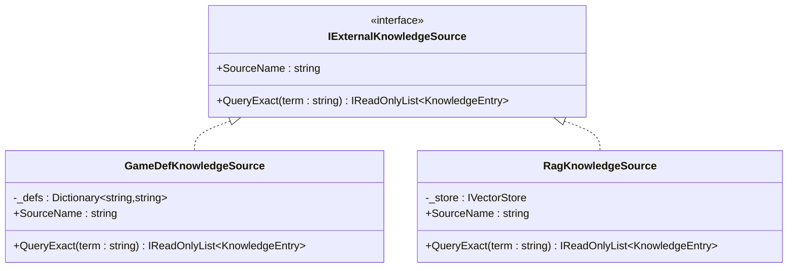
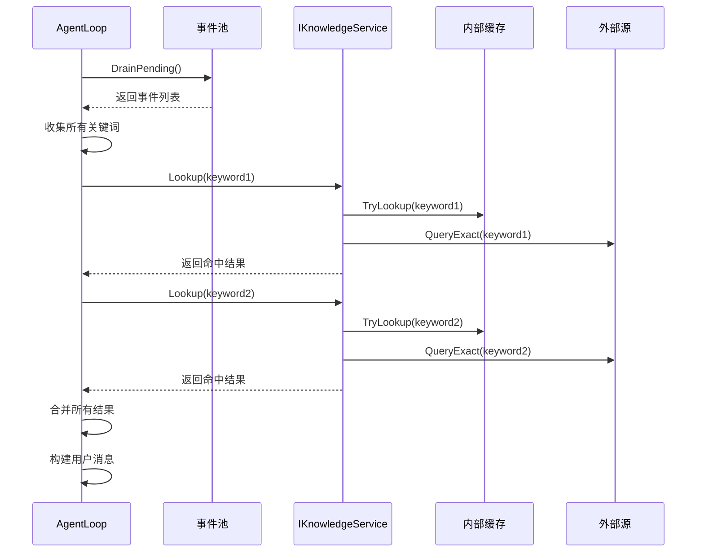
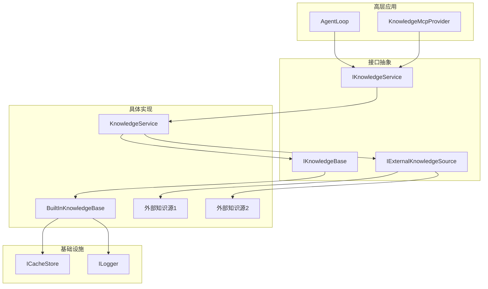

# 知识服务架构

<cite>
**本文档引用的文件**
- [KnowledgeService.cs](file://src/NPCLife/Core/KnowledgeService.cs)
- [IKnowledgeService.cs](file://src/NPCLife/Core/IKnowledgeService.cs)
- [IKnowledgeBase.cs](file://src/NPCLife/Core/IKnowledgeBase.cs)
- [IExternalKnowledgeSource.cs](file://src/NPCLife/Core/IExternalKnowledgeSource.cs)
- [BuiltInKnowledgeBase.cs](file://src/NPCLife/Infrastructure/Knowledge/BuiltInKnowledgeBase.cs)
- [KnowledgeEntry.cs](file://src/NPCLife/Core/KnowledgeEntry.cs)
- [KnowledgeMcpProvider.cs](file://src/NPCLife/Infrastructure/Mcp/KnowledgeMcpProvider.cs)
- [AgentLoop.cs](file://src/NPCLife/Agent/AgentLoop.cs)
- [IStorage.cs](file://src/NPCLife/Core/IStorage.cs)
- [KnowledgeModule.md](file://docs/KnowledgeModule.md)
</cite>

## 目录
1. [简介](#简介)
2. [项目结构](#项目结构)
3. [核心组件](#核心组件)
4. [架构概览](#架构概览)
5. [详细组件分析](#详细组件分析)
6. [依赖关系分析](#依赖关系分析)
7. [性能考虑](#性能考虑)
8. [故障排除指南](#故障排除指南)
9. [结论](#结论)
10. [附录](#附录)

## 简介

NPCLife 知识服务架构是一个高度模块化的知识管理系统，旨在为 AI Agent 提供统一的知识查询、存储和管理能力。该架构通过清晰的接口分离和可插拔设计，实现了知识服务的灵活性和可扩展性。

该架构的核心设计理念是：
- **接口驱动**：通过 IKnowledgeService 抽象接口，屏蔽底层实现细节
- **聚合模式**：KnowledgeService 聚合 IKnowledgeBase（可写）和 IExternalKnowledgeSource（只读）
- **并行查询**：同时查询内部缓存和外部知识源，返回所有命中结果
- **委托机制**：写入和删除操作委托给可写缓存，查询操作聚合多个源

## 项目结构

知识服务架构主要分布在以下目录和文件中：



**图表来源**
- [KnowledgeService.cs:1-66](file://src/NPCLife/Core/KnowledgeService.cs#L1-L66)
- [IKnowledgeService.cs:1-36](file://src/NPCLife/Core/IKnowledgeService.cs#L1-L36)
- [IKnowledgeBase.cs:1-53](file://src/NPCLife/Core/IKnowledgeBase.cs#L1-L53)
- [IExternalKnowledgeSource.cs:1-21](file://src/NPCLife/Core/IExternalKnowledgeSource.cs#L1-L21)
- [BuiltInKnowledgeBase.cs:1-206](file://src/NPCLife/Infrastructure/Knowledge/BuiltInKnowledgeBase.cs#L1-L206)

**章节来源**
- [KnowledgeService.cs:1-66](file://src/NPCLife/Core/KnowledgeService.cs#L1-L66)
- [IKnowledgeService.cs:1-36](file://src/NPCLife/Core/IKnowledgeService.cs#L1-L36)

## 核心组件

### IKnowledgeService 接口

IKnowledgeService 是知识服务的公共接口，定义了知识管理的核心能力：

| 方法 | 参数 | 返回值 | 描述 |
|------|------|--------|------|
| Lookup | term: string | IReadOnlyList<KnowledgeEntry> | 查询词条，返回所有来源的匹配结果 |
| Store | entry: KnowledgeEntry | void | 存储/覆盖知识条目 |
| Delete | term: string | void | 删除指定词条 |
| ListAll | - | IReadOnlyList<KnowledgeEntry> | 列出全部词条 |
| ListByTags | tags: IReadOnlyList<string> | IReadOnlyList<KnowledgeEntry> | 按语义标签筛选词条 |
| ListByPrefix | prefix: string | IReadOnlyList<KnowledgeEntry> | 按前缀列举词条 |

### KnowledgeEntry 数据模型

KnowledgeEntry 是知识库中的单条知识条目，包含以下关键属性：

- **Term**：词条名（索引键，大小写不敏感）
- **Definition**：释义文本
- **Source**：知识来源名称
- **Confidence**：信心度 (0.0~1.0)
- **ContextTags**：关联的语义标签列表

### KnowledgeService 默认实现

KnowledgeService 是框架提供的默认知识服务实现，采用聚合模式设计：



**图表来源**
- [KnowledgeService.cs:13-64](file://src/NPCLife/Core/KnowledgeService.cs#L13-L64)
- [IKnowledgeService.cs:12-34](file://src/NPCLife/Core/IKnowledgeService.cs#L12-L34)
- [IKnowledgeBase.cs:9-51](file://src/NPCLife/Core/IKnowledgeBase.cs#L9-L51)
- [IExternalKnowledgeSource.cs:9-19](file://src/NPCLife/Core/IExternalKnowledgeSource.cs#L9-L19)

**章节来源**
- [KnowledgeService.cs:13-64](file://src/NPCLife/Core/KnowledgeService.cs#L13-L64)
- [IKnowledgeService.cs:12-34](file://src/NPCLife/Core/IKnowledgeService.cs#L12-L34)
- [KnowledgeEntry.cs:9-25](file://src/NPCLife/Core/KnowledgeEntry.cs#L9-L25)

## 架构概览

知识服务架构采用分层设计，实现了高度的解耦和可扩展性：



**图表来源**
- [AgentLoop.cs:55-116](file://src/NPCLife/Agent/AgentLoop.cs#L55-L116)
- [KnowledgeMcpProvider.cs:15-24](file://src/NPCLife/Infrastructure/Mcp/KnowledgeMcpProvider.cs#L15-L24)
- [KnowledgeService.cs:13-22](file://src/NPCLife/Core/KnowledgeService.cs#L13-L22)
- [BuiltInKnowledgeBase.cs:13-29](file://src/NPCLife/Infrastructure/Knowledge/BuiltInKnowledgeBase.cs#L13-L29)

## 详细组件分析

### KnowledgeService 查询机制

KnowledgeService 的查询机制采用了并行查询策略，确保能够同时从多个知识源获取信息：



**图表来源**
- [KnowledgeService.cs:28-48](file://src/NPCLife/Core/KnowledgeService.cs#L28-L48)

#### 查询流程详解

1. **输入验证**：检查查询参数的有效性
2. **缓存查询**：优先查询内部可写缓存
3. **外部查询**：并行查询所有只读外部源
4. **结果合并**：将所有查询结果合并返回

#### 结果合并策略

KnowledgeService 采用"全量合并"策略：
- 不进行去重处理，保留所有来源的结果
- 每个结果都标注了来源信息（Source 字段）
- 调用方可以根据 Source 字段区分不同来源的可信度

**章节来源**
- [KnowledgeService.cs:28-48](file://src/NPCLife/Core/KnowledgeService.cs#L28-L48)

### BuiltInKnowledgeBase 存储机制

BuiltInKnowledgeBase 是框架提供的唯一可写知识库实现，采用内存字典 + 持久化存储的设计：



**图表来源**
- [BuiltInKnowledgeBase.cs:48-67](file://src/NPCLife/Infrastructure/Knowledge/BuiltInKnowledgeBase.cs#L48-L67)

#### 存储特性

- **内存字典**：使用 Dictionary<string, KnowledgeEntry> 实现 O(1) 查找
- **大小写不敏感**：使用 StringComparer.OrdinalIgnoreCase
- **持久化存储**：通过 ICacheStore 实现数据持久化
- **直接覆盖**：相同 Term 的词条直接覆盖，不进行合并

**章节来源**
- [BuiltInKnowledgeBase.cs:13-29](file://src/NPCLife/Infrastructure/Knowledge/BuiltInKnowledgeBase.cs#L13-L29)
- [BuiltInKnowledgeBase.cs:48-67](file://src/NPCLife/Infrastructure/Knowledge/BuiltInKnowledgeBase.cs#L48-L67)

### 外部知识源接口

IExternalKnowledgeSource 接口定义了只读外部知识源的标准：



**图表来源**
- [IExternalKnowledgeSource.cs:9-19](file://src/NPCLife/Core/IExternalKnowledgeSource.cs#L9-L19)

#### 外部源实现要点

1. **SourceName 属性**：必须返回唯一的来源标识
2. **QueryExact 方法**：实现精确查询逻辑
3. **结果标注**：返回的 KnowledgeEntry.Source 必须与 SourceName 一致

**章节来源**
- [IExternalKnowledgeSource.cs:9-19](file://src/NPCLife/Core/IExternalKnowledgeSource.cs#L9-L19)

### 应用集成点

#### AgentLoop 集成

AgentLoop 通过 IKnowledgeService 接口与知识服务集成，在构建用户消息时批量查询关键词：



**图表来源**
- [AgentLoop.cs:462-527](file://src/NPCLife/Agent/AgentLoop.cs#L462-L527)

#### MCP 工具集成

KnowledgeMcpProvider 提供了完整的知识管理工具集：

| 工具名称 | 功能描述 | 对应方法 |
|----------|----------|----------|
| lookup_term | 查询词条释义 | IKnowledgeService.Lookup |
| learn_term | 学习词条并存储 | IKnowledgeService.Store |
| list_known_terms | 列举已知词条 | IKnowledgeService.ListAll/ListByTags/ListByPrefix |
| forget_term | 删除指定词条 | IKnowledgeService.Delete |
| get_term_stats | 获取词条统计信息 | IKnowledgeService.Lookup |

**章节来源**
- [AgentLoop.cs:462-527](file://src/NPCLife/Agent/AgentLoop.cs#L462-L527)
- [KnowledgeMcpProvider.cs:30-40](file://src/NPCLife/Infrastructure/Mcp/KnowledgeMcpProvider.cs#L30-L40)

## 依赖关系分析

知识服务架构的依赖关系体现了清晰的层次化设计：



**图表来源**
- [KnowledgeService.cs:15-22](file://src/NPCLife/Core/KnowledgeService.cs#L15-L22)
- [BuiltInKnowledgeBase.cs:24-28](file://src/NPCLife/Infrastructure/Knowledge/BuiltInKnowledgeBase.cs#L24-L28)

### 耦合度分析

- **低耦合**：应用层只依赖 IKnowledgeService 接口
- **高内聚**：每个组件职责明确，功能单一
- **可替换性**：第三方可以完全替换默认实现

### 外部依赖

- **ILogger**：用于日志记录
- **ICacheStore**：用于持久化存储
- **JsonParser/JsonWriter**：用于序列化/反序列化

**章节来源**
- [KnowledgeService.cs:15-22](file://src/NPCLife/Core/KnowledgeService.cs#L15-L22)
- [BuiltInKnowledgeBase.cs:15-28](file://src/NPCLife/Infrastructure/Knowledge/BuiltInKnowledgeBase.cs#L15-L28)

## 性能考虑

### 查询性能

1. **缓存优化**：内置缓存使用内存字典，查找复杂度为 O(1)
2. **并行查询**：外部源查询采用并行执行，提高响应速度
3. **结果合并**：简单列表合并操作，时间复杂度线性

### 存储性能

1. **内存存储**：BuiltInKnowledgeBase 使用内存字典，访问速度快
2. **批量持久化**：存储操作采用批量写入，减少 I/O 操作
3. **懒加载**：首次访问时才从持久化存储加载数据

### 扩展性考虑

1. **水平扩展**：外部知识源可以无限扩展
2. **垂直扩展**：支持多种存储后端
3. **异步支持**：框架预留了异步接口扩展点

## 故障排除指南

### 常见问题及解决方案

#### 1. 知识服务不可用

**症状**：调用 Lookup/Learn/List 等方法时返回错误

**原因**：
- IKnowledgeService 实例为 null
- 外部依赖注入失败

**解决方案**：
- 检查依赖注入配置
- 确保 IKnowledgeService 实例正确初始化

#### 2. 查询结果为空

**症状**：Lookup 返回空列表

**原因**：
- 词条不存在于任何知识源
- 查询参数无效（空字符串）

**解决方案**：
- 检查词条拼写
- 验证查询参数有效性

#### 3. 存储失败

**症状**：Store 操作后数据丢失

**原因**：
- 持久化存储异常
- 序列化/反序列化错误

**解决方案**：
- 检查存储权限
- 验证数据格式

**章节来源**
- [KnowledgeMcpProvider.cs:54-75](file://src/NPCLife/Infrastructure/Mcp/KnowledgeMcpProvider.cs#L54-L75)
- [BuiltInKnowledgeBase.cs:128-132](file://src/NPCLife/Infrastructure/Knowledge/BuiltInKnowledgeBase.cs#L128-L132)

## 结论

NPCLife 知识服务架构通过清晰的接口设计和模块化实现，成功地实现了知识管理系统的灵活性和可扩展性。该架构的主要优势包括：

1. **高度解耦**：通过接口抽象实现了良好的模块隔离
2. **灵活扩展**：支持第三方自定义实现，无需修改框架代码
3. **性能优化**：采用并行查询和内存缓存提升响应速度
4. **易于维护**：清晰的职责分离便于代码维护和测试

该架构为 AI Agent 提供了强大的知识管理能力，支持从简单的本地缓存到复杂的分布式知识系统。

## 附录

### 使用示例

#### 基本使用模式

```csharp
// 创建内置缓存
var cache = new BuiltInKnowledgeBase(cacheStore, logger);

// 创建外部知识源
var gameDefSource = new GameDefKnowledgeSource(gameDefDb);
var ragSource = new RagKnowledgeSource(vectorStore);

// 创建知识服务
var knowledgeService = new KnowledgeService(cache, new[] { gameDefSource, ragSource });

// 使用知识服务
var results = knowledgeService.Lookup("魔法");
knowledgeService.Store(new KnowledgeEntry { 
    Term = "魔法", 
    Definition = "强大的超自然力量",
    Source = "LLM",
    Confidence = 0.8f
});
```

#### 自定义知识服务实现

```csharp
public class MyCustomKnowledgeService : IKnowledgeService
{
    private readonly IDbConnection _db;
    
    public IReadOnlyList<KnowledgeEntry> Lookup(string term)
    {
        // 实现自定义查询逻辑
        return _db.Query("SELECT * FROM knowledge WHERE term LIKE @term", new { term })
                  .Select(row => new KnowledgeEntry { /* 映射逻辑 */ })
                  .ToList();
    }
    
    // 实现其他方法...
}
```

### 最佳实践

1. **接口优先**：始终通过 IKnowledgeService 接口编程
2. **错误处理**：妥善处理外部依赖的异常情况
3. **性能监控**：监控查询延迟和存储性能
4. **数据一致性**：确保多源数据的一致性处理
5. **扩展设计**：为未来功能扩展预留接口