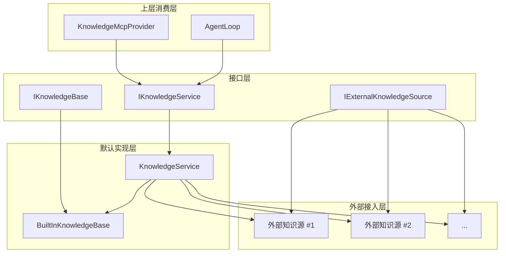
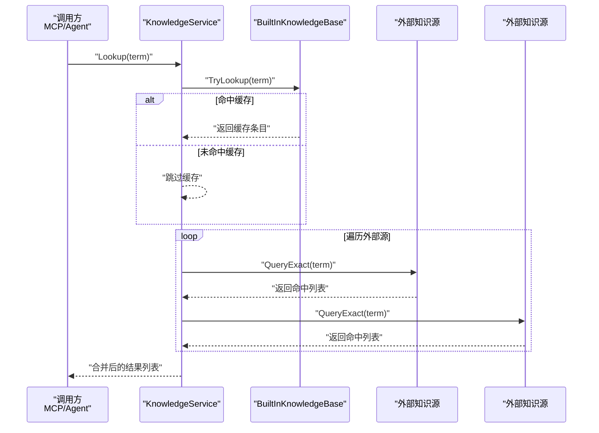
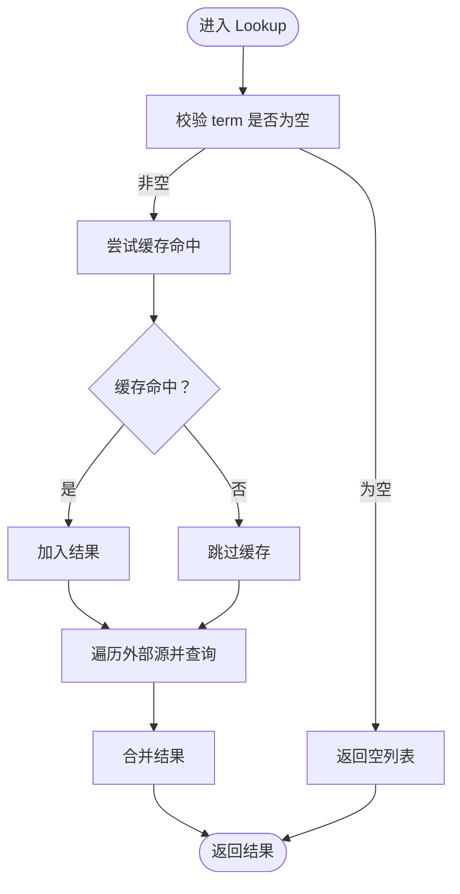
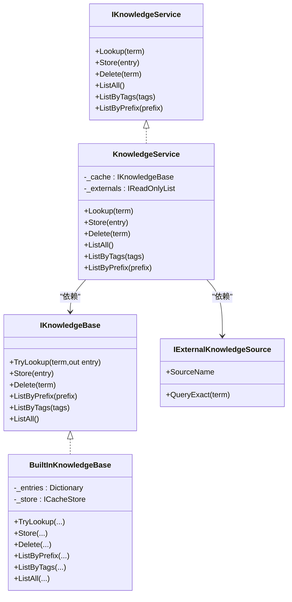

# 知识查询策略

<cite>
**本文引用的文件**
- [src/NPCLife/Core/KnowledgeService.cs](file://src/NPCLife/Core/KnowledgeService.cs)
- [src/NPCLife/Core/IKnowledgeService.cs](file://src/NPCLife/Core/IKnowledgeService.cs)
- [src/NPCLife/Core/IKnowledgeBase.cs](file://src/NPCLife/Core/IKnowledgeBase.cs)
- [src/NPCLife/Infrastructure/Knowledge/BuiltInKnowledgeBase.cs](file://src/NPCLife/Infrastructure/Knowledge/BuiltInKnowledgeBase.cs)
- [src/NPCLife/Core/IExternalKnowledgeSource.cs](file://src/NPCLife/Core/IExternalKnowledgeSource.cs)
- [src/NPCLife/Infrastructure/Mcp/KnowledgeMcpProvider.cs](file://src/NPCLife/Infrastructure/Mcp/KnowledgeMcpProvider.cs)
- [src/NPCLife/Core/KnowledgeEntry.cs](file://src/NPCLife/Core/KnowledgeEntry.cs)
- [src/NPCLife/Framework/RuntimeMetrics.cs](file://src/NPCLife/Framework/RuntimeMetrics.cs)
- [src/NPCLife/Agent/AgentLoop.cs](file://src/NPCLife/Agent/AgentLoop.cs)
- [tests/NPCLife.Tests/Core/EventQueryTests.cs](file://tests/NPCLife.Tests/Core/EventQueryTests.cs)
- [src/NPCLife/Core/EventQuery.cs](file://src/NPCLife/Core/EventQuery.cs)
</cite>

## 目录
1. [简介](#简介)
2. [项目结构](#项目结构)
3. [核心组件](#核心组件)
4. [架构总览](#架构总览)
5. [详细组件分析](#详细组件分析)
6. [依赖关系分析](#依赖关系分析)
7. [性能考量](#性能考量)
8. [故障排查指南](#故障排查指南)
9. [结论](#结论)
10. [附录](#附录)

## 简介
本文件系统性阐述知识查询策略，聚焦以下主题：
- 精确查询、前缀查询、标签查询的实现原理与行为边界
- 查询结果的优先级与去重机制
- 性能优化策略（缓存利用、并行查询）
- 查询参数最佳实践与调优建议
- 查询失败处理与回退策略
- 复杂查询场景示例与调试技巧
- 查询策略对整体系统性能的影响

## 项目结构
围绕“知识查询”这一核心能力，项目采用分层与接口抽象设计：
- 接口层：定义知识服务与知识库契约，确保上层组件与底层实现解耦
- 默认实现层：内置知识库负责本地缓存与持久化；知识服务聚合本地缓存与外部只读知识源
- 外部接入层：通过外部知识源接口对接游戏数据库、百科、RAG 等只读数据源
- 上层消费层：MCP 工具、智能体循环等通过统一接口发起查询

图表来源
- [src/NPCLife/Core/IKnowledgeService.cs:12-34](file://src/NPCLife/Core/IKnowledgeService.cs#L12-L34)
- [src/NPCLife/Core/IKnowledgeBase.cs:9-51](file://src/NPCLife/Core/IKnowledgeBase.cs#L9-L51)
- [src/NPCLife/Core/IExternalKnowledgeSource.cs:9-19](file://src/NPCLife/Core/IExternalKnowledgeSource.cs#L9-L19)
- [src/NPCLife/Core/KnowledgeService.cs:13-64](file://src/NPCLife/Core/KnowledgeService.cs#L13-L64)
- [src/NPCLife/Infrastructure/Knowledge/BuiltInKnowledgeBase.cs:13-104](file://src/NPCLife/Infrastructure/Knowledge/BuiltInKnowledgeBase.cs#L13-L104)
- [src/NPCLife/Infrastructure/Mcp/KnowledgeMcpProvider.cs:15-40](file://src/NPCLife/Infrastructure/Mcp/KnowledgeMcpProvider.cs#L15-L40)
- [src/NPCLife/Agent/AgentLoop.cs:480-490](file://src/NPCLife/Agent/AgentLoop.cs#L480-L490)

章节来源
- [src/NPCLife/Core/IKnowledgeService.cs:5-34](file://src/NPCLife/Core/IKnowledgeService.cs#L5-L34)
- [src/NPCLife/Core/IKnowledgeBase.cs:5-51](file://src/NPCLife/Core/IKnowledgeBase.cs#L5-L51)
- [src/NPCLife/Core/IExternalKnowledgeSource.cs:5-19](file://src/NPCLife/Core/IExternalKnowledgeSource.cs#L5-L19)
- [src/NPCLife/Core/KnowledgeService.cs:6-22](file://src/NPCLife/Core/KnowledgeService.cs#L6-L22)

## 核心组件
- 知识服务接口与默认实现
  - IKnowledgeService：对外暴露查询、存储、列举等能力，屏蔽底层知识源差异
  - KnowledgeService：聚合内置知识库与外部只读知识源，执行精确查询与列举操作
- 内置知识库
  - BuiltInKnowledgeBase：唯一可写实现，提供 O(1) 字典查找、前缀/标签/全量列举
- 外部知识源接口
  - IExternalKnowledgeSource：只读接口，由第三方实现精确查询
- MCP 工具与智能体消费
  - KnowledgeMcpProvider：封装查询、学习、列举、删除、统计等工具
  - AgentLoop：在推理流程中调用知识服务进行词条查询

章节来源
- [src/NPCLife/Core/IKnowledgeService.cs:12-34](file://src/NPCLife/Core/IKnowledgeService.cs#L12-L34)
- [src/NPCLife/Core/KnowledgeService.cs:13-64](file://src/NPCLife/Core/KnowledgeService.cs#L13-L64)
- [src/NPCLife/Infrastructure/Knowledge/BuiltInKnowledgeBase.cs:13-104](file://src/NPCLife/Infrastructure/Knowledge/BuiltInKnowledgeBase.cs#L13-L104)
- [src/NPCLife/Core/IExternalKnowledgeSource.cs:9-19](file://src/NPCLife/Core/IExternalKnowledgeSource.cs#L9-L19)
- [src/NPCLife/Infrastructure/Mcp/KnowledgeMcpProvider.cs:15-40](file://src/NPCLife/Infrastructure/Mcp/KnowledgeMcpProvider.cs#L15-L40)
- [src/NPCLife/Agent/AgentLoop.cs:480-490](file://src/NPCLife/Agent/AgentLoop.cs#L480-L490)

## 架构总览
下图展示“精确查询”的端到端流程：客户端通过 MCP 或智能体调用知识服务，先查本地缓存，再并行查询所有外部只读源，最终汇总返回。

图表来源
- [src/NPCLife/Core/KnowledgeService.cs:28-48](file://src/NPCLife/Core/KnowledgeService.cs#L28-L48)
- [src/NPCLife/Infrastructure/Knowledge/BuiltInKnowledgeBase.cs:38-43](file://src/NPCLife/Infrastructure/Knowledge/BuiltInKnowledgeBase.cs#L38-L43)
- [src/NPCLife/Core/IExternalKnowledgeSource.cs:18](file://src/NPCLife/Core/IExternalKnowledgeSource.cs#L18)

## 详细组件分析

### 精确查询（Lookup）
- 实现要点
  - 先查内置缓存，命中则加入结果
  - 并行遍历所有外部只读源，收集各自命中结果
  - 返回合并后的结果列表（可能为空）
- 结果去重
  - 当前实现未对来自不同源的重复条目做去重处理
  - 建议：以 Term 为主键进行去重，保留更高置信度或优先级来源
- 适用场景
  - 精确词条检索（如技能名、角色名、物品名）

图表来源
- [src/NPCLife/Core/KnowledgeService.cs:28-48](file://src/NPCLife/Core/KnowledgeService.cs#L28-L48)

章节来源
- [src/NPCLife/Core/KnowledgeService.cs:24-48](file://src/NPCLife/Core/KnowledgeService.cs#L24-L48)
- [src/NPCLife/Infrastructure/Knowledge/BuiltInKnowledgeBase.cs:38-43](file://src/NPCLife/Infrastructure/Knowledge/BuiltInKnowledgeBase.cs#L38-L43)
- [src/NPCLife/Core/IExternalKnowledgeSource.cs:18](file://src/NPCLife/Core/IExternalKnowledgeSource.cs#L18)

### 前缀查询（ListByPrefix）
- 实现要点
  - 内置知识库：基于字典顺序筛选 Term 前缀，返回有序列表
  - 支持空前缀返回全量
- 复杂度
  - 时间复杂度近似 O(N) 遍历 + 过滤 + 排序，N 为词条总数
- 使用建议
  - 适合探索性检索与自动补全场景

章节来源
- [src/NPCLife/Infrastructure/Knowledge/BuiltInKnowledgeBase.cs:72-81](file://src/NPCLife/Infrastructure/Knowledge/BuiltInKnowledgeBase.cs#L72-L81)
- [src/NPCLife/Core/IKnowledgeBase.cs:33-36](file://src/NPCLife/Core/IKnowledgeBase.cs#L33-L36)

### 标签查询（ListByTags）
- 实现要点
  - 内置知识库：匹配任一标签即命中，返回有序列表
  - 支持空标签返回全量
- 复杂度
  - 时间复杂度近似 O(N) 遍历 + 过滤 + 排序
- 使用建议
  - 适合按领域过滤（如战斗、派系、传说）

章节来源
- [src/NPCLife/Infrastructure/Knowledge/BuiltInKnowledgeBase.cs:86-96](file://src/NPCLife/Infrastructure/Knowledge/BuiltInKnowledgeBase.cs#L86-L96)
- [src/NPCLife/Core/IKnowledgeBase.cs:42-44](file://src/NPCLife/Core/IKnowledgeBase.cs#L42-L44)

### 列举全量（ListAll）
- 实现要点
  - 内置知识库：按 Term 排序返回全部条目
- 使用建议
  - 适用于导出、统计、全量扫描

章节来源
- [src/NPCLife/Infrastructure/Knowledge/BuiltInKnowledgeBase.cs:101-104](file://src/NPCLife/Infrastructure/Knowledge/BuiltInKnowledgeBase.cs#L101-L104)
- [src/NPCLife/Core/IKnowledgeBase.cs:49](file://src/NPCLife/Core/IKnowledgeBase.cs#L49)

### 存储与删除（Store/Delete）
- 实现要点
  - Store：直接覆盖已有词条；内置知识库负责持久化
  - Delete：删除指定词条；内置知识库负责持久化
- 使用建议
  - 学习新知识时建议设置合理置信度与标签，便于后续检索与排序

章节来源
- [src/NPCLife/Infrastructure/Knowledge/BuiltInKnowledgeBase.cs:48-67](file://src/NPCLife/Infrastructure/Knowledge/BuiltInKnowledgeBase.cs#L48-L67)
- [src/NPCLife/Core/IKnowledgeBase.cs:21-29](file://src/NPCLife/Core/IKnowledgeBase.cs#L21-L29)

### MCP 工具与智能体消费
- MCP 工具
  - lookup_term：并行查询所有源，返回全部命中
  - learn_term：学习并存储词条，随后回读确认
  - list_known_terms：支持前缀/标签/全量过滤与限制数量
  - forget_term：删除词条
  - get_term_stats：获取词条元数据
- 智能体消费
  - AgentLoop 在推理过程中调用知识服务进行词条查询

章节来源
- [src/NPCLife/Infrastructure/Mcp/KnowledgeMcpProvider.cs:46-229](file://src/NPCLife/Infrastructure/Mcp/KnowledgeMcpProvider.cs#L46-L229)
- [src/NPCLife/Agent/AgentLoop.cs:480-490](file://src/NPCLife/Agent/AgentLoop.cs#L480-L490)

### 查询结果的优先级与去重
- 优先级
  - 缓存命中优先于外部源
  - 外部源之间无显式优先级，按调用顺序合并
- 去重
  - 当前实现未做跨源去重
  - 建议：以 Term 为主键去重，保留更高置信度或优先级来源
- 影响
  - 多源重复会放大结果规模，影响展示与后续处理

章节来源
- [src/NPCLife/Core/KnowledgeService.cs:35-45](file://src/NPCLife/Core/KnowledgeService.cs#L35-L45)

### 事件查询参数（EventQuery）
- 功能概述
  - 支持标签 OR/AND、时间范围、Actor 过滤、重要度阈值、分页与限制
- 使用建议
  - 合理设置 Limit 与 Offset，避免一次性返回过多事件
  - 标签筛选建议优先使用 TagsAny，再叠加 TagsAll 以收窄范围

章节来源
- [src/NPCLife/Core/EventQuery.cs:9-46](file://src/NPCLife/Core/EventQuery.cs#L9-L46)
- [tests/NPCLife.Tests/Core/EventQueryTests.cs:13-102](file://tests/NPCLife.Tests/Core/EventQueryTests.cs#L13-L102)

## 依赖关系分析
- 组件耦合
  - KnowledgeService 依赖 IKnowledgeBase 与 IExternalKnowledgeSource 列表
  - BuiltInKnowledgeBase 依赖持久化存储与日志记录
  - MCP 工具与 Agent 仅依赖 IKnowledgeService，保持高内聚低耦合
- 外部依赖
  - JSON 解析/序列化用于持久化
  - 日志记录用于错误与加载提示

图表来源
- [src/NPCLife/Core/IKnowledgeService.cs:12-34](file://src/NPCLife/Core/IKnowledgeService.cs#L12-L34)
- [src/NPCLife/Core/KnowledgeService.cs:13-64](file://src/NPCLife/Core/KnowledgeService.cs#L13-L64)
- [src/NPCLife/Core/IKnowledgeBase.cs:9-51](file://src/NPCLife/Core/IKnowledgeBase.cs#L9-L51)
- [src/NPCLife/Infrastructure/Knowledge/BuiltInKnowledgeBase.cs:13-104](file://src/NPCLife/Infrastructure/Knowledge/BuiltInKnowledgeBase.cs#L13-L104)
- [src/NPCLife/Core/IExternalKnowledgeSource.cs:9-19](file://src/NPCLife/Core/IExternalKnowledgeSource.cs#L9-L19)

## 性能考量
- 缓存利用
  - 内置知识库采用字典 O(1) 查找，建议优先将高频词条写入缓存
  - 持久化采用 JSON 数组批量序列化，注意大体量词条的 IO 压力
- 并行查询
  - 外部源查询为顺序遍历，建议在外部实现层引入并发控制与超时策略
- 结果处理
  - 多源合并后未去重，建议在上层或服务层增加去重与排序逻辑
- 分页与限制
  - MCP 工具支持 limit 控制输出规模；事件查询支持 Limit/Offset
- 监控与指标
  - 运行时指标记录包含知识查询命中层级与会话标识，可用于性能分析

章节来源
- [src/NPCLife/Infrastructure/Knowledge/BuiltInKnowledgeBase.cs:38-43](file://src/NPCLife/Infrastructure/Knowledge/BuiltInKnowledgeBase.cs#L38-L43)
- [src/NPCLife/Infrastructure/Mcp/KnowledgeMcpProvider.cs:136-159](file://src/NPCLife/Infrastructure/Mcp/KnowledgeMcpProvider.cs#L136-L159)
- [src/NPCLife/Core/EventQuery.cs:29-33](file://src/NPCLife/Core/EventQuery.cs#L29-L33)
- [src/NPCLife/Framework/RuntimeMetrics.cs:150](file://src/NPCLife/Framework/RuntimeMetrics.cs#L150)

## 故障排查指南
- 常见问题
  - 查询无结果：检查 term 是否为空；确认缓存是否加载成功；核对标签/前缀过滤条件
  - 学习失败：检查 Store 参数合法性与持久化状态
  - 外部源异常：查看外部实现的 QueryExact 行为与返回格式
- 日志与告警
  - 内置知识库加载/保存异常会记录警告日志
  - MCP 工具捕获异常并返回标准化错误消息
- 回退策略
  - 当外部源不可用时，仍可返回缓存结果
  - 对于高延迟外部源，建议设置超时与短路策略

章节来源
- [src/NPCLife/Infrastructure/Knowledge/BuiltInKnowledgeBase.cs:110-132](file://src/NPCLife/Infrastructure/Knowledge/BuiltInKnowledgeBase.cs#L110-L132)
- [src/NPCLife/Infrastructure/Mcp/KnowledgeMcpProvider.cs:54-75](file://src/NPCLife/Infrastructure/Mcp/KnowledgeMcpProvider.cs#L54-L75)
- [src/NPCLife/Infrastructure/Mcp/KnowledgeMcpProvider.cs:177-199](file://src/NPCLife/Infrastructure/Mcp/KnowledgeMcpProvider.cs#L177-L199)

## 结论
- 精确查询通过“缓存优先 + 外部并行”的策略实现快速命中
- 前缀与标签查询为探索性检索提供高效路径
- 当前实现未内置跨源去重与优先级排序，建议在上层或服务层补充
- 通过缓存、并发与分页等手段可显著提升查询性能
- 建议结合运行时指标与日志持续优化查询策略与外部源质量

## 附录

### 查询参数最佳实践
- 精确查询
  - 保证 term 非空且大小写不敏感
  - 优先使用缓存命中，减少外部源调用
- 前缀查询
  - 使用较短前缀提高召回率，配合标签进一步收敛
- 标签查询
  - 先 OR 再 AND，逐步缩小范围
  - 合理设置标签集合，避免过多无关标签导致误判
- 事件查询
  - 明确时间范围与重要度阈值，避免全量扫描
  - 设置合理的 Limit 与 Offset，分页拉取

章节来源
- [src/NPCLife/Core/KnowledgeService.cs:30-31](file://src/NPCLife/Core/KnowledgeService.cs#L30-L31)
- [src/NPCLife/Infrastructure/Knowledge/BuiltInKnowledgeBase.cs:72-81](file://src/NPCLife/Infrastructure/Knowledge/BuiltInKnowledgeBase.cs#L72-L81)
- [src/NPCLife/Infrastructure/Knowledge/BuiltInKnowledgeBase.cs:86-96](file://src/NPCLife/Infrastructure/Knowledge/BuiltInKnowledgeBase.cs#L86-L96)
- [src/NPCLife/Core/EventQuery.cs:11-33](file://src/NPCLife/Core/EventQuery.cs#L11-L33)

### 复杂查询场景示例
- 场景：同时需要“技能名精确匹配 + 派系标签过滤”
  - 步骤：先调用 Lookup 抓取精确结果，再在外层按标签过滤
  - 注意：当前实现未内置跨源去重，建议在上层统一处理
- 场景：自动补全候选
  - 步骤：使用 ListByPrefix 生成候选集，再结合标签二次筛选

章节来源
- [src/NPCLife/Core/KnowledgeService.cs:28-48](file://src/NPCLife/Core/KnowledgeService.cs#L28-L48)
- [src/NPCLife/Infrastructure/Knowledge/BuiltInKnowledgeBase.cs:72-96](file://src/NPCLife/Infrastructure/Knowledge/BuiltInKnowledgeBase.cs#L72-L96)

### 调试技巧
- 使用 MCP 工具验证查询链路：lookup_term、list_known_terms、get_term_stats
- 关注运行时指标：知识查询命中层级与会话标识
- 观察日志：加载/保存知识库的警告信息，定位持久化问题

章节来源
- [src/NPCLife/Infrastructure/Mcp/KnowledgeMcpProvider.cs:46-229](file://src/NPCLife/Infrastructure/Mcp/KnowledgeMcpProvider.cs#L46-L229)
- [src/NPCLife/Framework/RuntimeMetrics.cs:150](file://src/NPCLife/Framework/RuntimeMetrics.cs#L150)