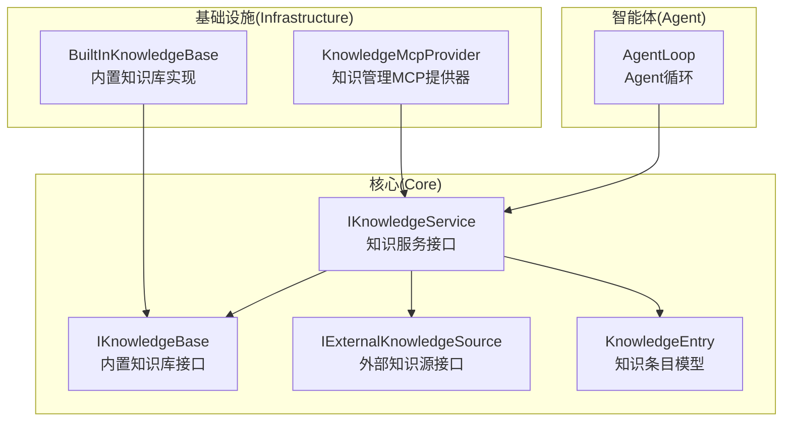
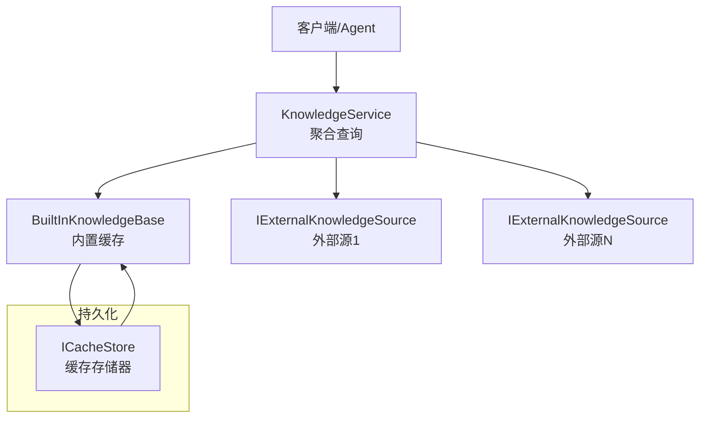
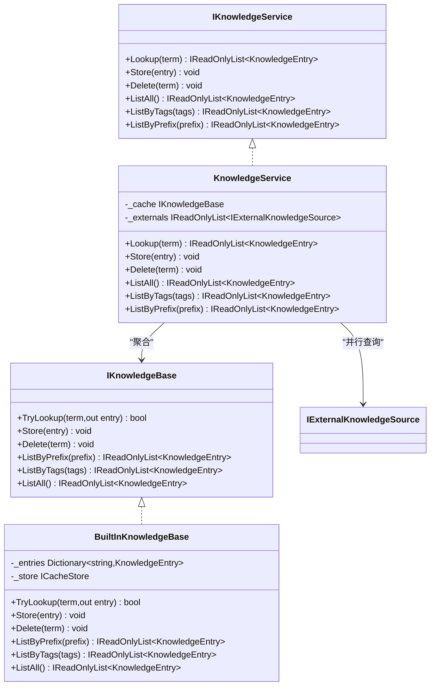
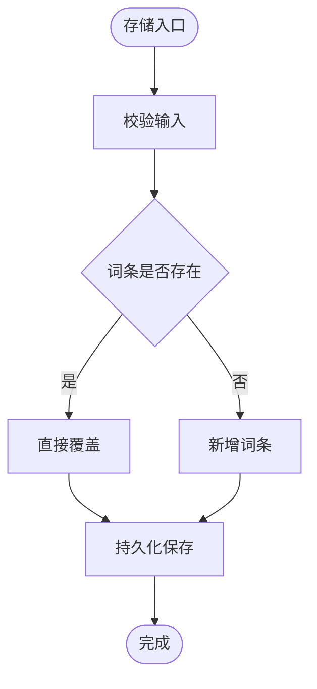
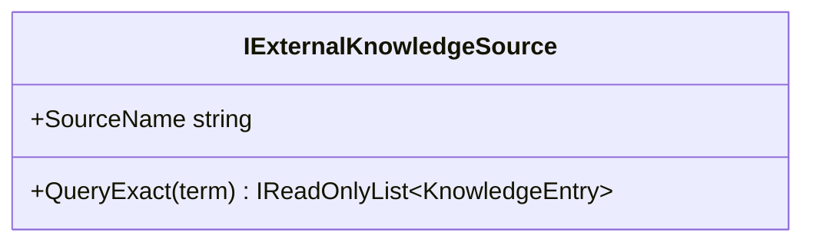
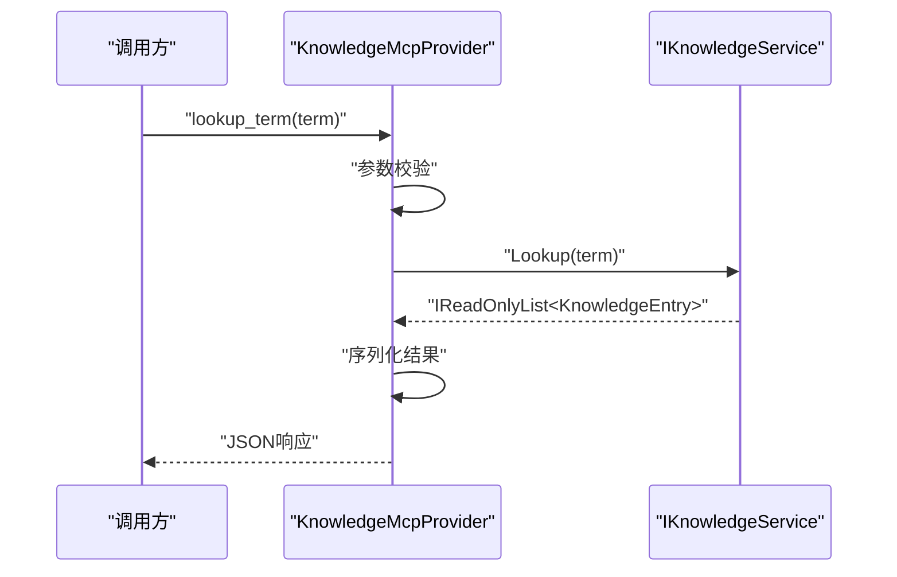
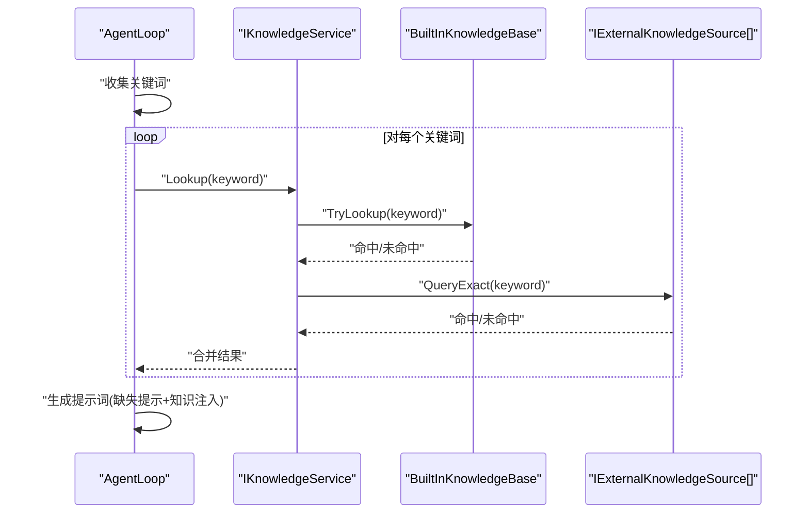
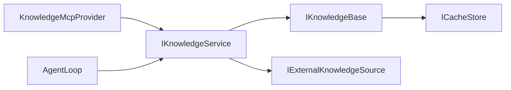
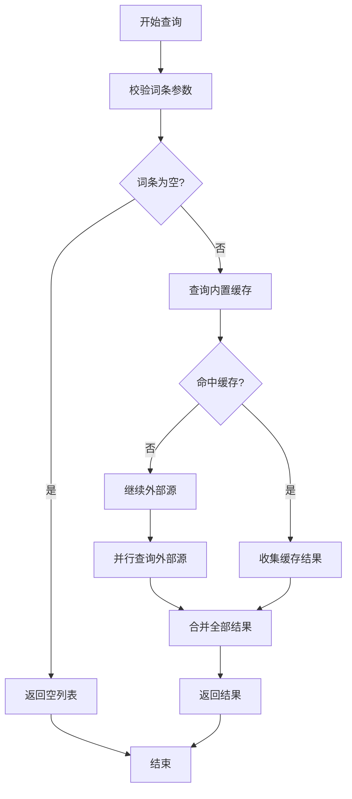

# 知识管理系统

<cite>
**本文引用的文件**
- [知识服务实现](file://src/NPCLife/Core/KnowledgeService.cs)
- [知识服务接口](file://src/NPCLife/Core/IKnowledgeService.cs)
- [内置知识库接口](file://src/NPCLife/Core/IKnowledgeBase.cs)
- [内置知识库实现](file://src/NPCLife/Infrastructure/Knowledge/BuiltInKnowledgeBase.cs)
- [知识条目模型](file://src/NPCLife/Core/KnowledgeEntry.cs)
- [外部知识源接口](file://src/NPCLife/Core/IExternalKnowledgeSource.cs)
- [知识管理MCP提供器](file://src/NPCLife/Infrastructure/Mcp/KnowledgeMcpProvider.cs)
- [Agent循环](file://src/NPCLife/Agent/AgentLoop.cs)
- [事件查询参数](file://src/NPCLife/Core/EventQuery.cs)
- [项目说明](file://README.md)
</cite>

## 目录
1. [简介](#简介)
2. [项目结构](#项目结构)
3. [核心组件](#核心组件)
4. [架构总览](#架构总览)
5. [详细组件分析](#详细组件分析)
6. [依赖关系分析](#依赖关系分析)
7. [性能考虑](#性能考虑)
8. [故障排查指南](#故障排查指南)
9. [结论](#结论)
10. [附录](#附录)

## 简介
本知识管理系统为叙事驱动的AI中间件提供核心知识能力，支撑NPC动态叙事生成。系统通过统一的知识服务接口聚合内置知识库与外部知识源，支持词条精确查询、学习、列举、删除与统计，并通过MCP工具暴露给Agent与外部系统调用。内置知识库采用内存字典存储并持久化至缓存存储器，提供O(1)字典查找与标签/前缀检索能力。

## 项目结构
系统采用分层与职责分离的设计：
- Core层：定义知识服务、知识库、外部知识源、知识条目等核心接口与数据模型
- Infrastructure层：提供内置知识库实现与MCP工具提供器
- Agent层：AgentLoop在生成叙事时消费知识服务，将知识注入提示词
- Framework层：提供序列化、日志、事件总线等通用能力

**图表来源**
- [知识服务实现:13-64](file://src/NPCLife/Core/KnowledgeService.cs#L13-L64)
- [内置知识库实现:13-206](file://src/NPCLife/Infrastructure/Knowledge/BuiltInKnowledgeBase.cs#L13-L206)
- [知识管理MCP提供器:15-355](file://src/NPCLife/Infrastructure/Mcp/KnowledgeMcpProvider.cs#L15-L355)
- [Agent循环:43-116](file://src/NPCLife/Agent/AgentLoop.cs#L43-L116)

**章节来源**
- [知识服务实现:1-66](file://src/NPCLife/Core/KnowledgeService.cs#L1-L66)
- [内置知识库实现:1-206](file://src/NPCLife/Infrastructure/Knowledge/BuiltInKnowledgeBase.cs#L1-L206)
- [知识管理MCP提供器:1-355](file://src/NPCLife/Infrastructure/Mcp/KnowledgeMcpProvider.cs#L1-L355)
- [Agent循环:1-581](file://src/NPCLife/Agent/AgentLoop.cs#L1-L581)

## 核心组件
- 知识服务接口：定义查询、存储、删除、列举等能力，屏蔽底层知识源差异
- 内置知识库接口：提供词条增删查改与过滤能力
- 内置知识库实现：基于内存字典的高性能存储，支持持久化
- 外部知识源接口：只读接口，支持GameDef、Wiki、RAG等接入
- 知识条目模型：纯DTO，包含词条名、释义、来源、信心度、语义标签
- 知识管理MCP提供器：将知识服务封装为MCP工具，供Agent调用
- Agent循环：在叙事生成过程中批量查询关键词，注入相关知识

**章节来源**
- [知识服务接口:12-34](file://src/NPCLife/Core/IKnowledgeService.cs#L12-L34)
- [内置知识库接口:9-51](file://src/NPCLife/Core/IKnowledgeBase.cs#L9-L51)
- [内置知识库实现:13-206](file://src/NPCLife/Infrastructure/Knowledge/BuiltInKnowledgeBase.cs#L13-L206)
- [外部知识源接口:9-20](file://src/NPCLife/Core/IExternalKnowledgeSource.cs#L9-L20)
- [知识条目模型:9-26](file://src/NPCLife/Core/KnowledgeEntry.cs#L9-L26)
- [知识管理MCP提供器:15-355](file://src/NPCLife/Infrastructure/Mcp/KnowledgeMcpProvider.cs#L15-L355)
- [Agent循环:43-116](file://src/NPCLife/Agent/AgentLoop.cs#L43-L116)

## 架构总览
系统采用“服务聚合 + 多源并行”的架构模式：
- 知识服务聚合内置可写知识库与多个只读外部知识源
- 查询时并行访问内部缓存与外部源，汇总全部命中结果
- 内置知识库负责持久化与快速检索，外部源提供权威或补充信息
- MCP工具为Agent与外部系统提供统一的知识操作入口

**图表来源**
- [知识服务实现:18-48](file://src/NPCLife/Core/KnowledgeService.cs#L18-L48)
- [内置知识库实现:24-29](file://src/NPCLife/Infrastructure/Knowledge/BuiltInKnowledgeBase.cs#L24-L29)
- [外部知识源接口:9-20](file://src/NPCLife/Core/IExternalKnowledgeSource.cs#L9-L20)

## 详细组件分析

### 知识服务组件分析
知识服务作为统一入口，聚合内置知识库与外部知识源：
- Lookup：先查内置缓存，再并行查询所有外部源，合并返回全部命中
- Store/Delete/List：代理到内置知识库，保证可写性与一致性
- 设计原则：屏蔽底层差异，调用方仅关注Term与Source区分

**图表来源**
- [知识服务接口:12-34](file://src/NPCLife/Core/IKnowledgeService.cs#L12-L34)
- [知识服务实现:13-64](file://src/NPCLife/Core/KnowledgeService.cs#L13-L64)
- [内置知识库接口:9-51](file://src/NPCLife/Core/IKnowledgeBase.cs#L9-L51)
- [内置知识库实现:13-206](file://src/NPCLife/Infrastructure/Knowledge/BuiltInKnowledgeBase.cs#L13-L206)

**章节来源**
- [知识服务实现:13-64](file://src/NPCLife/Core/KnowledgeService.cs#L13-L64)
- [知识服务接口:12-34](file://src/NPCLife/Core/IKnowledgeService.cs#L12-L34)

### 内置知识库组件分析
内置知识库提供高性能的内存存储与持久化：
- 存储结构：大小写不敏感字典，O(1)查找
- 持久化：通过ICacheStore以JSON数组形式保存，启动时加载
- 过滤能力：支持前缀与标签过滤，排序输出
- 序列化：自定义JSON写入器，兼容旧版字段

**图表来源**
- [内置知识库实现:48-67](file://src/NPCLife/Infrastructure/Knowledge/BuiltInKnowledgeBase.cs#L48-L67)
- [内置知识库实现:134-157](file://src/NPCLife/Infrastructure/Knowledge/BuiltInKnowledgeBase.cs#L134-L157)

**章节来源**
- [内置知识库实现:13-206](file://src/NPCLife/Infrastructure/Knowledge/BuiltInKnowledgeBase.cs#L13-L206)
- [内置知识库接口:9-51](file://src/NPCLife/Core/IKnowledgeBase.cs#L9-L51)

### 外部知识源组件分析
外部知识源接口定义只读查询能力：
- SourceName：标识来源名称，用于标注查询结果
- QueryExact：精确查询，返回命中列表
- 实现者可为GameDef、Wiki、RAG等，框架不关心内部匹配策略

**图表来源**
- [外部知识源接口:9-20](file://src/NPCLife/Core/IExternalKnowledgeSource.cs#L9-L20)

**章节来源**
- [外部知识源接口:9-20](file://src/NPCLife/Core/IExternalKnowledgeSource.cs#L9-L20)

### 知识管理MCP提供器分析
MCP提供器将知识服务封装为工具集：
- 工具清单：词条查询、学习、列举、删除、统计
- 查询策略：Lookup并行查询内部缓存与外部源
- 序列化：统一JSON输出格式，支持单条与多条结果
- 错误处理：捕获异常并返回标准错误结构

**图表来源**
- [知识管理MCP提供器:49-75](file://src/NPCLife/Infrastructure/Mcp/KnowledgeMcpProvider.cs#L49-L75)
- [知识服务接口:18-18](file://src/NPCLife/Core/IKnowledgeService.cs#L18-L18)

**章节来源**
- [知识管理MCP提供器:15-355](file://src/NPCLife/Infrastructure/Mcp/KnowledgeMcpProvider.cs#L15-L355)

### Agent循环中的知识查询分析
Agent在构建用户消息时批量查询关键词：
- 关键词提取：从事件列表中收集去重后的关键词
- 批量查询：对每个关键词调用知识服务
- 缺失提示：对未命中的关键词生成提示，引导学习
- 知识注入：将命中的知识条目格式化后注入提示词

**图表来源**
- [Agent循环:462-527](file://src/NPCLife/Agent/AgentLoop.cs#L462-L527)
- [知识服务实现:28-48](file://src/NPCLife/Core/KnowledgeService.cs#L28-L48)

**章节来源**
- [Agent循环:462-527](file://src/NPCLife/Agent/AgentLoop.cs#L462-L527)

## 依赖关系分析
- 知识服务依赖内置知识库与外部知识源接口
- 内置知识库依赖缓存存储器进行持久化
- MCP提供器依赖知识服务接口
- Agent循环依赖知识服务接口与MCP技能注册表

**图表来源**
- [知识服务实现:15-22](file://src/NPCLife/Core/KnowledgeService.cs#L15-L22)
- [内置知识库实现:22-28](file://src/NPCLife/Infrastructure/Knowledge/BuiltInKnowledgeBase.cs#L22-L28)
- [知识管理MCP提供器:17-24](file://src/NPCLife/Infrastructure/Mcp/KnowledgeMcpProvider.cs#L17-L24)
- [Agent循环:55-109](file://src/NPCLife/Agent/AgentLoop.cs#L55-L109)

**章节来源**
- [知识服务实现:15-22](file://src/NPCLife/Core/KnowledgeService.cs#L15-L22)
- [内置知识库实现:22-28](file://src/NPCLife/Infrastructure/Knowledge/BuiltInKnowledgeBase.cs#L22-L28)
- [知识管理MCP提供器:17-24](file://src/NPCLife/Infrastructure/Mcp/KnowledgeMcpProvider.cs#L17-L24)
- [Agent循环:55-109](file://src/NPCLife/Agent/AgentLoop.cs#L55-L109)

## 性能考虑
- 查询性能
  - 内置知识库采用字典存储，TryLookup为O(1)，适合高频查询
  - Lookup对内部缓存与外部源并行查询，建议合理配置外部源数量
- 存储性能
  - 持久化采用JSON数组，启动时一次性加载，运行时增量保存
  - 建议控制词条数量规模，避免过大的JSON序列化开销
- 过滤性能
  - ListByPrefix与ListByTags为线性扫描，建议配合标签与前缀策略减少数据量
- 缓存策略
  - 内置知识库为内存缓存，重启丢失；可通过ICacheStore实现跨进程持久化
  - 外部源命中结果未在系统内缓存，建议在上层应用实现LRU或TTL缓存

[本节为通用性能指导，不直接分析具体文件]

## 故障排查指南
- 知识查询无结果
  - 检查词条大小写与空值：TryLookup大小写不敏感，但空值不会命中
  - 确认外部源是否正确实现：QueryExact返回的Source字段应与SourceName一致
- 存储失败
  - 检查ICacheStore是否可用：LoadFromStore/SaveToStore异常会被记录
  - 确认JSON序列化/反序列化：DeserializeEntry对旧版字段有兼容处理
- MCP工具调用异常
  - 查看KnowledgeMcpProvider的日志输出，定位参数校验与序列化问题
  - 确认IKnowledgeService实例可用且未被释放

**章节来源**
- [内置知识库实现:110-132](file://src/NPCLife/Infrastructure/Knowledge/BuiltInKnowledgeBase.cs#L110-L132)
- [内置知识库实现:134-157](file://src/NPCLife/Infrastructure/Knowledge/BuiltInKnowledgeBase.cs#L134-L157)
- [知识管理MCP提供器:70-75](file://src/NPCLife/Infrastructure/Mcp/KnowledgeMcpProvider.cs#L70-L75)
- [外部知识源接口:11-18](file://src/NPCLife/Core/IExternalKnowledgeSource.cs#L11-L18)

## 结论
本知识管理系统通过清晰的接口分层与聚合查询模式，实现了内置知识库与外部知识源的统一管理。内置知识库提供高性能的内存存储与持久化能力，MCP工具为Agent与外部系统提供了标准化的知识操作接口。在叙事生成场景中，系统能够高效地将相关知识注入提示词，提升NPC叙事的一致性与丰富度。

[本节为总结性内容，不直接分析具体文件]

## 附录

### 知识查询流程图

**图表来源**
- [知识服务实现:28-48](file://src/NPCLife/Core/KnowledgeService.cs#L28-L48)

### 知识条目字段说明
- Term：词条名，作为索引键，大小写不敏感
- Definition：释义文本，可为空表示仅建立索引
- Source：来源名称，如"LLM"、"GameDef"、"AgentDeduction"、"Wiki"、"RAG"
- Confidence：信心度(0.0~1.0)，GameDef通常为1.0，LLM通常为0.6~0.9
- ContextTags：语义标签列表，用于按领域过滤

**章节来源**
- [知识条目模型:9-26](file://src/NPCLife/Core/KnowledgeEntry.cs#L9-L26)

### 最佳实践
- 知识更新
  - 使用LearnTerm进行主动学习，直接覆盖已有词条
  - 对外部源更新，建议实现增量同步策略，避免全量重建
- 版本控制
  - 通过Source字段区分来源，结合ContextTags进行版本标记
  - 对重要词条设置较高Confidence，降低误用风险
- 一致性保证
  - Lookup返回全部来源结果，调用方可根据Source与Confidence进行合并
  - 对冲突词条，优先选择可信度更高或更新的来源
- 外部知识源集成
  - 实现IExternalKnowledgeSource接口，提供稳定的QueryExact
  - 确保返回的KnowledgeEntry.Source与SourceName一致
  - 对权威来源（如GameDef）可设置更高的默认Confidence

**章节来源**
- [知识管理MCP提供器:80-123](file://src/NPCLife/Infrastructure/Mcp/KnowledgeMcpProvider.cs#L80-L123)
- [外部知识源接口:9-20](file://src/NPCLife/Core/IExternalKnowledgeSource.cs#L9-L20)
- [知识服务实现:28-48](file://src/NPCLife/Core/KnowledgeService.cs#L28-L48)

### 自定义知识源开发指南
- 接口实现
  - 实现IExternalKnowledgeSource，设置SourceName
  - 在QueryExact中实现精确匹配逻辑，返回IReadOnlyList<KnowledgeEntry>
- 数据格式
  - 确保KnowledgeEntry的Term不为空，Definition可为空
  - Source字段与SourceName保持一致
- 集成步骤
  - 在知识服务构造函数中传入外部源列表
  - 通过Lookup即可并行查询内部缓存与外部源
- 示例参考
  - 参考内置知识库的序列化/反序列化策略，确保兼容性

**章节来源**
- [外部知识源接口:9-20](file://src/NPCLife/Core/IExternalKnowledgeSource.cs#L9-L20)
- [内置知识库实现:163-203](file://src/NPCLife/Infrastructure/Knowledge/BuiltInKnowledgeBase.cs#L163-L203)
- [知识服务实现:18-22](file://src/NPCLife/Core/KnowledgeService.cs#L18-L22)

### 知识管理在叙事生成中的作用
- 关键词驱动
  - Agent从事件中提取关键词，批量查询知识服务，形成上下文
- 缺失引导
  - 对未命中的关键词生成学习提示，引导Agent或用户补充知识
- 知识注入
  - 将命中的知识条目格式化注入提示词，增强叙事细节与一致性
- 来源标注
  - 通过Source字段区分知识来源，帮助Agent判断可信度与适用性

**章节来源**
- [Agent循环:462-527](file://src/NPCLife/Agent/AgentLoop.cs#L462-L527)
- [知识服务实现:28-48](file://src/NPCLife/Core/KnowledgeService.cs#L28-L48)
- [项目说明:1-93](file://README.md#L1-L93)