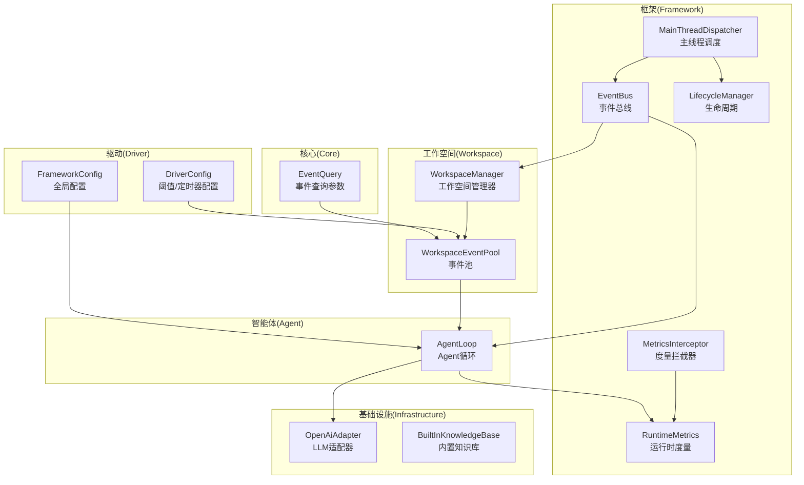
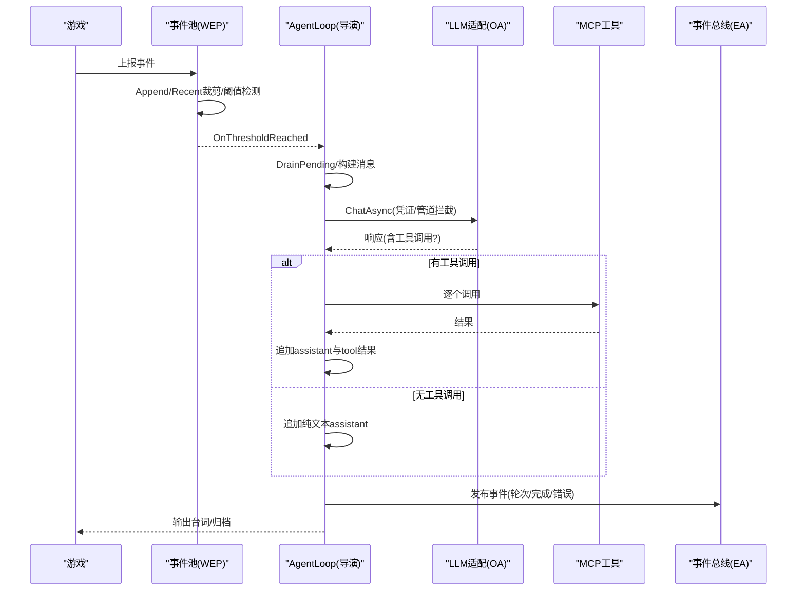
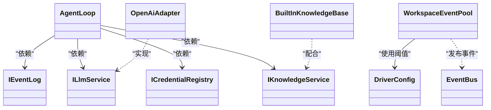

# 性能调优

<cite>
**本文引用的文件**
- [README.md](file://README.md)
- [EventQuery.cs](file://src/NPCLife/Core/EventQuery.cs)
- [EventBus.cs](file://src/NPCLife/Framework/EventBus.cs)
- [WorkspaceManager.cs](file://src/NPCLife/Workspace/WorkspaceManager.cs)
- [WorkspaceEventPool.cs](file://src/NPCLife/Workspace/WorkspaceEventPool.cs)
- [AgentLoop.cs](file://src/NPCLife/Agent/AgentLoop.cs)
- [FrameworkConfig.cs](file://src/NPCLife/Framework/FrameworkConfig.cs)
- [DriverConfig.cs](file://src/NPCLife/Driver/DriverConfig.cs)
- [RuntimeMetrics.cs](file://src/NPCLife/Framework/RuntimeMetrics.cs)
- [MetricsInterceptor.cs](file://src/NPCLife/Framework/MetricsInterceptor.cs)
- [OpenAiAdapter.cs](file://src/NPCLife/Infrastructure/Llm/OpenAiAdapter.cs)
- [BuiltInKnowledgeBase.cs](file://src/NPCLife/Infrastructure/Knowledge/BuiltInKnowledgeBase.cs)
- [MainThreadDispatcher.cs](file://src/NPCLife/Framework/MainThreadDispatcher.cs)
- [LifecycleManager.cs](file://src/NPCLife/Framework/LifecycleManager.cs)
</cite>

## 目录
1. [简介](#简介)
2. [项目结构](#项目结构)
3. [核心组件](#核心组件)
4. [架构总览](#架构总览)
5. [详细组件分析](#详细组件分析)
6. [依赖分析](#依赖分析)
7. [性能考量](#性能考量)
8. [故障排查指南](#故障排查指南)
9. [结论](#结论)
10. [附录](#附录)

## 简介
本指南聚焦 NPCLife 的性能调优，围绕事件阈值配置、内存与GC、并发与异步、LLM调用频率与成本、数据库/缓存、工作空间并发、网络I/O与API瓶颈、基准与压测方法以及CPU/内存监控指标展开。目标是在保障功能正确性的前提下，最大化吞吐、降低延迟与成本，并提升稳定性。

## 项目结构
NPCLife 采用“领域驱动”的分层组织：Core（领域模型与接口）、Framework（事件总线、生命周期、度量、主线程调度等）、Workspace（工作空间与事件池）、Agent（AI循环）、Infrastructure（LLM适配与知识库）、Driver（阈值与定时器配置）、Prompts（提示词资源）。

图表来源
- [EventQuery.cs:1-48](file://src/NPCLife/Core/EventQuery.cs#L1-L48)
- [EventBus.cs:1-243](file://src/NPCLife/Framework/EventBus.cs#L1-L243)
- [WorkspaceManager.cs:1-616](file://src/NPCLife/Workspace/WorkspaceManager.cs#L1-L616)
- [WorkspaceEventPool.cs:1-186](file://src/NPCLife/Workspace/WorkspaceEventPool.cs#L1-L186)
- [AgentLoop.cs:1-581](file://src/NPCLife/Agent/AgentLoop.cs#L1-L581)
- [DriverConfig.cs:1-107](file://src/NPCLife/Driver/DriverConfig.cs#L1-L107)
- [FrameworkConfig.cs:1-248](file://src/NPCLife/Framework/FrameworkConfig.cs#L1-L248)
- [RuntimeMetrics.cs:1-649](file://src/NPCLife/Framework/RuntimeMetrics.cs#L1-L649)
- [MetricsInterceptor.cs:1-110](file://src/NPCLife/Framework/MetricsInterceptor.cs#L1-L110)
- [OpenAiAdapter.cs:1-392](file://src/NPCLife/Infrastructure/Llm/OpenAiAdapter.cs#L1-L392)
- [BuiltInKnowledgeBase.cs:1-206](file://src/NPCLife/Infrastructure/Knowledge/BuiltInKnowledgeBase.cs#L1-L206)
- [MainThreadDispatcher.cs:1-147](file://src/NPCLife/Framework/MainThreadDispatcher.cs#L1-L147)
- [LifecycleManager.cs:1-264](file://src/NPCLife/Framework/LifecycleManager.cs#L1-L264)

章节来源
- [README.md:1-93](file://README.md#L1-L93)

## 核心组件
- 事件阈值与触发：DriverConfig 定义分角色阈值与定时器；WorkspaceEventPool 在 Append 后检测阈值并触发 OnThresholdReached，从而激活 AgentLoop。
- Agent 循环：基于事件池 Drain、构建提示词、调用 LLM、工具调用循环、追加结果、完成归档；通过状态机与信号量防止重入。
- 事件总线：EventBus 提供发布/订阅、优先级排序、错误隔离与清理；用于框架事件与工具调用的可观测性。
- 运行时度量：RuntimeMetrics + MetricsInterceptor 采集 Token、工具调用、知识库命中、Agent 循环统计；支持会话聚合与快照导出。
- LLM 适配：OpenAiAdapter 将统一请求转换为 OpenAI 格式，同步发送 HTTP 请求；支持连接测试与模型列举。
- 知识库：BuiltInKnowledgeBase 内存字典 + 缓存持久化，无容量限制；适合高频读写的场景。
- 主线程调度：MainThreadDispatcher 将任意线程提交的任务排队，由主线程周期 Drain，避免跨线程UI/状态冲突。
- 生命周期：LifecycleManager 统一注册/销毁组件、触发钩子、发布事件，支持 Reset 存档切换。

章节来源
- [DriverConfig.cs:1-107](file://src/NPCLife/Driver/DriverConfig.cs#L1-L107)
- [WorkspaceEventPool.cs:1-186](file://src/NPCLife/Workspace/WorkspaceEventPool.cs#L1-L186)
- [AgentLoop.cs:1-581](file://src/NPCLife/Agent/AgentLoop.cs#L1-L581)
- [EventBus.cs:1-243](file://src/NPCLife/Framework/EventBus.cs#L1-L243)
- [RuntimeMetrics.cs:1-649](file://src/NPCLife/Framework/RuntimeMetrics.cs#L1-L649)
- [MetricsInterceptor.cs:1-110](file://src/NPCLife/Framework/MetricsInterceptor.cs#L1-L110)
- [OpenAiAdapter.cs:1-392](file://src/NPCLife/Infrastructure/Llm/OpenAiAdapter.cs#L1-L392)
- [BuiltInKnowledgeBase.cs:1-206](file://src/NPCLife/Infrastructure/Knowledge/BuiltInKnowledgeBase.cs#L1-L206)
- [MainThreadDispatcher.cs:1-147](file://src/NPCLife/Framework/MainThreadDispatcher.cs#L1-L147)
- [LifecycleManager.cs:1-264](file://src/NPCLife/Framework/LifecycleManager.cs#L1-L264)

## 架构总览
NPCLife 的性能关键路径是“事件积累 → 阈值触发 → 导演审查 → 编剧生成 → 工具调用 → 录入结果”。调优围绕以下环节展开：阈值与批处理、并发与异步、LLM 调用节流、缓存与持久化、事件总线与度量。

图表来源
- [WorkspaceEventPool.cs:1-186](file://src/NPCLife/Workspace/WorkspaceEventPool.cs#L1-L186)
- [AgentLoop.cs:1-581](file://src/NPCLife/Agent/AgentLoop.cs#L1-L581)
- [OpenAiAdapter.cs:1-392](file://src/NPCLife/Infrastructure/Llm/OpenAiAdapter.cs#L1-L392)
- [EventBus.cs:1-243](file://src/NPCLife/Framework/EventBus.cs#L1-L243)

## 详细组件分析

### 事件阈值配置与性能影响
- 阈值类型
  - 数量阈值：pending 事件数达到阈值触发。
  - 重要度阈值：pending 事件总重要度达到阈值触发。
  - 定时器阈值：按角色的定时脉冲（ticks）注入 TimerPulse 事件，避免长期无事件卡住。
- 影响
  - 阈值过低：频繁触发，增加 LLM 调用次数与成本，增大网络I/O与工具调用开销。
  - 阈值过高：延迟响应，影响实时性与用户体验。
- 建议
  - 分角色微调：Director/Screenwriter/Freelancer 各设不同阈值，平衡吞吐与成本。
  - 动态调整：结合业务负载与成本预算，定期校准阈值。
  - 与批处理结合：提高阈值可减少 LLM 调用频次，但需权衡延迟。

章节来源
- [DriverConfig.cs:1-107](file://src/NPCLife/Driver/DriverConfig.cs#L1-L107)
- [WorkspaceEventPool.cs:81-90](file://src/NPCLife/Workspace/WorkspaceEventPool.cs#L81-L90)

### 内存使用优化与垃圾回收调优
- 事件池与历史缓冲
  - pending：随 WorkspaceState 持久化，内存占用可控。
  - recent：仅内存，按 RecentHistoryCapacity 裁剪，采用按重要度选择删除元素的策略，避免 O(n) 遍历删除。
- 知识库
  - BuiltInKnowledgeBase 使用内存字典，无容量限制；适合高频读写，注意监控内存增长。
- 度量与日志
  - RuntimeMetrics 与 MetricsInterceptor 仅在启用时注册，避免不必要的开销。
  - MainThreadDispatcher 对队列长度进行上限控制，防止积压。
- 建议
  - 控制 RecentHistoryCapacity，避免过大导致内存峰值升高。
  - 对知识库条目进行定期清理与压缩，避免无限增长。
  - 使用只读/共享结构，减少复制与临时对象创建。

章节来源
- [WorkspaceEventPool.cs:27-74](file://src/NPCLife/Workspace/WorkspaceEventPool.cs#L27-L74)
- [BuiltInKnowledgeBase.cs:19-29](file://src/NPCLife/Infrastructure/Knowledge/BuiltInKnowledgeBase.cs#L19-L29)
- [RuntimeMetrics.cs:29-76](file://src/NPCLife/Framework/RuntimeMetrics.cs#L29-L76)
- [MetricsInterceptor.cs:13-31](file://src/NPCLife/Framework/MetricsInterceptor.cs#L13-L31)
- [MainThreadDispatcher.cs:20-56](file://src/NPCLife/Framework/MainThreadDispatcher.cs#L20-L56)

### 并发处理与异步编程最佳实践
- AgentLoop
  - 显式状态机 + SemaphoreSlim 防重入，避免并发执行。
  - CancellationToken 贯穿链路，失败路径统一。
  - 工具调用循环串行执行，确保消息历史结构一致性。
- 事件总线
  - 发布时对订阅者逐一调用，异常隔离，不影响其他处理器。
- 主线程调度
  - 通过 MainThreadDispatcher 将任务排队至主线程执行，避免跨线程状态竞争。
- 建议
  - 保持 AgentLoop 的串行化，必要时将耗时操作放入后台任务。
  - 对外部 I/O（如 LLM、知识库）采用异步模式，避免阻塞。
  - 使用并发集合与锁粒度优化，减少争用。

章节来源
- [AgentLoop.cs:43-116](file://src/NPCLife/Agent/AgentLoop.cs#L43-L116)
- [AgentLoop.cs:171-337](file://src/NPCLife/Agent/AgentLoop.cs#L171-L337)
- [EventBus.cs:86-113](file://src/NPCLife/Framework/EventBus.cs#L86-L113)
- [MainThreadDispatcher.cs:62-108](file://src/NPCLife/Framework/MainThreadDispatcher.cs#L62-L108)

### LLM调用频率控制与成本优化策略
- 触发策略
  - 通过 DriverConfig 的阈值与定时器控制 LLM 调用频率。
  - MetricsInterceptor 与 RuntimeMetrics 记录会话内 LLM 调用次数与 Token 消耗。
- 成本优化
  - 提升阈值与批处理规模，减少调用次数。
  - 使用缓存命中（cacheReadTokens）与更短的提示词，降低输入/输出Token。
  - 选择合适模型与温度，平衡质量与成本。
- 连接与超时
  - OpenAiAdapter 设置超时与基础地址，支持连接测试与模型列举。
- 建议
  - 基于 RuntimeMetrics 的快照定期评估成本，动态调整阈值与模型。
  - 对失败重试与降级策略进行限流，避免雪崩。

章节来源
- [DriverConfig.cs:1-107](file://src/NPCLife/Driver/DriverConfig.cs#L1-L107)
- [MetricsInterceptor.cs:39-47](file://src/NPCLife/Framework/MetricsInterceptor.cs#L39-L47)
- [RuntimeMetrics.cs:85-104](file://src/NPCLife/Framework/RuntimeMetrics.cs#L85-L104)
- [OpenAiAdapter.cs:149-177](file://src/NPCLife/Infrastructure/Llm/OpenAiAdapter.cs#L149-L177)
- [OpenAiAdapter.cs:79-112](file://src/NPCLife/Infrastructure/Llm/OpenAiAdapter.cs#L79-L112)

### 数据库查询优化与缓存策略
- 知识库
  - BuiltInKnowledgeBase 为内存字典 + 缓存持久化，TryLookup 为 O(1)，适合高频读。
  - Store/Delete 为直接覆盖，适合写少读多场景。
- 建议
  - 对热词建立索引或预热，减少冷启动抖动。
  - 对外部知识源（如RAG）设置合理的 topK 与阈值，避免过多候选。
  - 使用只读/共享结构，减少拷贝与锁竞争。

章节来源
- [BuiltInKnowledgeBase.cs:38-57](file://src/NPCLife/Infrastructure/Knowledge/BuiltInKnowledgeBase.cs#L38-L57)
- [BuiltInKnowledgeBase.cs:110-157](file://src/NPCLife/Infrastructure/Knowledge/BuiltInKnowledgeBase.cs#L110-L157)

### 工作空间并发数的合理配置
- WorkspaceManager
  - 使用 ReaderWriterLockSlim 管理工作空间列表的并发读写。
  - Persist/Load 采用序列化与持久化，注意 I/O 峰值。
- 建议
  - 根据 CPU 与 I/O 能力设定最大工作空间数量，避免内存与磁盘压力过大。
  - 对持久化操作进行批处理与异步化，降低主线程阻塞。

章节来源
- [WorkspaceManager.cs:21-40](file://src/NPCLife/Workspace/WorkspaceManager.cs#L21-L40)
- [WorkspaceManager.cs:50-74](file://src/NPCLife/Workspace/WorkspaceManager.cs#L50-L74)

### 网络I/O与API调用的性能瓶颈
- OpenAiAdapter
  - 同步发送 HTTP 请求，超时可配置；建议在后台线程执行，避免阻塞。
  - 支持额外头部与自定义基础地址，便于代理与中转。
- 建议
  - 使用连接池与复用 HttpClient，减少握手开销。
  - 对上游限流与熔断，避免瞬时高峰导致失败。
  - 监控 HTTP 状态码与错误体，快速定位问题。

章节来源
- [OpenAiAdapter.cs:179-200](file://src/NPCLife/Infrastructure/Llm/OpenAiAdapter.cs#L179-L200)
- [OpenAiAdapter.cs:149-177](file://src/NPCLife/Infrastructure/Llm/OpenAiAdapter.cs#L149-L177)

### 性能基准测试与压力测试方法
- 基准测试
  - 事件池吞吐：构造不同阈值与事件规模，测量 AgentLoop 激活频率与平均处理时延。
  - LLM 成本：记录 Token 消耗与调用次数，评估不同阈值下的成本曲线。
  - 工具调用：统计工具调用次数与成功率，识别热点工具。
- 压力测试
  - 高并发事件注入：模拟高 QPS 事件上报，观察队列积压与延迟。
  - 知识库压力：高频 Lookup/Store/Delete，评估内存与持久化性能。
  - 网络压力：模拟高延迟/丢包，验证重试与降级策略。
- 指标采集
  - 使用 RuntimeMetrics.GetSnapshot 导出指标，结合外部监控系统可视化。

章节来源
- [RuntimeMetrics.cs:246-365](file://src/NPCLife/Framework/RuntimeMetrics.cs#L246-L365)
- [MetricsInterceptor.cs:59-65](file://src/NPCLife/Framework/MetricsInterceptor.cs#L59-L65)

### CPU与内存使用率监控指标
- CPU
  - AgentLoop 状态切换与工具调用耗时，阈值触发频率。
- 内存
  - 事件池 recent 长度与容量、知识库条目数量、度量容器大小。
- 指标
  - 会话维度：输入/输出/缓存命中 Token、工具调用次数与错误数。
  - 角色维度：各角色激活次数、平均轮次、事件处理总数。
  - 工作空间维度：操作计数与批次数。

章节来源
- [RuntimeMetrics.cs:449-525](file://src/NPCLife/Framework/RuntimeMetrics.cs#L449-L525)
- [RuntimeMetrics.cs:246-365](file://src/NPCLife/Framework/RuntimeMetrics.cs#L246-L365)

## 依赖分析
- 组件耦合
  - AgentLoop 依赖 IEventLog（事件池）、ILlmService、ICredentialRegistry、IKnowledgeService。
  - WorkspaceEventPool 依赖 DriverConfig 与序列化器，向 WorkspaceManager 暴露事件池。
  - EventBus 作为弱耦合事件通道，贯穿框架。
- 外部依赖
  - LLM 适配器依赖 HTTP 客户端与上游 API。
  - 知识库依赖缓存存储接口。

图表来源
- [AgentLoop.cs:43-116](file://src/NPCLife/Agent/AgentLoop.cs#L43-L116)
- [WorkspaceEventPool.cs:22-43](file://src/NPCLife/Workspace/WorkspaceEventPool.cs#L22-L43)
- [DriverConfig.cs:9-107](file://src/NPCLife/Driver/DriverConfig.cs#L9-L107)
- [EventBus.cs:17-33](file://src/NPCLife/Framework/EventBus.cs#L17-L33)
- [OpenAiAdapter.cs:18-29](file://src/NPCLife/Infrastructure/Llm/OpenAiAdapter.cs#L18-L29)
- [BuiltInKnowledgeBase.cs:13-29](file://src/NPCLife/Infrastructure/Knowledge/BuiltInKnowledgeBase.cs#L13-L29)

## 性能考量
- 事件阈值
  - 通过 EventQuery 与 WorkspaceEventPool 的查询/统计接口，评估不同阈值对延迟与吞吐的影响。
- 并发与异步
  - 保持 AgentLoop 串行化，利用 SemaphoreSlim 与 CancellationToken 控制并发。
- LLM 与网络
  - 通过 MetricsInterceptor 与 RuntimeMetrics 量化 LLM 调用与 Token 消耗；OpenAiAdapter 提供超时与连接测试。
- 缓存与持久化
  - BuiltInKnowledgeBase 的 O(1) 查找与持久化策略，平衡读写性能。
- 主线程与生命周期
  - MainThreadDispatcher 与 LifecycleManager 保障线程安全与组件生命周期。

章节来源
- [EventQuery.cs:9-46](file://src/NPCLife/Core/EventQuery.cs#L9-L46)
- [WorkspaceEventPool.cs:96-154](file://src/NPCLife/Workspace/WorkspaceEventPool.cs#L96-L154)
- [AgentLoop.cs:171-337](file://src/NPCLife/Agent/AgentLoop.cs#L171-L337)
- [RuntimeMetrics.cs:85-141](file://src/NPCLife/Framework/RuntimeMetrics.cs#L85-L141)
- [OpenAiAdapter.cs:79-112](file://src/NPCLife/Infrastructure/Llm/OpenAiAdapter.cs#L79-L112)
- [BuiltInKnowledgeBase.cs:110-157](file://src/NPCLife/Infrastructure/Knowledge/BuiltInKnowledgeBase.cs#L110-L157)
- [MainThreadDispatcher.cs:62-108](file://src/NPCLife/Framework/MainThreadDispatcher.cs#L62-L108)
- [LifecycleManager.cs:159-229](file://src/NPCLife/Framework/LifecycleManager.cs#L159-L229)

## 故障排查指南
- 事件未触发
  - 检查 DriverConfig 阈值是否过高；确认 WorkspaceEventPool.Append 是否正确累加 PendingCount 与 TotalImportance。
- LLM 调用失败
  - 查看 OpenAiAdapter 的错误日志与 HTTP 状态码；使用 TestConnection 验证连通性。
- 工具调用异常
  - 通过 MetricsInterceptor 与 RuntimeMetrics 的工具调用统计定位失败工具；EventBus 订阅 ToolInvoking/ToolInvoked 事件。
- 内存增长
  - 监控 BuiltInKnowledgeBase 条目数量与事件池 recent 长度；适当降低 RecentHistoryCapacity 或清理无效条目。
- 主线程阻塞
  - 检查 MainThreadDispatcher 队列长度与 DrainQueue 调用频率；避免在主线程执行耗时操作。

章节来源
- [WorkspaceEventPool.cs:81-90](file://src/NPCLife/Workspace/WorkspaceEventPool.cs#L81-L90)
- [OpenAiAdapter.cs:62-74](file://src/NPCLife/Infrastructure/Llm/OpenAiAdapter.cs#L62-L74)
- [MetricsInterceptor.cs:59-65](file://src/NPCLife/Framework/MetricsInterceptor.cs#L59-L65)
- [RuntimeMetrics.cs:113-141](file://src/NPCLife/Framework/RuntimeMetrics.cs#L113-L141)
- [BuiltInKnowledgeBase.cs:110-157](file://src/NPCLife/Infrastructure/Knowledge/BuiltInKnowledgeBase.cs#L110-L157)
- [MainThreadDispatcher.cs:46-108](file://src/NPCLife/Framework/MainThreadDispatcher.cs#L46-L108)

## 结论
NPCLife 的性能调优围绕“阈值触发、并发控制、LLM 节流、缓存与持久化、网络与度量”五大支柱展开。通过合理配置 DriverConfig、优化事件池与知识库、采用异步与主线程调度、严格控制 LLM 调用频率与成本，并结合 RuntimeMetrics 的持续观测，可在保证质量的前提下显著提升系统吞吐与稳定性。

## 附录
- 事件查询参数
  - 支持标签 OR/AND、时间范围、Actor 过滤、最小重要度、Limit/Offset 分页。
- 全局配置
  - 包含 Driver、Diagnostics、Features 三部分，支持冻结与序列化。
- 生命周期与事件
  - LifecycleManager 提供 Initialize/NotifyConfigReady/Shutdown/Reset；EventBus 提供订阅/发布/清理。

章节来源
- [EventQuery.cs:9-46](file://src/NPCLife/Core/EventQuery.cs#L9-L46)
- [FrameworkConfig.cs:17-247](file://src/NPCLife/Framework/FrameworkConfig.cs#L17-L247)
- [LifecycleManager.cs:159-240](file://src/NPCLife/Framework/LifecycleManager.cs#L159-L240)
- [EventBus.cs:186-241](file://src/NPCLife/Framework/EventBus.cs#L186-L241)