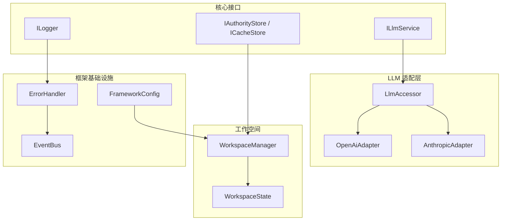
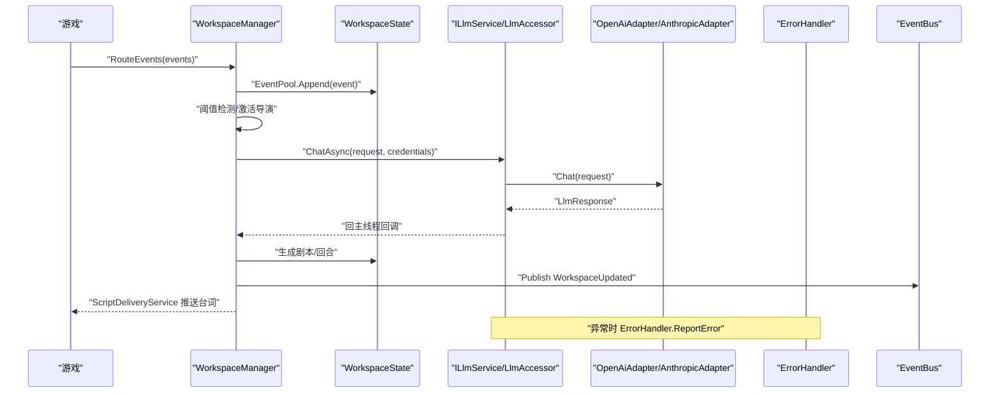
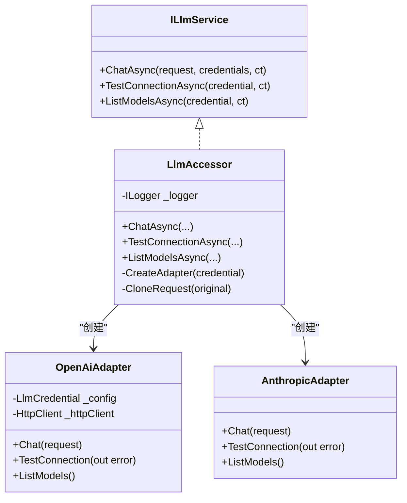
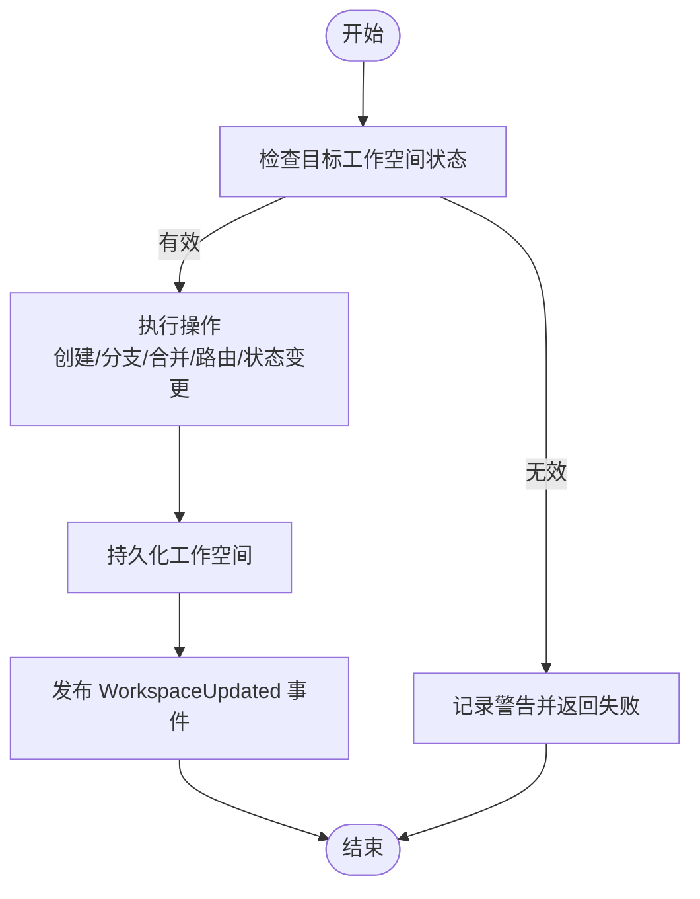
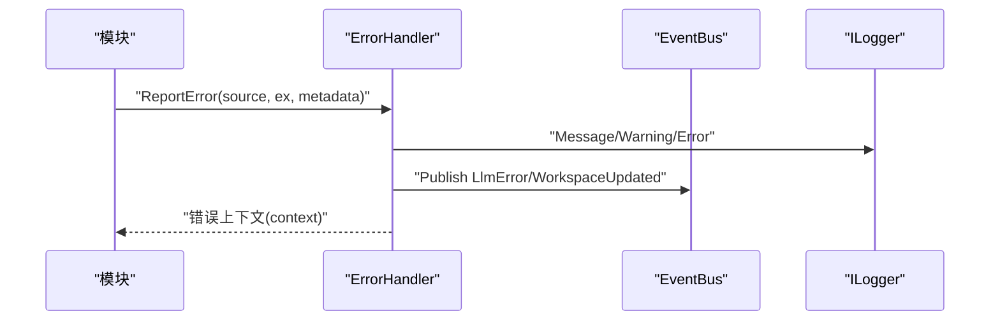
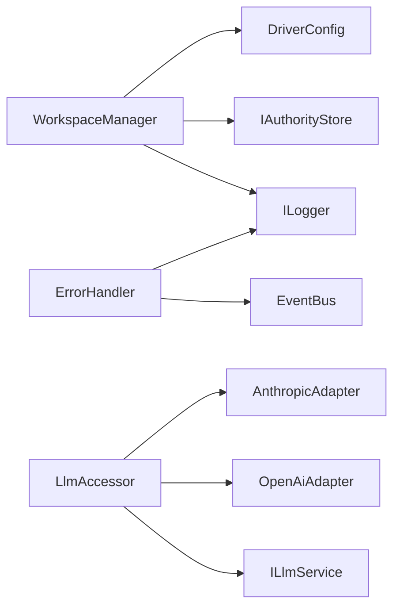
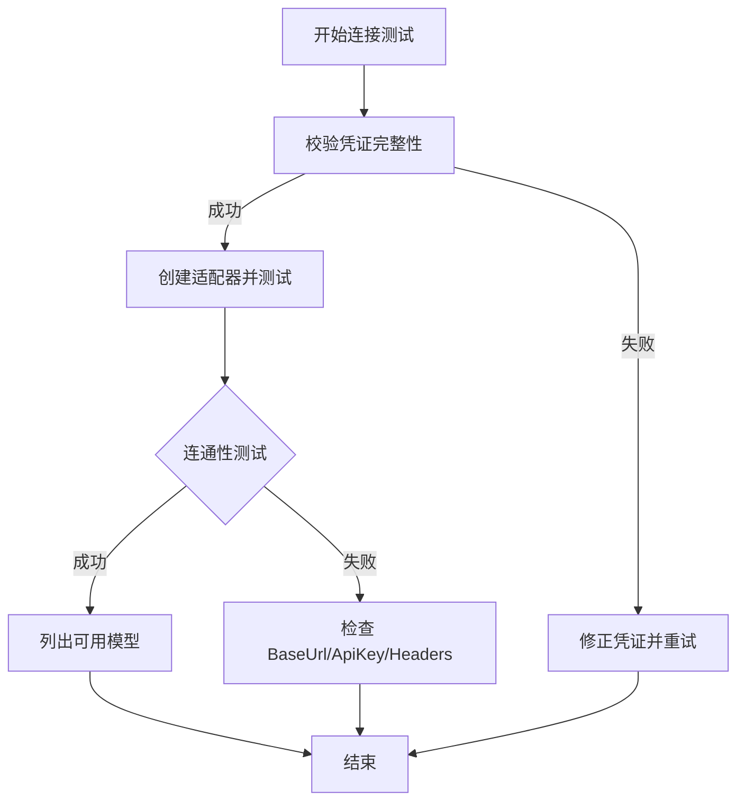

# 故障排除与FAQ

<cite>
**本文引用的文件**
- [README.md](file://README.md)
- [ILlmService.cs](file://src/NPCLife/Core/ILlmService.cs)
- [LlmAccessor.cs](file://src/NPCLife/Infrastructure/Llm/LlmAccessor.cs)
- [OpenAiAdapter.cs](file://src/NPCLife/Infrastructure/Llm/OpenAiAdapter.cs)
- [AnthropicAdapter.cs](file://src/NPCLife/Infrastructure/Llm/AnthropicAdapter.cs)
- [ErrorHandler.cs](file://src/NPCLife/Framework/ErrorHandler.cs)
- [EventBus.cs](file://src/NPCLife/Framework/EventBus.cs)
- [ILogger.cs](file://src/NPCLife/Framework/ILogger.cs)
- [WorkspaceManager.cs](file://src/NPCLife/Workspace/WorkspaceManager.cs)
- [WorkspaceState.cs](file://src/NPCLife/Workspace/WorkspaceState.cs)
- [FrameworkConfig.cs](file://src/NPCLife/Framework/FrameworkConfig.cs)
- [IStorage.cs](file://src/NPCLife/Core/IStorage.cs)
- [AgentLoop.cs](file://src/NPCLife/Agent/AgentLoop.cs)
- [McpSkillRegistry.cs](file://src/NPCLife/Framework/Mcp/McpSkillRegistry.cs)
- [LogTestBase.cs](file://tests/NPCLife.Tests/Helpers/LogTestBase.cs)
</cite>

## 目录
1. [简介](#简介)
2. [项目结构](#项目结构)
3. [核心组件](#核心组件)
4. [架构总览](#架构总览)
5. [详细组件分析](#详细组件分析)
6. [依赖分析](#依赖分析)
7. [性能考虑](#性能考虑)
8. [故障排除指南](#故障排除指南)
9. [结论](#结论)
10. [附录](#附录)

## 简介
本手册面向集成 NPCLife 的开发者与运维人员，聚焦系统崩溃与异常的诊断步骤、常见配置错误与解决方案、LLM 服务连接失败排查、工作空间状态异常修复、日志分析与错误定位技巧、性能下降识别与处理、网络与API限流应对策略，以及备份恢复与数据修复操作指南。文档基于仓库源码进行梳理，提供可操作的排障流程与FAQ。

## 项目结构
NPCLife 是一个以“工作空间（Workspace）”为中心的叙事中间件，围绕事件池、角色（导演/编剧/自由编剧）、MCP 工具与 LLM 服务协同工作。关键模块包括：
- 核心接口与服务：ILlmService、IStorage、ILogger、IEventLog 等
- LLM 适配层：OpenAI/Anthropic 适配器与统一访问器 LlmAccessor
- 工作空间管理层：WorkspaceManager、WorkspaceState
- 框架基础设施：ErrorHandler、EventBus、FrameworkConfig、MainThreadDispatcher
- MCP 工具与脚本：McpSkillRegistry、ScriptDeliveryService

图表来源
- [WorkspaceManager.cs:1-616](file://src/NPCLife/Workspace/WorkspaceManager.cs#L1-L616)
- [WorkspaceState.cs:1-152](file://src/NPCLife/Workspace/WorkspaceState.cs#L1-L152)
- [LlmAccessor.cs:1-331](file://src/NPCLife/Infrastructure/Llm/LlmAccessor.cs#L1-L331)
- [OpenAiAdapter.cs:1-392](file://src/NPCLife/Infrastructure/Llm/OpenAiAdapter.cs#L1-L392)
- [ErrorHandler.cs:1-207](file://src/NPCLife/Framework/ErrorHandler.cs#L1-L207)
- [EventBus.cs:1-243](file://src/NPCLife/Framework/EventBus.cs#L1-L243)
- [FrameworkConfig.cs:1-248](file://src/NPCLife/Framework/FrameworkConfig.cs#L1-L248)
- [IStorage.cs:1-53](file://src/NPCLife/Core/IStorage.cs#L1-L53)
- [ILogger.cs:1-20](file://src/NPCLife/Framework/ILogger.cs#L1-L20)
- [ILlmService.cs:1-51](file://src/NPCLife/Core/ILlmService.cs#L1-L51)

章节来源
- [README.md:1-93](file://README.md#L1-L93)

## 核心组件
- LLM 服务接口与访问器
  - ILlmService 定义统一的异步聊天、连通性测试与模型列表查询契约，支持多凭证回退
  - LlmAccessor 实现多凭证回退、主线程回调、适配器工厂与请求克隆
  - OpenAI/Anthropic 适配器负责 HTTP 请求构建、发送与响应解析
- 工作空间管理
  - WorkspaceManager 负责工作空间的创建、分支、合并、状态变更与持久化
  - WorkspaceState 描述工作空间状态、回合、标签、角色与事件缓存
- 错误与事件
  - ErrorHandler 提供全局错误钩子、诊断模式与请求链路追踪
  - EventBus 提供事件发布/订阅、错误隔离与优先级排序
- 配置与日志
  - FrameworkConfig 提供驱动参数、诊断开关与功能开关
  - ILogger 作为宿主注入的日志门面

章节来源
- [ILlmService.cs:1-51](file://src/NPCLife/Core/ILlmService.cs#L1-L51)
- [LlmAccessor.cs:1-331](file://src/NPCLife/Infrastructure/Llm/LlmAccessor.cs#L1-L331)
- [OpenAiAdapter.cs:1-392](file://src/NPCLife/Infrastructure/Llm/OpenAiAdapter.cs#L1-L392)
- [WorkspaceManager.cs:1-616](file://src/NPCLife/Workspace/WorkspaceManager.cs#L1-L616)
- [WorkspaceState.cs:1-152](file://src/NPCLife/Workspace/WorkspaceState.cs#L1-L152)
- [ErrorHandler.cs:1-207](file://src/NPCLife/Framework/ErrorHandler.cs#L1-L207)
- [EventBus.cs:1-243](file://src/NPCLife/Framework/EventBus.cs#L1-L243)
- [FrameworkConfig.cs:1-248](file://src/NPCLife/Framework/FrameworkConfig.cs#L1-L248)
- [ILogger.cs:1-20](file://src/NPCLife/Framework/ILogger.cs#L1-L20)

## 架构总览
NPCLife 的运行流程围绕“事件上报—阈值检测—导演激活—事件路由—编剧生成—台词输出—轮次归档”的闭环展开。其中 LLM 调用采用多凭证回退策略，工作空间状态通过权威存储持久化，错误与事件通过 ErrorHandler 与 EventBus 统一上报与追踪。

图表来源
- [WorkspaceManager.cs:382-392](file://src/NPCLife/Workspace/WorkspaceManager.cs#L382-L392)
- [LlmAccessor.cs:47-71](file://src/NPCLife/Infrastructure/Llm/LlmAccessor.cs#L47-L71)
- [OpenAiAdapter.cs:38-74](file://src/NPCLife/Infrastructure/Llm/OpenAiAdapter.cs#L38-L74)
- [ErrorHandler.cs:97-163](file://src/NPCLife/Framework/ErrorHandler.cs#L97-L163)
- [EventBus.cs:86-113](file://src/NPCLife/Framework/EventBus.cs#L86-L113)

## 详细组件分析

### LLM 服务与适配器
- 多凭证回退：LlmAccessor.ChatAsync 支持按顺序尝试多个凭证，失败自动切换，全部失败返回最后一个错误
- 主线程回调：后台线程执行 HTTP 调用，完成后通过 MainThreadDispatcher 回到主线程
- 适配器工厂：根据 ProviderType 创建对应适配器（OpenAI/Anthropic）
- OpenAI 适配器：构建请求、发送 HTTP、解析响应、记录日志与错误

图表来源
- [ILlmService.cs:17-51](file://src/NPCLife/Core/ILlmService.cs#L17-L51)
- [LlmAccessor.cs:26-331](file://src/NPCLife/Infrastructure/Llm/LlmAccessor.cs#L26-L331)
- [OpenAiAdapter.cs:18-392](file://src/NPCLife/Infrastructure/Llm/OpenAiAdapter.cs#L18-L392)
- [AnthropicAdapter.cs](file://src/NPCLife/Infrastructure/Llm/AnthropicAdapter.cs)

章节来源
- [LlmAccessor.cs:47-191](file://src/NPCLife/Infrastructure/Llm/LlmAccessor.cs#L47-L191)
- [OpenAiAdapter.cs:38-143](file://src/NPCLife/Infrastructure/Llm/OpenAiAdapter.cs#L38-L143)

### 工作空间管理与状态
- 状态机：Active/Suspended/Completed/Abandoned，存在有效状态转移约束
- 操作权限：Director 可分支/合并/关闭；Screenwriter/Free freelancer 可推进叙事
- 持久化：通过 IAuthorityStore 保存工作空间 JSON 数组，加载时反序列化并恢复
- 事件路由：将事件追加到目标工作空间的事件池

图表来源
- [WorkspaceManager.cs:165-187](file://src/NPCLife/Workspace/WorkspaceManager.cs#L165-L187)
- [WorkspaceManager.cs:429-457](file://src/NPCLife/Workspace/WorkspaceManager.cs#L429-L457)
- [WorkspaceState.cs:25-38](file://src/NPCLife/Workspace/WorkspaceState.cs#L25-L38)

章节来源
- [WorkspaceManager.cs:91-138](file://src/NPCLife/Workspace/WorkspaceManager.cs#L91-L138)
- [WorkspaceManager.cs:193-263](file://src/NPCLife/Workspace/WorkspaceManager.cs#L193-L263)
- [WorkspaceManager.cs:269-376](file://src/NPCLife/Workspace/WorkspaceManager.cs#L269-L376)
- [WorkspaceManager.cs:382-392](file://src/NPCLife/Workspace/WorkspaceManager.cs#L382-L392)
- [WorkspaceState.cs:94-150](file://src/NPCLife/Workspace/WorkspaceState.cs#L94-L150)

### 错误处理与事件总线
- ErrorHandler：统一错误钩子、诊断模式、请求链路追踪（BeginTrace/EndTrace）、错误上下文传播
- EventBus：事件发布/订阅、错误隔离、优先级排序、预定义事件名常量

图表来源
- [ErrorHandler.cs:97-163](file://src/NPCLife/Framework/ErrorHandler.cs#L97-L163)
- [EventBus.cs:86-113](file://src/NPCLife/Framework/EventBus.cs#L86-L113)
- [ILogger.cs:8-18](file://src/NPCLife/Framework/ILogger.cs#L8-L18)

章节来源
- [ErrorHandler.cs:22-207](file://src/NPCLife/Framework/ErrorHandler.cs#L22-L207)
- [EventBus.cs:17-243](file://src/NPCLife/Framework/EventBus.cs#L17-L243)

## 依赖分析
- 组件耦合
  - WorkspaceManager 依赖 IAuthorityStore、ILogger、DriverConfig、ICardSerializer
  - LlmAccessor 依赖 ILlmApiProvider（OpenAI/Anthropic）、ILogger、MainThreadDispatcher
  - ErrorHandler 与 EventBus 为全局静态组件，零外部依赖
- 外部依赖
  - HTTP 客户端（HttpClient）用于 OpenAI/兼容 API
  - 存储接口（IAuthorityStore/ICacheStore）由宿主实现

图表来源
- [WorkspaceManager.cs:31-40](file://src/NPCLife/Workspace/WorkspaceManager.cs#L31-L40)
- [LlmAccessor.cs:26-36](file://src/NPCLife/Infrastructure/Llm/LlmAccessor.cs#L26-L36)
- [ErrorHandler.cs:22-32](file://src/NPCLife/Framework/ErrorHandler.cs#L22-L32)
- [EventBus.cs:17-32](file://src/NPCLife/Framework/EventBus.cs#L17-L32)

章节来源
- [WorkspaceManager.cs:19-40](file://src/NPCLife/Workspace/WorkspaceManager.cs#L19-L40)
- [LlmAccessor.cs:26-36](file://src/NPCLife/Infrastructure/Llm/LlmAccessor.cs#L26-L36)
- [IStorage.cs:10-53](file://src/NPCLife/Core/IStorage.cs#L10-L53)

## 性能考虑
- 事件阈值触发：通过累计事件数量与重要度阈值控制 LLM 调用频率，降低 API 成本与延迟
- 异步与回退：LLM 调用在后台线程执行，完成后回到主线程；多凭证回退减少单点故障影响
- 日志与追踪：诊断模式与事件追踪可帮助定位热点与瓶颈，但需谨慎开启以避免性能损耗
- 工作空间并发：WorkspaceManager 使用 ReaderWriterLockSlim 保护工作空间列表，注意高并发下的锁竞争

章节来源
- [README.md:50-53](file://README.md#L50-L53)
- [LlmAccessor.cs:47-71](file://src/NPCLife/Infrastructure/Llm/LlmAccessor.cs#L47-L71)
- [FrameworkConfig.cs:211-246](file://src/NPCLife/Framework/FrameworkConfig.cs#L211-L246)
- [WorkspaceManager.cs:21-28](file://src/NPCLife/Workspace/WorkspaceManager.cs#L21-L28)

## 故障排除指南

### 一、系统崩溃与异常诊断步骤
1. 启用诊断模式
   - 设置 FrameworkConfig.Diagnostics.EnableVerboseLogging 为 true，捕获更详细日志
   - 可选：开启工具调用与事件追踪，便于回放链路
2. 识别错误来源
   - 通过 ErrorHandler.ReportError 的 Source 字段定位模块（如 AgentLoop、LlmAccessor、McpTool）
   - 查看 CurrentTraceId 关联请求链路，结合 EventBus 事件名定位阶段
3. 检查全局错误处理器
   - 确认已注册错误处理器，避免异常被吞没
   - 检查处理器内部异常是否影响其他处理器执行
4. 回放关键路径
   - 使用 LogTestBase 风格的结构化日志输出，逐步打印关键变量与状态
   - 对复杂流程使用一次性聚合输出，便于整体审查

章节来源
- [FrameworkConfig.cs:211-224](file://src/NPCLife/Framework/FrameworkConfig.cs#L211-L224)
- [ErrorHandler.cs:42-71](file://src/NPCLife/Framework/ErrorHandler.cs#L42-L71)
- [ErrorHandler.cs:97-163](file://src/NPCLife/Framework/ErrorHandler.cs#L97-L163)
- [EventBus.cs:86-113](file://src/NPCLife/Framework/EventBus.cs#L86-L113)
- [LogTestBase.cs:18-154](file://tests/NPCLife.Tests/Helpers/LogTestBase.cs#L18-L154)

### 二、常见配置错误与解决方案
- 驱动参数校验失败
  - 现象：初始化时报错，提示阈值或容量不合法
  - 处理：确保 Driver.DirectorCountThreshold、DirectorImportanceThreshold、RecentHistoryCapacity、MaxAgentRounds 等参数满足范围要求
- 诊断开关配置不当
  - 现象：日志过多或过少
  - 处理：根据需要开启/关闭 EnableVerboseLogging、EnableToolCallTracing、EnableEventTracing
- 功能开关冲突
  - 现象：某些功能未生效或出现异常
  - 处理：检查 Features 下各开关组合，必要时冻结配置后重启

章节来源
- [FrameworkConfig.cs:56-75](file://src/NPCLife/Framework/FrameworkConfig.cs#L56-L75)
- [FrameworkConfig.cs:211-246](file://src/NPCLife/Framework/FrameworkConfig.cs#L211-L246)

### 三、LLM 服务连接失败排查
1. 连通性测试
   - 使用 ILlmService.TestConnectionAsync 验证凭证完整性与 API 可达性
   - 若失败，检查 BaseUrl、ApiKey、ExtraHeaders 是否正确
2. 多凭证回退
   - 确保 credentials 列表至少包含一个有效凭证
   - 查看回退日志，确认失败原因（网络、认证、模型不支持等）
3. 适配器细节
   - OpenAI 适配器会记录请求 JSON 与响应状态，便于定位问题
   - 注意超时与 HTTP 状态码，必要时调整超时时间
4. 事件与错误上报
   - LLM 错误通过 EventBus.Publish(FrameworkEvents.LlmError) 上报，可在处理器中捕获并记录

图表来源
- [ILlmService.cs:39-39](file://src/NPCLife/Core/ILlmService.cs#L39-L39)
- [LlmAccessor.cs:196-240](file://src/NPCLife/Infrastructure/Llm/LlmAccessor.cs#L196-L240)
- [OpenAiAdapter.cs:79-112](file://src/NPCLife/Infrastructure/Llm/OpenAiAdapter.cs#L79-L112)

章节来源
- [ILlmService.cs:39-48](file://src/NPCLife/Core/ILlmService.cs#L39-L48)
- [LlmAccessor.cs:196-281](file://src/NPCLife/Infrastructure/Llm/LlmAccessor.cs#L196-L281)
- [OpenAiAdapter.cs:79-143](file://src/NPCLife/Infrastructure/Llm/OpenAiAdapter.cs#L79-L143)

### 四、工作空间状态异常修复流程
1. 状态机校验
   - 检查状态转移是否符合约束（Active/Suspended 可转 Completed/Abandoned；Completed/Abandoned 不可逆）
   - 若发现非法状态，记录警告并回滚或重建
2. 分支/合并一致性
   - 确认合并时的轮次序号不重复，合并来源列表正确
   - 检查角色与标签合并逻辑是否覆盖所有分支
3. 持久化与恢复
   - 加载失败时记录警告，检查存储键与 JSON 格式
   - 如需修复，手动清理或重建对应工作空间 JSON
4. 事件路由与阈值
   - 确认事件已正确路由至目标工作空间且处于 Active 状态
   - 检查阈值配置是否导致事件未触发处理

章节来源
- [WorkspaceManager.cs:165-187](file://src/NPCLife/Workspace/WorkspaceManager.cs#L165-L187)
- [WorkspaceManager.cs:269-376](file://src/NPCLife/Workspace/WorkspaceManager.cs#L269-L376)
- [WorkspaceManager.cs:429-457](file://src/NPCLife/Workspace/WorkspaceManager.cs#L429-L457)
- [WorkspaceState.cs:25-53](file://src/NPCLife/Workspace/WorkspaceState.cs#L25-L53)

### 五、日志分析与错误定位技巧
- 使用 ErrorHandler.BeginTrace()/EndTrace() 包裹关键流程，生成 TraceId 串联请求链
- 通过 EventBus 订阅预定义事件（如 LlmError、WorkspaceUpdated、ScriptLineReady）捕获系统状态变化
- ILogger 的 Message/Warning/Error 用于分级输出，建议在诊断模式下开启详细日志
- 对复杂流程使用结构化日志输出，逐步缩小问题范围

章节来源
- [ErrorHandler.cs:55-71](file://src/NPCLife/Framework/ErrorHandler.cs#L55-L71)
- [EventBus.cs:186-241](file://src/NPCLife/Framework/EventBus.cs#L186-L241)
- [ILogger.cs:10-17](file://src/NPCLife/Framework/ILogger.cs#L10-L17)
- [LogTestBase.cs:28-99](file://tests/NPCLife.Tests/Helpers/LogTestBase.cs#L28-L99)

### 六、性能下降识别与处理
- 识别热点
  - 开启 EnableToolCallTracing 与 EnableEventTracing，观察高频事件与工具调用
  - 检查事件阈值是否过于敏感，导致频繁触发 LLM
- 优化策略
  - 调整 Driver 阈值参数，平衡生成质量与调用频率
  - 合理使用多凭证回退，避免过多失败尝试
  - 控制日志级别与详细日志开关，减少 IO 压力
- 监控指标
  - 使用运行时度量（EnableRuntimeMetrics）统计 Token 消耗与工具频率

章节来源
- [FrameworkConfig.cs:211-246](file://src/NPCLife/Framework/FrameworkConfig.cs#L211-L246)
- [README.md:50-53](file://README.md#L50-L53)

### 七、网络问题与API限流应对策略
- 网络异常
  - OpenAI 适配器捕获 HttpRequestException 与 TaskCanceledException，返回明确错误
  - 建议增加重试与退避策略（在上层封装），避免瞬时网络波动影响
- API 限流
  - 通过多凭证回退分散压力
  - 调整阈值与轮次上限，减少单位时间请求量
  - 监控响应中的错误信息与 HTTP 状态码，及时调整策略

章节来源
- [OpenAiAdapter.cs:62-73](file://src/NPCLife/Infrastructure/Llm/OpenAiAdapter.cs#L62-L73)
- [LlmAccessor.cs:114-191](file://src/NPCLife/Infrastructure/Llm/LlmAccessor.cs#L114-L191)

### 八、备份恢复与数据修复
- 备份
  - 通过 IAuthorityStore.Store 将工作空间 JSON 数组持久化到安全位置
- 恢复
  - 使用 WorkspaceManager.LoadFromStore 从存储恢复工作空间
  - 如 JSON 损坏，记录警告并尝试修复或重建
- 数据修复
  - 对于状态异常的工作空间，可通过状态变更接口回滚或重建
  - 合并/分支逻辑修复：检查轮次序号与来源列表，确保不重复与完整性

章节来源
- [IStorage.cs:10-23](file://src/NPCLife/Core/IStorage.cs#L10-L23)
- [WorkspaceManager.cs:50-74](file://src/NPCLife/Workspace/WorkspaceManager.cs#L50-L74)
- [WorkspaceManager.cs:429-457](file://src/NPCLife/Workspace/WorkspaceManager.cs#L429-L457)

### 九、常见问题与解答（FAQ）
- Q: 为什么 LLM 调用总是失败？
  - A: 检查凭证完整性与 API 可达性，使用 TestConnectionAsync 进行连通性测试；查看适配器日志与错误信息
- Q: 工作空间无法推进？
  - A: 确认工作空间状态为 Active；检查事件是否正确路由；核对阈值配置
- Q: 系统日志太多/太少怎么办？
  - A: 调整 FrameworkConfig.Diagnostics 的开关与日志级别
- Q: 如何定位异常来源？
  - A: 启用诊断模式与请求链路追踪，结合 ErrorHandler 与 EventBus 事件进行定位
- Q: API 限流如何应对？
  - A: 通过多凭证回退与阈值调整降低请求频率；监控错误信息并优化策略

章节来源
- [ILlmService.cs:39-48](file://src/NPCLife/Core/ILlmService.cs#L39-L48)
- [WorkspaceManager.cs:382-392](file://src/NPCLife/Workspace/WorkspaceManager.cs#L382-L392)
- [FrameworkConfig.cs:211-224](file://src/NPCLife/Framework/FrameworkConfig.cs#L211-L224)
- [ErrorHandler.cs:42-71](file://src/NPCLife/Framework/ErrorHandler.cs#L42-L71)
- [EventBus.cs:186-241](file://src/NPCLife/Framework/EventBus.cs#L186-L241)

## 结论
本手册提供了从配置、LLM 连接、工作空间状态到日志与性能的全栈排障指南。建议在开发与运维实践中：
- 始终启用诊断模式与事件追踪，建立标准化的错误上报与回放流程
- 合理配置阈值与功能开关，平衡生成质量与系统性能
- 通过多凭证回退与限流策略提升鲁棒性
- 建立完善的备份与恢复机制，保障数据安全

## 附录
- 关键接口与契约
  - ILlmService：统一 LLM 调用契约
  - IAuthorityStore/ICacheStore：权威与缓存存储抽象
  - ILogger：日志门面
- 预定义事件
  - LlmError、WorkspaceCreated/Closed/Updated、ScriptLineReady/Ready 等

章节来源
- [ILlmService.cs:17-51](file://src/NPCLife/Core/ILlmService.cs#L17-L51)
- [IStorage.cs:10-53](file://src/NPCLife/Core/IStorage.cs#L10-L53)
- [ILogger.cs:8-18](file://src/NPCLife/Framework/ILogger.cs#L8-L18)
- [EventBus.cs:186-241](file://src/NPCLife/Framework/EventBus.cs#L186-L241)