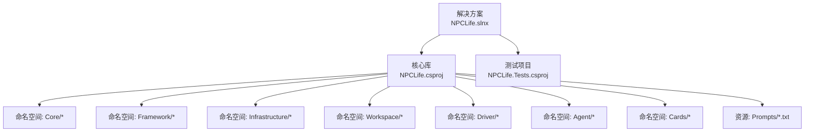
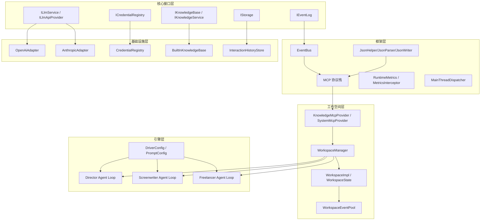
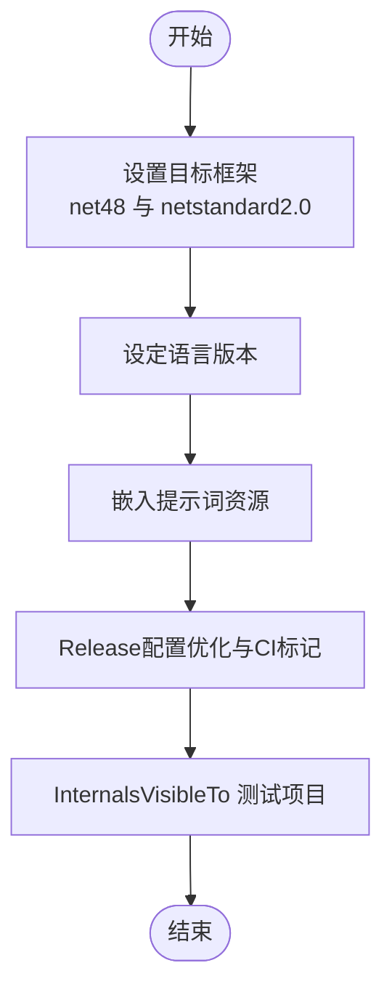
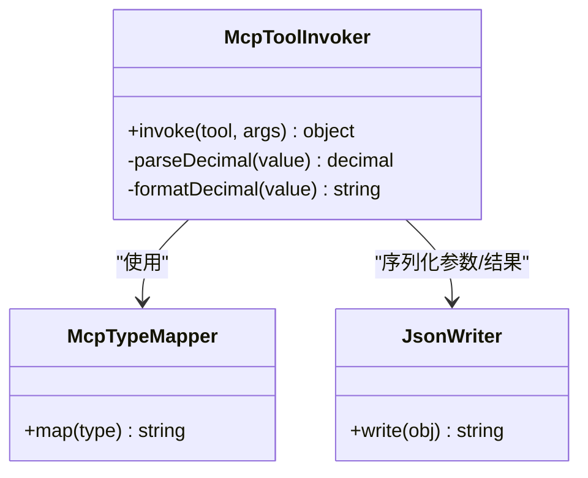
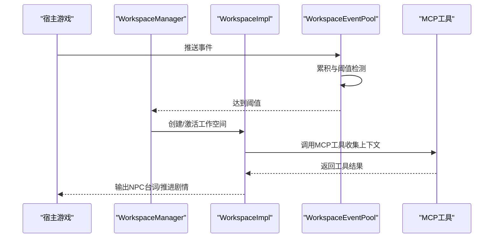
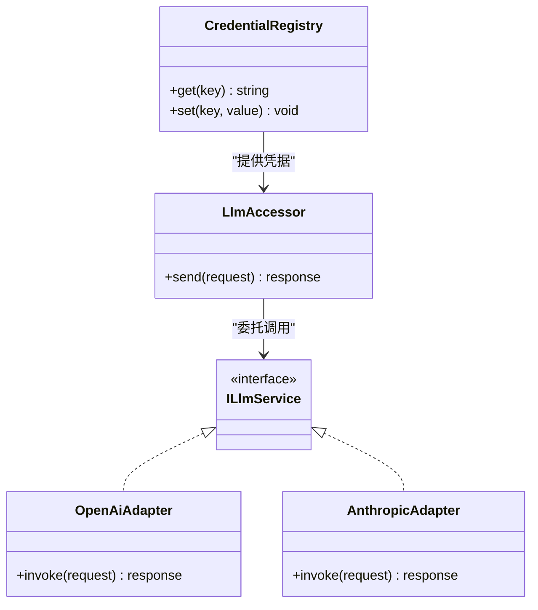
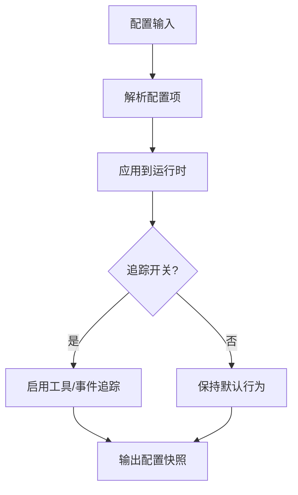
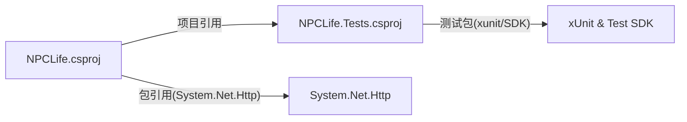

# 构建与部署

<cite>
**本文引用的文件**
- [README.md](file://README.md)
- [NPCLife.csproj](file://src/NPCLife/NPCLife.csproj)
- [NPCLife.Tests.csproj](file://tests/NPCLife.Tests/NPCLife.Tests.csproj)
- [NPCLife.slnx](file://NPCLife.slnx)
- [FrameworkConfig.cs](file://src/NPCLife/Framework/FrameworkConfig.cs)
- [JsonWriter.cs](file://src/NPCLife/Framework/JsonWriter.cs)
- [McpToolInvoker.cs](file://src/NPCLife/Framework/Mcp/McpToolInvoker.cs)
- [McpTypeMapper.cs](file://src/NPCLife/Framework/Mcp/McpTypeMapper.cs)
- [JsonHelper.cs](file://src/NPCLife/Framework/JsonHelper.cs)
- [JsonParser.cs](file://src/NPCLife/Framework/JsonParser.cs)
- [AnthropicAdapter.cs](file://src/NPCLife/Infrastructure/Llm/AnthropicAdapter.cs)
- [OpenAiAdapter.cs](file://src/NPCLife/Infrastructure/Llm/OpenAiAdapter.cs)
- [LlmAccessor.cs](file://src/NPCLife/Infrastructure/Llm/LlmAccessor.cs)
- [CredentialRegistry.cs](file://src/NPCLife/Infrastructure/Llm/CredentialRegistry.cs)
- [BuiltInKnowledgeBase.cs](file://src/NPCLife/Infrastructure/Knowledge/BuiltInKnowledgeBase.cs)
- [WorkspaceManager.cs](file://src/NPCLife/Workspace/WorkspaceManager.cs)
- [WorkspaceImpl.cs](file://src/NPCLife/Workspace/WorkspaceImpl.cs)
- [WorkspaceState.cs](file://src/NPCLife/Workspace/WorkspaceState.cs)
- [WorkspaceEventPool.cs](file://src/NPCLife/Workspace/WorkspaceEventPool.cs)
- [DirectionMcpTools.cs](file://src/NPCLife/Workspace/DirectionMcpTools.cs)
- [WritingMcpTools.cs](file://src/NPCLife/Workspace/WritingMcpTools.cs)
- [FreelancerMcpTools.cs](file://src/NPCLife/Workspace/FreelancerMcpTools.cs)
- [KnowledgeMcpProvider.cs](file://src/NPCLife/Infrastructure/Mcp/KnowledgeMcpProvider.cs)
- [SystemMcpProvider.cs](file://src/NPCLife/Infrastructure/Mcp/SystemMcpProvider.cs)
- [AgentLoop.cs](file://src/NPCLife/Agent/AgentLoop.cs)
- [DriverConfig.cs](file://src/NPCLife/Driver/DriverConfig.cs)
- [PromptConfig.cs](file://src/NPCLife/Driver/PromptConfig.cs)
- [DirectorPrompt.txt](file://src/NPCLife/Prompts/DirectorPrompt.txt)
- [FreelancerPrompt.txt](file://src/NPCLife/Prompts/FreelancerPrompt.txt)
- [ScreenwriterPrompt.txt](file://src/NPCLife/Prompts/ScreenwriterPrompt.txt)
</cite>

## 目录
1. [简介](#简介)
2. [项目结构](#项目结构)
3. [核心组件](#核心组件)
4. [架构总览](#架构总览)
5. [详细组件分析](#详细组件分析)
6. [依赖分析](#依赖分析)
7. [性能考虑](#性能考虑)
8. [故障排查指南](#故障排查指南)
9. [结论](#结论)
10. [附录](#附录)

## 简介
本指南面向NPCLife项目的构建与部署，覆盖以下主题：
- C#项目的编译配置与目标框架兼容性（.NET Framework 4.8 与 .NET Standard 2.0）
- 依赖管理与NuGet包策略
- 本地开发环境搭建
- CI/CD流水线配置思路
- Docker容器化部署方案
- 生产环境部署清单与配置模板
- 热更新与版本回滚策略

## 项目结构
NPCLife采用多项目解决方案组织，核心库位于src/NPCLife，测试项目位于tests/NPCLife.Tests。项目使用SDK风格的MSBuild工程文件，支持多目标框架。

**图表来源**
- [NPCLife.slnx](file://NPCLife.slnx)
- [NPCLife.csproj](file://src/NPCLife/NPCLife.csproj)

**章节来源**
- [NPCLife.slnx](file://NPCLife.slnx)
- [NPCLife.csproj](file://src/NPCLife/NPCLife.csproj)
- [NPCLife.Tests.csproj](file://tests/NPCLife.Tests/NPCLife.Tests.csproj)

## 核心组件
- 多目标框架：同时支持 .NET Framework 4.8 与 .NET Standard 2.0，确保在传统桌面应用与跨平台库中均可使用。
- 关键依赖：系统HTTP客户端包，用于网络请求；测试框架（xUnit及相关运行器）。
- 测试项目：针对核心库进行单元测试，便于持续集成与质量保障。
- 资源嵌入：提示词文本资源以嵌入式资源形式随库发布，简化运行时部署。

**章节来源**
- [NPCLife.csproj](file://src/NPCLife/NPCLife.csproj)
- [NPCLife.Tests.csproj](file://tests/NPCLife.Tests/NPCLife.Tests.csproj)

## 架构总览
NPCLife采用“工作空间驱动”的多智能体叙事管线，核心模块包括：
- 核心接口层：事件、知识、存储、日志、LLM服务等抽象
- 框架层：事件总线、JSON序列化、MCP协议、指标与拦截器、主线程调度等
- 基础设施层：LLM适配器（OpenAI/Anthropic）、凭证注册、内置知识库、交互历史存储
- 工作空间层：工作空间管理、事件池、状态机、MCP工具提供者
- 引擎层：导演/编剧/自由职业者代理循环与驱动配置

**图表来源**
- [FrameworkConfig.cs](file://src/NPCLife/Framework/FrameworkConfig.cs)
- [JsonHelper.cs](file://src/NPCLife/Framework/JsonHelper.cs)
- [JsonParser.cs](file://src/NPCLife/Framework/JsonParser.cs)
- [JsonWriter.cs](file://src/NPCLife/Framework/JsonWriter.cs)
- [McpToolInvoker.cs](file://src/NPCLife/Framework/Mcp/McpToolInvoker.cs)
- [McpTypeMapper.cs](file://src/NPCLife/Framework/Mcp/McpTypeMapper.cs)
- [OpenAiAdapter.cs](file://src/NPCLife/Infrastructure/Llm/OpenAiAdapter.cs)
- [AnthropicAdapter.cs](file://src/NPCLife/Infrastructure/Llm/AnthropicAdapter.cs)
- [CredentialRegistry.cs](file://src/NPCLife/Infrastructure/Llm/CredentialRegistry.cs)
- [BuiltInKnowledgeBase.cs](file://src/NPCLife/Infrastructure/Knowledge/BuiltInKnowledgeBase.cs)
- [WorkspaceManager.cs](file://src/NPCLife/Workspace/WorkspaceManager.cs)
- [WorkspaceImpl.cs](file://src/NPCLife/Workspace/WorkspaceImpl.cs)
- [WorkspaceState.cs](file://src/NPCLife/Workspace/WorkspaceState.cs)
- [WorkspaceEventPool.cs](file://src/NPCLife/Workspace/WorkspaceEventPool.cs)
- [KnowledgeMcpProvider.cs](file://src/NPCLife/Infrastructure/Mcp/KnowledgeMcpProvider.cs)
- [SystemMcpProvider.cs](file://src/NPCLife/Infrastructure/Mcp/SystemMcpProvider.cs)
- [AgentLoop.cs](file://src/NPCLife/Agent/AgentLoop.cs)
- [DriverConfig.cs](file://src/NPCLife/Driver/DriverConfig.cs)
- [PromptConfig.cs](file://src/NPCLife/Driver/PromptConfig.cs)

## 详细组件分析

### 组件A：多目标框架与编译配置
- 目标框架：同时声明 net48 与 netstandard2.0，确保在传统桌面应用与跨平台库中可用。
- 语言版本：启用较新的语言特性，提升开发效率与代码表达力。
- 发布优化：Release配置开启优化与CI标记，利于自动化构建与打包。
- 资源嵌入：提示词文本作为嵌入式资源，减少运行时依赖。
- 测试可见性：通过InternalsVisibleTo允许测试项目访问内部成员，便于测试覆盖。

**图表来源**
- [NPCLife.csproj](file://src/NPCLife/NPCLife.csproj)

**章节来源**
- [NPCLife.csproj](file://src/NPCLife/NPCLife.csproj)

### 组件B：MCP协议与类型映射
- 类型映射：对浮点与十进制类型的序列化/反序列化采用文化无关格式，保证跨平台一致性。
- 工具调用：参数解析与返回值转换遵循协议约定，确保与外部工具链稳定交互。
- JSON写入：基于StringBuilder的高性能写入器，支持容量预估，降低内存分配。

**图表来源**
- [McpTypeMapper.cs](file://src/NPCLife/Framework/Mcp/McpTypeMapper.cs)
- [McpToolInvoker.cs](file://src/NPCLife/Framework/Mcp/McpToolInvoker.cs)
- [JsonWriter.cs](file://src/NPCLife/Framework/JsonWriter.cs)

**章节来源**
- [McpTypeMapper.cs](file://src/NPCLife/Framework/Mcp/McpTypeMapper.cs)
- [McpToolInvoker.cs](file://src/NPCLife/Framework/Mcp/McpToolInvoker.cs)
- [JsonWriter.cs](file://src/NPCLife/Framework/JsonWriter.cs)

### 组件C：工作空间与事件池
- 工作空间管理：统一创建、挂起、恢复、合并与关闭工作空间，维护独立事件池与状态。
- 事件池：按阈值触发AI处理，避免频繁调用LLM，控制成本与延迟。
- MCP工具：为不同角色提供专用工具集，增强叙事生成能力。

**图表来源**
- [WorkspaceManager.cs](file://src/NPCLife/Workspace/WorkspaceManager.cs)
- [WorkspaceImpl.cs](file://src/NPCLife/Workspace/WorkspaceImpl.cs)
- [WorkspaceEventPool.cs](file://src/NPCLife/Workspace/WorkspaceEventPool.cs)
- [DirectionMcpTools.cs](file://src/NPCLife/Workspace/DirectionMcpTools.cs)
- [WritingMcpTools.cs](file://src/NPCLife/Workspace/WritingMcpTools.cs)
- [FreelancerMcpTools.cs](file://src/NPCLife/Workspace/FreelancerMcpTools.cs)

**章节来源**
- [WorkspaceManager.cs](file://src/NPCLife/Workspace/WorkspaceManager.cs)
- [WorkspaceImpl.cs](file://src/NPCLife/Workspace/WorkspaceImpl.cs)
- [WorkspaceState.cs](file://src/NPCLife/Workspace/WorkspaceState.cs)
- [WorkspaceEventPool.cs](file://src/NPCLife/Workspace/WorkspaceEventPool.cs)
- [DirectionMcpTools.cs](file://src/NPCLife/Workspace/DirectionMcpTools.cs)
- [WritingMcpTools.cs](file://src/NPCLife/Workspace/WritingMcpTools.cs)
- [FreelancerMcpTools.cs](file://src/NPCLife/Workspace/FreelancerMcpTools.cs)

### 组件D：LLM适配与凭证管理
- 适配器模式：分别封装OpenAI与Anthropic的API差异，统一对外接口。
- 凭证注册：集中管理API密钥与凭据，支持运行时更新。
- 访问器：统一LLM调用入口，便于监控与限流。

**图表来源**
- [OpenAiAdapter.cs](file://src/NPCLife/Infrastructure/Llm/OpenAiAdapter.cs)
- [AnthropicAdapter.cs](file://src/NPCLife/Infrastructure/Llm/AnthropicAdapter.cs)
- [CredentialRegistry.cs](file://src/NPCLife/Infrastructure/Llm/CredentialRegistry.cs)
- [LlmAccessor.cs](file://src/NPCLife/Infrastructure/Llm/LlmAccessor.cs)

**章节来源**
- [OpenAiAdapter.cs](file://src/NPCLife/Infrastructure/Llm/OpenAiAdapter.cs)
- [AnthropicAdapter.cs](file://src/NPCLife/Infrastructure/Llm/AnthropicAdapter.cs)
- [CredentialRegistry.cs](file://src/NPCLife/Infrastructure/Llm/CredentialRegistry.cs)
- [LlmAccessor.cs](file://src/NPCLife/Infrastructure/Llm/LlmAccessor.cs)

### 组件E：配置与诊断
- 运行时配置：通过配置对象与字典映射，支持运行时调整最近历史容量、工具调用追踪与事件追踪开关。
- 诊断开关：在Release构建中启用连续集成标记，便于发布渠道识别。

**图表来源**
- [FrameworkConfig.cs](file://src/NPCLife/Framework/FrameworkConfig.cs)
- [NPCLife.csproj](file://src/NPCLife/NPCLife.csproj)

**章节来源**
- [FrameworkConfig.cs](file://src/NPCLife/Framework/FrameworkConfig.cs)
- [NPCLife.csproj](file://src/NPCLife/NPCLife.csproj)

## 依赖分析
- 直接依赖：系统HTTP客户端包，满足网络请求需求。
- 测试依赖：xUnit测试框架与Visual Studio运行器，配合.NET Test SDK。
- 项目依赖：测试项目引用核心库，形成单向依赖。

**图表来源**
- [NPCLife.csproj](file://src/NPCLife/NPCLife.csproj)
- [NPCLife.Tests.csproj](file://tests/NPCLife.Tests/NPCLife.Tests.csproj)

**章节来源**
- [NPCLife.csproj](file://src/NPCLife/NPCLife.csproj)
- [NPCLife.Tests.csproj](file://tests/NPCLife.Tests/NPCLife.Tests.csproj)

## 性能考虑
- 事件阈值触发：通过累积事件与重要度阈值，降低LLM调用频率，控制成本与延迟。
- 文化无关序列化：十进制与浮点数采用文化无关格式，避免跨区域解析问题。
- 高效JSON写入：预估容量的StringBuilder写入器，减少内存分配与GC压力。
- 运行时指标：内置指标拦截器与运行时指标收集，便于性能观测与优化。

## 故障排查指南
- 配置校验：检查最近历史容量与追踪开关的配置边界，确保数值有效。
- 类型映射异常：确认十进制/浮点数转换路径，避免格式解析错误。
- LLM适配器：核对凭证注册与访问器调用链路，确保凭据正确加载。
- 工作空间状态：验证事件池阈值与工作空间生命周期管理，防止状态错乱。

**章节来源**
- [FrameworkConfig.cs](file://src/NPCLife/Framework/FrameworkConfig.cs)
- [McpToolInvoker.cs](file://src/NPCLife/Framework/Mcp/McpToolInvoker.cs)
- [McpTypeMapper.cs](file://src/NPCLife/Framework/Mcp/McpTypeMapper.cs)
- [LlmAccessor.cs](file://src/NPCLife/Infrastructure/Llm/LlmAccessor.cs)
- [WorkspaceState.cs](file://src/NPCLife/Workspace/WorkspaceState.cs)

## 结论
NPCLife通过多目标框架、清晰的模块划分与稳健的MCP协议，提供了可在多种环境中使用的叙事中间件。结合合理的阈值触发、序列化策略与运行时配置，能够在保证性能的同时提供灵活的扩展能力。建议在生产环境中配合CI/CD与容器化部署，确保版本可控与快速回滚。

## 附录

### 本地开发环境搭建步骤
- 安装.NET SDK：支持 .NET Framework 4.8 与 .NET Standard 2.0 的编译环境
- 克隆仓库并打开解决方案
- 还原NuGet包并构建项目
- 运行测试项目验证功能
- 配置LLM适配器与凭证注册，准备提示词资源

**章节来源**
- [NPCLife.slnx](file://NPCLife.slnx)
- [NPCLife.csproj](file://src/NPCLife/NPCLife.csproj)
- [NPCLife.Tests.csproj](file://tests/NPCLife.Tests/NPCLife.Tests.csproj)

### CI/CD流水线配置方法
- 触发条件：主分支保护、PR合并、标签发布
- 步骤建议：
  - 还原依赖
  - 构建多目标框架
  - 运行单元测试
  - 打包发布工件
  - 生成NuGet包（已启用）
  - 可选：上传覆盖率报告
- 版本控制：使用语义化版本号与Git标签

**章节来源**
- [NPCLife.csproj](file://src/NPCLife/NPCLife.csproj)

### Docker容器化部署方案
- 基础镜像：选择包含所需.NET运行时的官方基础镜像
- 构建阶段：在CI中构建并生成可执行或库产物
- 运行阶段：挂载配置文件与日志目录，暴露必要端口（如需HTTP服务）
- 健康检查：添加健康检查探针，确保服务可用
- 安全：最小权限原则，禁用不必要的服务

[本节为概念性指导，不直接分析具体文件]

### 生产环境部署清单与配置模板
- 部署清单要点：
  - 目标框架匹配（net48 或 netstandard2.0）
  - LLM凭据安全存储与轮换
  - 日志适配器接入企业日志系统
  - 存储适配器连接参数
  - 运行时配置文件（最近历史容量、追踪开关）
- 配置模板字段：
  - 最近历史容量
  - 工具调用追踪开关
  - 事件追踪开关
  - LLM提供商与端点
  - 凭证标识符

**章节来源**
- [FrameworkConfig.cs](file://src/NPCLife/Framework/FrameworkConfig.cs)
- [DriverConfig.cs](file://src/NPCLife/Driver/DriverConfig.cs)
- [PromptConfig.cs](file://src/NPCLife/Driver/PromptConfig.cs)

### 热更新与版本回滚策略
- 热更新：优先通过配置热更新（运行时配置、追踪开关）与凭据轮换来实现无停机变更；库升级建议通过CI/CD流水线进行灰度发布。
- 回滚策略：保留上一版本的容器镜像与NuGet包；回滚时恢复配置与镜像版本，验证关键路径后再扩大范围。

[本节为通用实践指导，不直接分析具体文件]