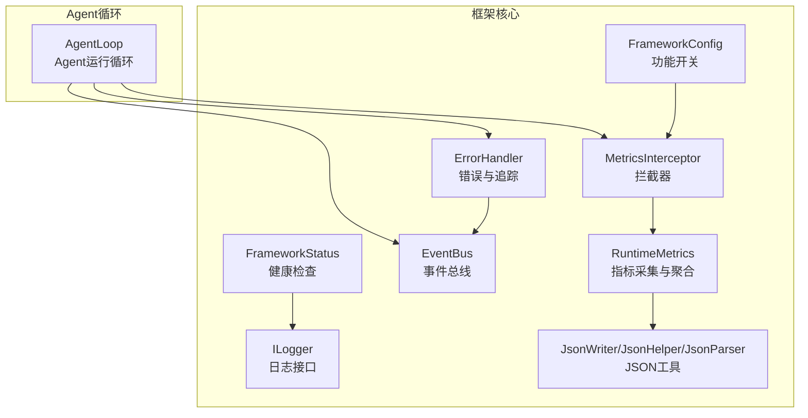
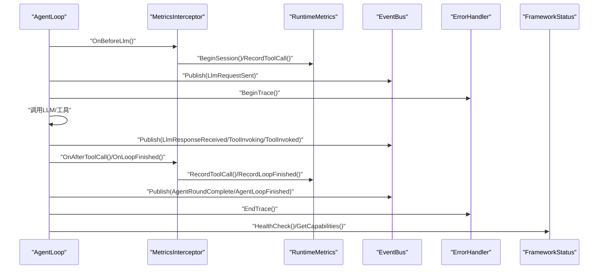
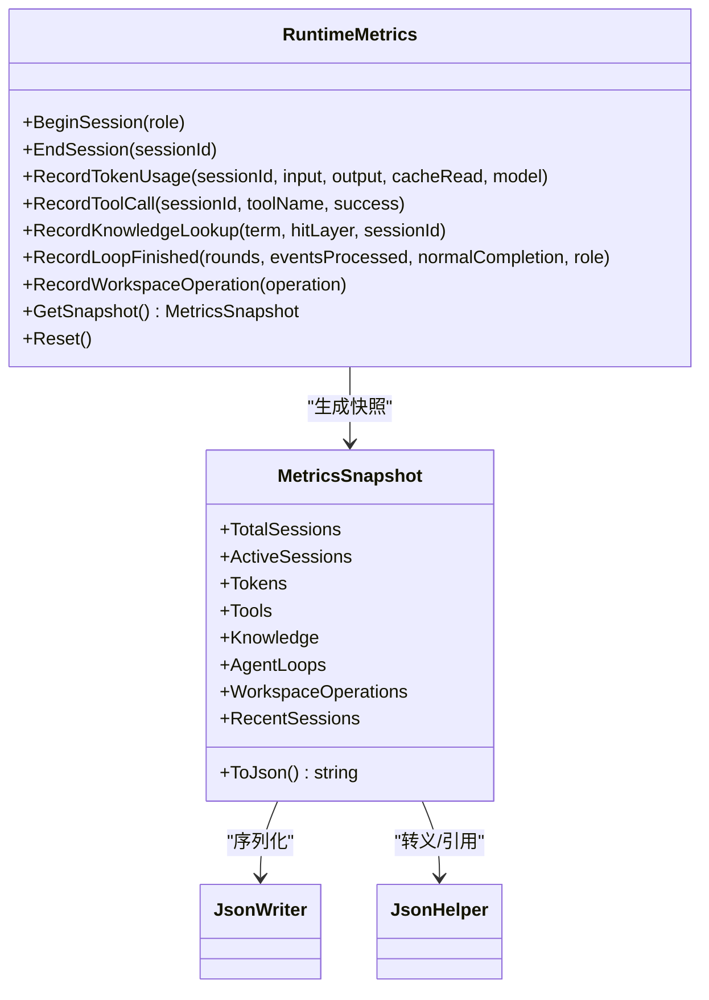
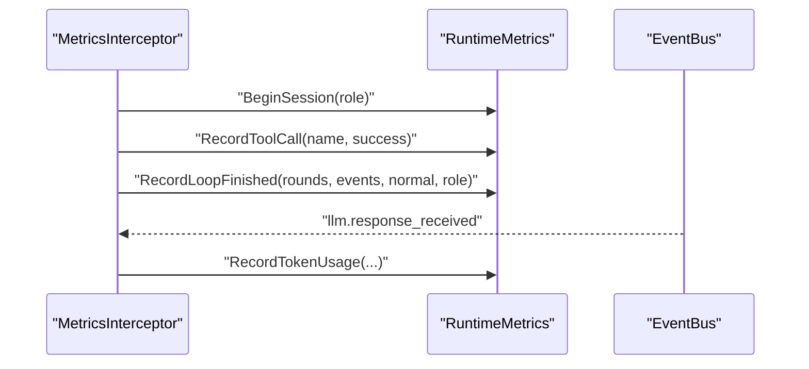
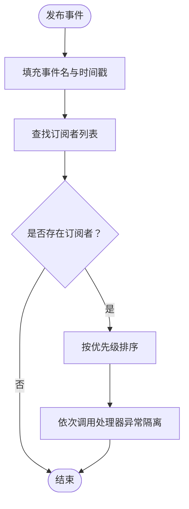
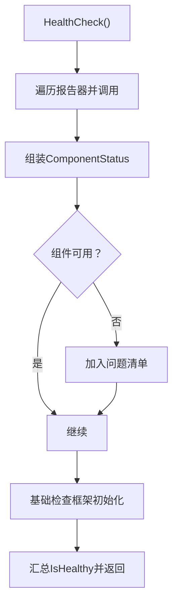
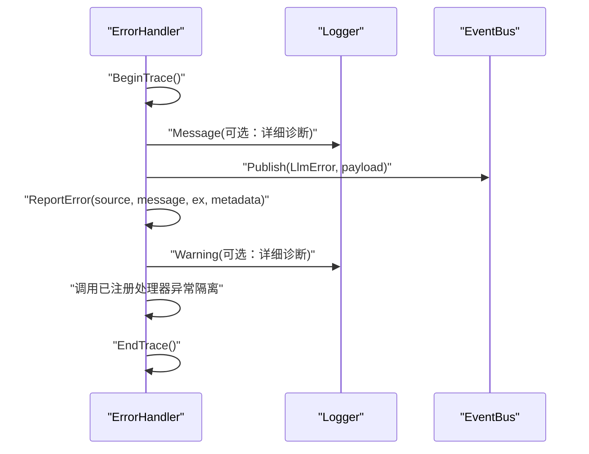
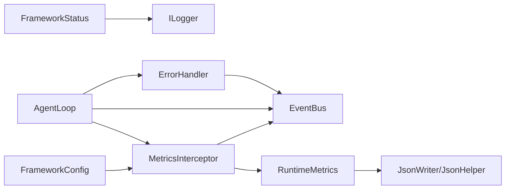

# 监控与告警

<cite>
**本文引用的文件**
- [RuntimeMetrics.cs](file://src/NPCLife/Framework/RuntimeMetrics.cs)
- [MetricsInterceptor.cs](file://src/NPCLife/Framework/MetricsInterceptor.cs)
- [EventBus.cs](file://src/NPCLife/Framework/EventBus.cs)
- [FrameworkStatus.cs](file://src/NPCLife/Framework/FrameworkStatus.cs)
- [ErrorHandler.cs](file://src/NPCLife/Framework/ErrorHandler.cs)
- [FrameworkConfig.cs](file://src/NPCLife/Framework/FrameworkConfig.cs)
- [AgentLoop.cs](file://src/NPCLife/Agent/AgentLoop.cs)
- [JsonWriter.cs](file://src/NPCLife/Framework/JsonWriter.cs)
- [JsonHelper.cs](file://src/NPCLife/Framework/JsonHelper.cs)
- [JsonParser.cs](file://src/NPCLife/Framework/JsonParser.cs)
- [ILogger.cs](file://src/NPCLife/Framework/ILogger.cs)
</cite>

## 目录
1. [简介](#简介)
2. [项目结构](#项目结构)
3. [核心组件](#核心组件)
4. [架构总览](#架构总览)
5. [详细组件分析](#详细组件分析)
6. [依赖关系分析](#依赖关系分析)
7. [性能考量](#性能考量)
8. [故障排查指南](#故障排查指南)
9. [结论](#结论)
10. [附录](#附录)

## 简介
本文件面向 NPCLife 的监控与告警体系，基于现有代码实现，系统化阐述运行时指标采集与统计、关键性能指标（KPI）定义与阈值建议、日志级别与格式最佳实践、分布式追踪与链路监控、告警规则设计与通知渠道、监控仪表板搭建、异常检测与自动恢复机制，以及健康检查与可用性监控策略。目标是帮助开发者与运维人员快速落地可观测性方案，并在生产环境中稳定运行。

## 项目结构
NPCLife 的监控与告警能力主要由以下模块构成：
- 指标采集与聚合：RuntimeMetrics、MetricsInterceptor
- 事件总线：EventBus（用于事件驱动的观测）
- 健康检查与能力查询：FrameworkStatus
- 全局错误处理与链路追踪：ErrorHandler
- 配置开关：FrameworkConfig（启用/禁用运行时度量）
- 日志接口：ILogger
- JSON 工具：JsonWriter、JsonHelper、JsonParser（用于序列化指标与状态）

**图表来源**
- [RuntimeMetrics.cs:29-444](file://src/NPCLife/Framework/RuntimeMetrics.cs#L29-L444)
- [MetricsInterceptor.cs:13-108](file://src/NPCLife/Framework/MetricsInterceptor.cs#L13-L108)
- [EventBus.cs:17-155](file://src/NPCLife/Framework/EventBus.cs#L17-L155)
- [FrameworkStatus.cs:22-222](file://src/NPCLife/Framework/FrameworkStatus.cs#L22-L222)
- [ErrorHandler.cs:22-181](file://src/NPCLife/Framework/ErrorHandler.cs#L22-L181)
- [FrameworkConfig.cs:17-246](file://src/NPCLife/Framework/FrameworkConfig.cs#L17-L246)
- [AgentLoop.cs:170-369](file://src/NPCLife/Agent/AgentLoop.cs#L170-L369)
- [JsonWriter.cs:11-134](file://src/NPCLife/Framework/JsonWriter.cs#L11-L134)
- [JsonHelper.cs:8-53](file://src/NPCLife/Framework/JsonHelper.cs#L8-L53)
- [JsonParser.cs:13-267](file://src/NPCLife/Framework/JsonParser.cs#L13-L267)

**章节来源**
- [RuntimeMetrics.cs:29-444](file://src/NPCLife/Framework/RuntimeMetrics.cs#L29-L444)
- [MetricsInterceptor.cs:13-108](file://src/NPCLife/Framework/MetricsInterceptor.cs#L13-L108)
- [EventBus.cs:17-155](file://src/NPCLife/Framework/EventBus.cs#L17-L155)
- [FrameworkStatus.cs:22-222](file://src/NPCLife/Framework/FrameworkStatus.cs#L22-L222)
- [ErrorHandler.cs:22-181](file://src/NPCLife/Framework/ErrorHandler.cs#L22-L181)
- [FrameworkConfig.cs:17-246](file://src/NPCLife/Framework/FrameworkConfig.cs#L17-L246)
- [AgentLoop.cs:170-369](file://src/NPCLife/Agent/AgentLoop.cs#L170-L369)
- [JsonWriter.cs:11-134](file://src/NPCLife/Framework/JsonWriter.cs#L11-L134)
- [JsonHelper.cs:8-53](file://src/NPCLife/Framework/JsonHelper.cs#L8-L53)
- [JsonParser.cs:13-267](file://src/NPCLife/Framework/JsonParser.cs#L13-L267)

## 核心组件
- 运行时指标（RuntimeMetrics）：提供会话、Token、MCP 工具、知识库、Agent 循环、工作空间等维度的采集与快照生成，支持并发安全的增量统计与 JSON 序列化导出。
- 指标拦截器（MetricsInterceptor）：在 Agent 循环的关键节点（LLM 请求前、工具调用前后、循环结束）触发指标记录，自动管理会话生命周期。
- 事件总线（EventBus）：统一发布/订阅框架事件，便于观测与告警联动（如 LLM 请求/响应、工具调用、Agent 循环完成等）。
- 健康检查（FrameworkStatus）：注册组件状态报告器，进行健康检查与能力查询，支持序列化输出。
- 全局错误处理（ErrorHandler）：统一错误上报、请求链路追踪（TraceId）、错误上下文封装，支持事件总线联动。
- 配置开关（FrameworkConfig）：通过 Features.EnableRuntimeMetrics 控制是否启用运行时度量采集，关闭时拦截器不注册，零开销。
- 日志接口（ILogger）：统一的日志抽象，便于接入不同日志系统。
- JSON 工具（JsonWriter/JsonHelper/JsonParser）：用于指标与状态的高性能序列化与解析。

**章节来源**
- [RuntimeMetrics.cs:29-444](file://src/NPCLife/Framework/RuntimeMetrics.cs#L29-L444)
- [MetricsInterceptor.cs:13-108](file://src/NPCLife/Framework/MetricsInterceptor.cs#L13-L108)
- [EventBus.cs:17-155](file://src/NPCLife/Framework/EventBus.cs#L17-L155)
- [FrameworkStatus.cs:22-222](file://src/NPCLife/Framework/FrameworkStatus.cs#L22-L222)
- [ErrorHandler.cs:22-181](file://src/NPCLife/Framework/ErrorHandler.cs#L22-L181)
- [FrameworkConfig.cs:17-246](file://src/NPCLife/Framework/FrameworkConfig.cs#L17-L246)
- [ILogger.cs:8-19](file://src/NPCLife/Framework/ILogger.cs#L8-L19)
- [JsonWriter.cs:11-134](file://src/NPCLife/Framework/JsonWriter.cs#L11-L134)
- [JsonHelper.cs:8-53](file://src/NPCLife/Framework/JsonHelper.cs#L8-L53)
- [JsonParser.cs:13-267](file://src/NPCLife/Framework/JsonParser.cs#L13-L267)

## 架构总览
下图展示了监控与告警体系在运行时的交互关系：AgentLoop 作为业务主循环，通过 MetricsInterceptor 采集指标，通过 EventBus 发布事件，通过 ErrorHandler 进行错误与链路追踪；RuntimeMetrics 负责聚合统计；FrameworkStatus 提供健康检查；FrameworkConfig 控制功能开关；ILogger 与 JSON 工具负责日志与序列化。

**图表来源**
- [AgentLoop.cs:170-369](file://src/NPCLife/Agent/AgentLoop.cs#L170-L369)
- [MetricsInterceptor.cs:13-108](file://src/NPCLife/Framework/MetricsInterceptor.cs#L13-L108)
- [RuntimeMetrics.cs:29-444](file://src/NPCLife/Framework/RuntimeMetrics.cs#L29-L444)
- [EventBus.cs:17-155](file://src/NPCLife/Framework/EventBus.cs#L17-L155)
- [ErrorHandler.cs:22-181](file://src/NPCLife/Framework/ErrorHandler.cs#L22-L181)
- [FrameworkStatus.cs:22-222](file://src/NPCLife/Framework/FrameworkStatus.cs#L22-L222)

## 详细组件分析

### 运行时指标（RuntimeMetrics）
- 会话管理：按 Agent 角色（Director、Screenwriter、Freelancer）开始/结束会话，记录输入/输出/缓存读取 Token、模型、工具调用次数与错误、KB 查询与命中等。
- 聚合查询：提供 MetricsSnapshot，包含会话总数、活跃会话、Token 分角色统计、工具调用与错误、知识库批次与术语访问率、Agent 循环激活次数/轮次/事件数/错误数、工作空间操作、最近会话摘要。
- 快照序列化：通过 JsonWriter/JsonHelper 实现高效 JSON 序列化，便于导出与仪表板消费。

**图表来源**
- [RuntimeMetrics.cs:29-444](file://src/NPCLife/Framework/RuntimeMetrics.cs#L29-L444)
- [JsonWriter.cs:11-134](file://src/NPCLife/Framework/JsonWriter.cs#L11-L134)
- [JsonHelper.cs:8-53](file://src/NPCLife/Framework/JsonHelper.cs#L8-L53)

**章节来源**
- [RuntimeMetrics.cs:29-444](file://src/NPCLife/Framework/RuntimeMetrics.cs#L29-L444)
- [JsonWriter.cs:11-134](file://src/NPCLife/Framework/JsonWriter.cs#L11-L134)
- [JsonHelper.cs:8-53](file://src/NPCLife/Framework/JsonHelper.cs#L8-L53)

### 指标拦截器（MetricsInterceptor）
- 在 LLM 请求前开启会话并统计调用次数；在工具调用后根据结果记录调用与错误；在 Agent 循环结束后记录统计并结束会话。
- 通过 EventBus 订阅 llm.response_received 独立采集 Token 消耗，避免侵入核心循环。

**图表来源**
- [MetricsInterceptor.cs:13-108](file://src/NPCLife/Framework/MetricsInterceptor.cs#L13-L108)
- [RuntimeMetrics.cs:29-444](file://src/NPCLife/Framework/RuntimeMetrics.cs#L29-L444)
- [EventBus.cs:17-155](file://src/NPCLife/Framework/EventBus.cs#L17-L155)

**章节来源**
- [MetricsInterceptor.cs:13-108](file://src/NPCLife/Framework/MetricsInterceptor.cs#L13-L108)
- [RuntimeMetrics.cs:29-444](file://src/NPCLife/Framework/RuntimeMetrics.cs#L29-L444)
- [EventBus.cs:17-155](file://src/NPCLife/Framework/EventBus.cs#L17-L155)

### 事件总线（EventBus）
- 提供事件发布/订阅能力，支持命名空间事件名、优先级排序与错误隔离；框架预定义了大量事件（如 LLM 请求/响应、工具调用、Agent 循环完成等），便于观测与告警联动。

**图表来源**
- [EventBus.cs:17-155](file://src/NPCLife/Framework/EventBus.cs#L17-L155)

**章节来源**
- [EventBus.cs:17-155](file://src/NPCLife/Framework/EventBus.cs#L17-L155)

### 健康检查（FrameworkStatus）
- 支持注册组件状态报告器，统一健康检查与能力查询；序列化输出包含框架名、版本、初始化状态、健康状态、问题清单与能力字典。

**图表来源**
- [FrameworkStatus.cs:22-222](file://src/NPCLife/Framework/FrameworkStatus.cs#L22-L222)

**章节来源**
- [FrameworkStatus.cs:22-222](file://src/NPCLife/Framework/FrameworkStatus.cs#L22-L222)

### 全局错误处理（ErrorHandler）
- 提供统一错误钩子、诊断模式与请求链路追踪（TraceId）；错误上下文包含来源、消息、异常、TraceId、元数据与已处理标记；支持事件总线联动发布 LLM 错误事件。

**图表来源**
- [ErrorHandler.cs:22-181](file://src/NPCLife/Framework/ErrorHandler.cs#L22-L181)
- [EventBus.cs:17-155](file://src/NPCLife/Framework/EventBus.cs#L17-L155)

**章节来源**
- [ErrorHandler.cs:22-181](file://src/NPCLife/Framework/ErrorHandler.cs#L22-L181)
- [EventBus.cs:17-155](file://src/NPCLife/Framework/EventBus.cs#L17-L155)

### 配置开关（FrameworkConfig）
- 通过 Features.EnableRuntimeMetrics 控制是否启用运行时度量采集；关闭时 MetricsInterceptor 不注册，零开销；同时提供诊断开关与功能开关，便于在不同环境调整可观测性粒度。

**章节来源**
- [FrameworkConfig.cs:17-246](file://src/NPCLife/Framework/FrameworkConfig.cs#L17-L246)

### 日志接口（ILogger）
- 统一日志接口，提供 Message/Warning/Error 三个级别，便于接入不同日志系统与实现自定义日志策略。

**章节来源**
- [ILogger.cs:8-19](file://src/NPCLife/Framework/ILogger.cs#L8-L19)

## 依赖关系分析
- 指标采集依赖 EventBus 的 llm.response_received 事件进行 Token 统计，避免在核心循环中直接耦合。
- 指标拦截器依赖 RuntimeMetrics 进行会话与统计维护。
- 健康检查依赖组件状态报告器，统一输出健康状态。
- 错误处理与事件总线联动，形成统一的异常观测通道。
- 配置开关控制指标采集的启用与否，降低运行时开销。

**图表来源**
- [MetricsInterceptor.cs:13-108](file://src/NPCLife/Framework/MetricsInterceptor.cs#L13-L108)
- [RuntimeMetrics.cs:29-444](file://src/NPCLife/Framework/RuntimeMetrics.cs#L29-L444)
- [EventBus.cs:17-155](file://src/NPCLife/Framework/EventBus.cs#L17-L155)
- [FrameworkStatus.cs:22-222](file://src/NPCLife/Framework/FrameworkStatus.cs#L22-L222)
- [ErrorHandler.cs:22-181](file://src/NPCLife/Framework/ErrorHandler.cs#L22-L181)
- [FrameworkConfig.cs:17-246](file://src/NPCLife/Framework/FrameworkConfig.cs#L17-L246)
- [AgentLoop.cs:170-369](file://src/NPCLife/Agent/AgentLoop.cs#L170-L369)
- [JsonWriter.cs:11-134](file://src/NPCLife/Framework/JsonWriter.cs#L11-L134)
- [JsonHelper.cs:8-53](file://src/NPCLife/Framework/JsonHelper.cs#L8-L53)

**章节来源**
- [MetricsInterceptor.cs:13-108](file://src/NPCLife/Framework/MetricsInterceptor.cs#L13-L108)
- [RuntimeMetrics.cs:29-444](file://src/NPCLife/Framework/RuntimeMetrics.cs#L29-L444)
- [EventBus.cs:17-155](file://src/NPCLife/Framework/EventBus.cs#L17-L155)
- [FrameworkStatus.cs:22-222](file://src/NPCLife/Framework/FrameworkStatus.cs#L22-L222)
- [ErrorHandler.cs:22-181](file://src/NPCLife/Framework/ErrorHandler.cs#L22-L181)
- [FrameworkConfig.cs:17-246](file://src/NPCLife/Framework/FrameworkConfig.cs#L17-L246)
- [AgentLoop.cs:170-369](file://src/NPCLife/Agent/AgentLoop.cs#L170-L369)
- [JsonWriter.cs:11-134](file://src/NPCLife/Framework/JsonWriter.cs#L11-L134)
- [JsonHelper.cs:8-53](file://src/NPCLife/Framework/JsonHelper.cs#L8-L53)

## 性能考量
- 指标采集采用锁保护的并发安全设计，避免竞争条件；快照生成与 JSON 序列化通过 JsonWriter 最小化内存分配，适合高频导出场景。
- 指标拦截器仅在关键节点触发，且通过 EventBus 订阅事件独立采集 Token，减少对核心循环的侵入与开销。
- 配置开关 EnableRuntimeMetrics 可在生产环境关闭，实现零观测性开销。
- 建议：在高吞吐场景下，结合采样策略与异步导出，避免阻塞主线程。

[本节为通用性能讨论，无需列出具体文件来源]

## 故障排查指南
- 使用 ErrorHandler 的诊断模式与链路追踪（BeginTrace/EndTrace）定位异常请求路径。
- 通过 EventBus 订阅 LLM 错误、工具调用异常等事件，结合错误上下文（TraceId、来源、元数据）进行根因分析。
- 利用 FrameworkStatus 的健康检查与能力查询，确认组件可用性与功能状态。
- 通过 RuntimeMetrics 的快照与最近会话摘要，识别异常会话与工具调用失败热点。

**章节来源**
- [ErrorHandler.cs:22-181](file://src/NPCLife/Framework/ErrorHandler.cs#L22-L181)
- [EventBus.cs:17-155](file://src/NPCLife/Framework/EventBus.cs#L17-L155)
- [FrameworkStatus.cs:22-222](file://src/NPCLife/Framework/FrameworkStatus.cs#L22-L222)
- [RuntimeMetrics.cs:29-444](file://src/NPCLife/Framework/RuntimeMetrics.cs#L29-L444)

## 结论
NPCLife 的监控与告警体系以事件驱动与拦截器为核心，结合健康检查、错误处理与配置开关，实现了低侵入、可扩展、可配置的可观测性能力。通过 RuntimeMetrics 与 MetricsInterceptor 的配合，能够全面覆盖会话、Token、工具、知识库与 Agent 循环等关键维度；通过 EventBus 与 ErrorHandler 形成统一的观测与告警通道；通过 FrameworkStatus 与 JSON 工具支撑健康检查与可视化输出。建议在此基础上进一步完善告警规则、通知渠道与仪表板，并结合采样与异步导出来优化性能。

[本节为总结性内容，无需列出具体文件来源]

## 附录

### 运行时指标采集与统计方法
- 会话维度：BeginSession/EndSession 记录会话生命周期；GetSnapshot 提供会话总数与活跃会话数。
- Token 维度：通过 llm.response_received 事件记录输入/输出/缓存读取 Token，按角色分桶统计。
- 工具维度：记录工具调用次数与错误次数，支持全局与会话内统计。
- 知识库维度：记录术语访问次数、命中次数与 L1 命中次数，计算访问率。
- Agent 循环维度：记录激活次数、总轮次、平均每激活轮次、总事件数与错误数。
- 工作空间维度：记录操作类型与频次。

**章节来源**
- [RuntimeMetrics.cs:29-444](file://src/NPCLife/Framework/RuntimeMetrics.cs#L29-L444)
- [MetricsInterceptor.cs:13-108](file://src/NPCLife/Framework/MetricsInterceptor.cs#L13-L108)
- [EventBus.cs:17-155](file://src/NPCLife/Framework/EventBus.cs#L17-L155)

### 关键性能指标（KPI）定义与阈值建议
- 会话吞吐：每分钟会话完成数；建议阈值：低于基线值 20% 触发预警。
- Token 成本：每会话平均输入/输出/缓存读取 Token；建议阈值：超过配额预算 80% 触发预警。
- 工具成功率：工具调用错误率；建议阈值：高于 5% 触发预警。
- 知识库命中率：KB 命中次数/总查询次数；建议阈值：低于 60% 触发预警。
- Agent 循环稳定性：错误数/激活次数；建议阈值：错误率高于 3% 触发预警。
- 工作空间操作异常：特定操作失败率；建议阈值：高于 2% 触发预警。

[本节为通用 KPI 设定建议，无需列出具体文件来源]

### 日志级别与日志格式最佳实践
- 日志级别：Debug（详细诊断）、Info（常规运行信息）、Warning（可恢复异常与潜在问题）、Error（严重异常）。
- 日志格式：统一包含时间戳、TraceId、模块名、级别、消息与可选元数据；使用 JsonHelper/JsonWriter 进行转义与序列化，确保日志可解析。
- 诊断模式：通过 FrameworkConfig.Diagnostics.EnableVerboseLogging 控制是否输出详细日志（如提示词、工具参数等）。

**章节来源**
- [ILogger.cs:8-19](file://src/NPCLife/Framework/ILogger.cs#L8-L19)
- [JsonHelper.cs:8-53](file://src/NPCLife/Framework/JsonHelper.cs#L8-L53)
- [JsonWriter.cs:11-134](file://src/NPCLife/Framework/JsonWriter.cs#L11-L134)
- [FrameworkConfig.cs:17-246](file://src/NPCLife/Framework/FrameworkConfig.cs#L17-L246)

### 分布式追踪与链路监控
- 请求链路追踪：在 AgentLoop 入口调用 BeginTrace，在异常或完成时调用 EndTrace；ErrorHandler 自动关联 TraceId。
- 事件链路：通过 EventBus 订阅 LLM 请求/响应、工具调用、Agent 循环完成等事件，串联一次请求的全链路轨迹。
- 建议：在网关/入口层透传 TraceId，结合日志与指标进行端到端关联分析。

**章节来源**
- [AgentLoop.cs:170-369](file://src/NPCLife/Agent/AgentLoop.cs#L170-L369)
- [ErrorHandler.cs:22-181](file://src/NPCLife/Framework/ErrorHandler.cs#L22-L181)
- [EventBus.cs:17-155](file://src/NPCLife/Framework/EventBus.cs#L17-L155)

### 告警规则设计与通知渠道
- 规则设计：基于 KPI 阈值与趋势（如滑动窗口均值与标准差）设定告警；区分预警与严重级别。
- 通知渠道：邮件、IM（如企业微信/钉钉）、Webhook；针对不同级别选择合适渠道与收敛策略。
- 建议：结合 Grafana/Prometheus/Alertmanager 或同类平台实现自动化告警与升级策略。

[本节为通用告警设计建议，无需列出具体文件来源]

### 监控仪表板搭建指南
- 指标来源：RuntimeMetrics 的快照与 FrameworkStatus 的健康检查输出。
- 图表建议：会话吞吐、Token 成本、工具成功率、知识库命中率、Agent 循环稳定性、错误分布、TraceId 关联的事件流。
- 导出方式：通过 JsonWriter/JsonHelper 序列化指标，接入时序数据库或日志平台进行可视化。

**章节来源**
- [RuntimeMetrics.cs:29-444](file://src/NPCLife/Framework/RuntimeMetrics.cs#L29-L444)
- [FrameworkStatus.cs:22-222](file://src/NPCLife/Framework/FrameworkStatus.cs#L22-L222)
- [JsonWriter.cs:11-134](file://src/NPCLife/Framework/JsonWriter.cs#L11-L134)
- [JsonHelper.cs:8-53](file://src/NPCLife/Framework/JsonHelper.cs#L8-L53)

### 异常检测与自动恢复机制
- 异常检测：基于 ErrorHandler 的错误上下文与事件总线，识别工具调用失败、LLM 错误、Agent 循环异常等。
- 自动恢复：在拦截器与 AgentLoop 中实现重试、降级与回退策略；通过健康检查与能力查询动态调整功能开关。

**章节来源**
- [ErrorHandler.cs:22-181](file://src/NPCLife/Framework/ErrorHandler.cs#L22-L181)
- [EventBus.cs:17-155](file://src/NPCLife/Framework/EventBus.cs#L17-L155)
- [FrameworkStatus.cs:22-222](file://src/NPCLife/Framework/FrameworkStatus.cs#L22-L222)

### 系统健康检查与可用性监控策略
- 健康检查：定期调用 FrameworkStatus.HealthCheck，汇总组件可用性与问题清单。
- 可用性策略：基于生命周期管理（Initialize/Shutdown/Reset）与事件总线发布框架状态事件，确保可观测性与可恢复性。

**章节来源**
- [FrameworkStatus.cs:22-222](file://src/NPCLife/Framework/FrameworkStatus.cs#L22-L222)
- [EventBus.cs:17-155](file://src/NPCLife/Framework/EventBus.cs#L17-L155)