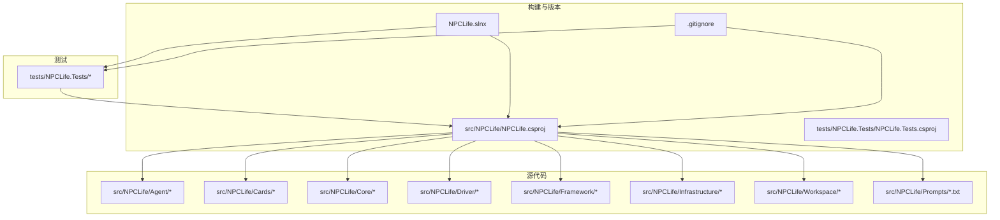
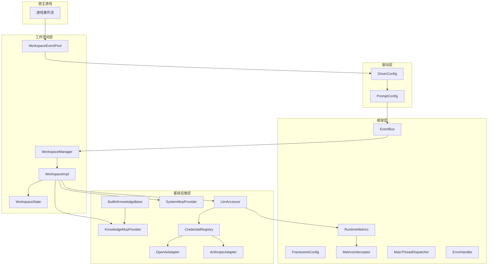
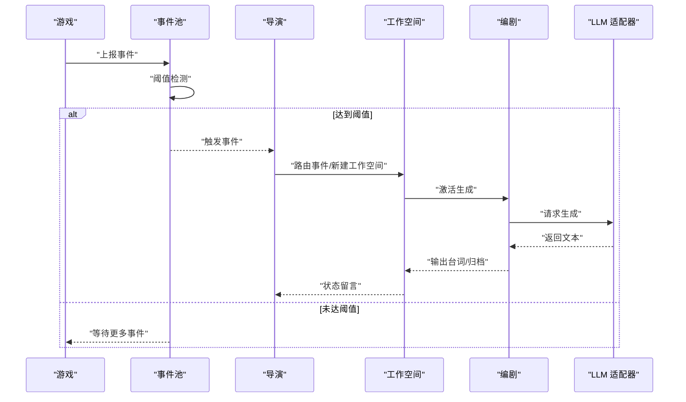
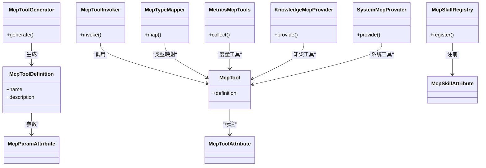
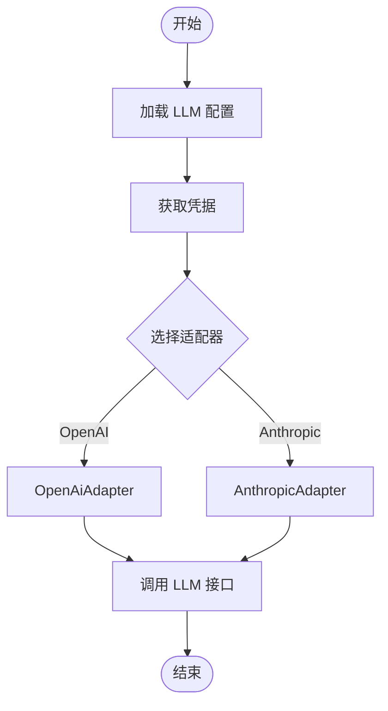
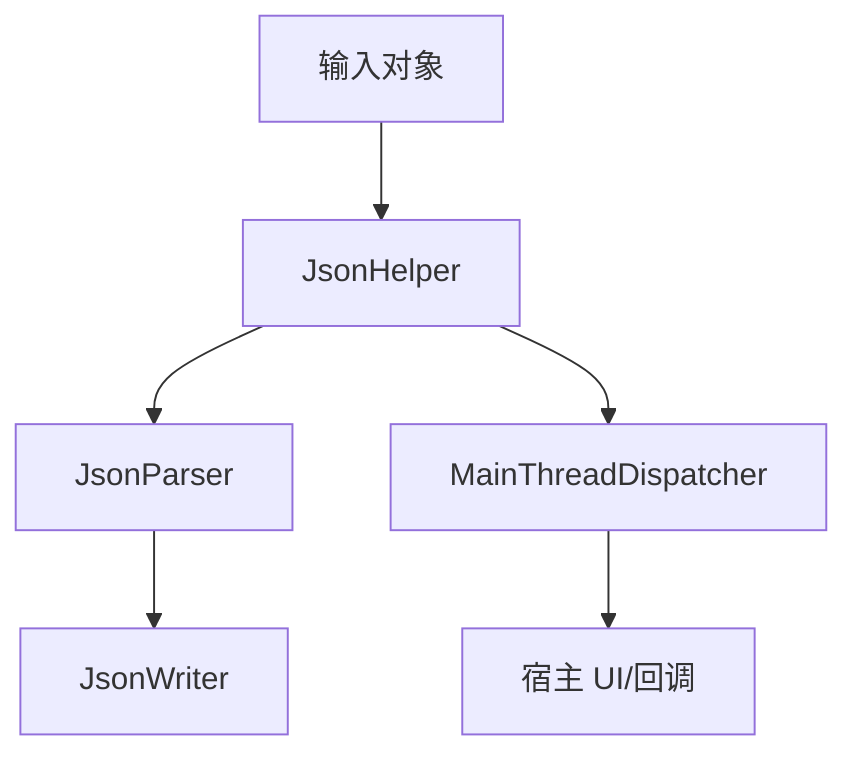
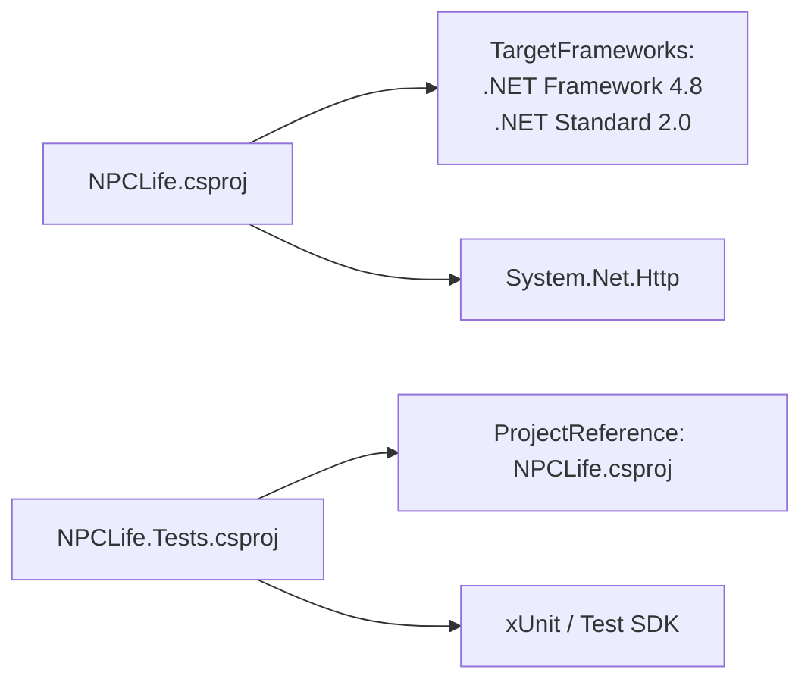

# 部署与运维

<cite>
**本文引用的文件**
- [README.md](file://README.md)
- [NPCLife.slnx](file://NPCLife.slnx)
- [NPCLife.csproj](file://src/NPCLife/NPCLife.csproj)
- [NPCLife.Tests.csproj](file://tests/NPCLife.Tests/NPCLife.Tests.csproj)
- [.gitignore](file://.gitignore)
- [AgentLoop.cs](file://src/NPCLife/Agent/AgentLoop.cs)
- [DriverConfig.cs](file://src/NPCLife/Driver/DriverConfig.cs)
- [PromptConfig.cs](file://src/NPCLife/Driver/PromptConfig.cs)
- [FrameworkConfig.cs](file://src/NPCLife/Framework/FrameworkConfig.cs)
- [RuntimeMetrics.cs](file://src/NPCLife/Framework/RuntimeMetrics.cs)
- [MetricsInterceptor.cs](file://src/NPCLife/Framework/MetricsInterceptor.cs)
- [LlmConfig.cs](file://src/NPCLife/Framework/Llm/LlmConfig.cs)
- [LlmCredential.cs](file://src/NPCLife/Framework/Llm/LlmCredential.cs)
- [AnthropicAdapter.cs](file://src/NPCLife/Infrastructure/Llm/AnthropicAdapter.cs)
- [OpenAiAdapter.cs](file://src/NPCLife/Infrastructure/Llm/OpenAiAdapter.cs)
- [CredentialRegistry.cs](file://src/NPCLife/Infrastructure/Llm/CredentialRegistry.cs)
- [LlmAccessor.cs](file://src/NPCLife/Infrastructure/Llm/LlmAccessor.cs)
- [KnowledgeMcpProvider.cs](file://src/NPCLife/Infrastructure/Mcp/KnowledgeMcpProvider.cs)
- [SystemMcpProvider.cs](file://src/NPCLife/Infrastructure/Mcp/SystemMcpProvider.cs)
- [WorkspaceManager.cs](file://src/NPCLife/Workspace/WorkspaceManager.cs)
- [WorkspaceImpl.cs](file://src/NPCLife/Workspace/WorkspaceImpl.cs)
- [WorkspaceState.cs](file://src/NPCLife/Workspace/WorkspaceState.cs)
- [BuiltInKnowledgeBase.cs](file://src/NPCLife/Infrastructure/Knowledge/BuiltInKnowledgeBase.cs)
- [IStorage.cs](file://src/NPCLife/Core/IStorage.cs)
- [ILogger.cs](file://src/NPCLife/Framework/ILogger.cs)
- [ILlmService.cs](file://src/NPCLife/Core/ILlmService.cs)
- [ICharacterContentProvider.cs](file://src/NPCLife/Core/ICharacterContentProvider.cs)
- [ICredentialRegistry.cs](file://src/NPCLife/Core/ICredentialRegistry.cs)
- [IEventLog.cs](file://src/NPCLife/Core/IEventLog.cs)
- [IExternalKnowledgeSource.cs](file://src/NPCLife/Core/IExternalKnowledgeSource.cs)
- [IInteractionStore.cs](file://src/NPCLife/Core/IInteractionStore.cs)
- [IKnowledgeBase.cs](file://src/NPCLife/Core/IKnowledgeBase.cs)
- [IKnowledgeService.cs](file://src/NPCLife/Core/IKnowledgeService.cs)
- [IScriptConsumer.cs](file://src/NPCLife/Core/IScriptConsumer.cs)
- [IScriptLineResolver.cs](file://src/NPCLife/Core/IScriptLineResolver.cs)
- [IWorkspaceManager.cs](file://src/NPCLife/Core/IWorkspaceManager.cs)
- [JsonHelper.cs](file://src/NPCLife/Framework/JsonHelper.cs)
- [JsonParser.cs](file://src/NPCLife/Framework/JsonParser.cs)
- [JsonWriter.cs](file://src/NPCLife/Framework/JsonWriter.cs)
- [MainThreadDispatcher.cs](file://src/NPCLife/Framework/MainThreadDispatcher.cs)
- [EventBus.cs](file://src/NPCLife/Framework/EventBus.cs)
- [LifecycleManager.cs](file://src/NPCLife/Framework/LifecycleManager.cs)
- [ErrorHandler.cs](file://src/NPCLife/Framework/ErrorHandler.cs)
- [WorkspaceEventPool.cs](file://src/NPCLife/Workspace/WorkspaceEventPool.cs)
- [DirectionMcpTools.cs](file://src/NPCLife/Workspace/DirectionMcpTools.cs)
- [FreelancerMcpTools.cs](file://src/NPCLife/Workspace/FreelancerMcpTools.cs)
- [WritingMcpTools.cs](file://src/NPCLife/Workspace/WritingMcpTools.cs)
- [McpToolGenerator.cs](file://src/NPCLife/Framework/Mcp/McpToolGenerator.cs)
- [McpToolInvoker.cs](file://src/NPCLife/Framework/Mcp/McpToolInvoker.cs)
- [McpSkillRegistry.cs](file://src/NPCLife/Framework/Mcp/McpSkillRegistry.cs)
- [McpTool.cs](file://src/NPCLife/Framework/Mcp/McpTool.cs)
- [McpToolDefinition.cs](file://src/NPCLife/Framework/Mcp/McpToolDefinition.cs)
- [McpSkillAttribute.cs](file://src/NPCLife/Framework/Mcp/McpSkillAttribute.cs)
- [McpToolAttribute.cs](file://src/NPCLife/Framework/Mcp/McpToolAttribute.cs)
- [McpParamAttribute.cs](file://src/NPCLife/Framework/Mcp/McpParamAttribute.cs)
- [McpTypeMapper.cs](file://src/NPCLife/Framework/Mcp/McpTypeMapper.cs)
- [MetricsMcpTools.cs](file://src/NPCLife/Framework/Mcp/MetricsMcpTools.cs)
- [CardSerializer.cs](file://src/NPCLife/Framework/Mcp/CardSerializer.cs)
- [IExtensibleCard.cs](file://src/NPCLife/Cards/IExtensibleCard.cs)
- [CharacterCard.cs](file://src/NPCLife/Cards/CharacterCard.cs)
- [ColonyContext.cs](file://src/NPCLife/Cards/ColonyContext.cs)
- [EnvironmentCard.cs](file://src/NPCLife/Cards/EnvironmentCard.cs)
- [EventCard.cs](file://src/NPCLife/Cards/EventCard.cs)
- [ObjectiveCard.cs](file://src/NPCLife/Cards/ObjectiveCard.cs)
- [CardDataStructs.cs](file://src/NPCLife/Cards/CardDataStructs.cs)
- [ScriptFormat.cs](file://src/NPCLife/Framework/Script/ScriptFormat.cs)
- [ScriptLine.cs](file://src/NPCLife/Framework/Script/ScriptLine.cs)
- [DirectorPrompt.txt](file://src/NPCLife/Prompts/DirectorPrompt.txt)
- [FreelancerPrompt.txt](file://src/NPCLife/Prompts/FreelancerPrompt.txt)
- [ScreenwriterPrompt.txt](file://src/NPCLife/Prompts/ScreenwriterPrompt.txt)
</cite>

## 目录
1. [简介](#简介)
2. [项目结构](#项目结构)
3. [核心组件](#核心组件)
4. [架构总览](#架构总览)
5. [详细组件分析](#详细组件分析)
6. [依赖分析](#依赖分析)
7. [性能考虑](#性能考虑)
8. [故障排除指南](#故障排除指南)
9. [结论](#结论)
10. [附录](#附录)

## 简介
本指南面向在生产环境中部署与运维 NPCLife 的工程团队，目标是帮助您完成从构建、打包、发布到运行期监控、性能调优与故障排除的全生命周期管理。NPCLife 是一个以 C# 实现的“LLM 驱动的游戏叙事中间件”，提供多智能体管线（导演/编剧/自由编剧）、基于工作空间的剧情分支与合并、MCP 工具协议以及 LLM 后端集成能力。项目采用多目标框架与 NuGet 包构建方式，测试项目与主库分离，便于 CI/CD 流水线执行。

- 项目定位与用途参见 [README.md:1-93](file://README.md#L1-L93)
- 解决方案与项目文件参见 [NPCLife.slnx:1-5](file://NPCLife.slnx#L1-L5)
- 构建配置与包元数据参见 [NPCLife.csproj:1-38](file://src/NPCLife/NPCLife.csproj#L1-L38)、[NPCLife.Tests.csproj:1-23](file://tests/NPCLife.Tests/NPCLife.Tests.csproj#L1-L23)

**章节来源**
- [README.md:1-93](file://README.md#L1-L93)
- [NPCLife.slnx:1-5](file://NPCLife.slnx#L1-L5)
- [NPCLife.csproj:1-38](file://src/NPCLife/NPCLife.csproj#L1-L38)
- [NPCLife.Tests.csproj:1-23](file://tests/NPCLife.Tests/NPCLife.Tests.csproj#L1-L23)

## 项目结构
仓库采用“根目录 + 多层子目录”的组织方式，核心代码位于 src/NPCLife 下，测试位于 tests/NPCLife.Tests。主要模块包括：
- Agent：智能体循环与调度
- Cards：卡牌数据模型与扩展接口
- Core：核心接口与知识服务
- Driver：驱动层配置与提示词
- Framework：框架配置、事件总线、度量拦截、JSON 工具、主线程派发器等
- Infrastructure：知识库、LLM 适配器、MCP 提供者、交互历史存储
- Workspace：工作空间管理与剧情生命周期
- Prompts：内置提示词资源

构建与版本控制方面：
- 构建目标：同时支持 .NET Framework 4.8 与 .NET Standard 2.0
- 发布策略：启用打包并在 Release 配置下优化
- 版本号：项目文件中声明版本
- 源码托管：使用 Git，忽略构建产物与 IDE 用户文件

**图表来源**
- [NPCLife.csproj:1-38](file://src/NPCLife/NPCLife.csproj#L1-L38)
- [NPCLife.Tests.csproj:1-23](file://tests/NPCLife.Tests/NPCLife.Tests.csproj#L1-L23)
- [NPCLife.slnx:1-5](file://NPCLife.slnx#L1-L5)
- [.gitignore:1-16](file://.gitignore#L1-L16)

**章节来源**
- [NPCLife.csproj:1-38](file://src/NPCLife/NPCLife.csproj#L1-L38)
- [NPCLife.Tests.csproj:1-23](file://tests/NPCLife.Tests/NPCLife.Tests.csproj#L1-L23)
- [NPCLife.slnx:1-5](file://NPCLife.slnx#L1-L5)
- [.gitignore:1-16](file://.gitignore#L1-L16)

## 核心组件
本节聚焦于与部署和运维密切相关的组件与配置点：

- 驱动层配置与提示词
  - DriverConfig：驱动层参数与开关
  - PromptConfig：提示词模板加载与参数化
  - 内置提示词资源：DirectorPrompt、ScreenwriterPrompt、FreelancerPrompt
  - 参考路径：[DriverConfig.cs](file://src/NPCLife/Driver/DriverConfig.cs)、[PromptConfig.cs](file://src/NPCLife/Driver/PromptConfig.cs)、[DirectorPrompt.txt](file://src/NPCLife/Prompts/DirectorPrompt.txt)、[ScreenwriterPrompt.txt](file://src/NPCLife/Prompts/ScreenwriterPrompt.txt)、[FreelancerPrompt.txt](file://src/NPCLife/Prompts/FreelancerPrompt.txt)

- 框架配置与运行时度量
  - FrameworkConfig：框架级配置入口
  - RuntimeMetrics：运行时指标采集
  - MetricsInterceptor：指标拦截器
  - 参考路径：[FrameworkConfig.cs](file://src/NPCLife/Framework/FrameworkConfig.cs)、[RuntimeMetrics.cs](file://src/NPCLife/Framework/RuntimeMetrics.cs)、[MetricsInterceptor.cs](file://src/NPCLife/Framework/MetricsInterceptor.cs)

- LLM 配置与凭据
  - LlmConfig：LLM 供应商配置
  - LlmCredential：凭据抽象
  - LlmAccessor：统一访问入口
  - 凭据注册表：CredentialRegistry
  - 适配器：AnthropicAdapter、OpenAiAdapter
  - 参考路径：[LlmConfig.cs](file://src/NPCLife/Framework/Llm/LlmConfig.cs)、[LlmCredential.cs](file://src/NPCLife/Framework/Llm/LlmCredential.cs)、[LlmAccessor.cs](file://src/NPCLife/Infrastructure/Llm/LlmAccessor.cs)、[CredentialRegistry.cs](file://src/NPCLife/Infrastructure/Llm/CredentialRegistry.cs)、[AnthropicAdapter.cs](file://src/NPCLife/Infrastructure/Llm/AnthropicAdapter.cs)、[OpenAiAdapter.cs](file://src/NPCLife/Infrastructure/Llm/OpenAiAdapter.cs)

- 工作空间与剧情生命周期
  - WorkspaceManager：工作空间管理器
  - WorkspaceImpl：工作空间实现
  - WorkspaceState：工作空间状态
  - WorkspaceEventPool：事件池
  - 参考路径：[WorkspaceManager.cs](file://src/NPCLife/Workspace/WorkspaceManager.cs)、[WorkspaceImpl.cs](file://src/NPCLife/Workspace/WorkspaceImpl.cs)、[WorkspaceState.cs](file://src/NPCLife/Workspace/WorkspaceState.cs)、[WorkspaceEventPool.cs](file://src/NPCLife/Workspace/WorkspaceEventPool.cs)

- MCP 工具与系统集成
  - KnowledgeMcpProvider、SystemMcpProvider：MCP 提供者
  - McpToolGenerator、McpToolInvoker、McpSkillRegistry、McpTool、McpToolDefinition、McpSkillAttribute、McpToolAttribute、McpParamAttribute、McpTypeMapper、MetricsMcpTools、CardSerializer
  - 参考路径：[KnowledgeMcpProvider.cs](file://src/NPCLife/Infrastructure/Mcp/KnowledgeMcpProvider.cs)、[SystemMcpProvider.cs](file://src/NPCLife/Infrastructure/Mcp/SystemMcpProvider.cs)、[McpToolGenerator.cs](file://src/NPCLife/Framework/Mcp/McpToolGenerator.cs)、[McpToolInvoker.cs](file://src/NPCLife/Framework/Mcp/McpToolInvoker.cs)、[McpSkillRegistry.cs](file://src/NPCLife/Framework/Mcp/McpSkillRegistry.cs)、[McpTool.cs](file://src/NPCLife/Framework/Mcp/McpTool.cs)、[McpToolDefinition.cs](file://src/NPCLife/Framework/Mcp/McpToolDefinition.cs)、[McpSkillAttribute.cs](file://src/NPCLife/Framework/Mcp/McpSkillAttribute.cs)、[McpToolAttribute.cs](file://src/NPCLife/Framework/Mcp/McpToolAttribute.cs)、[McpParamAttribute.cs](file://src/NPCLife/Framework/Mcp/McpParamAttribute.cs)、[McpTypeMapper.cs](file://src/NPCLife/Framework/Mcp/McpTypeMapper.cs)、[MetricsMcpTools.cs](file://src/NPCLife/Framework/Mcp/MetricsMcpTools.cs)、[CardSerializer.cs](file://src/NPCLife/Framework/Mcp/CardSerializer.cs)

- 日志与存储接口
  - ILogger：日志接口
  - IStorage：存储接口（宿主注入）
  - 参考路径：[ILogger.cs](file://src/NPCLife/Framework/ILogger.cs)、[IStorage.cs](file://src/NPCLife/Core/IStorage.cs)

- JSON 工具与主线程派发
  - JsonHelper、JsonParser、JsonWriter：序列化/解析工具
  - MainThreadDispatcher：主线程派发器
  - 参考路径：[JsonHelper.cs](file://src/NPCLife/Framework/JsonHelper.cs)、[JsonParser.cs](file://src/NPCLife/Framework/JsonParser.cs)、[JsonWriter.cs](file://src/NPCLife/Framework/JsonWriter.cs)、[MainThreadDispatcher.cs](file://src/NPCLife/Framework/MainThreadDispatcher.cs)

- 事件总线与生命周期管理
  - EventBus：事件总线
  - LifecycleManager：生命周期管理
  - ErrorHandler：错误处理
  - 参考路径：[EventBus.cs](file://src/NPCLife/Framework/EventBus.cs)、[LifecycleManager.cs](file://src/NPCLife/Framework/LifecycleManager.cs)、[ErrorHandler.cs](file://src/NPCLife/Framework/ErrorHandler.cs)

**章节来源**
- [DriverConfig.cs](file://src/NPCLife/Driver/DriverConfig.cs)
- [PromptConfig.cs](file://src/NPCLife/Driver/PromptConfig.cs)
- [FrameworkConfig.cs](file://src/NPCLife/Framework/FrameworkConfig.cs)
- [RuntimeMetrics.cs](file://src/NPCLife/Framework/RuntimeMetrics.cs)
- [MetricsInterceptor.cs](file://src/NPCLife/Framework/MetricsInterceptor.cs)
- [LlmConfig.cs](file://src/NPCLife/Framework/Llm/LlmConfig.cs)
- [LlmCredential.cs](file://src/NPCLife/Framework/Llm/LlmCredential.cs)
- [LlmAccessor.cs](file://src/NPCLife/Infrastructure/Llm/LlmAccessor.cs)
- [CredentialRegistry.cs](file://src/NPCLife/Infrastructure/Llm/CredentialRegistry.cs)
- [AnthropicAdapter.cs](file://src/NPCLife/Infrastructure/Llm/AnthropicAdapter.cs)
- [OpenAiAdapter.cs](file://src/NPCLife/Infrastructure/Llm/OpenAiAdapter.cs)
- [WorkspaceManager.cs](file://src/NPCLife/Workspace/WorkspaceManager.cs)
- [WorkspaceImpl.cs](file://src/NPCLife/Workspace/WorkspaceImpl.cs)
- [WorkspaceState.cs](file://src/NPCLife/Workspace/WorkspaceState.cs)
- [WorkspaceEventPool.cs](file://src/NPCLife/Workspace/WorkspaceEventPool.cs)
- [KnowledgeMcpProvider.cs](file://src/NPCLife/Infrastructure/Mcp/KnowledgeMcpProvider.cs)
- [SystemMcpProvider.cs](file://src/NPCLife/Infrastructure/Mcp/SystemMcpProvider.cs)
- [McpToolGenerator.cs](file://src/NPCLife/Framework/Mcp/McpToolGenerator.cs)
- [McpToolInvoker.cs](file://src/NPCLife/Framework/Mcp/McpToolInvoker.cs)
- [McpSkillRegistry.cs](file://src/NPCLife/Framework/Mcp/McpSkillRegistry.cs)
- [McpTool.cs](file://src/NPCLife/Framework/Mcp/McpTool.cs)
- [McpToolDefinition.cs](file://src/NPCLife/Framework/Mcp/McpToolDefinition.cs)
- [McpSkillAttribute.cs](file://src/NPCLife/Framework/Mcp/McpSkillAttribute.cs)
- [McpToolAttribute.cs](file://src/NPCLife/Framework/Mcp/McpToolAttribute.cs)
- [McpParamAttribute.cs](file://src/NPCLife/Framework/Mcp/McpParamAttribute.cs)
- [McpTypeMapper.cs](file://src/NPCLife/Framework/Mcp/McpTypeMapper.cs)
- [MetricsMcpTools.cs](file://src/NPCLife/Framework/Mcp/MetricsMcpTools.cs)
- [CardSerializer.cs](file://src/NPCLife/Framework/Mcp/CardSerializer.cs)
- [ILogger.cs](file://src/NPCLife/Framework/ILogger.cs)
- [IStorage.cs](file://src/NPCLife/Core/IStorage.cs)
- [JsonHelper.cs](file://src/NPCLife/Framework/JsonHelper.cs)
- [JsonParser.cs](file://src/NPCLife/Framework/JsonParser.cs)
- [JsonWriter.cs](file://src/NPCLife/Framework/JsonWriter.cs)
- [MainThreadDispatcher.cs](file://src/NPCLife/Framework/MainThreadDispatcher.cs)
- [EventBus.cs](file://src/NPCLife/Framework/EventBus.cs)
- [LifecycleManager.cs](file://src/NPCLife/Framework/LifecycleManager.cs)
- [ErrorHandler.cs](file://src/NPCLife/Framework/ErrorHandler.cs)

## 架构总览
NPCLife 的运行时由“驱动层”“框架层”“基础设施层”“工作空间层”构成，核心流程围绕事件池与工作空间展开。事件在游戏侧产生并进入事件池，达到阈值后由导演进行路由决策，再由编剧在工作空间内生成具体叙事内容。MCP 工具贯穿其中，提供外部知识与系统能力的桥接。

**图表来源**
- [DriverConfig.cs](file://src/NPCLife/Driver/DriverConfig.cs)
- [PromptConfig.cs](file://src/NPCLife/Driver/PromptConfig.cs)
- [FrameworkConfig.cs](file://src/NPCLife/Framework/FrameworkConfig.cs)
- [RuntimeMetrics.cs](file://src/NPCLife/Framework/RuntimeMetrics.cs)
- [MetricsInterceptor.cs](file://src/NPCLife/Framework/MetricsInterceptor.cs)
- [EventBus.cs](file://src/NPCLife/Framework/EventBus.cs)
- [MainThreadDispatcher.cs](file://src/NPCLife/Framework/MainThreadDispatcher.cs)
- [ErrorHandler.cs](file://src/NPCLife/Framework/ErrorHandler.cs)
- [WorkspaceManager.cs](file://src/NPCLife/Workspace/WorkspaceManager.cs)
- [WorkspaceImpl.cs](file://src/NPCLife/Workspace/WorkspaceImpl.cs)
- [WorkspaceState.cs](file://src/NPCLife/Workspace/WorkspaceState.cs)
- [WorkspaceEventPool.cs](file://src/NPCLife/Workspace/WorkspaceEventPool.cs)
- [BuiltInKnowledgeBase.cs](file://src/NPCLife/Infrastructure/Knowledge/BuiltInKnowledgeBase.cs)
- [KnowledgeMcpProvider.cs](file://src/NPCLife/Infrastructure/Mcp/KnowledgeMcpProvider.cs)
- [SystemMcpProvider.cs](file://src/NPCLife/Infrastructure/Mcp/SystemMcpProvider.cs)
- [LlmAccessor.cs](file://src/NPCLife/Infrastructure/Llm/LlmAccessor.cs)
- [CredentialRegistry.cs](file://src/NPCLife/Infrastructure/Llm/CredentialRegistry.cs)
- [OpenAiAdapter.cs](file://src/NPCLife/Infrastructure/Llm/OpenAiAdapter.cs)
- [AnthropicAdapter.cs](file://src/NPCLife/Infrastructure/Llm/AnthropicAdapter.cs)

## 详细组件分析

### 组件一：事件阈值触发与工作空间生命周期
该流程控制 LLM 调用频率与成本，确保只有在事件积累达到阈值时才触发 AI 处理。工作空间负责独立的事件池、对话历史与角色集合，支持分支、合并与独立生命周期。

**图表来源**
- [WorkspaceEventPool.cs](file://src/NPCLife/Workspace/WorkspaceEventPool.cs)
- [WorkspaceManager.cs](file://src/NPCLife/Workspace/WorkspaceManager.cs)
- [WorkspaceImpl.cs](file://src/NPCLife/Workspace/WorkspaceImpl.cs)
- [AnthropicAdapter.cs](file://src/NPCLife/Infrastructure/Llm/AnthropicAdapter.cs)
- [OpenAiAdapter.cs](file://src/NPCLife/Infrastructure/Llm/OpenAiAdapter.cs)

**章节来源**
- [WorkspaceEventPool.cs](file://src/NPCLife/Workspace/WorkspaceEventPool.cs)
- [WorkspaceManager.cs](file://src/NPCLife/Workspace/WorkspaceManager.cs)
- [WorkspaceImpl.cs](file://src/NPCLife/Workspace/WorkspaceImpl.cs)
- [AnthropicAdapter.cs](file://src/NPCLife/Infrastructure/Llm/AnthropicAdapter.cs)
- [OpenAiAdapter.cs](file://src/NPCLife/Infrastructure/Llm/OpenAiAdapter.cs)

### 组件二：MCP 工具链与系统集成
MCP 工具链提供外部知识与系统能力的统一调用接口，支持技能注册、参数映射与工具生成。MetricsMcpTools 提供度量工具，KnowledgeMcpProvider 与 SystemMcpProvider 提供知识与系统能力。

**图表来源**
- [McpToolGenerator.cs](file://src/NPCLife/Framework/Mcp/McpToolGenerator.cs)
- [McpToolInvoker.cs](file://src/NPCLife/Framework/Mcp/McpToolInvoker.cs)
- [McpSkillRegistry.cs](file://src/NPCLife/Framework/Mcp/McpSkillRegistry.cs)
- [McpTool.cs](file://src/NPCLife/Framework/Mcp/McpTool.cs)
- [McpToolDefinition.cs](file://src/NPCLife/Framework/Mcp/McpToolDefinition.cs)
- [McpSkillAttribute.cs](file://src/NPCLife/Framework/Mcp/McpSkillAttribute.cs)
- [McpToolAttribute.cs](file://src/NPCLife/Framework/Mcp/McpToolAttribute.cs)
- [McpParamAttribute.cs](file://src/NPCLife/Framework/Mcp/McpParamAttribute.cs)
- [McpTypeMapper.cs](file://src/NPCLife/Framework/Mcp/McpTypeMapper.cs)
- [MetricsMcpTools.cs](file://src/NPCLife/Framework/Mcp/MetricsMcpTools.cs)
- [KnowledgeMcpProvider.cs](file://src/NPCLife/Infrastructure/Mcp/KnowledgeMcpProvider.cs)
- [SystemMcpProvider.cs](file://src/NPCLife/Infrastructure/Mcp/SystemMcpProvider.cs)

**章节来源**
- [McpToolGenerator.cs](file://src/NPCLife/Framework/Mcp/McpToolGenerator.cs)
- [McpToolInvoker.cs](file://src/NPCLife/Framework/Mcp/McpToolInvoker.cs)
- [McpSkillRegistry.cs](file://src/NPCLife/Framework/Mcp/McpSkillRegistry.cs)
- [McpTool.cs](file://src/NPCLife/Framework/Mcp/McpTool.cs)
- [McpToolDefinition.cs](file://src/NPCLife/Framework/Mcp/McpToolDefinition.cs)
- [McpSkillAttribute.cs](file://src/NPCLife/Framework/Mcp/McpSkillAttribute.cs)
- [McpToolAttribute.cs](file://src/NPCLife/Framework/Mcp/McpToolAttribute.cs)
- [McpParamAttribute.cs](file://src/NPCLife/Framework/Mcp/McpParamAttribute.cs)
- [McpTypeMapper.cs](file://src/NPCLife/Framework/Mcp/McpTypeMapper.cs)
- [MetricsMcpTools.cs](file://src/NPCLife/Framework/Mcp/MetricsMcpTools.cs)
- [KnowledgeMcpProvider.cs](file://src/NPCLife/Infrastructure/Mcp/KnowledgeMcpProvider.cs)
- [SystemMcpProvider.cs](file://src/NPCLife/Infrastructure/Mcp/SystemMcpProvider.cs)

### 组件三：LLM 适配与凭据管理
LLM 访问通过 LlmAccessor 统一入口，凭据由 CredentialRegistry 注册与管理，适配器根据供应商选择 OpenAI 或 Anthropic。此设计便于在不同 LLM 提供商间切换与灰度。

**图表来源**
- [LlmAccessor.cs](file://src/NPCLife/Infrastructure/Llm/LlmAccessor.cs)
- [CredentialRegistry.cs](file://src/NPCLife/Infrastructure/Llm/CredentialRegistry.cs)
- [OpenAiAdapter.cs](file://src/NPCLife/Infrastructure/Llm/OpenAiAdapter.cs)
- [AnthropicAdapter.cs](file://src/NPCLife/Infrastructure/Llm/AnthropicAdapter.cs)

**章节来源**
- [LlmAccessor.cs](file://src/NPCLife/Infrastructure/Llm/LlmAccessor.cs)
- [CredentialRegistry.cs](file://src/NPCLife/Infrastructure/Llm/CredentialRegistry.cs)
- [OpenAiAdapter.cs](file://src/NPCLife/Infrastructure/Llm/OpenAiAdapter.cs)
- [AnthropicAdapter.cs](file://src/NPCLife/Infrastructure/Llm/AnthropicAdapter.cs)

### 组件四：JSON 工具与主线程派发
JSON 工具负责序列化与解析，主线程派发器确保 UI 或宿主相关操作在正确线程执行，降低跨线程异常风险。

**图表来源**
- [JsonHelper.cs](file://src/NPCLife/Framework/JsonHelper.cs)
- [JsonParser.cs](file://src/NPCLife/Framework/JsonParser.cs)
- [JsonWriter.cs](file://src/NPCLife/Framework/JsonWriter.cs)
- [MainThreadDispatcher.cs](file://src/NPCLife/Framework/MainThreadDispatcher.cs)

**章节来源**
- [JsonHelper.cs](file://src/NPCLife/Framework/JsonHelper.cs)
- [JsonParser.cs](file://src/NPCLife/Framework/JsonParser.cs)
- [JsonWriter.cs](file://src/NPCLife/Framework/JsonWriter.cs)
- [MainThreadDispatcher.cs](file://src/NPCLife/Framework/MainThreadDispatcher.cs)

## 依赖分析
- 目标框架与兼容性
  - 主库同时支持 .NET Framework 4.8 与 .NET Standard 2.0，便于在多种宿主环境中复用
  - 测试项目使用 .NET Framework 4.8
- 第三方依赖
  - 仅包含 System.Net.Http，用于 HTTP 通信
- 内部可见性
  - 通过 InternalsVisibleTo 允许测试程序集访问内部成员，便于单元测试覆盖

**图表来源**
- [NPCLife.csproj:1-38](file://src/NPCLife/NPCLife.csproj#L1-L38)
- [NPCLife.Tests.csproj:1-23](file://tests/NPCLife.Tests/NPCLife.Tests.csproj#L1-L23)

**章节来源**
- [NPCLife.csproj:1-38](file://src/NPCLife/NPCLife.csproj#L1-L38)
- [NPCLife.Tests.csproj:1-23](file://tests/NPCLife.Tests/NPCLife.Tests.csproj#L1-L23)

## 性能考虑
- 事件阈值与批处理
  - 利用事件池的阈值机制减少 LLM 调用频率，控制成本与延迟
  - 参考：[WorkspaceEventPool.cs](file://src/NPCLife/Workspace/WorkspaceEventPool.cs)
- 并发与线程模型
  - 使用 MainThreadDispatcher 将 UI 或宿主回调派发至主线程，避免跨线程访问
  - 参考：[MainThreadDispatcher.cs](file://src/NPCLife/Framework/MainThreadDispatcher.cs)
- 度量与可观测性
  - 通过 RuntimeMetrics 与 MetricsInterceptor 收集运行时指标，辅助性能分析
  - 参考：[RuntimeMetrics.cs](file://src/NPCLife/Framework/RuntimeMetrics.cs)、[MetricsInterceptor.cs](file://src/NPCLife/Framework/MetricsInterceptor.cs)
- JSON 序列化开销
  - 合理使用 JsonHelper/JsonParser/JsonWriter，避免重复解析与大对象频繁序列化
  - 参考：[JsonHelper.cs](file://src/NPCLife/Framework/JsonHelper.cs)、[JsonParser.cs](file://src/NPCLife/Framework/JsonParser.cs)、[JsonWriter.cs](file://src/NPCLife/Framework/JsonWriter.cs)
- LLM 调用优化
  - 通过 LlmAccessor 与凭据注册表集中管理调用，结合适配器选择最优供应商
  - 参考：[LlmAccessor.cs](file://src/NPCLife/Infrastructure/Llm/LlmAccessor.cs)、[CredentialRegistry.cs](file://src/NPCLife/Infrastructure/Llm/CredentialRegistry.cs)

**章节来源**
- [WorkspaceEventPool.cs](file://src/NPCLife/Workspace/WorkspaceEventPool.cs)
- [MainThreadDispatcher.cs](file://src/NPCLife/Framework/MainThreadDispatcher.cs)
- [RuntimeMetrics.cs](file://src/NPCLife/Framework/RuntimeMetrics.cs)
- [MetricsInterceptor.cs](file://src/NPCLife/Framework/MetricsInterceptor.cs)
- [JsonHelper.cs](file://src/NPCLife/Framework/JsonHelper.cs)
- [JsonParser.cs](file://src/NPCLife/Framework/JsonParser.cs)
- [JsonWriter.cs](file://src/NPCLife/Framework/JsonWriter.cs)
- [LlmAccessor.cs](file://src/NPCLife/Infrastructure/Llm/LlmAccessor.cs)
- [CredentialRegistry.cs](file://src/NPCLife/Infrastructure/Llm/CredentialRegistry.cs)

## 故障排除指南
- LLM 调用失败
  - 检查凭据注册与适配器配置，确认供应商可用性
  - 参考：[CredentialRegistry.cs](file://src/NPCLife/Infrastructure/Llm/CredentialRegistry.cs)、[OpenAiAdapter.cs](file://src/NPCLife/Infrastructure/Llm/OpenAiAdapter.cs)、[AnthropicAdapter.cs](file://src/NPCLife/Infrastructure/Llm/AnthropicAdapter.cs)
- 事件未触发
  - 核对事件池阈值配置与事件上报逻辑
  - 参考：[WorkspaceEventPool.cs](file://src/NPCLife/Workspace/WorkspaceEventPool.cs)
- 工作空间状态异常
  - 检查 WorkspaceManager/Impl 的状态流转与持久化
  - 参考：[WorkspaceManager.cs](file://src/NPCLife/Workspace/WorkspaceManager.cs)、[WorkspaceImpl.cs](file://src/NPCLife/Workspace/WorkspaceImpl.cs)、[WorkspaceState.cs](file://src/NPCLife/Workspace/WorkspaceState.cs)
- MCP 工具调用失败
  - 检查工具定义、参数映射与注册表
  - 参考：[McpToolDefinition.cs](file://src/NPCLife/Framework/Mcp/McpToolDefinition.cs)、[McpParamAttribute.cs](file://src/NPCLife/Framework/Mcp/McpParamAttribute.cs)、[McpSkillRegistry.cs](file://src/NPCLife/Framework/Mcp/McpSkillRegistry.cs)
- 日志与错误处理
  - 使用 ILogger 输出诊断信息，ErrorHandler 进行统一捕获
  - 参考：[ILogger.cs](file://src/NPCLife/Framework/ILogger.cs)、[ErrorHandler.cs](file://src/NPCLife/Framework/ErrorHandler.cs)

**章节来源**
- [CredentialRegistry.cs](file://src/NPCLife/Infrastructure/Llm/CredentialRegistry.cs)
- [OpenAiAdapter.cs](file://src/NPCLife/Infrastructure/Llm/OpenAiAdapter.cs)
- [AnthropicAdapter.cs](file://src/NPCLife/Infrastructure/Llm/AnthropicAdapter.cs)
- [WorkspaceEventPool.cs](file://src/NPCLife/Workspace/WorkspaceEventPool.cs)
- [WorkspaceManager.cs](file://src/NPCLife/Workspace/WorkspaceManager.cs)
- [WorkspaceImpl.cs](file://src/NPCLife/Workspace/WorkspaceImpl.cs)
- [WorkspaceState.cs](file://src/NPCLife/Workspace/WorkspaceState.cs)
- [McpToolDefinition.cs](file://src/NPCLife/Framework/Mcp/McpToolDefinition.cs)
- [McpParamAttribute.cs](file://src/NPCLife/Framework/Mcp/McpParamAttribute.cs)
- [McpSkillRegistry.cs](file://src/NPCLife/Framework/Mcp/McpSkillRegistry.cs)
- [ILogger.cs](file://src/NPCLife/Framework/ILogger.cs)
- [ErrorHandler.cs](file://src/NPCLife/Framework/ErrorHandler.cs)

## 结论
NPCLife 提供了清晰的分层架构与可插拔的适配器模式，适合在生产环境中通过严格的配置管理、度量监控与事件阈值策略实现稳定高效的运行。建议在部署时重点关注 LLM 凭据与供应商切换、事件阈值与批处理策略、MCP 工具链的稳定性与可观测性，以及日志与错误处理的标准化。

## 附录

### A. 构建与发布流程
- 构建目标
  - 支持 .NET Framework 4.8 与 .NET Standard 2.0
  - Release 配置下启用优化与持续集成标志
- 打包与版本
  - 项目文件中声明版本，启用打包
- 测试
  - 单元测试项目引用主库，使用 xUnit 测试框架
- 参考路径
  - [NPCLife.csproj:1-38](file://src/NPCLife/NPCLife.csproj#L1-L38)
  - [NPCLife.Tests.csproj:1-23](file://tests/NPCLife.Tests/NPCLife.Tests.csproj#L1-L23)

**章节来源**
- [NPCLife.csproj:1-38](file://src/NPCLife/NPCLife.csproj#L1-L38)
- [NPCLife.Tests.csproj:1-23](file://tests/NPCLife.Tests/NPCLife.Tests.csproj#L1-L23)

### B. 依赖管理与版本控制策略
- 依赖范围
  - 仅包含 System.Net.Http
- 版本策略
  - 使用项目文件中的版本号作为发布版本
  - 建议配合语义化版本与变更日志进行发布管理
- 源码管理
  - .gitignore 忽略构建产物与 IDE 用户文件
- 参考路径
  - [.gitignore:1-16](file://.gitignore#L1-L16)
  - [NPCLife.csproj:27-29](file://src/NPCLife/NPCLife.csproj#L27-L29)

**章节来源**
- [.gitignore:1-16](file://.gitignore#L1-L16)
- [NPCLife.csproj:27-29](file://src/NPCLife/NPCLife.csproj#L27-L29)

### C. 生产环境部署配置与优化建议
- 配置项
  - DriverConfig：事件阈值、触发策略
  - PromptConfig：提示词模板与参数
  - FrameworkConfig：框架级开关
  - LlmConfig：供应商与模型参数
- 存储与日志
  - 宿主需提供 IStorage 与 ILogger 实现，确保状态持久化与可观测性
- 优化建议
  - 合理设置事件阈值，平衡响应速度与成本
  - 使用 MetricsInterceptor 与 RuntimeMetrics 持续监控关键指标
  - 通过 MCP 工具链扩展外部知识与系统能力
- 参考路径
  - [DriverConfig.cs](file://src/NPCLife/Driver/DriverConfig.cs)
  - [PromptConfig.cs](file://src/NPCLife/Driver/PromptConfig.cs)
  - [FrameworkConfig.cs](file://src/NPCLife/Framework/FrameworkConfig.cs)
  - [LlmConfig.cs](file://src/NPCLife/Framework/Llm/LlmConfig.cs)
  - [IStorage.cs](file://src/NPCLife/Core/IStorage.cs)
  - [ILogger.cs](file://src/NPCLife/Framework/ILogger.cs)

**章节来源**
- [DriverConfig.cs](file://src/NPCLife/Driver/DriverConfig.cs)
- [PromptConfig.cs](file://src/NPCLife/Driver/PromptConfig.cs)
- [FrameworkConfig.cs](file://src/NPCLife/Framework/FrameworkConfig.cs)
- [LlmConfig.cs](file://src/NPCLife/Framework/Llm/LlmConfig.cs)
- [IStorage.cs](file://src/NPCLife/Core/IStorage.cs)
- [ILogger.cs](file://src/NPCLife/Framework/ILogger.cs)

### D. 监控指标与告警机制
- 指标采集
  - RuntimeMetrics：运行时指标
  - MetricsInterceptor：拦截器
  - MetricsMcpTools：MCP 度量工具
- 告警建议
  - LLM 调用失败率、事件池积压、工作空间状态异常、MCP 工具超时
- 参考路径
  - [RuntimeMetrics.cs](file://src/NPCLife/Framework/RuntimeMetrics.cs)
  - [MetricsInterceptor.cs](file://src/NPCLife/Framework/MetricsInterceptor.cs)
  - [MetricsMcpTools.cs](file://src/NPCLife/Framework/Mcp/MetricsMcpTools.cs)

**章节来源**
- [RuntimeMetrics.cs](file://src/NPCLife/Framework/RuntimeMetrics.cs)
- [MetricsInterceptor.cs](file://src/NPCLife/Framework/MetricsInterceptor.cs)
- [MetricsMcpTools.cs](file://src/NPCLife/Framework/Mcp/MetricsMcpTools.cs)

### E. 性能调优方法与工具
- 方法
  - 事件阈值与批处理
  - 主线程派发与并发控制
  - JSON 工具的高效使用
  - LLM 调用的集中化与适配器选择
- 工具
  - RuntimeMetrics、MetricsInterceptor、MCP 工具链
- 参考路径
  - [WorkspaceEventPool.cs](file://src/NPCLife/Workspace/WorkspaceEventPool.cs)
  - [MainThreadDispatcher.cs](file://src/NPCLife/Framework/MainThreadDispatcher.cs)
  - [JsonHelper.cs](file://src/NPCLife/Framework/JsonHelper.cs)
  - [JsonParser.cs](file://src/NPCLife/Framework/JsonParser.cs)
  - [JsonWriter.cs](file://src/NPCLife/Framework/JsonWriter.cs)
  - [LlmAccessor.cs](file://src/NPCLife/Infrastructure/Llm/LlmAccessor.cs)
  - [RuntimeMetrics.cs](file://src/NPCLife/Framework/RuntimeMetrics.cs)
  - [MetricsInterceptor.cs](file://src/NPCLife/Framework/MetricsInterceptor.cs)

**章节来源**
- [WorkspaceEventPool.cs](file://src/NPCLife/Workspace/WorkspaceEventPool.cs)
- [MainThreadDispatcher.cs](file://src/NPCLife/Framework/MainThreadDispatcher.cs)
- [JsonHelper.cs](file://src/NPCLife/Framework/JsonHelper.cs)
- [JsonParser.cs](file://src/NPCLife/Framework/JsonParser.cs)
- [JsonWriter.cs](file://src/NPCLife/Framework/JsonWriter.cs)
- [LlmAccessor.cs](file://src/NPCLife/Infrastructure/Llm/LlmAccessor.cs)
- [RuntimeMetrics.cs](file://src/NPCLife/Framework/RuntimeMetrics.cs)
- [MetricsInterceptor.cs](file://src/NPCLife/Framework/MetricsInterceptor.cs)

### F. 日志管理与审计跟踪
- 日志接口
  - ILogger：宿主注入的日志实现
- 审计建议
  - 记录关键事件（阈值触发、工作空间状态变更、MCP 工具调用、LLM 请求/响应摘要）
  - 使用 ErrorHandler 统一捕获异常并落盘
- 参考路径
  - [ILogger.cs](file://src/NPCLife/Framework/ILogger.cs)
  - [ErrorHandler.cs](file://src/NPCLife/Framework/ErrorHandler.cs)

**章节来源**
- [ILogger.cs](file://src/NPCLife/Framework/ILogger.cs)
- [ErrorHandler.cs](file://src/NPCLife/Framework/ErrorHandler.cs)

### G. 可扩展性与高可用性设计
- 可扩展性
  - MCP 工具链与知识提供者解耦，便于按需扩展
  - LLM 适配器可替换，支持多供应商并行或灰度
- 高可用性
  - 事件池与工作空间的独立生命周期，避免单点故障传播
  - 通过度量与告警快速发现与恢复
- 参考路径
  - [KnowledgeMcpProvider.cs](file://src/NPCLife/Infrastructure/Mcp/KnowledgeMcpProvider.cs)
  - [SystemMcpProvider.cs](file://src/NPCLife/Infrastructure/Mcp/SystemMcpProvider.cs)
  - [AnthropicAdapter.cs](file://src/NPCLife/Infrastructure/Llm/AnthropicAdapter.cs)
  - [OpenAiAdapter.cs](file://src/NPCLife/Infrastructure/Llm/OpenAiAdapter.cs)
  - [WorkspaceManager.cs](file://src/NPCLife/Workspace/WorkspaceManager.cs)
  - [WorkspaceImpl.cs](file://src/NPCLife/Workspace/WorkspaceImpl.cs)

**章节来源**
- [KnowledgeMcpProvider.cs](file://src/NPCLife/Infrastructure/Mcp/KnowledgeMcpProvider.cs)
- [SystemMcpProvider.cs](file://src/NPCLife/Infrastructure/Mcp/SystemMcpProvider.cs)
- [AnthropicAdapter.cs](file://src/NPCLife/Infrastructure/Llm/AnthropicAdapter.cs)
- [OpenAiAdapter.cs](file://src/NPCLife/Infrastructure/Llm/OpenAiAdapter.cs)
- [WorkspaceManager.cs](file://src/NPCLife/Workspace/WorkspaceManager.cs)
- [WorkspaceImpl.cs](file://src/NPCLife/Workspace/WorkspaceImpl.cs)