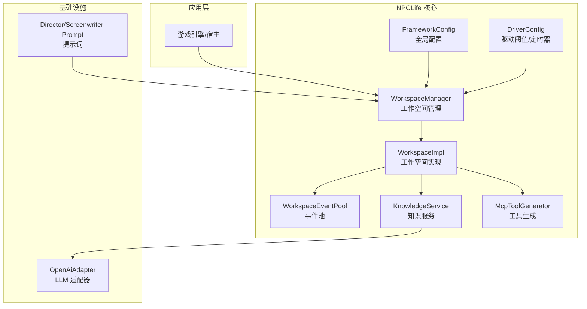
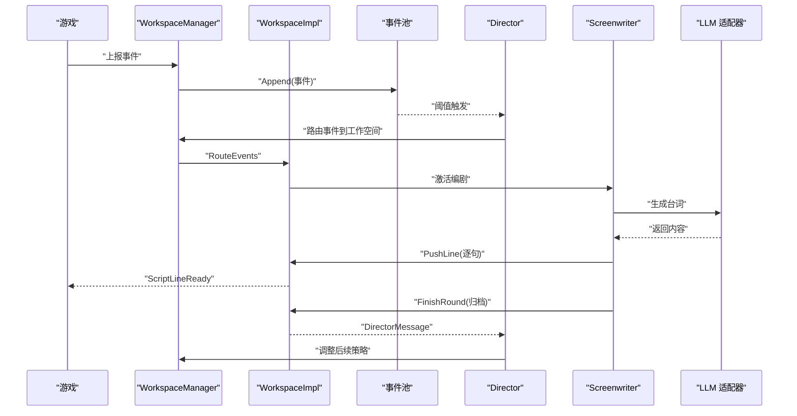
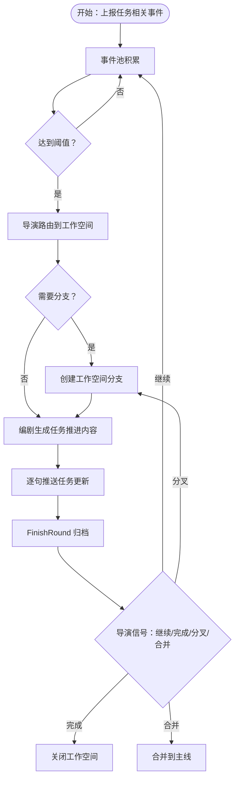
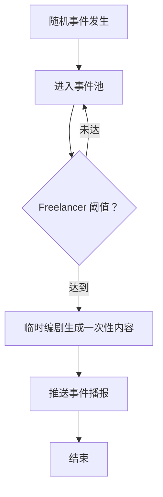
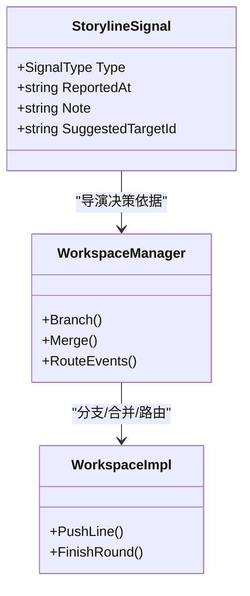
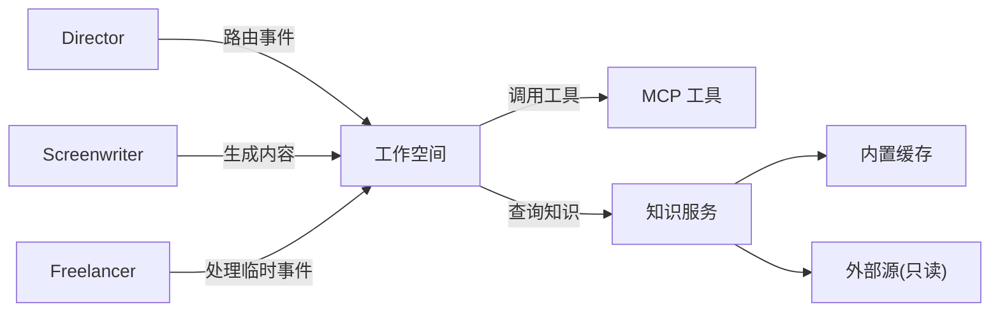
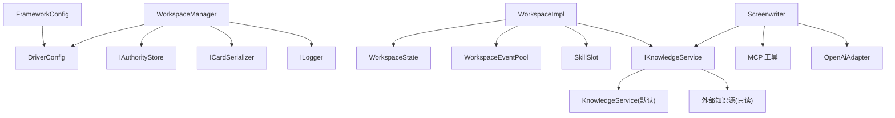

# 应用场景

<cite>
**本文引用的文件**
- [README.md](file://README.md)
- [FrameworkConfig.cs](file://src/NPCLife/Framework/FrameworkConfig.cs)
- [DriverConfig.cs](file://src/NPCLife/Driver/DriverConfig.cs)
- [WorkspaceManager.cs](file://src/NPCLife/Workspace/WorkspaceManager.cs)
- [WorkspaceImpl.cs](file://src/NPCLife/Workspace/WorkspaceImpl.cs)
- [WorkspaceState.cs](file://src/NPCLife/Workspace/WorkspaceState.cs)
- [WorkspaceEventPool.cs](file://src/NPCLife/Workspace/WorkspaceEventPool.cs)
- [EventCard.cs](file://src/NPCLife/Cards/EventCard.cs)
- [CharacterCard.cs](file://src/NPCLife/Cards/CharacterCard.cs)
- [CardDataStructs.cs](file://src/NPCLife/Cards/CardDataStructs.cs)
- [KnowledgeService.cs](file://src/NPCLife/Core/KnowledgeService.cs)
- [McpToolGenerator.cs](file://src/NPCLife/Framework/Mcp/McpToolGenerator.cs)
- [OpenAiAdapter.cs](file://src/NPCLife/Infrastructure/Llm/OpenAiAdapter.cs)
- [DirectorPrompt.txt](file://src/NPCLife/Prompts/DirectorPrompt.txt)
- [ScreenwriterPrompt.txt](file://src/NPCLife/Prompts/ScreenwriterPrompt.txt)
- [StorylineSignal.cs](file://src/NPCLife/Workspace/StorylineSignal.cs)
- [KnowledgeModule.md](file://docs/KnowledgeModule.md)
</cite>

## 目录
1. [引言](#引言)
2. [项目结构](#项目结构)
3. [核心组件](#核心组件)
4. [架构总览](#架构总览)
5. [详细场景分析](#详细场景分析)
6. [依赖关系分析](#依赖关系分析)
7. [性能考量](#性能考量)
8. [故障排查指南](#故障排查指南)
9. [结论](#结论)
10. [附录](#附录)

## 引言
NPCLife 是一个“面向游戏的 LLM 驱动叙事中间件”，目标是让游戏世界中的事件自动触发 AI 驱动的动态剧情生成，为 NPC 提供有因果关系的叙事线索。其核心能力包括：
- 事件池与阈值触发：事件在池中积累，达到数量或重要度阈值后触发 AI 处理，降低 API 调用频率与成本
- 多角色协作：导演（Director）、编剧（Screenwriter）、临时编剧（Freelancer）三类 Agent 通过异步消息协作
- 工作空间（Workspace）：每条剧情线是一个独立工作空间，支持分支、合并、独立生命周期管理
- 上下文隔离：每个工作空间维护独立事件池、对话历史与角色集合，避免上下文污染
- MCP 工具生态：通过特性标注与反射生成工具定义，供 Agent 在生成过程中调用

这些能力使得 NPCLife 非常适用于需要“动态叙事”“多线并行”“可扩展上下文”的游戏类型。

**章节来源**
- [README.md:1-93](file://README.md#L1-L93)

## 项目结构
NPCLife 采用清晰的分层与模块化设计：
- Framework 层：配置、事件总线、日志、JSON 工具、MCP 工具生成、运行时度量等基础设施
- Core 层：知识服务、事件查询、凭证注册、交互历史、存储抽象等核心契约
- Workspace 层：工作空间管理、事件池、回合与状态机、角色技能槽
- Cards 层：事件卡、人物卡、环境卡、目标卡等数据结构
- Driver 层：驱动配置（阈值、定时器、轮次上限等）
- Infrastructure 层：LLM 适配器（OpenAI/Anthropic 等）、知识库内置实现
- Prompts 层：角色提示词模板
- Tests 层：单元测试覆盖关键路径

**图表来源**
- [FrameworkConfig.cs:17-205](file://src/NPCLife/Framework/FrameworkConfig.cs#L17-L205)
- [DriverConfig.cs:9-106](file://src/NPCLife/Driver/DriverConfig.cs#L9-L106)
- [WorkspaceManager.cs:19-616](file://src/NPCLife/Workspace/WorkspaceManager.cs#L19-L616)
- [WorkspaceImpl.cs:16-197](file://src/NPCLife/Workspace/WorkspaceImpl.cs#L16-L197)
- [OpenAiAdapter.cs:18-392](file://src/NPCLife/Infrastructure/Llm/OpenAiAdapter.cs#L18-L392)

**章节来源**
- [README.md:69-87](file://README.md#L69-L87)

## 核心组件
- 全局配置 FrameworkConfig：集中管理驱动参数、诊断开关、功能开关，支持 JSON 序列化/反序列化与校验
- 驱动配置 DriverConfig：为导演、临时编剧、剧情编剧分别设置事件数量与重要度阈值，以及定时器脉冲间隔
- 工作空间管理 WorkspaceManager：负责工作空间的创建、分支、合并、事件路由、持久化与状态机
- 工作空间 WorkspaceImpl：封装事件池、技能槽、剧本行推送与回合收尾，发布事件总线消息
- 事件模型 EventCard：统一的事件接口与可序列化实现，支持标签、关键词、演员引用、重要度、地图提示等
- 知识服务 KnowledgeService：聚合可写缓存与只读外部源，提供并行查询、存储、列举能力
- MCP 工具生成 McpToolGenerator：通过特性反射生成工具定义，供 Agent 调用
- LLM 适配器 OpenAiAdapter：将内部请求格式转换为 OpenAI 兼容格式，处理连接测试、模型列表、请求/响应解析
- 提示词模板：DirectorPrompt、ScreenwriterPrompt 明确角色职责与协作原则

**章节来源**
- [FrameworkConfig.cs:17-247](file://src/NPCLife/Framework/FrameworkConfig.cs#L17-L247)
- [DriverConfig.cs:9-106](file://src/NPCLife/Driver/DriverConfig.cs#L9-L106)
- [WorkspaceManager.cs:19-616](file://src/NPCLife/Workspace/WorkspaceManager.cs#L19-L616)
- [WorkspaceImpl.cs:16-197](file://src/NPCLife/Workspace/WorkspaceImpl.cs#L16-L197)
- [EventCard.cs:11-125](file://src/NPCLife/Cards/EventCard.cs#L11-L125)
- [KnowledgeService.cs:13-65](file://src/NPCLife/Core/KnowledgeService.cs#L13-L65)
- [McpToolGenerator.cs:12-214](file://src/NPCLife/Framework/Mcp/McpToolGenerator.cs#L12-L214)
- [OpenAiAdapter.cs:18-392](file://src/NPCLife/Infrastructure/Llm/OpenAiAdapter.cs#L18-L392)
- [DirectorPrompt.txt:1-18](file://src/NPCLife/Prompts/DirectorPrompt.txt#L1-L18)
- [ScreenwriterPrompt.txt:1-17](file://src/NPCLife/Prompts/ScreenwriterPrompt.txt#L1-L17)

## 架构总览
NPCLife 的工作流围绕“事件池积累 → 导演审查 → 工作空间路由 → 编剧生成 → 台词输出 → 回合归档 → 导演策略更新”展开。导演根据阈值与事件重要度决定路由策略；编剧在工作空间内生成 NPC 台词并逐句推送；完成后向导演留言，指导后续策略。

**图表来源**
- [WorkspaceManager.cs:382-392](file://src/NPCLife/Workspace/WorkspaceManager.cs#L382-L392)
- [WorkspaceImpl.cs:83-123](file://src/NPCLife/Workspace/WorkspaceImpl.cs#L83-L123)
- [WorkspaceImpl.cs:125-182](file://src/NPCLife/Workspace/WorkspaceImpl.cs#L125-L182)
- [OpenAiAdapter.cs:38-74](file://src/NPCLife/Infrastructure/Llm/OpenAiAdapter.cs#L38-L74)

## 详细场景分析

### 场景一：RPG 游戏中的动态任务系统
- 典型事件：战斗胜利、对话选择、探索发现、资源消耗、NPC 死亡/受伤
- 阈值配置：导演与编剧的 Count/Importance 阈值应相对保守，确保任务线稳定推进；可提高 MaxAgentRounds 以支持更长叙事
- 工作空间策略：主线任务作为父线，分支任务（如“调查失踪村民”“阻止商人走私”）作为子线；在关键节点合并
- 知识与工具：注入角色关系、阵营立场、物品定义、任务日志等外部知识源；通过 MCP 工具查询当前任务状态与角色属性
- 输出节奏：使用 PushLine 逐句输出任务更新与 NPC 对话，FinishRound 归档本轮结果与导演留言

**图表来源**
- [DriverConfig.cs:13-29](file://src/NPCLife/Driver/DriverConfig.cs#L13-L29)
- [WorkspaceManager.cs:193-263](file://src/NPCLife/Workspace/WorkspaceManager.cs#L193-L263)
- [WorkspaceManager.cs:269-376](file://src/NPCLife/Workspace/WorkspaceManager.cs#L269-L376)
- [WorkspaceImpl.cs:83-123](file://src/NPCLife/Workspace/WorkspaceImpl.cs#L83-L123)
- [WorkspaceImpl.cs:125-182](file://src/NPCLife/Workspace/WorkspaceImpl.cs#L125-L182)

**章节来源**
- [EventCard.cs:11-39](file://src/NPCLife/Cards/EventCard.cs#L11-L39)
- [KnowledgeModule.md:115-173](file://docs/KnowledgeModule.md#L115-L173)
- [McpToolGenerator.cs:126-166](file://src/NPCLife/Framework/Mcp/McpToolGenerator.cs#L126-L166)

### 场景二：沙盒游戏中的随机事件生成
- 典型事件：天气变化、怪物突袭、资源枯竭、派系冲突、节日庆典
- 阈值配置：临时编剧阈值较低，便于快速响应短期事件；导演定时器脉冲可周期性注入 TimerPulse 事件，维持长期事件流
- 工具与知识：天气、时间、资源、派系关系等卡片数据作为上下文；通过 MCP 工具查询实时环境快照
- 输出节奏：事件优先交给 Freelancer 进行一次性处理，必要时再转入主线工作空间深化

**图表来源**
- [DriverConfig.cs:19-29](file://src/NPCLife/Driver/DriverConfig.cs#L19-L29)
- [DriverConfig.cs:33-39](file://src/NPCLife/Driver/DriverConfig.cs#L33-L39)
- [CardDataStructs.cs:30-37](file://src/NPCLife/Cards/CardDataStructs.cs#L30-L37)

**章节来源**
- [CardDataStructs.cs:6-37](file://src/NPCLife/Cards/CardDataStructs.cs#L6-L37)
- [DriverConfig.cs:54-101](file://src/NPCLife/Driver/DriverConfig.cs#L54-L101)

### 场景三：叙事驱动游戏的分支剧情
- 典型事件：关键对话分歧、道德选择、隐藏线索、多人视角切换
- 工作空间策略：导演根据编剧上报的 StorylineSignal 决策分叉/合并；分支保留各自历史，合并时去重并保留多线证据
- 知识与工具：角色背景、关系网络、阵营立场、时间线等；通过 MCP 工具查询角色状态与历史交互
- 输出节奏：每轮只推送一个回合，保持玩家沉浸感；DirectorMessage 用于明确下一步事件类型

**图表来源**
- [StorylineSignal.cs:31-44](file://src/NPCLife/Workspace/StorylineSignal.cs#L31-L44)
- [WorkspaceManager.cs:193-263](file://src/NPCLife/Workspace/WorkspaceManager.cs#L193-L263)
- [WorkspaceManager.cs:269-376](file://src/NPCLife/Workspace/WorkspaceManager.cs#L269-L376)
- [WorkspaceImpl.cs:83-182](file://src/NPCLife/Workspace/WorkspaceImpl.cs#L83-L182)

**章节来源**
- [StorylineSignal.cs:8-24](file://src/NPCLife/Workspace/StorylineSignal.cs#L8-L24)
- [WorkspaceManager.cs:193-376](file://src/NPCLife/Workspace/WorkspaceManager.cs#L193-L376)

### 场景四：多角色协作与知识驱动的复杂叙事
- 角色职责：Director 审查事件并路由；Screenwriter 生成具体台词与推进；Freelancer 处理临时事件
- 知识库：内置缓存 + 多个外部源（游戏定义、RAG 等）并行查询，统一标注来源与置信度
- MCP 工具：通过特性标注与反射生成工具定义，Agent 可按需调用角色查询、环境感知、关系网络等

**图表来源**
- [DirectorPrompt.txt:1-18](file://src/NPCLife/Prompts/DirectorPrompt.txt#L1-L18)
- [ScreenwriterPrompt.txt:1-17](file://src/NPCLife/Prompts/ScreenwriterPrompt.txt#L1-L17)
- [KnowledgeService.cs:28-48](file://src/NPCLife/Core/KnowledgeService.cs#L28-L48)
- [McpToolGenerator.cs:19-78](file://src/NPCLife/Framework/Mcp/McpToolGenerator.cs#L19-L78)

**章节来源**
- [DirectorPrompt.txt:3-17](file://src/NPCLife/Prompts/DirectorPrompt.txt#L3-L17)
- [ScreenwriterPrompt.txt:3-16](file://src/NPCLife/Prompts/ScreenwriterPrompt.txt#L3-L16)
- [KnowledgeService.cs:13-65](file://src/NPCLife/Core/KnowledgeService.cs#L13-L65)
- [McpToolGenerator.cs:12-214](file://src/NPCLife/Framework/Mcp/McpToolGenerator.cs#L12-L214)

## 依赖关系分析
- 配置层：FrameworkConfig 聚合 DriverConfig、DiagnosticSection、FeatureToggleSection，提供统一校验与序列化
- 工作空间层：WorkspaceManager 依赖 DriverConfig、IAuthorityStore、ICardSerializer、ILogger；WorkspaceImpl 依赖 WorkspaceState、WorkspaceEventPool、SkillSlot
- 事件与卡片：EventCard 提供统一事件接口；CharacterCard/环境卡片提供上下文数据
- 知识与工具：IKnowledgeService 作为单一契约，支持默认实现与第三方自定义实现；McpToolGenerator 通过特性反射生成工具定义
- LLM 适配：OpenAiAdapter 实现 ILlmApiProvider，供 LlmAccessor 使用

**图表来源**
- [FrameworkConfig.cs:17-205](file://src/NPCLife/Framework/FrameworkConfig.cs#L17-L205)
- [WorkspaceManager.cs:19-616](file://src/NPCLife/Workspace/WorkspaceManager.cs#L19-L616)
- [WorkspaceImpl.cs:16-46](file://src/NPCLife/Workspace/WorkspaceImpl.cs#L16-L46)
- [KnowledgeService.cs:13-65](file://src/NPCLife/Core/KnowledgeService.cs#L13-L65)
- [OpenAiAdapter.cs:18-392](file://src/NPCLife/Infrastructure/Llm/OpenAiAdapter.cs#L18-L392)

**章节来源**
- [FrameworkConfig.cs:56-75](file://src/NPCLife/Framework/FrameworkConfig.cs#L56-L75)
- [WorkspaceManager.cs:31-40](file://src/NPCLife/Workspace/WorkspaceManager.cs#L31-L40)
- [KnowledgeModule.md:53-112](file://docs/KnowledgeModule.md#L53-L112)

## 性能考量
- 触发阈值与轮次上限
  - 事件池采用“数量阈值 + 重要度阈值”双阈值，避免频繁调用 LLM；MaxAgentRounds 限制多轮工具调用，防止死循环
  - 配置参考：Director/Screenwriter/Freelancer 的 Count/Importance 阈值可根据事件密度调整；MaxAgentRounds 建议 10～20
- 历史环形缓冲区
  - RecentHistoryCapacity 控制最近事件裁剪，建议 ≥100，避免过小导致上下文丢失
- LLM 调用与成本
  - 通过阈值与轮次限制降低 Token 消耗；OpenAiAdapter 支持连接测试与模型列表查询，便于预检
- 工具调用与度量
  - EnableRuntimeMetrics 可开启运行时度量（工具频率、Token 消耗、知识库命中率），关闭时零开销
- 线程与锁
  - WorkspaceManager 使用 ReaderWriterLockSlim 保护工作空间列表，读多写少场景性能良好

**章节来源**
- [DriverConfig.cs:42-46](file://src/NPCLife/Driver/DriverConfig.cs#L42-L46)
- [FrameworkConfig.cs:63-68](file://src/NPCLife/Framework/FrameworkConfig.cs#L63-L68)
- [FrameworkConfig.cs:243-246](file://src/NPCLife/Framework/FrameworkConfig.cs#L243-L246)
- [OpenAiAdapter.cs:79-112](file://src/NPCLife/Infrastructure/Llm/OpenAiAdapter.cs#L79-L112)

## 故障排查指南
- 配置校验失败
  - 使用 Validate() 检查 Driver 配置合法性（阈值≥1、RecentHistoryCapacity≥10、MaxAgentRounds 合法范围）
- LLM 连接问题
  - 使用 TestConnection() 进行连通性测试；检查 BaseUrl、ApiKey、超时设置；查看日志中的请求/响应片段
- 工具调用异常
  - 检查 MCP 工具定义生成是否正确；确认工具参数必填项与类型匹配；核对工具注册与激活状态
- 工作空间状态机
  - 确认状态转移是否符合约束（Active/Suspended 可转 Completed/Abandoned，Completed/Abandoned 不可逆）
- 事件路由失败
  - 确认目标工作空间存在且处于 Active 状态；事件 Append 成功；Logger 是否记录警告

**章节来源**
- [FrameworkConfig.cs:56-75](file://src/NPCLife/Framework/FrameworkConfig.cs#L56-L75)
- [OpenAiAdapter.cs:79-112](file://src/NPCLife/Infrastructure/Llm/OpenAiAdapter.cs#L79-L112)
- [WorkspaceManager.cs:406-423](file://src/NPCLife/Workspace/WorkspaceManager.cs#L406-L423)
- [WorkspaceManager.cs:382-392](file://src/NPCLife/Workspace/WorkspaceManager.cs#L382-L392)

## 结论
NPCLife 通过“事件池 + 阈值触发 + 多角色协作 + 工作空间分支/合并”的组合，为游戏提供了可扩展、可隔离、可度量的动态叙事能力。针对不同游戏类型，只需调整 DriverConfig 与 FrameworkConfig 的阈值、轮次与功能开关，并注入合适的 MCP 工具与知识源，即可快速落地 RPG 任务系统、沙盒随机事件、叙事分支等场景。建议在集成初期以保守阈值与较低轮次上限起步，逐步优化以平衡叙事质量与性能成本。

## 附录
- 最佳实践清单
  - 明确事件重要度计算规则，避免噪声事件触发
  - 为不同角色设置差异化阈值，导演更关注全局，编剧更关注局部深度
  - 启用运行时度量，持续监控工具调用频率与 Token 消耗
  - 注入高质量 MCP 工具与知识源，提升生成内容的准确性与一致性
  - 使用分支/合并机制管理多线叙事，避免上下文污染
  - 定期持久化工作空间状态，确保崩溃恢复与进度保存