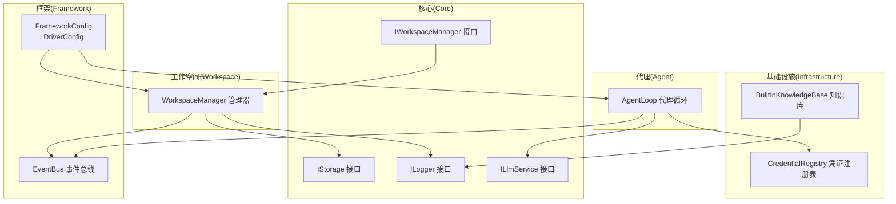
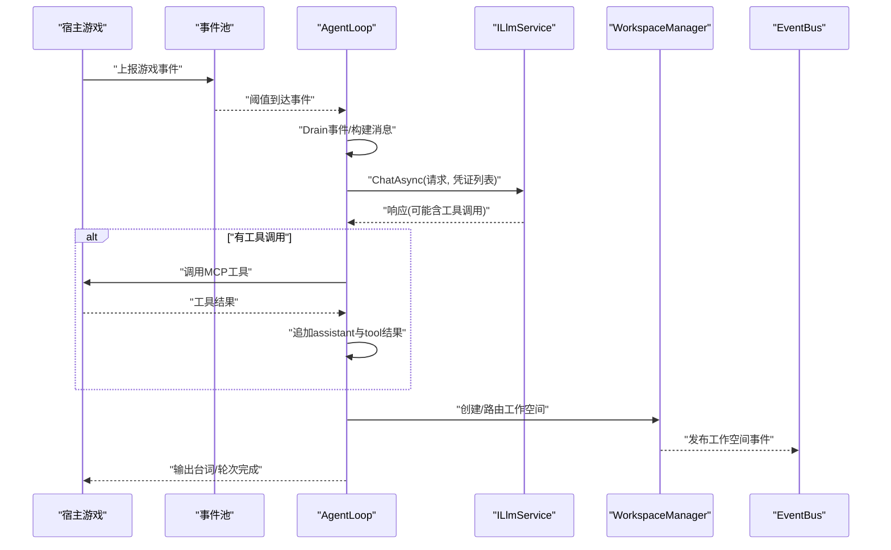
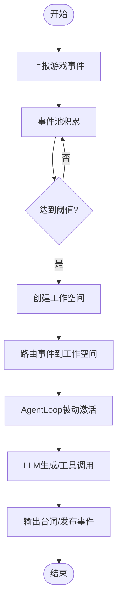
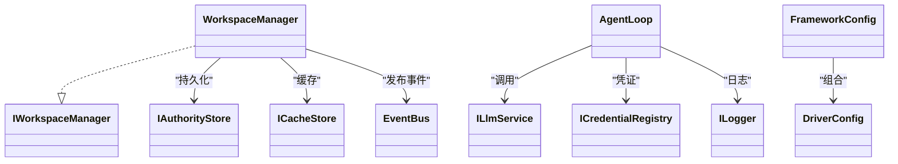

# 快速开始

<cite>
**本文引用的文件**
- [README.md](file://README.md)
- [NPCLife.csproj](file://src/NPCLife/NPCLife.csproj)
- [IStorage.cs](file://src/NPCLife/Core/IStorage.cs)
- [ILogger.cs](file://src/NPCLife/Framework/ILogger.cs)
- [ILlmService.cs](file://src/NPCLife/Core/ILlmService.cs)
- [IWorkspaceManager.cs](file://src/NPCLife/Core/IWorkspaceManager.cs)
- [WorkspaceManager.cs](file://src/NPCLife/Workspace/WorkspaceManager.cs)
- [EventBus.cs](file://src/NPCLife/Framework/EventBus.cs)
- [AgentLoop.cs](file://src/NPCLife/Agent/AgentLoop.cs)
- [DriverConfig.cs](file://src/NPCLife/Driver/DriverConfig.cs)
- [FrameworkConfig.cs](file://src/NPCLife/Framework/FrameworkConfig.cs)
- [CredentialRegistry.cs](file://src/NPCLife/Infrastructure/Llm/CredentialRegistry.cs)
- [BuiltInKnowledgeBase.cs](file://src/NPCLife/Infrastructure/Knowledge/BuiltInKnowledgeBase.cs)
</cite>

## 目录
1. [简介](#简介)
2. [项目结构](#项目结构)
3. [核心组件](#核心组件)
4. [架构总览](#架构总览)
5. [详细组件分析](#详细组件分析)
6. [依赖分析](#依赖分析)
7. [性能考虑](#性能考虑)
8. [故障排除指南](#故障排除指南)
9. [结论](#结论)
10. [附录](#附录)

## 简介
本指南面向希望在30分钟内完成NPCLife基础集成并看到效果的新手。你将学会：
- 如何安装NPCLife库（NuGet）
- 如何实现宿主必需的适配器接口：IStorage、ILogger、ILlmService
- 如何最小化集成以实现“事件上报 → 工作空间创建 → AI生成”的闭环
- 如何进行常见初始化配置与依赖注入模式

## 项目结构
NPCLife是纯逻辑库，不依赖任何游戏引擎，适合嵌入任意C#项目。核心目录与职责概览：
- Core：领域接口与核心契约（IStorage、ILogger、ILlmService、IWorkspaceManager等）
- Framework：通用基础设施（日志、事件总线、配置、JSON工具等）
- Agent：AI代理循环（Director/Screenwriter/Freelancer角色）
- Workspace：工作空间管理与持久化
- Infrastructure：内置实现（知识库、凭证注册表、LLM适配器等）
- Driver：驱动配置（阈值、定时器、轮次限制等）

图表来源
- [IStorage.cs:1-53](file://src/NPCLife/Core/IStorage.cs#L1-L53)
- [ILogger.cs:1-20](file://src/NPCLife/Framework/ILogger.cs#L1-L20)
- [ILlmService.cs:1-51](file://src/NPCLife/Core/ILlmService.cs#L1-L51)
- [IWorkspaceManager.cs:1-58](file://src/NPCLife/Core/IWorkspaceManager.cs#L1-L58)
- [WorkspaceManager.cs:1-616](file://src/NPCLife/Workspace/WorkspaceManager.cs#L1-L616)
- [EventBus.cs:1-243](file://src/NPCLife/Framework/EventBus.cs#L1-L243)
- [AgentLoop.cs:1-581](file://src/NPCLife/Agent/AgentLoop.cs#L1-L581)
- [FrameworkConfig.cs:1-248](file://src/NPCLife/Framework/FrameworkConfig.cs#L1-L248)
- [DriverConfig.cs:1-107](file://src/NPCLife/Driver/DriverConfig.cs#L1-L107)
- [CredentialRegistry.cs:1-327](file://src/NPCLife/Infrastructure/Llm/CredentialRegistry.cs#L1-L327)
- [BuiltInKnowledgeBase.cs:1-206](file://src/NPCLife/Infrastructure/Knowledge/BuiltInKnowledgeBase.cs#L1-L206)

章节来源
- [README.md:1-93](file://README.md#L1-L93)
- [NPCLife.csproj:1-38](file://src/NPCLife/NPCLife.csproj#L1-L38)

## 核心组件
- IStorage：权威存档与缓存存取接口，分别用于工作空间状态与可再生缓存
- ILogger：统一日志接口，宿主注入具体实现
- ILlmService：统一的异步LLM对话契约，支持多凭证回退与连接测试
- IWorkspaceManager：工作空间CRUD、分支/合并、事件路由与持久化

章节来源
- [IStorage.cs:1-53](file://src/NPCLife/Core/IStorage.cs#L1-L53)
- [ILogger.cs:1-20](file://src/NPCLife/Framework/ILogger.cs#L1-L20)
- [ILlmService.cs:1-51](file://src/NPCLife/Core/ILlmService.cs#L1-L51)
- [IWorkspaceManager.cs:1-58](file://src/NPCLife/Core/IWorkspaceManager.cs#L1-L58)

## 架构总览
NPCLife通过事件池积累触发阈值，Director审查事件并路由到工作空间；Screenwriter基于工作空间事件生成NPC台词；Freelancer处理临时事件。AI通过工具调用与MCP协议与外部系统交互。

图表来源
- [AgentLoop.cs:171-337](file://src/NPCLife/Agent/AgentLoop.cs#L171-L337)
- [ILlmService.cs:28-31](file://src/NPCLife/Core/ILlmService.cs#L28-L31)
- [WorkspaceManager.cs:91-138](file://src/NPCLife/Workspace/WorkspaceManager.cs#L91-L138)
- [EventBus.cs:86-113](file://src/NPCLife/Framework/EventBus.cs#L86-L113)

## 详细组件分析

### 安装与准备
- 使用NuGet安装NPCLife库（目标框架支持net48与netstandard2.0）
- 在你的宿主项目中实现以下三个适配器：
  - IStorage（权威存档与缓存）
  - ILogger（日志）
  - ILlmService（LLM服务）

章节来源
- [NPCLife.csproj:1-38](file://src/NPCLife/NPCLife.csproj#L1-L38)
- [README.md:69-87](file://README.md#L69-L87)

### 最小可运行示例（步骤分解）
以下为“事件上报 → 工作空间创建 → AI生成”的最小流程。请按顺序在宿主项目中完成：

1) 实现IStorage与ILogger
- IStorage提供权威存档与缓存两类接口，分别用于工作空间状态与可再生缓存
- ILogger提供Message/Warning/Error三档日志

章节来源
- [IStorage.cs:10-51](file://src/NPCLife/Core/IStorage.cs#L10-L51)
- [ILogger.cs:8-18](file://src/NPCLife/Framework/ILogger.cs#L8-L18)

2) 实现ILlmService（示例：OpenAI/Anthropic适配器）
- ChatAsync：接收统一格式请求与凭证列表，按顺序尝试回退
- TestConnectionAsync：用于配置向导的连通性测试
- ListModelsAsync：列出可用模型（部分API不支持）

章节来源
- [ILlmService.cs:17-49](file://src/NPCLife/Core/ILlmService.cs#L17-L49)

3) 初始化配置与依赖注入
- 使用FrameworkConfig与DriverConfig设置阈值、轮次上限、定时器等
- 注入ILogger、IStorage、ILlmService、Func<string>时间提供者
- 可选：内置知识库与凭证注册表作为参考实现

章节来源
- [FrameworkConfig.cs:17-75](file://src/NPCLife/Framework/FrameworkConfig.cs#L17-L75)
- [DriverConfig.cs:9-105](file://src/NPCLife/Driver/DriverConfig.cs#L9-L105)
- [CredentialRegistry.cs:20-52](file://src/NPCLife/Infrastructure/Llm/CredentialRegistry.cs#L20-L52)
- [BuiltInKnowledgeBase.cs:13-29](file://src/NPCLife/Infrastructure/Knowledge/BuiltInKnowledgeBase.cs#L13-L29)

4) 创建工作空间并上报事件
- 通过IWorkspaceManager.Create创建工作空间
- 通过RouteEvents将事件池化
- 事件积累达到阈值后，AgentLoop被动激活并生成内容

章节来源
- [IWorkspaceManager.cs:14-56](file://src/NPCLife/Core/IWorkspaceManager.cs#L14-L56)
- [WorkspaceManager.cs:91-138](file://src/NPCLife/Workspace/WorkspaceManager.cs#L91-L138)
- [WorkspaceManager.cs:382-392](file://src/NPCLife/Workspace/WorkspaceManager.cs#L382-L392)

5) 订阅事件总线观察运行状态
- 订阅FrameworkEvents.WorkspaceCreated/Updated/ScriptLineReady等事件
- 逐步验证工作空间创建、事件路由、台词输出

章节来源
- [EventBus.cs:186-241](file://src/NPCLife/Framework/EventBus.cs#L186-L241)
- [WorkspaceManager.cs:134-137](file://src/NPCLife/Workspace/WorkspaceManager.cs#L134-L137)
- [WorkspaceManager.cs:260-262](file://src/NPCLife/Workspace/WorkspaceManager.cs#L260-L262)

### 依赖注入模式（建议）
- 服务容器注册顺序建议：
  1) 注册ILogger实现
  2) 注册IStorage实现
  3) 注册ILlmService实现
  4) 注册Func<string>时间提供者
  5) 注册DriverConfig/FrameworkConfig
  6) 注册WorkspaceManager
  7) 注册AgentLoop（可选，按角色）
- 通过构造函数注入上述依赖，避免硬编码

章节来源
- [WorkspaceManager.cs:31-40](file://src/NPCLife/Workspace/WorkspaceManager.cs#L31-L40)
- [AgentLoop.cs:86-116](file://src/NPCLife/Agent/AgentLoop.cs#L86-L116)
- [FrameworkConfig.cs:197-205](file://src/NPCLife/Framework/FrameworkConfig.cs#L197-L205)

### 事件上报与工作空间创建流程图

图表来源
- [WorkspaceManager.cs:91-138](file://src/NPCLife/Workspace/WorkspaceManager.cs#L91-L138)
- [WorkspaceManager.cs:382-392](file://src/NPCLife/Workspace/WorkspaceManager.cs#L382-L392)
- [AgentLoop.cs:171-337](file://src/NPCLife/Agent/AgentLoop.cs#L171-L337)
- [EventBus.cs:86-113](file://src/NPCLife/Framework/EventBus.cs#L86-L113)

## 依赖分析
- IWorkspaceManager依赖IAuthorityStore与ICacheStore（通过WorkspaceManager实现）
- AgentLoop依赖ILlmService、ICredentialRegistry、ILogger、IKnowledgeService（可选）
- EventBus为纯静态事件总线，零外部依赖
- FrameworkConfig/DriverConfig为配置载体，不参与业务逻辑耦合

图表来源
- [IWorkspaceManager.cs:14-56](file://src/NPCLife/Core/IWorkspaceManager.cs#L14-L56)
- [WorkspaceManager.cs:19-40](file://src/NPCLife/Workspace/WorkspaceManager.cs#L19-L40)
- [AgentLoop.cs:43-116](file://src/NPCLife/Agent/AgentLoop.cs#L43-L116)
- [EventBus.cs:17-33](file://src/NPCLife/Framework/EventBus.cs#L17-L33)
- [FrameworkConfig.cs:17-31](file://src/NPCLife/Framework/FrameworkConfig.cs#L17-L31)
- [DriverConfig.cs:9-105](file://src/NPCLife/Driver/DriverConfig.cs#L9-L105)

章节来源
- [WorkspaceManager.cs:19-40](file://src/NPCLife/Workspace/WorkspaceManager.cs#L19-L40)
- [AgentLoop.cs:43-116](file://src/NPCLife/Agent/AgentLoop.cs#L43-L116)
- [EventBus.cs:17-33](file://src/NPCLife/Framework/EventBus.cs#L17-L33)

## 性能考虑
- 事件阈值触发：通过DriverConfig的分角色阈值与MaxAgentRounds限制API调用频率
- 无状态LLM服务：ILlmService完全无状态，Task完成后回到主线程，避免UI阻塞
- 缓存与权威存储分离：减少持久化压力，提升启动速度
- 日志级别与追踪：通过FrameworkConfig.Diagnostics控制详细日志与追踪开销

章节来源
- [DriverConfig.cs:13-46](file://src/NPCLife/Driver/DriverConfig.cs#L13-L46)
- [ILlmService.cs:17-16](file://src/NPCLife/Core/ILlmService.cs#L17-L16)
- [FrameworkConfig.cs:211-246](file://src/NPCLife/Framework/FrameworkConfig.cs#L211-L246)

## 故障排除指南
- LLM连接失败：使用ILlmService.TestConnectionAsync进行连通性测试
- 凭证问题：检查CredentialRegistry中别名与活跃顺序，确认IsChatReady
- 工作空间未保存：调用WorkspaceManager.Persist并在合适时机持久化
- 事件未触发：确认DriverConfig阈值与定时器设置，检查EventBus订阅

章节来源
- [ILlmService.cs:38-39](file://src/NPCLife/Core/ILlmService.cs#L38-L39)
- [CredentialRegistry.cs:58-153](file://src/NPCLife/Infrastructure/Llm/CredentialRegistry.cs#L58-L153)
- [WorkspaceManager.cs:50-74](file://src/NPCLife/Workspace/WorkspaceManager.cs#L50-L74)
- [EventBus.cs:38-86](file://src/NPCLife/Framework/EventBus.cs#L38-L86)

## 结论
通过实现IStorage、ILogger、ILlmService三个适配器，并完成FrameworkConfig/DriverConfig的基础配置，你可以在30分钟内完成NPCLife的最小集成，实现“事件上报 → 工作空间创建 → AI生成”的闭环。随后可根据需要扩展MCP工具、知识库与凭证管理。

## 附录

### 常见初始化配置清单
- DriverConfig：分角色阈值、定时器、最大轮次
- FrameworkConfig：驱动、诊断、功能开关
- WorkspaceManager：注册IAuthorityStore/ICacheStore、ILogger、时间提供者
- AgentLoop：注册ILlmService、ICredentialRegistry、ILogger、系统提示词、技能ID

章节来源
- [DriverConfig.cs:54-101](file://src/NPCLife/Driver/DriverConfig.cs#L54-L101)
- [FrameworkConfig.cs:197-205](file://src/NPCLife/Framework/FrameworkConfig.cs#L197-L205)
- [WorkspaceManager.cs:31-40](file://src/NPCLife/Workspace/WorkspaceManager.cs#L31-L40)
- [AgentLoop.cs:86-116](file://src/NPCLife/Agent/AgentLoop.cs#L86-L116)