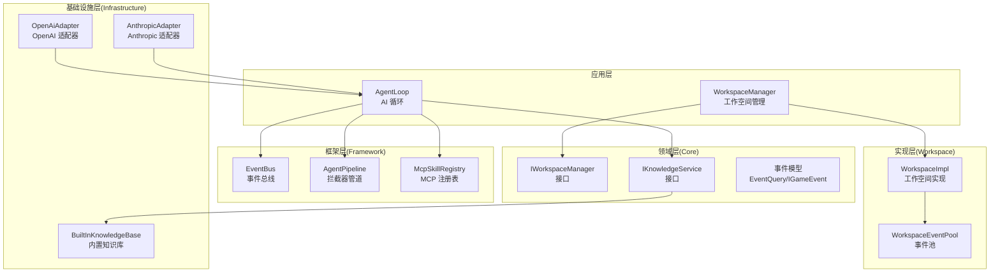
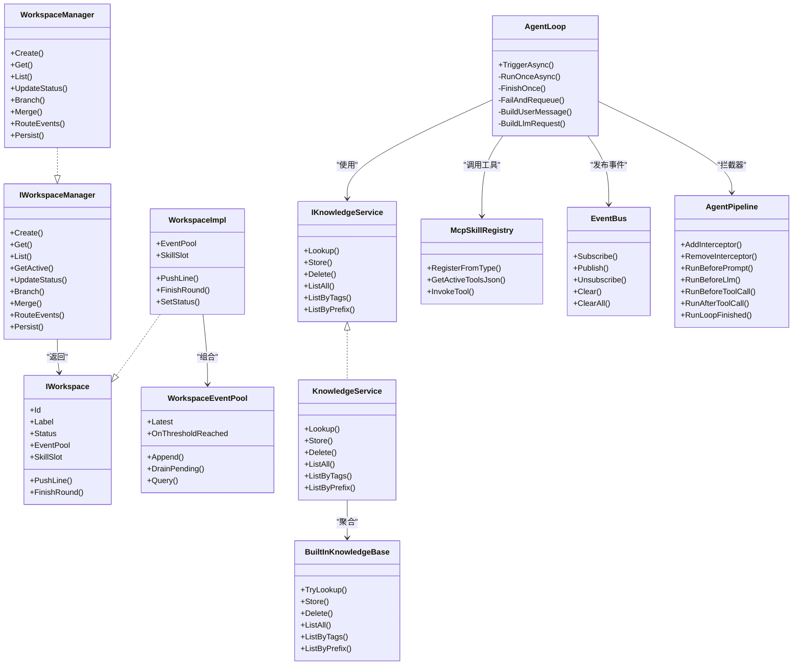
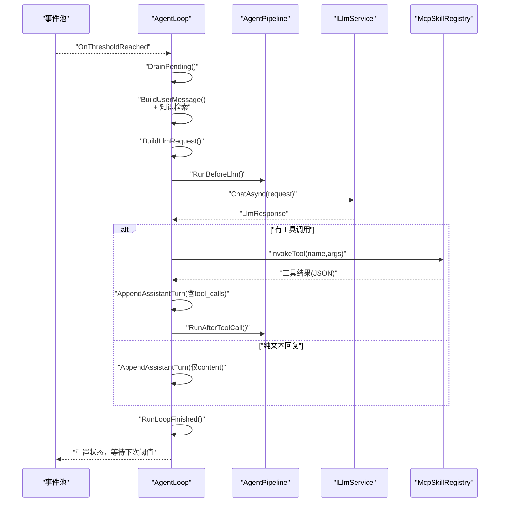
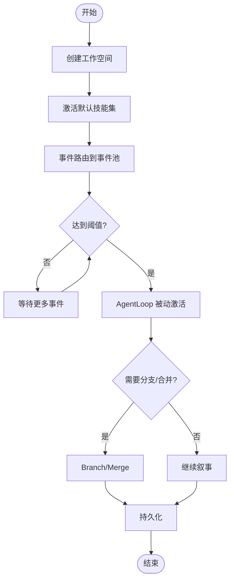
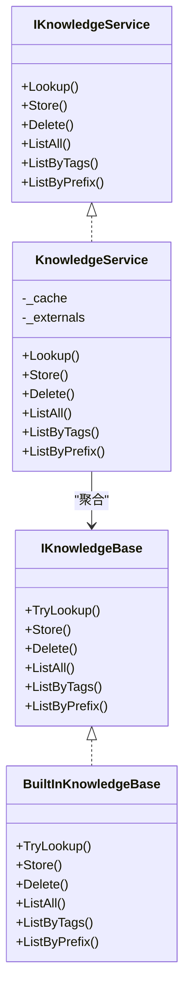
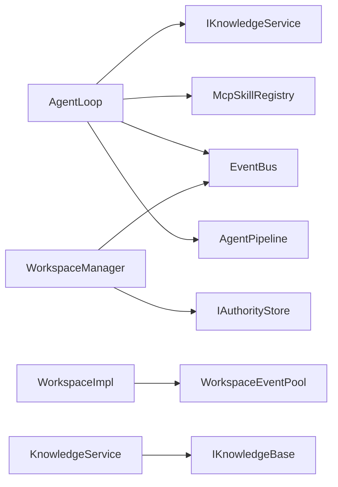

# 架构概览

<cite>
**本文引用的文件**
- [AgentLoop.cs](file://src/NPCLife/Agent/AgentLoop.cs)
- [WorkspaceManager.cs](file://src/NPCLife/Workspace/WorkspaceManager.cs)
- [IWorkspaceManager.cs](file://src/NPCLife/Core/IWorkspaceManager.cs)
- [IWorkspace.cs](file://src/NPCLife/Workspace/IWorkspace.cs)
- [WorkspaceImpl.cs](file://src/NPCLife/Workspace/WorkspaceImpl.cs)
- [WorkspaceEventPool.cs](file://src/NPCLife/Workspace/WorkspaceEventPool.cs)
- [IKnowledgeService.cs](file://src/NPCLife/Core/IKnowledgeService.cs)
- [KnowledgeService.cs](file://src/NPCLife/Core/KnowledgeService.cs)
- [BuiltInKnowledgeBase.cs](file://src/NPCLife/Infrastructure/Knowledge/BuiltInKnowledgeBase.cs)
- [AgentPipeline.cs](file://src/NPCLife/Framework/AgentPipeline.cs)
- [EventBus.cs](file://src/NPCLife/Framework/EventBus.cs)
- [McpSkillRegistry.cs](file://src/NPCLife/Framework/Mcp/McpSkillRegistry.cs)
- [OpenAiAdapter.cs](file://src/NPCLife/Infrastructure/Llm/OpenAiAdapter.cs)
- [AnthropicAdapter.cs](file://src/NPCLife/Infrastructure/Llm/AnthropicAdapter.cs)
- [README.md](file://README.md)
</cite>

## 目录
1. [引言](#引言)
2. [项目结构](#项目结构)
3. [核心组件](#核心组件)
4. [架构总览](#架构总览)
5. [详细组件分析](#详细组件分析)
6. [依赖关系分析](#依赖关系分析)
7. [性能考量](#性能考量)
8. [故障排查指南](#故障排查指南)
9. [结论](#结论)

## 引言
NPCLife 是一个面向游戏的 LLM 驱动叙事中间件，采用分层架构、事件驱动与适配器模式相结合的设计。系统围绕“工作空间（Workspace）”组织剧情线，通过事件池阈值触发 AI 审查与生成，借助 MCP 工具集实现可控的外部能力扩展，并通过统一的事件总线进行解耦协作。

## 项目结构
项目采用按领域与层次混合的组织方式：
- Core 层：定义核心接口与领域模型（事件、知识、工作空间状态等）
- Workspace 层：工作空间的实现与事件池
- Agent 层：AI 循环（AgentLoop）负责事件消费、提示词构建、LLM 调用与工具调用
- Framework 层：通用基础设施（事件总线、拦截器管道、MCP 注册表、日志、JSON 工具等）
- Infrastructure 层：适配器实现（LLM 适配器、知识库、存储等）
- Driver 层：驱动配置与提示词模板
- Cards 层：卡牌与事件数据结构
- Prompts 层：角色提示词模板

**图表来源**
- [AgentLoop.cs](file://src/NPCLife/Agent/AgentLoop.cs)
- [WorkspaceManager.cs](file://src/NPCLife/Workspace/WorkspaceManager.cs)
- [IWorkspaceManager.cs](file://src/NPCLife/Core/IWorkspaceManager.cs)
- [WorkspaceImpl.cs](file://src/NPCLife/Workspace/WorkspaceImpl.cs)
- [WorkspaceEventPool.cs](file://src/NPCLife/Workspace/WorkspaceEventPool.cs)
- [IKnowledgeService.cs](file://src/NPCLife/Core/IKnowledgeService.cs)
- [KnowledgeService.cs](file://src/NPCLife/Core/KnowledgeService.cs)
- [BuiltInKnowledgeBase.cs](file://src/NPCLife/Infrastructure/Knowledge/BuiltInKnowledgeBase.cs)
- [AgentPipeline.cs](file://src/NPCLife/Framework/AgentPipeline.cs)
- [EventBus.cs](file://src/NPCLife/Framework/EventBus.cs)
- [McpSkillRegistry.cs](file://src/NPCLife/Framework/Mcp/McpSkillRegistry.cs)
- [OpenAiAdapter.cs](file://src/NPCLife/Infrastructure/Llm/OpenAiAdapter.cs)
- [AnthropicAdapter.cs](file://src/NPCLife/Infrastructure/Llm/AnthropicAdapter.cs)

**章节来源**
- [README.md](file://README.md)
- [AgentLoop.cs](file://src/NPCLife/Agent/AgentLoop.cs)
- [WorkspaceManager.cs](file://src/NPCLife/Workspace/WorkspaceManager.cs)
- [IWorkspaceManager.cs](file://src/NPCLife/Core/IWorkspaceManager.cs)
- [WorkspaceImpl.cs](file://src/NPCLife/Workspace/WorkspaceImpl.cs)
- [WorkspaceEventPool.cs](file://src/NPCLife/Workspace/WorkspaceEventPool.cs)
- [IKnowledgeService.cs](file://src/NPCLife/Core/IKnowledgeService.cs)
- [KnowledgeService.cs](file://src/NPCLife/Core/KnowledgeService.cs)
- [BuiltInKnowledgeBase.cs](file://src/NPCLife/Infrastructure/Knowledge/BuiltInKnowledgeBase.cs)
- [AgentPipeline.cs](file://src/NPCLife/Framework/AgentPipeline.cs)
- [EventBus.cs](file://src/NPCLife/Framework/EventBus.cs)
- [McpSkillRegistry.cs](file://src/NPCLife/Framework/Mcp/McpSkillRegistry.cs)
- [OpenAiAdapter.cs](file://src/NPCLife/Infrastructure/Llm/OpenAiAdapter.cs)
- [AnthropicAdapter.cs](file://src/NPCLife/Infrastructure/Llm/AnthropicAdapter.cs)

## 核心组件
- AgentLoop：基于事件阈值被动激活的 AI 循环，负责事件抽取、提示词构建、LLM 请求、工具调用与结果注入，贯穿统一的状态机与拦截器管道。
- WorkspaceManager：工作空间的 CRUD、分支/合并、事件路由与持久化，通过 WorkspaceImpl 暴露门面接口 IWorkspace。
- IWorkspace/WorkspaceImpl：工作空间门面与实现，封装事件池与技能槽，提供叙事操作（推送台词、结束轮次）。
- WorkspaceEventPool：双层缓冲事件池（持久化的 pending 与内存 recent 历史），按阈值触发 OnThresholdReached。
- IKnowledgeService/KnowledgeService/BuiltInKnowledgeBase：知识服务抽象与默认实现，聚合可写内置知识库与只读外部源。
- AgentPipeline：Agent 循环的拦截器管道，提供 BeforePrompt/BeforeLlm/BeforeToolCall/AfterToolCall/LoopFinished 等扩展点。
- EventBus：通用事件总线，支持命名空间事件名、优先级排序与错误隔离。
- McpSkillRegistry：MCP 技能与工具注册中心，提供工具定义查询与调用。
- OpenAiAdapter/AnthropicAdapter：LLM 适配器，屏蔽不同厂商 API 差异，统一对外暴露 ILlmApiProvider。

**章节来源**
- [AgentLoop.cs](file://src/NPCLife/Agent/AgentLoop.cs)
- [WorkspaceManager.cs](file://src/NPCLife/Workspace/WorkspaceManager.cs)
- [IWorkspaceManager.cs](file://src/NPCLife/Core/IWorkspaceManager.cs)
- [IWorkspace.cs](file://src/NPCLife/Workspace/IWorkspace.cs)
- [WorkspaceImpl.cs](file://src/NPCLife/Workspace/WorkspaceImpl.cs)
- [WorkspaceEventPool.cs](file://src/NPCLife/Workspace/WorkspaceEventPool.cs)
- [IKnowledgeService.cs](file://src/NPCLife/Core/IKnowledgeService.cs)
- [KnowledgeService.cs](file://src/NPCLife/Core/KnowledgeService.cs)
- [BuiltInKnowledgeBase.cs](file://src/NPCLife/Infrastructure/Knowledge/BuiltInKnowledgeBase.cs)
- [AgentPipeline.cs](file://src/NPCLife/Framework/AgentPipeline.cs)
- [EventBus.cs](file://src/NPCLife/Framework/EventBus.cs)
- [McpSkillRegistry.cs](file://src/NPCLife/Framework/Mcp/McpSkillRegistry.cs)
- [OpenAiAdapter.cs](file://src/NPCLife/Infrastructure/Llm/OpenAiAdapter.cs)
- [AnthropicAdapter.cs](file://src/NPCLife/Infrastructure/Llm/AnthropicAdapter.cs)

## 架构总览
NPCLife 采用分层架构与事件驱动模式：
- 分层架构：Core 定义契约，Framework 提供通用设施，Infrastructure 实现适配器，Workspace/Agent 实现业务闭环。
- 事件驱动：WorkspaceEventPool 以阈值触发事件，AgentLoop 订阅 OnThresholdReached 被动激活；EventBus 用于跨组件解耦通信。
- 适配器模式：OpenAiAdapter/AnthropicAdapter 将不同 LLM API 统一为 ILlmApiProvider；McpSkillRegistry 将工具能力抽象为统一调用入口。
- 拦截器管道：AgentPipeline 在关键阶段注入可插拔逻辑，便于审计、限流、校验与扩展。

**图表来源**
- [AgentLoop.cs](file://src/NPCLife/Agent/AgentLoop.cs)
- [WorkspaceManager.cs](file://src/NPCLife/Workspace/WorkspaceManager.cs)
- [IWorkspaceManager.cs](file://src/NPCLife/Core/IWorkspaceManager.cs)
- [IWorkspace.cs](file://src/NPCLife/Workspace/IWorkspace.cs)
- [WorkspaceImpl.cs](file://src/NPCLife/Workspace/WorkspaceImpl.cs)
- [WorkspaceEventPool.cs](file://src/NPCLife/Workspace/WorkspaceEventPool.cs)
- [IKnowledgeService.cs](file://src/NPCLife/Core/IKnowledgeService.cs)
- [KnowledgeService.cs](file://src/NPCLife/Core/KnowledgeService.cs)
- [BuiltInKnowledgeBase.cs](file://src/NPCLife/Infrastructure/Knowledge/BuiltInKnowledgeBase.cs)
- [AgentPipeline.cs](file://src/NPCLife/Framework/AgentPipeline.cs)
- [EventBus.cs](file://src/NPCLife/Framework/EventBus.cs)
- [McpSkillRegistry.cs](file://src/NPCLife/Framework/Mcp/McpSkillRegistry.cs)

## 详细组件分析

### AgentLoop：事件驱动的 AI 循环
- 角色与职责：被动激活（订阅事件池阈值）、构建提示词、调用 LLM、执行工具、注入结果、发布事件。
- 状态机：Idle/DrainingEvents/BuildingRequest/CallingLlm/ExecutingTools/AppendingToolResults/Finishing/Error，防止重入与异常恢复。
- 关键流程：
  - 事件池阈值达到 → DrainPending → 构建用户消息（含知识检索与上下文）→ 构建 LLM 请求 → 拦截器 BeforeLlm → LLM 调用 → 工具调用循环（拦截器 Before/After ToolCall）→ 追加工具结果 → 发布事件 → 结束或继续。
- 与知识服务协作：从事件关键词去重后批量查询 IKnowledgeService，缺失项提示学习，命中项注入提示词。
- 与 MCP 协作：通过 McpSkillRegistry 查询激活工具定义，调用工具并注入工具结果消息。

**图表来源**
- [AgentLoop.cs](file://src/NPCLife/Agent/AgentLoop.cs)
- [AgentPipeline.cs](file://src/NPCLife/Framework/AgentPipeline.cs)
- [McpSkillRegistry.cs](file://src/NPCLife/Framework/Mcp/McpSkillRegistry.cs)

**章节来源**
- [AgentLoop.cs](file://src/NPCLife/Agent/AgentLoop.cs)

### WorkspaceManager：工作空间生命周期与路由
- 职责：CRUD、分支/合并、事件路由、持久化。
- 与 WorkspaceImpl 的关系：管理内存中的 WorkspaceImpl 列表，持久化键为固定字符串，序列化 WorkspaceState。
- 事件路由：将事件写入目标工作空间的事件池（IEventLog），由 AgentLoop 订阅阈值被动激活。
- 状态机约束：仅允许特定状态间的合法转换，避免非法状态变更。

**图表来源**
- [WorkspaceManager.cs](file://src/NPCLife/Workspace/WorkspaceManager.cs)
- [WorkspaceEventPool.cs](file://src/NPCLife/Workspace/WorkspaceEventPool.cs)
- [IWorkspaceManager.cs](file://src/NPCLife/Core/IWorkspaceManager.cs)

**章节来源**
- [WorkspaceManager.cs](file://src/NPCLife/Workspace/WorkspaceManager.cs)
- [IWorkspaceManager.cs](file://src/NPCLife/Core/IWorkspaceManager.cs)
- [WorkspaceEventPool.cs](file://src/NPCLife/Workspace/WorkspaceEventPool.cs)

### WorkspaceImpl/IWorkspace：工作空间门面与组件
- 门面接口 IWorkspace 暴露只读元数据与内部组件（事件池、技能槽），状态变更由 WorkspaceManager 控制。
- 内部组件：
  - WorkspaceEventPool：双层缓冲（持久化 pending + 内存 recent），阈值触发。
  - SkillSlot：管理 MCP 技能激活状态，变更时回调更新。
- 叙事操作：
  - PushLine：编剧/临时编剧推送台词，立即发布 ScriptLineReady 事件。
  - FinishRound：结束本轮，归档 Recap/Outcome/DirectorMessage，发布 ScriptReady 事件。

**章节来源**
- [IWorkspace.cs](file://src/NPCLife/Workspace/IWorkspace.cs)
- [WorkspaceImpl.cs](file://src/NPCLife/Workspace/WorkspaceImpl.cs)
- [WorkspaceEventPool.cs](file://src/NPCLife/Workspace/WorkspaceEventPool.cs)

### 知识服务：IKnowledgeService 与默认实现
- IKnowledgeService 抽象知识检索与管理能力，第三方可完全自定义实现。
- KnowledgeService 默认实现：
  - 聚合 IKnowledgeBase（可写）与 IExternalKnowledgeSource[]（只读）。
  - Lookup 并行查询内部缓存与外部源，返回全部命中结果。
  - Store/Delete/List* 代理到 IKnowledgeBase。
- BuiltInKnowledgeBase：
  - 字典存储，大小写不敏感，持久化到 ICacheStore。
  - 支持前缀与标签筛选，无容量限制与淘汰策略。

**图表来源**
- [IKnowledgeService.cs](file://src/NPCLife/Core/IKnowledgeService.cs)
- [KnowledgeService.cs](file://src/NPCLife/Core/KnowledgeService.cs)
- [BuiltInKnowledgeBase.cs](file://src/NPCLife/Infrastructure/Knowledge/BuiltInKnowledgeBase.cs)

**章节来源**
- [IKnowledgeService.cs](file://src/NPCLife/Core/IKnowledgeService.cs)
- [KnowledgeService.cs](file://src/NPCLife/Core/KnowledgeService.cs)
- [BuiltInKnowledgeBase.cs](file://src/NPCLife/Infrastructure/Knowledge/BuiltInKnowledgeBase.cs)

### AgentPipeline：拦截器管道
- 拦截点：BeforePrompt/BeforeLlm/BeforeToolCall/AfterToolCall/LoopFinished。
- 优先级：priority 越小越先执行，支持动态增删与快照执行。
- 用途：审计统计、参数校验、限流、结果改写、异常隔离。

**章节来源**
- [AgentPipeline.cs](file://src/NPCLife/Framework/AgentPipeline.cs)

### EventBus：事件总线
- 功能：发布/订阅、命名空间事件名、优先级排序、错误隔离、调试接口。
- 用途：Agent/Workspace/MCP 工具调用等跨组件解耦通信。

**章节来源**
- [EventBus.cs](file://src/NPCLife/Framework/EventBus.cs)

### McpSkillRegistry：MCP 工具注册与调用
- 能力：注册技能与工具、生成工具定义 JSON、在激活技能范围内调用工具。
- 调用顺序：业务技能 → system 技能（fallback），失败返回错误 JSON。
- 与 AgentLoop 协作：提供工具定义注入提示词，调用工具并注入结果消息。

**章节来源**
- [McpSkillRegistry.cs](file://src/NPCLife/Framework/Mcp/McpSkillRegistry.cs)

### LLM 适配器：OpenAI 与 Anthropic
- OpenAiAdapter：将内部统一格式转换为 OpenAI Chat Completions 请求/响应，支持连接测试与模型列举。
- AnthropicAdapter：适配 Messages API，处理 system 顶层字段、tool content 块与 stop_reason 映射。
- 两者均实现 ILlmApiProvider，由上层 LlmAccessor 统一调度。

**章节来源**
- [OpenAiAdapter.cs](file://src/NPCLife/Infrastructure/Llm/OpenAiAdapter.cs)
- [AnthropicAdapter.cs](file://src/NPCLife/Infrastructure/Llm/AnthropicAdapter.cs)

## 依赖关系分析
- 组件耦合：
  - AgentLoop 依赖 IKnowledgeService、McpSkillRegistry、EventBus、AgentPipeline、ICredentialRegistry、ILlmService。
  - WorkspaceManager 依赖 IAuthorityStore、ILogger、DriverConfig、ICardSerializer、EventBus。
  - WorkspaceImpl 组合 WorkspaceEventPool 与 SkillSlot，受 WorkspaceManager 管理。
  - KnowledgeService 聚合 IKnowledgeBase 与 IExternalKnowledgeSource。
- 外部依赖：
  - HttpClient（适配器层）、JSON 解析/序列化工具（Framework 层）、ReaderWriterLockSlim（WorkspaceManager）。
- 潜在循环依赖：
  - 通过接口解耦，未见直接循环依赖；事件总线与拦截器提供横切关注点，避免侵入式耦合。

**图表来源**
- [AgentLoop.cs](file://src/NPCLife/Agent/AgentLoop.cs)
- [WorkspaceManager.cs](file://src/NPCLife/Workspace/WorkspaceManager.cs)
- [WorkspaceImpl.cs](file://src/NPCLife/Workspace/WorkspaceImpl.cs)
- [WorkspaceEventPool.cs](file://src/NPCLife/Workspace/WorkspaceEventPool.cs)
- [IKnowledgeService.cs](file://src/NPCLife/Core/IKnowledgeService.cs)
- [KnowledgeService.cs](file://src/NPCLife/Core/KnowledgeService.cs)

**章节来源**
- [AgentLoop.cs](file://src/NPCLife/Agent/AgentLoop.cs)
- [WorkspaceManager.cs](file://src/NPCLife/Workspace/WorkspaceManager.cs)
- [WorkspaceImpl.cs](file://src/NPCLife/Workspace/WorkspaceImpl.cs)
- [WorkspaceEventPool.cs](file://src/NPCLife/Workspace/WorkspaceEventPool.cs)
- [IKnowledgeService.cs](file://src/NPCLife/Core/IKnowledgeService.cs)
- [KnowledgeService.cs](file://src/NPCLife/Core/KnowledgeService.cs)

## 性能考量
- 事件阈值触发：减少不必要的 LLM 调用，平衡质量与成本。
- 双层事件池：持久化 pending 与内存 recent，兼顾可靠性与查询效率。
- 知识检索并行：IKnowledgeService.Lookup 并行查询内部与外部源，降低延迟。
- 拦截器零开销：默认无拦截器时为零开销，按需注入。
- 适配器统一：屏蔽 API 差异，便于替换与扩展，避免重复适配成本。

## 故障排查指南
- AgentLoop 常见问题：
  - 无可用凭证：抛出异常并回灌事件，检查 ICredentialRegistry。
  - 工具调用被拦截器取消：检查 AgentPipeline 拦截器优先级与 Cancelled 标记。
  - Transcript 校验失败：检查消息历史结构，确保 assistant/tool 结构正确。
- WorkspaceManager：
  - 状态转换无效：检查 WorkspaceStatus 合法性。
  - 持久化失败：检查 IAuthorityStore 实现与日志。
- 知识服务：
  - Lookup 无命中：确认关键词大小写与外部源可用性。
  - Store/Load 失败：检查 ICacheStore 实现与 JSON 序列化。
- 事件总线：
  - 订阅无回调：检查事件名大小写与优先级排序。
- LLM 适配器：
  - HTTP 错误/超时：检查 BaseUrl、ApiKey、超时配置与网络连通性。

**章节来源**
- [AgentLoop.cs](file://src/NPCLife/Agent/AgentLoop.cs)
- [WorkspaceManager.cs](file://src/NPCLife/Workspace/WorkspaceManager.cs)
- [EventBus.cs](file://src/NPCLife/Framework/EventBus.cs)
- [OpenAiAdapter.cs](file://src/NPCLife/Infrastructure/Llm/OpenAiAdapter.cs)
- [AnthropicAdapter.cs](file://src/NPCLife/Infrastructure/Llm/AnthropicAdapter.cs)

## 结论
NPCLife 通过清晰的分层、事件驱动与适配器模式，实现了可扩展、可维护且高性能的叙事中间件。AgentLoop 作为核心编排单元，结合 Workspace 管理与 MCP 工具集，形成“事件 → 审查 → 生成 → 输出”的闭环；IKnowledgeService 提供可插拔的知识检索能力；EventBus 与 AgentPipeline 保证跨组件解耦与可观测性。该架构既满足游戏叙事的动态需求，也为第三方扩展提供了稳定的接入点与演进空间。