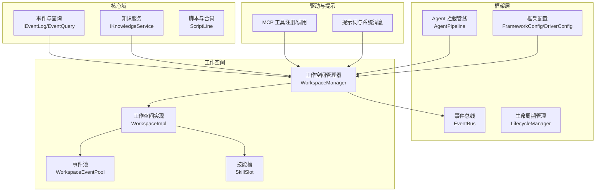
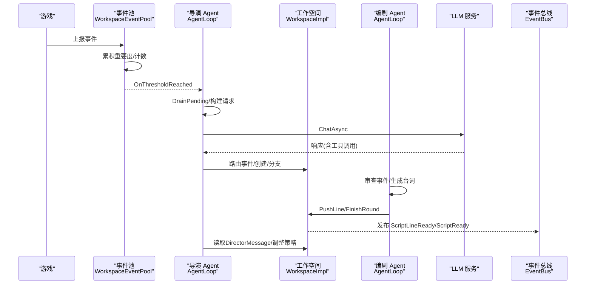
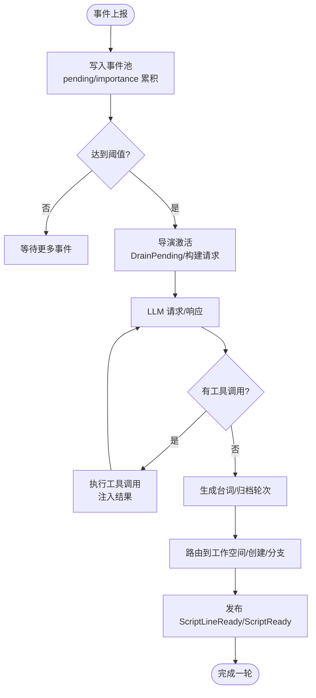
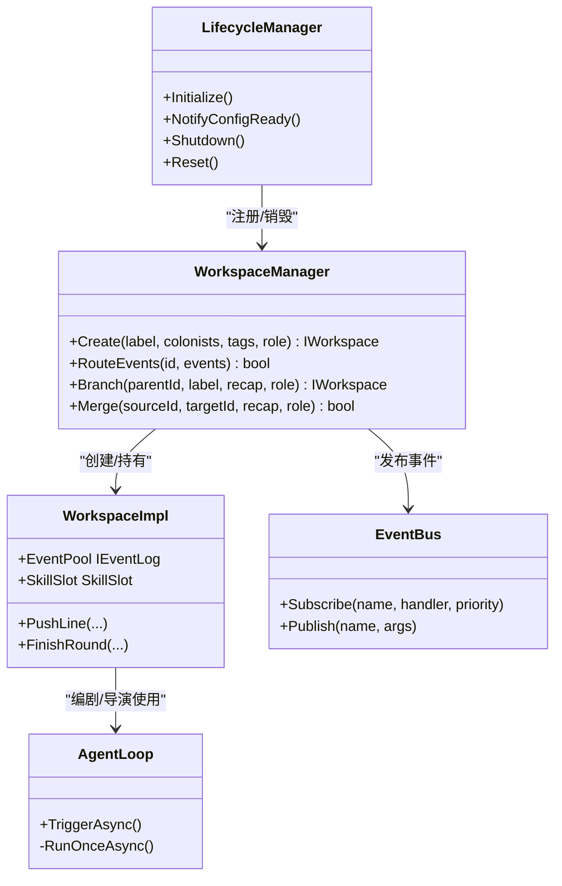
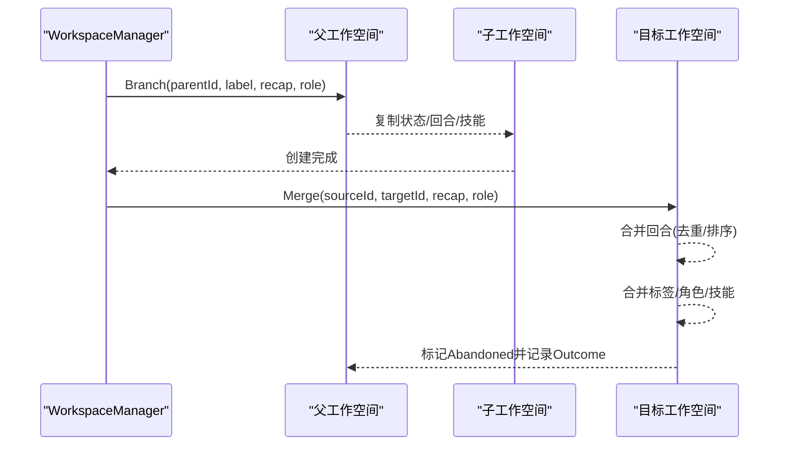
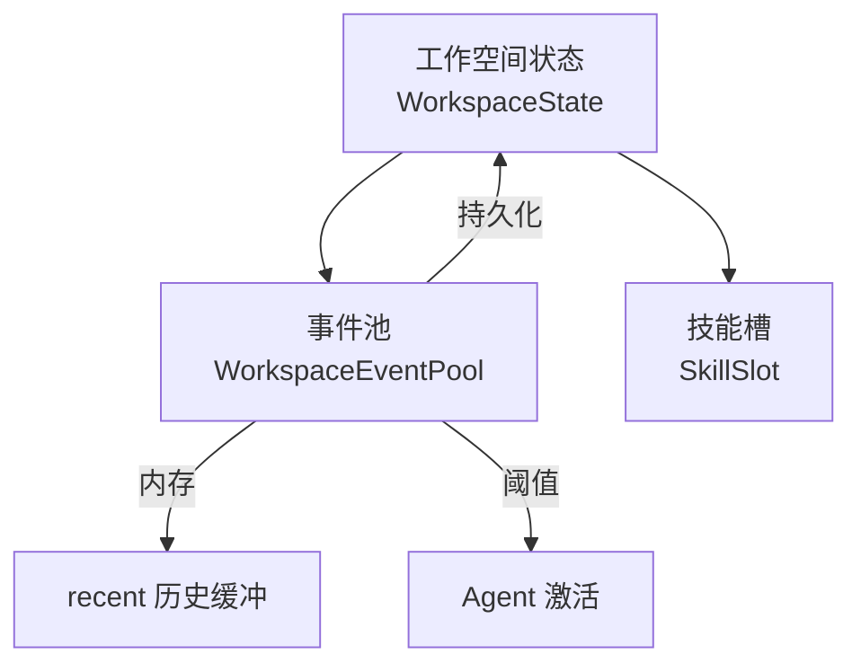
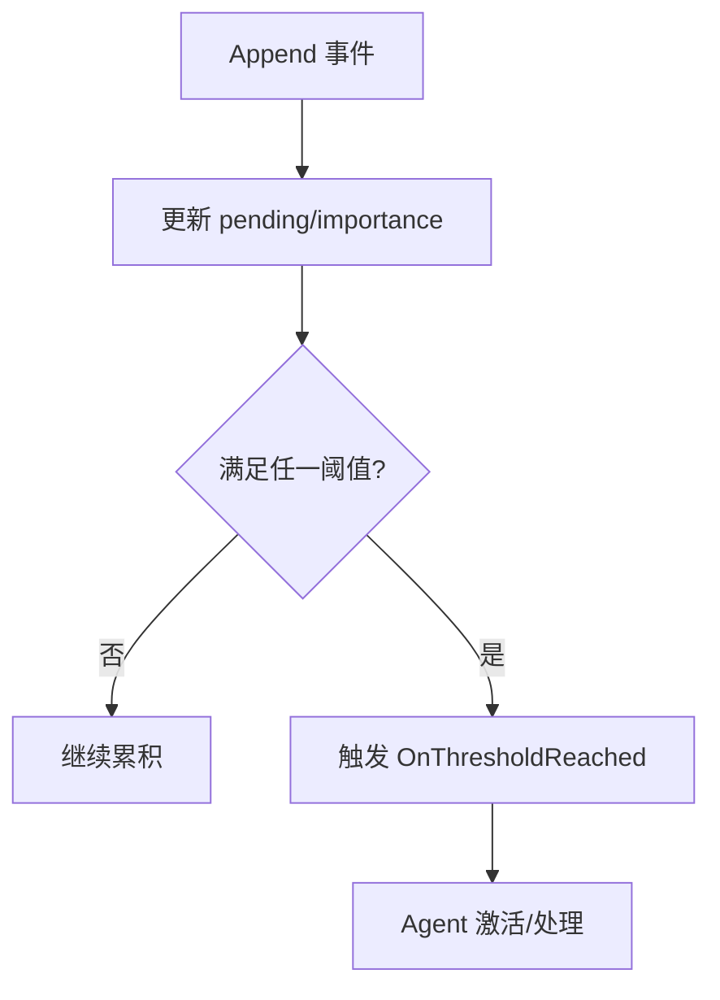
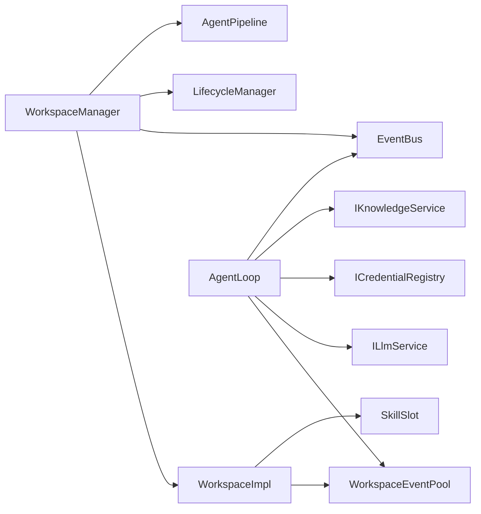

# 核心特性

<cite>
**本文引用的文件**
- [README.md](file://README.md)
- [AgentLoop.cs](file://src/NPCLife/Agent/AgentLoop.cs)
- [WorkspaceManager.cs](file://src/NPCLife/Workspace/WorkspaceManager.cs)
- [WorkspaceImpl.cs](file://src/NPCLife/Workspace/WorkspaceImpl.cs)
- [WorkspaceEventPool.cs](file://src/NPCLife/Workspace/WorkspaceEventPool.cs)
- [IWorkspace.cs](file://src/NPCLife/Workspace/IWorkspace.cs)
- [EventBus.cs](file://src/NPCLife/Framework/EventBus.cs)
- [AgentPipeline.cs](file://src/NPCLife/Framework/AgentPipeline.cs)
- [DriverConfig.cs](file://src/NPCLife/Driver/DriverConfig.cs)
- [FrameworkConfig.cs](file://src/NPCLife/Framework/FrameworkConfig.cs)
- [IEventLog.cs](file://src/NPCLife/Core/IEventLog.cs)
- [EventQuery.cs](file://src/NPCLife/Core/EventQuery.cs)
- [KnowledgeService.cs](file://src/NPCLife/Core/KnowledgeService.cs)
- [CardDataStructs.cs](file://src/NPCLife/Cards/CardDataStructs.cs)
</cite>

## 目录
1. [引言](#引言)
2. [项目结构](#项目结构)
3. [核心组件](#核心组件)
4. [架构总览](#架构总览)
5. [详细特性分析](#详细特性分析)
6. [依赖关系分析](#依赖关系分析)
7. [性能考量](#性能考量)
8. [故障排查指南](#故障排查指南)
9. [结论](#结论)
10. [附录](#附录)

## 引言
本文件聚焦 NPCLife 的五大核心特性：自动剧情生成机制、多智能体协作系统、工作空间分支合并功能、上下文隔离设计、事件阈值触发。文档以循序渐进的方式呈现概念、实现原理与技术优势，并辅以图示与“章节来源”定位到具体代码文件，帮助不同技术背景的读者快速理解并高效集成。

## 项目结构
NPCLife 采用清晰的分层与模块化组织：
- 核心域：事件、知识、脚本、存储等基础抽象与实现
- 框架层：事件总线、生命周期管理、拦截管线、配置等横切关注点
- 工作空间：工作空间管理器、事件池、技能槽、叙事轮次等
- 驱动与提示：驱动配置、提示词模板、MCP 工具注册与调用
- 卡片与数据结构：角色卡、环境卡、事件卡、目标卡等

**图表来源**
- [WorkspaceManager.cs:1-616](file://src/NPCLife/Workspace/WorkspaceManager.cs#L1-L616)
- [WorkspaceImpl.cs:1-197](file://src/NPCLife/Workspace/WorkspaceImpl.cs#L1-L197)
- [WorkspaceEventPool.cs:1-186](file://src/NPCLife/Workspace/WorkspaceEventPool.cs#L1-L186)
- [EventBus.cs:1-243](file://src/NPCLife/Framework/EventBus.cs#L1-L243)
- [AgentPipeline.cs:1-248](file://src/NPCLife/Framework/AgentPipeline.cs#L1-L248)
- [FrameworkConfig.cs:1-248](file://src/NPCLife/Framework/FrameworkConfig.cs#L1-L248)
- [DriverConfig.cs:1-107](file://src/NPCLife/Driver/DriverConfig.cs#L1-L107)
- [IEventLog.cs:1-52](file://src/NPCLife/Core/IEventLog.cs#L1-L52)
- [EventQuery.cs:1-48](file://src/NPCLife/Core/EventQuery.cs#L1-L48)
- [KnowledgeService.cs:1-66](file://src/NPCLife/Core/KnowledgeService.cs#L1-L66)

**章节来源**
- [README.md:1-93](file://README.md#L1-L93)

## 核心组件
- 事件与查询：IEventLog 提供事件池能力，EventQuery 支持多维筛选与分页
- 工作空间：IWorkspace 暴露元数据、事件池、技能槽与叙事操作；WorkspaceManager 负责 CRUD、分支/合并、事件路由与持久化
- 事件总线：EventBus 提供发布/订阅、优先级排序与错误隔离
- Agent 管线：AgentPipeline 提供多阶段拦截点，支持前置/后置增强与取消
- 配置体系：FrameworkConfig 与 DriverConfig 提供驱动参数、诊断与功能开关
- 知识服务：KnowledgeService 聚合本地缓存与外部只读源，支持并行查询

**章节来源**
- [IEventLog.cs:1-52](file://src/NPCLife/Core/IEventLog.cs#L1-L52)
- [EventQuery.cs:1-48](file://src/NPCLife/Core/EventQuery.cs#L1-L48)
- [IWorkspace.cs:1-51](file://src/NPCLife/Workspace/IWorkspace.cs#L1-L51)
- [WorkspaceManager.cs:1-616](file://src/NPCLife/Workspace/WorkspaceManager.cs#L1-L616)
- [WorkspaceImpl.cs:1-197](file://src/NPCLife/Workspace/WorkspaceImpl.cs#L1-L197)
- [WorkspaceEventPool.cs:1-186](file://src/NPCLife/Workspace/WorkspaceEventPool.cs#L1-L186)
- [EventBus.cs:1-243](file://src/NPCLife/Framework/EventBus.cs#L1-L243)
- [AgentPipeline.cs:1-248](file://src/NPCLife/Framework/AgentPipeline.cs#L1-L248)
- [FrameworkConfig.cs:1-248](file://src/NPCLife/Framework/FrameworkConfig.cs#L1-L248)
- [DriverConfig.cs:1-107](file://src/NPCLife/Driver/DriverConfig.cs#L1-L107)
- [KnowledgeService.cs:1-66](file://src/NPCLife/Core/KnowledgeService.cs#L1-L66)

## 架构总览
NPCLife 的运行时由“事件池阈值触发 + 导演路由 + 编剧生成 + 台词交付”的闭环构成。事件在工作空间内积累，达到阈值后由导演审查并路由到合适的工作空间；编剧基于事件与知识生成 NPC 台词，完成后归档并反馈给导演，形成持续演进的叙事循环。

**图表来源**
- [WorkspaceEventPool.cs:81-90](file://src/NPCLife/Workspace/WorkspaceEventPool.cs#L81-L90)
- [AgentLoop.cs:122-139](file://src/NPCLife/Agent/AgentLoop.cs#L122-L139)
- [WorkspaceImpl.cs:83-123](file://src/NPCLife/Workspace/WorkspaceImpl.cs#L83-L123)
- [WorkspaceImpl.cs:125-182](file://src/NPCLife/Workspace/WorkspaceImpl.cs#L125-L182)
- [EventBus.cs:86-113](file://src/NPCLife/Framework/EventBus.cs#L86-L113)

## 详细特性分析

### 特性一：自动剧情生成机制
- 概念解释
  - 事件在工作空间事件池中累积，达到数量或重要度阈值后，导演 Agent 被动激活，审查事件并决定路由策略；随后编剧生成具体 NPC 台词与叙事，最终通过工具调用逐句推送至游戏侧。
- 实现原理
  - 事件池阈值：WorkspaceEventPool 在 Append 后评估阈值，满足则触发 OnThresholdReached
  - 导演激活：AgentLoop 订阅 OnThresholdReached，进入 RunOnceAsync，DrainPending 后构建用户消息
  - 工具调用循环：AgentLoop 调用 LLM，根据响应中的工具调用执行 MCP 工具，将结果注入消息历史，直至无工具调用或达到最大轮次
  - 知识注入：AgentLoop 在构建用户消息时，对事件关键词去重并并行查询知识服务，缺失词条与相关知识一并纳入提示词
- 技术优势
  - 降低 LLM 调用频率与成本，提升吞吐与稳定性
  - 通过工具调用将生成内容结构化落地，便于后续叙事归档与回放
  - 知识服务聚合内外部知识源，增强叙事一致性与背景丰富度

**图表来源**
- [WorkspaceEventPool.cs:49-90](file://src/NPCLife/Workspace/WorkspaceEventPool.cs#L49-L90)
- [AgentLoop.cs:171-337](file://src/NPCLife/Agent/AgentLoop.cs#L171-L337)
- [WorkspaceImpl.cs:83-182](file://src/NPCLife/Workspace/WorkspaceImpl.cs#L83-L182)
- [EventBus.cs:86-113](file://src/NPCLife/Framework/EventBus.cs#L86-L113)

**章节来源**
- [WorkspaceEventPool.cs:1-186](file://src/NPCLife/Workspace/WorkspaceEventPool.cs#L1-L186)
- [AgentLoop.cs:1-581](file://src/NPCLife/Agent/AgentLoop.cs#L1-L581)
- [WorkspaceImpl.cs:1-197](file://src/NPCLife/Workspace/WorkspaceImpl.cs#L1-L197)
- [EventBus.cs:1-243](file://src/NPCLife/Framework/EventBus.cs#L1-L243)
- [KnowledgeService.cs:1-66](file://src/NPCLife/Core/KnowledgeService.cs#L1-L66)

### 特性二：多智能体协作系统
- 概念解释
  - 导演负责审查与路由，编剧负责生成具体叙事，临时编剧处理一次性事件；三者通过异步消息传递协作，导演读取编剧的 DirectorMessage 调整策略。
- 实现原理
  - 角色与技能：工作空间由创建角色自动激活默认技能集；技能槽管理 MCP 工具集的激活/停用
  - 事件路由：WorkspaceManager.RouteEvents 将事件追加到目标工作空间事件池
  - 事件总线：通过 FrameworkEvents 命名空间事件进行跨组件解耦
  - 生命周期：LifecycleManager 统一注册/销毁组件与钩子，支持 Reset 用于存档切换
- 技术优势
  - 角色职责清晰，避免交叉耦合
  - 通过事件总线与命名空间事件实现松耦合协作
  - 生命周期管理保障资源有序释放与重置

**图表来源**
- [WorkspaceManager.cs:19-138](file://src/NPCLife/Workspace/WorkspaceManager.cs#L19-L138)
- [WorkspaceImpl.cs:16-75](file://src/NPCLife/Workspace/WorkspaceImpl.cs#L16-L75)
- [AgentLoop.cs:43-116](file://src/NPCLife/Agent/AgentLoop.cs#L43-L116)
- [EventBus.cs:17-155](file://src/NPCLife/Framework/EventBus.cs#L17-L155)
- [LifecycleManager.cs:23-264](file://src/NPCLife/Framework/LifecycleManager.cs#L23-L264)

**章节来源**
- [WorkspaceManager.cs:1-616](file://src/NPCLife/Workspace/WorkspaceManager.cs#L1-L616)
- [WorkspaceImpl.cs:1-197](file://src/NPCLife/Workspace/WorkspaceImpl.cs#L1-L197)
- [AgentLoop.cs:1-581](file://src/NPCLife/Agent/AgentLoop.cs#L1-L581)
- [EventBus.cs:1-243](file://src/NPCLife/Framework/EventBus.cs#L1-L243)
- [LifecycleManager.cs:1-264](file://src/NPCLife/Framework/LifecycleManager.cs#L1-L264)

### 特性三：工作空间分支合并功能
- 概念解释
  - 工作空间代表一条独立的剧情线，支持从主线分叉（Branch）与将多条子线合并（Merge），保留各自历史并统一归档。
- 实现原理
  - 分支：复制父工作空间的状态与回合，新增一个 Branch 类型回合，子线继承父线的活跃技能与元数据
  - 合并：将源工作空间的回合按序号去重合并到目标工作空间，保留触发事件 ID、角色与标签等信息，同时记录合并来源
  - 状态与事件：合并后源工作空间标记为 Abandoned，目标工作空间更新 CurrentRecap 与最后活动时间
- 技术优势
  - 保证叙事历史完整性与可追溯性
  - 支持多线并行创作与统一收敛，提升创作灵活性

**图表来源**
- [WorkspaceManager.cs:193-263](file://src/NPCLife/Workspace/WorkspaceManager.cs#L193-L263)
- [WorkspaceManager.cs:269-376](file://src/NPCLife/Workspace/WorkspaceManager.cs#L269-L376)

**章节来源**
- [WorkspaceManager.cs:193-376](file://src/NPCLife/Workspace/WorkspaceManager.cs#L193-L376)

### 特性四：上下文隔离设计
- 概念解释
  - 每个工作空间维护独立的事件池、对话历史与角色集合，不同剧情线之间互不干扰，避免上下文污染。
- 实现原理
  - 事件池双层结构：pending 缓冲区（持久化到 WorkspaceState）与 recent 历史缓冲（仅内存），阈值检测在每次 Append 后评估
  - 元数据与组件：IWorkspace 暴露只读元数据，内部组件（事件池、技能槽）通过 WorkspaceImpl 暴露，避免外部直接访问内部状态
  - 配置隔离：DriverConfig 按角色提供独立阈值，确保不同角色工作空间的触发节奏与容量可控
- 技术优势
  - 高隔离性：减少跨线副作用，提升稳定性与可测试性
  - 可控容量：recent 历史容量可配置，平衡内存占用与查询效率

**图表来源**
- [WorkspaceEventPool.cs:21-43](file://src/NPCLife/Workspace/WorkspaceEventPool.cs#L21-L43)
- [WorkspaceImpl.cs:16-46](file://src/NPCLife/Workspace/WorkspaceImpl.cs#L16-L46)
- [DriverConfig.cs:54-101](file://src/NPCLife/Driver/DriverConfig.cs#L54-L101)

**章节来源**
- [WorkspaceEventPool.cs:1-186](file://src/NPCLife/Workspace/WorkspaceEventPool.cs#L1-L186)
- [WorkspaceImpl.cs:1-197](file://src/NPCLife/Workspace/WorkspaceImpl.cs#L1-L197)
- [DriverConfig.cs:1-107](file://src/NPCLife/Driver/DriverConfig.cs#L1-L107)

### 特性五：事件阈值触发
- 概念解释
  - 事件在池中积累，达到“事件数量阈值”或“累计重要度阈值”之一时才触发 AI 处理，从而控制 LLM 调用频率与成本。
- 实现原理
  - 阈值计算：DriverConfig 按角色提供独立阈值；WorkspaceEventPool 在 Append 后计算有效阈值并评估
  - 触发机制：达到阈值时触发 OnThresholdReached，AgentLoop 订阅后被动激活
  - 配置化：FrameworkConfig 支持冻结后不可变，确保运行时配置一致性
- 技术优势
  - 成本可控：避免高频调用，降低 Token 与延迟
  - 灵活适配：不同角色可配置不同阈值，满足多样化创作节奏

**图表来源**
- [WorkspaceEventPool.cs:81-90](file://src/NPCLife/Workspace/WorkspaceEventPool.cs#L81-L90)
- [DriverConfig.cs:54-85](file://src/NPCLife/Driver/DriverConfig.cs#L54-L85)
- [FrameworkConfig.cs:41-49](file://src/NPCLife/Framework/FrameworkConfig.cs#L41-L49)

**章节来源**
- [WorkspaceEventPool.cs:1-186](file://src/NPCLife/Workspace/WorkspaceEventPool.cs#L1-L186)
- [DriverConfig.cs:1-107](file://src/NPCLife/Driver/DriverConfig.cs#L1-L107)
- [FrameworkConfig.cs:1-248](file://src/NPCLife/Framework/FrameworkConfig.cs#L1-L248)

## 依赖关系分析
- 组件耦合
  - WorkspaceManager 对 WorkspaceImpl、事件池、技能槽、序列化器、日志与存储有直接依赖
  - AgentLoop 依赖事件池、LLM 服务、凭证注册表、知识服务与事件总线
  - AgentPipeline 作为横切点，通过拦截器扩展 AgentLoop 的行为
- 外部依赖
  - LLM 服务接口（ILlmService）、存储接口（IStorage）、日志接口（ILogger）由宿主注入
  - MCP 工具通过注册表统一管理与调用

**图表来源**
- [WorkspaceManager.cs:19-85](file://src/NPCLife/Workspace/WorkspaceManager.cs#L19-L85)
- [WorkspaceImpl.cs:16-46](file://src/NPCLife/Workspace/WorkspaceImpl.cs#L16-L46)
- [AgentLoop.cs:43-116](file://src/NPCLife/Agent/AgentLoop.cs#L43-L116)
- [EventBus.cs:17-155](file://src/NPCLife/Framework/EventBus.cs#L17-L155)
- [AgentPipeline.cs:120-174](file://src/NPCLife/Framework/AgentPipeline.cs#L120-L174)

**章节来源**
- [WorkspaceManager.cs:1-616](file://src/NPCLife/Workspace/WorkspaceManager.cs#L1-L616)
- [WorkspaceImpl.cs:1-197](file://src/NPCLife/Workspace/WorkspaceImpl.cs#L1-L197)
- [AgentLoop.cs:1-581](file://src/NPCLife/Agent/AgentLoop.cs#L1-L581)
- [EventBus.cs:1-243](file://src/NPCLife/Framework/EventBus.cs#L1-L243)
- [AgentPipeline.cs:1-248](file://src/NPCLife/Framework/AgentPipeline.cs#L1-L248)

## 性能考量
- 事件池阈值控制：通过数量与重要度双阈值抑制不必要的 LLM 调用，降低 Token 与延迟
- 并行知识查询：KnowledgeService 对关键词去重后并行查询，减少重复检索
- 拦截器零开销：默认无拦截器时 AgentPipeline 无额外开销，仅在注册拦截器时按优先级执行
- 内存与容量：recent 历史容量可配置，避免无限增长；事件池持久化仅保存必要字段
- 最大轮次限制：AgentLoop 的最大轮次防止死循环，保障稳定性

[本节为通用性能讨论，不直接分析具体文件]

## 故障排查指南
- Agent 激活失败
  - 检查事件池是否达到阈值：确认 DriverConfig 阈值配置与 WorkspaceEventPool.Append 流程
  - 检查 OnThresholdReached 是否被触发：查看 WorkspaceEventPool.CheckThreshold 与订阅方
- LLM 调用异常
  - 关注 AgentLoop 中的错误捕获与 FailAndRequeue 逻辑，确认错误是否回灌事件池
  - 检查凭证注册表是否为空或无效
- 工具调用问题
  - 通过 AgentPipeline 的拦截器链定位工具调用前后的行为，必要时设置取消标志
- 事件总线异常
  - EventBus 对单个处理器异常进行隔离，不影响其他订阅者；可通过日志定位具体处理器

**章节来源**
- [WorkspaceEventPool.cs:81-90](file://src/NPCLife/Workspace/WorkspaceEventPool.cs#L81-L90)
- [AgentLoop.cs:327-396](file://src/NPCLife/Agent/AgentLoop.cs#L327-L396)
- [AgentPipeline.cs:180-236](file://src/NPCLife/Framework/AgentPipeline.cs#L180-L236)
- [EventBus.cs:104-112](file://src/NPCLife/Framework/EventBus.cs#L104-L112)

## 结论
NPCLife 通过“事件阈值触发 + 工作空间隔离 + 多智能体协作 + 知识注入 + 工具调用闭环”的设计，在保证成本可控的同时实现了高质量的自动剧情生成。其模块化与事件驱动的架构便于扩展与集成，适合需要动态叙事与复杂角色交互的游戏场景。

[本节为总结性内容，不直接分析具体文件]

## 附录
- 关键数据结构
  - 工作空间状态与回合：WorkspaceState、WorkspaceRound
  - 事件与查询：IGameEvent、EventQuery
  - 卡片数据结构：ColonistSummary、FactionStanding、WeatherInfo
- 配置要点
  - DriverConfig：按角色的阈值与定时器配置
  - FrameworkConfig：驱动、诊断与功能开关的统一入口

**章节来源**
- [WorkspaceManager.cs:520-571](file://src/NPCLife/Workspace/WorkspaceManager.cs#L520-L571)
- [EventQuery.cs:1-48](file://src/NPCLife/Core/EventQuery.cs#L1-L48)
- [CardDataStructs.cs:1-39](file://src/NPCLife/Cards/CardDataStructs.cs#L1-L39)
- [DriverConfig.cs:1-107](file://src/NPCLife/Driver/DriverConfig.cs#L1-L107)
- [FrameworkConfig.cs:1-248](file://src/NPCLife/Framework/FrameworkConfig.cs#L1-L248)