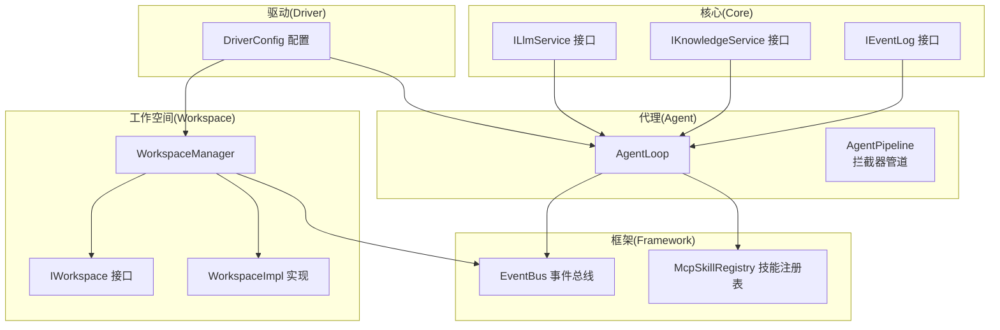
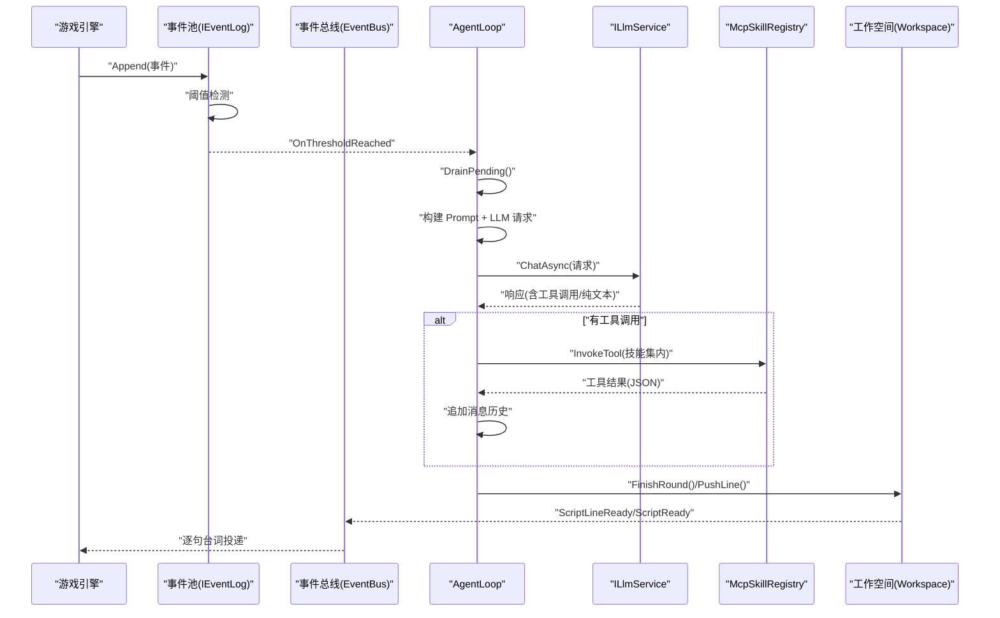
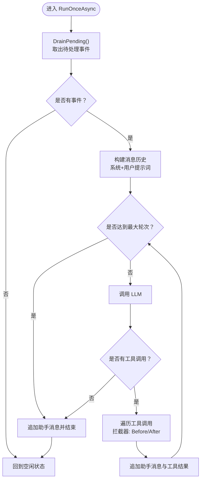
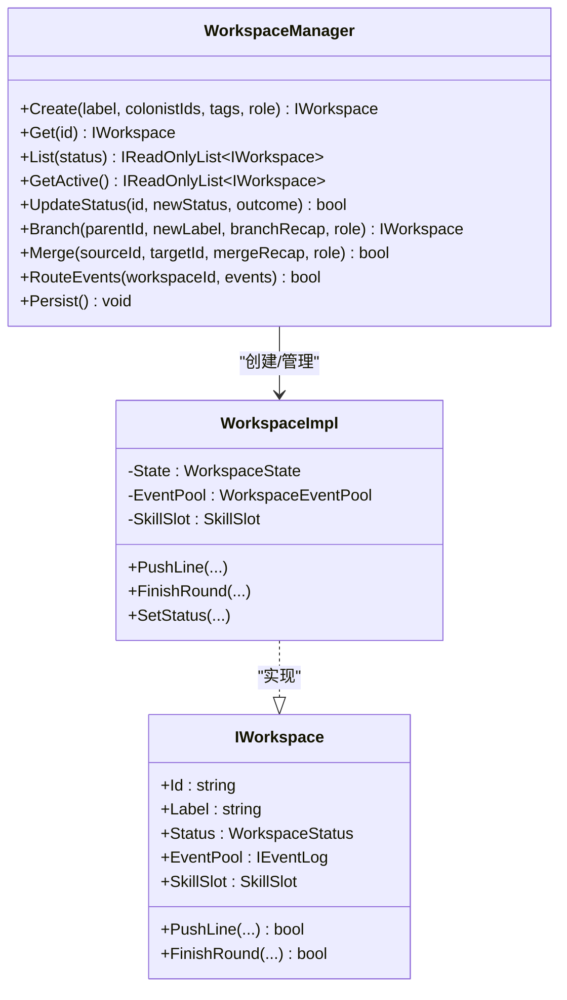
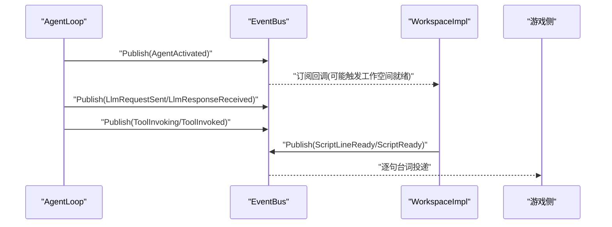
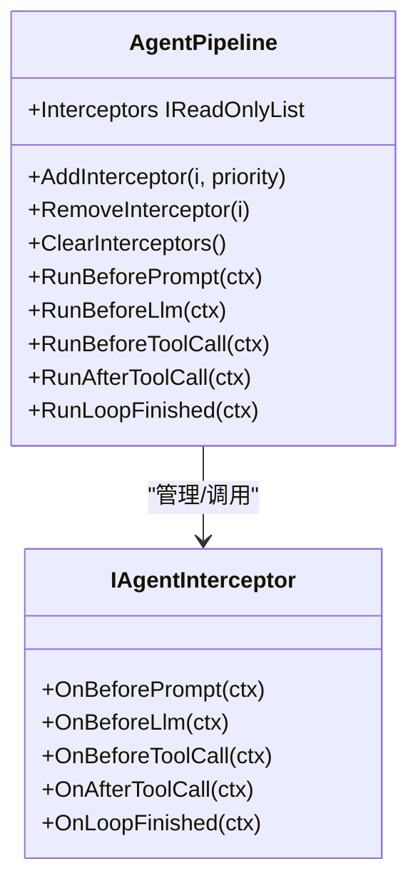
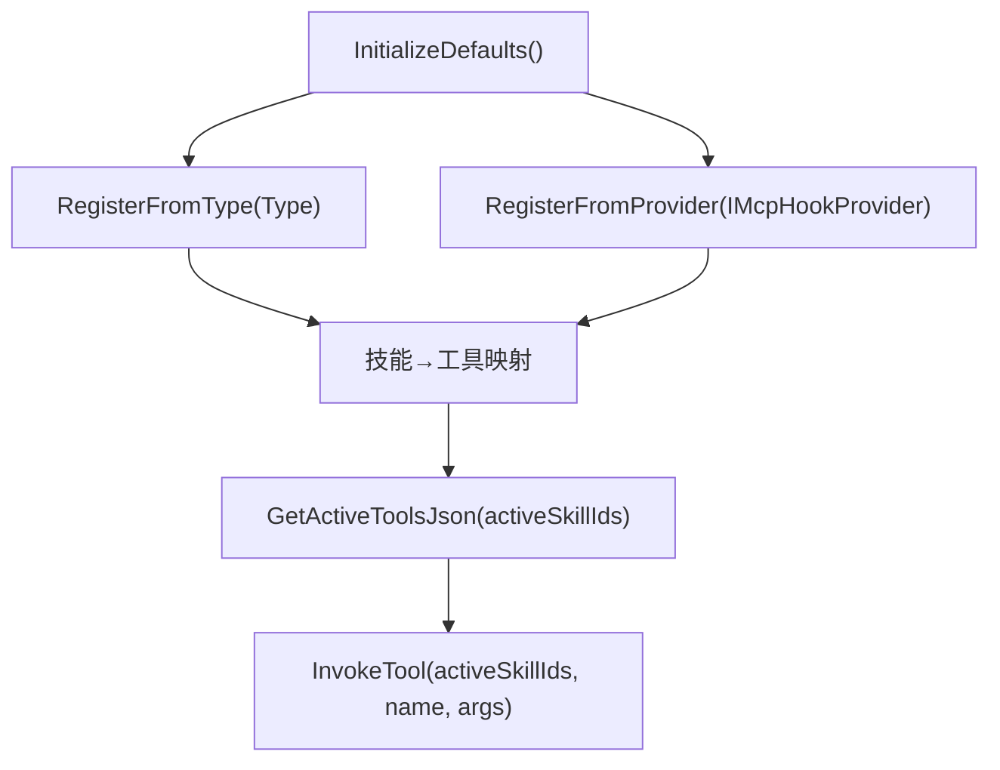
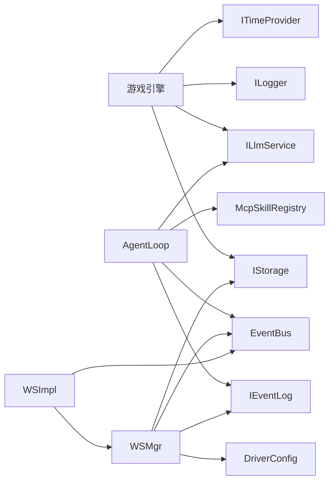

# 项目概述

<cite>
**本文引用的文件**
- [README.md](file://README.md)
- [NPCLife.csproj](file://src/NPCLife/NPCLife.csproj)
- [AgentLoop.cs](file://src/NPCLife/Agent/AgentLoop.cs)
- [WorkspaceManager.cs](file://src/NPCLife/Workspace/WorkspaceManager.cs)
- [IWorkspace.cs](file://src/NPCLife/Workspace/IWorkspace.cs)
- [WorkspaceImpl.cs](file://src/NPCLife/Workspace/WorkspaceImpl.cs)
- [EventBus.cs](file://src/NPCLife/Framework/EventBus.cs)
- [AgentPipeline.cs](file://src/NPCLife/Framework/AgentPipeline.cs)
- [McpSkillRegistry.cs](file://src/NPCLife/Framework/Mcp/McpSkillRegistry.cs)
- [DriverConfig.cs](file://src/NPCLife/Driver/DriverConfig.cs)
- [IEventLog.cs](file://src/NPCLife/Core/IEventLog.cs)
- [KnowledgeService.cs](file://src/NPCLife/Core/KnowledgeService.cs)
</cite>

## 目录
1. [简介](#简介)
2. [项目结构](#项目结构)
3. [核心组件](#核心组件)
4. [架构总览](#架构总览)
5. [详细组件分析](#详细组件分析)
6. [依赖分析](#依赖分析)
7. [性能考虑](#性能考虑)
8. [故障排查指南](#故障排查指南)
9. [结论](#结论)
10. [附录](#附录)

## 简介
NPCLife 是一个可嵌入游戏引擎的 C# 库，专注于“LLM 驱动的游戏叙事中间件”。其核心价值在于：
- 将游戏世界中发生的事件（战斗、对话、探索、环境变化等）自动转化为由 AI 驱动的动态剧情，为 NPC 提供有因果关系的叙事线索；
- 通过“工作空间（Workspace）”实现剧情线的分支与合并，支持独立生命周期管理；
- 以“导演（Director）/编剧（Screenwriter）/临时编剧（Freelancer）”三角色协作的多智能体管线，实现事件路由、叙事生成与台词输出；
- 采用事件阈值触发机制与上下文隔离设计，降低 LLM 调用频率与成本，避免上下文污染。

NPCLife 是纯逻辑库，不依赖特定游戏引擎，宿主游戏只需提供存储、日志、LLM 服务与时间提供者等适配器，并可注入自定义 MCP 工具以增强叙事生成能力。

**章节来源**
- [README.md:1-93](file://README.md#L1-L93)

## 项目结构
仓库采用按领域与层次混合的组织方式：
- Core：核心接口与知识服务（如 IEventLog、IKnowledgeService、ILlmService 等），提供最小可替换的抽象；
- Agent：AgentLoop 及其拦截器管道，负责事件池激活、LLM 请求、工具调用与消息历史管理；
- Workspace：工作空间管理器与工作空间实现，负责工作空间的 CRUD、分支/合并、事件路由与剧本交付；
- Framework：事件总线、MCP 技能注册表、JSON 工具、拦截器管道、生命周期管理等通用基础设施；
- Driver：驱动配置（阈值、定时器、轮次上限等）；
- Infrastructure：知识库内置实现、LLM 适配器（OpenAI/Anthropic）、MCP 提供者等；
- Cards/Infrastructure/Driver/Prompts：卡片数据结构、基础设施与提示词资源；
- Tests：单元测试覆盖核心接口与关键流程。

**图示来源**
- [AgentLoop.cs:1-581](file://src/NPCLife/Agent/AgentLoop.cs#L1-L581)
- [WorkspaceManager.cs:1-616](file://src/NPCLife/Workspace/WorkspaceManager.cs#L1-L616)
- [IWorkspace.cs:1-51](file://src/NPCLife/Workspace/IWorkspace.cs#L1-L51)
- [WorkspaceImpl.cs:1-197](file://src/NPCLife/Workspace/WorkspaceImpl.cs#L1-L197)
- [EventBus.cs:1-243](file://src/NPCLife/Framework/EventBus.cs#L1-L243)
- [McpSkillRegistry.cs:1-470](file://src/NPCLife/Framework/Mcp/McpSkillRegistry.cs#L1-L470)
- [DriverConfig.cs:1-107](file://src/NPCLife/Driver/DriverConfig.cs#L1-L107)
- [IEventLog.cs:1-52](file://src/NPCLife/Core/IEventLog.cs#L1-L52)

**章节来源**
- [NPCLife.csproj:1-38](file://src/NPCLife/NPCLife.csproj#L1-L38)

## 核心组件
- 事件池与阈值触发：IEventLog 提供 append-only 写入、条件查询与 pending 缓冲区，支持按事件数与重要度阈值触发 AgentLoop；
- 多智能体管线：AgentLoop 以显式状态机驱动，按“Drain → Prompt → LLM → 工具调用循环 → 归档回合”的流程运行，支持拦截器链与事件总线；
- 工作空间管理：WorkspaceManager 负责工作空间的创建、分支、合并、状态变更与持久化，工作空间内部维护独立事件池与技能槽；
- MCP 技能体系：McpSkillRegistry 管理技能与工具注册，支持系统技能与业务技能，按激活集合动态生成工具定义；
- 知识服务：IKnowledgeService 聚合本地缓存与外部知识源，支持精确查询与批量检索；
- 驱动配置：DriverConfig 提供分角色阈值、定时器脉冲与轮次上限等参数，影响事件池触发与 Agent 行为。

**章节来源**
- [IEventLog.cs:1-52](file://src/NPCLife/Core/IEventLog.cs#L1-L52)
- [AgentLoop.cs:1-581](file://src/NPCLife/Agent/AgentLoop.cs#L1-L581)
- [WorkspaceManager.cs:1-616](file://src/NPCLife/Workspace/WorkspaceManager.cs#L1-L616)
- [IWorkspace.cs:1-51](file://src/NPCLife/Workspace/IWorkspace.cs#L1-L51)
- [WorkspaceImpl.cs:1-197](file://src/NPCLife/Workspace/WorkspaceImpl.cs#L1-L197)
- [McpSkillRegistry.cs:1-470](file://src/NPCLife/Framework/Mcp/McpSkillRegistry.cs#L1-L470)
- [KnowledgeService.cs:1-66](file://src/NPCLife/Core/KnowledgeService.cs#L1-L66)
- [DriverConfig.cs:1-107](file://src/NPCLife/Driver/DriverConfig.cs#L1-L107)

## 架构总览
NPCLife 采用“事件驱动 + 多智能体 + 工作空间”的整体架构：
- 游戏侧在每一帧将事件写入 IEventLog；
- 事件池根据 DriverConfig 的阈值进行检测，满足条件时通过 EventBus 通知 AgentLoop；
- AgentLoop 构造 Prompt，调用 ILlmService，执行工具调用（MCP），并将生成的台词通过事件总线推送给 ScriptDeliveryService；
- 工作空间（Workspace）承载每条剧情线的生命周期，支持分支与合并，独立维护事件历史与技能集；
- 框架通过 EventBus 提供跨模块解耦，通过 AgentPipeline 提供可插拔的拦截器扩展点。

**图示来源**
- [AgentLoop.cs:171-337](file://src/NPCLife/Agent/AgentLoop.cs#L171-L337)
- [EventBus.cs:86-113](file://src/NPCLife/Framework/EventBus.cs#L86-L113)
- [IEventLog.cs:48-49](file://src/NPCLife/Core/IEventLog.cs#L48-L49)
- [WorkspaceImpl.cs:83-182](file://src/NPCLife/Workspace/WorkspaceImpl.cs#L83-L182)

## 详细组件分析

### AgentLoop：多轮对话与工具调用循环
- 显式状态机：Idle → DrainingEvents → BuildingRequest → CallingLlm → ExecutingTools → AppendingToolResults → Finishing/Error；
- 阈值触发：订阅 IEventLog.OnThresholdReached，被动激活；
- 请求构建：组装系统提示词与用户消息，注入知识服务命中结果与动态上下文；
- 工具调用：通过 McpSkillRegistry 在激活技能范围内解析并执行工具，支持拦截器链；
- 错误处理：统一失败路径将事件回灌至池中，保证幂等与一致性。

**图示来源**
- [AgentLoop.cs:171-337](file://src/NPCLife/Agent/AgentLoop.cs#L171-L337)

**章节来源**
- [AgentLoop.cs:1-581](file://src/NPCLife/Agent/AgentLoop.cs#L1-L581)

### WorkspaceManager：工作空间生命周期与分支/合并
- CRUD：创建、查询、状态更新（含有效性校验）；
- 分支：复制父线历史，生成分支回合，继承技能集与标签；
- 合并：将源线回合有序合并至目标线，去重并保留各自历史；
- 事件路由：将事件追加到指定工作空间的事件池；
- 持久化：统一序列化/反序列化，保存至 IAuthorityStore；
- 并发：读写锁保护工作空间列表，保障并发安全。

**图示来源**
- [WorkspaceManager.cs:19-616](file://src/NPCLife/Workspace/WorkspaceManager.cs#L19-L616)
- [IWorkspace.cs:11-51](file://src/NPCLife/Workspace/IWorkspace.cs#L11-L51)
- [WorkspaceImpl.cs:16-197](file://src/NPCLife/Workspace/WorkspaceImpl.cs#L16-L197)

**章节来源**
- [WorkspaceManager.cs:1-616](file://src/NPCLife/Workspace/WorkspaceManager.cs#L1-L616)
- [WorkspaceImpl.cs:1-197](file://src/NPCLife/Workspace/WorkspaceImpl.cs#L1-L197)
- [IWorkspace.cs:1-51](file://src/NPCLife/Workspace/IWorkspace.cs#L1-L51)

### 事件总线 EventBus：模块间解耦与可观测性
- 发布/订阅：支持命名空间事件名、优先级排序、错误隔离；
- 预定义事件：Agent 生命周期、LLM 请求/响应、工具调用、工作空间更新、剧本就绪等；
- 调试友好：提供订阅计数、事件名列表等辅助查询。

**图示来源**
- [EventBus.cs:86-113](file://src/NPCLife/Framework/EventBus.cs#L86-L113)
- [AgentLoop.cs:229-318](file://src/NPCLife/Agent/AgentLoop.cs#L229-L318)
- [WorkspaceImpl.cs:114-179](file://src/NPCLife/Workspace/WorkspaceImpl.cs#L114-L179)

**章节来源**
- [EventBus.cs:1-243](file://src/NPCLife/Framework/EventBus.cs#L1-L243)

### AgentPipeline：可插拔拦截器扩展点
- 拦截阶段：BeforePrompt → BeforeLlm → BeforeToolCall → AfterToolCall → LoopFinished；
- 优先级：按 priority 升序执行，支持动态增删；
- 默认零开销：未注册拦截器时不产生额外成本。

**图示来源**
- [AgentPipeline.cs:18-248](file://src/NPCLife/Framework/AgentPipeline.cs#L18-L248)

**章节来源**
- [AgentPipeline.cs:1-248](file://src/NPCLife/Framework/AgentPipeline.cs#L1-L248)

### MCP 技能注册表：工具定义与调用
- 技能元数据：colony_overview、character_query、relationship_query、event_query、environment_query、knowledge_management、workspace_direction、workspace_writing；
- 工具注册：支持从类型反射与 Hook 提供者注册，按技能聚合；
- 工具调用：优先在业务技能中查找，未命中回退到 system 技能；
- JSON 输出：统一构造激活/反激活/错误结果，便于 LLM prompt。

**图示来源**
- [McpSkillRegistry.cs:52-175](file://src/NPCLife/Framework/Mcp/McpSkillRegistry.cs#L52-L175)
- [McpSkillRegistry.cs:249-287](file://src/NPCLife/Framework/Mcp/McpSkillRegistry.cs#L249-L287)
- [McpSkillRegistry.cs:361-437](file://src/NPCLife/Framework/Mcp/McpSkillRegistry.cs#L361-L437)

**章节来源**
- [McpSkillRegistry.cs:1-470](file://src/NPCLife/Framework/Mcp/McpSkillRegistry.cs#L1-L470)

### 驱动配置 DriverConfig：阈值与轮次控制
- 分角色阈值：Director/Screenwriter/Freelancer 各自的事件数与重要度阈值；
- 定时器脉冲：Director/Freelancer 支持按游戏 tick 注入 TimerPulse 事件；
- 最大轮次：防止工具调用死循环；
- 历史容量：RecentHistoryCapacity 控制事件池裁剪策略。

**章节来源**
- [DriverConfig.cs:1-107](file://src/NPCLife/Driver/DriverConfig.cs#L1-L107)

### 知识服务 KnowledgeService：多源聚合查询
- 精确查询：先查本地缓存，再并行查询外部只读源；
- 写操作：Store/Delete/List* 代理到本地缓存；
- 与 AgentLoop 集成：在 Prompt 构造阶段批量查询关键词，缺失词条引导 LLM 先学习。

**章节来源**
- [KnowledgeService.cs:1-66](file://src/NPCLife/Core/KnowledgeService.cs#L1-L66)

## 依赖分析
- 模块内聚：Core 提供最小接口集，Agent/Workspace/Framework 通过接口依赖，低耦合；
- 外部依赖：System.Net.Http（HTTP 客户端），无游戏引擎依赖；
- 可替换性：IStorage、ILogger、ILlmService、ITimeProvider 等均由宿主注入；
- 技术栈：.NET Framework 4.8 与 .NET Standard 2.0 双目标，兼容广泛运行时。

**图示来源**
- [NPCLife.csproj:23-35](file://src/NPCLife/NPCLife.csproj#L23-L35)
- [AgentLoop.cs:43-116](file://src/NPCLife/Agent/AgentLoop.cs#L43-L116)
- [WorkspaceManager.cs:19-40](file://src/NPCLife/Workspace/WorkspaceManager.cs#L19-L40)

**章节来源**
- [NPCLife.csproj:1-38](file://src/NPCLife/NPCLife.csproj#L1-L38)

## 性能考虑
- 事件阈值触发：通过累计事件数与重要度阈值减少 LLM 调用频率，控制成本；
- 状态机与防重入：SemaphoreSlim 防止并发重复运行，统一失败路径回灌事件；
- 工具调用上限：MaxAgentRounds 防止死循环，保障稳定性；
- 序列化与内存：JsonWriter/JsonParser 优化序列化开销，事件池裁剪策略控制内存占用；
- 并发安全：WorkspaceManager 使用读写锁，保障多工作空间并发访问安全。

[本节为通用指导，不直接分析具体文件]

## 故障排查指南
- AgentLoop 失败回灌：出现异常时将已 drain 的事件回灌至池中，检查日志与错误上下文；
- 工具调用错误：McpSkillRegistry 捕获异常并返回错误 JSON，检查工具签名与参数；
- 事件总线异常：EventBus 对订阅者异常进行隔离，不影响其他订阅者；
- 工作空间状态：WorkspaceManager 对状态转换进行校验，非法状态变更会记录警告日志；
- 日志注入：ILogger 由宿主注入，建议在开发与生产环境分别配置不同级别。

**章节来源**
- [AgentLoop.cs:370-396](file://src/NPCLife/Agent/AgentLoop.cs#L370-L396)
- [McpSkillRegistry.cs:401-431](file://src/NPCLife/Framework/Mcp/McpSkillRegistry.cs#L401-L431)
- [EventBus.cs:104-112](file://src/NPCLife/Framework/EventBus.cs#L104-L112)
- [WorkspaceManager.cs:170-174](file://src/NPCLife/Workspace/WorkspaceManager.cs#L170-L174)

## 结论
NPCLife 通过“事件阈值触发 + 多智能体协作 + 工作空间管理”的组合，实现了可嵌入、可扩展、可演进的叙事中间件。其架构强调：
- 上下文隔离：工作空间独立事件池与技能槽，避免交叉污染；
- 成本可控：阈值触发与轮次上限降低 LLM 调用频次；
- 可观测性：事件总线与拦截器链提供清晰的可观测与可扩展点；
- 兼容性强：双目标框架与纯逻辑设计，易于集成到各类游戏引擎。

[本节为总结性内容，不直接分析具体文件]

## 附录

### 技术栈概览
- 目标框架：.NET Framework 4.8、.NET Standard 2.0
- 依赖：System.Net.Http
- 语言版本：C# 12

**章节来源**
- [NPCLife.csproj:3-14](file://src/NPCLife/NPCLife.csproj#L3-L14)

### 集成要求与使用场景
- 集成要求：IStorage、ILogger、ILlmService、ITimeProvider 四大适配器；可注入自定义 MCP 工具；
- 适用场景：需要 NPC 动态剧情、响应玩家行为与环境变化、可定制存储/日志/LLM 的游戏项目。

**章节来源**
- [README.md:69-87](file://README.md#L69-L87)