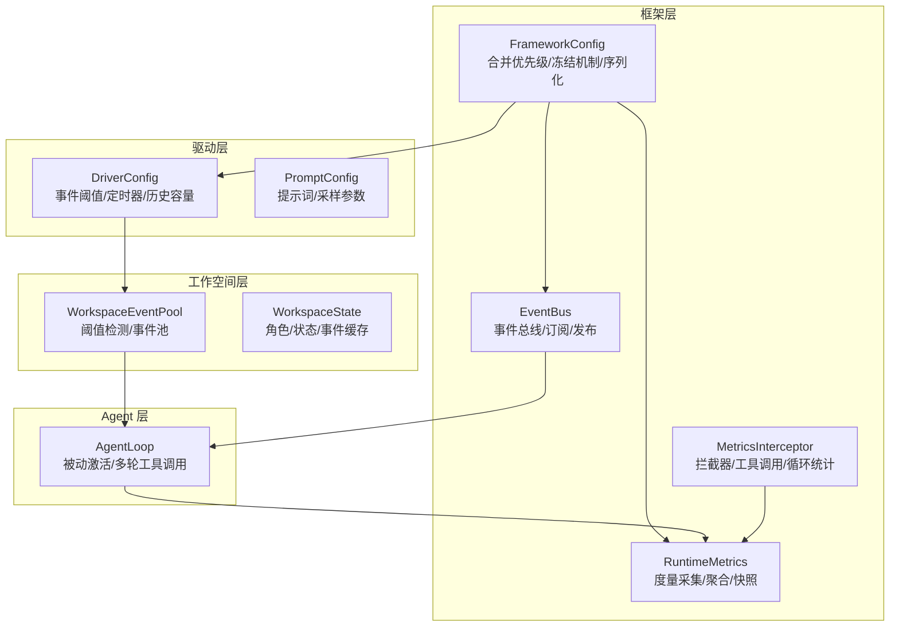
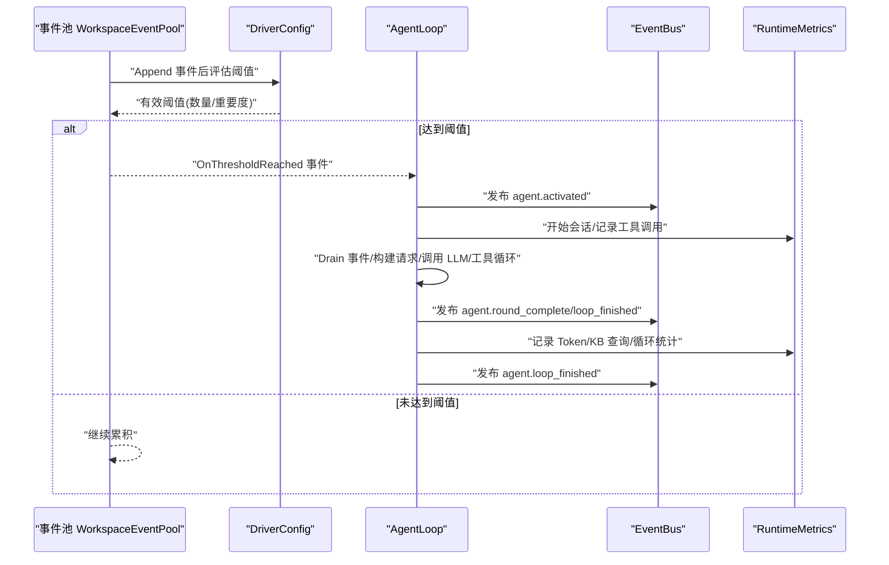
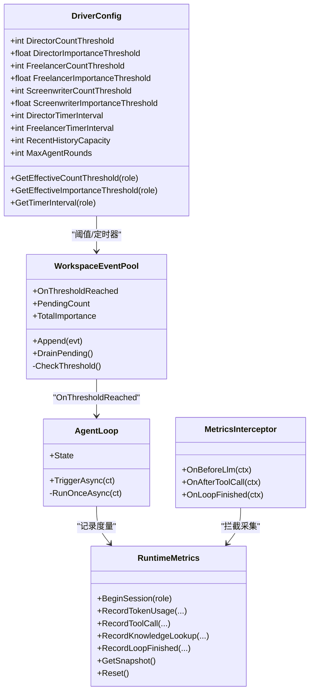

# 驱动配置系统

<cite>
**本文档引用的文件**
- [DriverConfig.cs](file://src/NPCLife/Driver/DriverConfig.cs)
- [PromptConfig.cs](file://src/NPCLife/Driver/PromptConfig.cs)
- [FrameworkConfig.cs](file://src/NPCLife/Framework/FrameworkConfig.cs)
- [WorkspaceEventPool.cs](file://src/NPCLife/Workspace/WorkspaceEventPool.cs)
- [WorkspaceState.cs](file://src/NPCLife/Workspace/WorkspaceState.cs)
- [AgentLoop.cs](file://src/NPCLife/Agent/AgentLoop.cs)
- [RuntimeMetrics.cs](file://src/NPCLife/Framework/RuntimeMetrics.cs)
- [MetricsInterceptor.cs](file://src/NPCLife/Framework/MetricsInterceptor.cs)
- [EventBus.cs](file://src/NPCLife/Framework/EventBus.cs)
- [JsonHelper.cs](file://src/NPCLife/Framework/JsonHelper.cs)
- [DriverConfigTests.cs](file://tests/NPCLife.Tests/Driver/DriverConfigTests.cs)
</cite>

## 目录
1. [简介](#简介)
2. [项目结构](#项目结构)
3. [核心组件](#核心组件)
4. [架构概览](#架构概览)
5. [详细组件分析](#详细组件分析)
6. [依赖关系分析](#依赖关系分析)
7. [性能考量](#性能考量)
8. [故障排查指南](#故障排查指南)
9. [结论](#结论)
10. [附录](#附录)

## 简介
本文件系统化阐述驱动配置系统的设计与使用方法，涵盖事件阈值、定时器脉冲、提示词与采样参数、性能相关参数等。文档面向不同技术背景读者，提供参数含义、调优建议、最佳实践、热更新与运行时调整可行性、监控诊断工具使用指南，并给出测试方法与验证路径。

## 项目结构
驱动配置系统主要分布在以下模块：
- Driver：驱动配置与提示词配置
- Framework：全局配置、运行时度量、事件总线
- Workspace：工作空间与事件池，承载阈值触发逻辑
- Agent：Agent 循环，基于阈值被动激活
- Tests：配置默认值与阈值查询的单元测试

**图表来源**
- [DriverConfig.cs:1-107](file://src/NPCLife/Driver/DriverConfig.cs#L1-L107)
- [PromptConfig.cs:1-164](file://src/NPCLife/Driver/PromptConfig.cs#L1-L164)
- [FrameworkConfig.cs:1-248](file://src/NPCLife/Framework/FrameworkConfig.cs#L1-L248)
- [WorkspaceEventPool.cs:1-186](file://src/NPCLife/Workspace/WorkspaceEventPool.cs#L1-L186)
- [WorkspaceState.cs:1-152](file://src/NPCLife/Workspace/WorkspaceState.cs#L1-L152)
- [AgentLoop.cs:1-581](file://src/NPCLife/Agent/AgentLoop.cs#L1-L581)
- [RuntimeMetrics.cs:1-649](file://src/NPCLife/Framework/RuntimeMetrics.cs#L1-L649)
- [MetricsInterceptor.cs:1-110](file://src/NPCLife/Framework/MetricsInterceptor.cs#L1-L110)
- [EventBus.cs:1-243](file://src/NPCLife/Framework/EventBus.cs#L1-L243)

**章节来源**
- [DriverConfig.cs:1-107](file://src/NPCLife/Driver/DriverConfig.cs#L1-L107)
- [FrameworkConfig.cs:1-248](file://src/NPCLife/Framework/FrameworkConfig.cs#L1-L248)
- [WorkspaceEventPool.cs:1-186](file://src/NPCLife/Workspace/WorkspaceEventPool.cs#L1-L186)
- [AgentLoop.cs:1-581](file://src/NPCLife/Agent/AgentLoop.cs#L1-L581)

## 核心组件
- DriverConfig：事件阈值、定时器脉冲、历史容量、Agent 最大轮数等
- PromptConfig：提示词缓存与默认值、采样温度、序列化/反序列化
- FrameworkConfig：全局配置合并优先级、冻结机制、校验、序列化/反序列化
- WorkspaceEventPool：阈值检测与触发、最近事件历史缓冲
- AgentLoop：被动激活、多轮工具调用、事件处理
- RuntimeMetrics/MetricsInterceptor：运行时度量采集与聚合
- EventBus：事件总线，用于生命周期与诊断事件

**章节来源**
- [DriverConfig.cs:1-107](file://src/NPCLife/Driver/DriverConfig.cs#L1-L107)
- [PromptConfig.cs:1-164](file://src/NPCLife/Driver/PromptConfig.cs#L1-L164)
- [FrameworkConfig.cs:1-248](file://src/NPCLife/Framework/FrameworkConfig.cs#L1-L248)
- [WorkspaceEventPool.cs:1-186](file://src/NPCLife/Workspace/WorkspaceEventPool.cs#L1-L186)
- [AgentLoop.cs:1-581](file://src/NPCLife/Agent/AgentLoop.cs#L1-L581)
- [RuntimeMetrics.cs:1-649](file://src/NPCLife/Framework/RuntimeMetrics.cs#L1-L649)
- [MetricsInterceptor.cs:1-110](file://src/NPCLife/Framework/MetricsInterceptor.cs#L1-L110)
- [EventBus.cs:1-243](file://src/NPCLife/Framework/EventBus.cs#L1-L243)

## 架构概览
驱动配置系统通过分层设计实现“配置即契约”：
- DriverConfig 作为事件池触发与 Agent 行为的直接依据
- FrameworkConfig 统一管理驱动、诊断与功能开关，提供序列化/反序列化与冻结机制
- WorkspaceEventPool 在每次事件写入后进行阈值评估，触发 OnThresholdReached
- AgentLoop 订阅阈值事件，被动进入执行循环
- RuntimeMetrics 与 MetricsInterceptor 通过 EventBus 事件与拦截点采集运行时指标
- PromptConfig 与 LLM 采样参数共同影响 Agent 的创造性与稳定性

**图表来源**
- [WorkspaceEventPool.cs:81-90](file://src/NPCLife/Workspace/WorkspaceEventPool.cs#L81-L90)
- [DriverConfig.cs:54-101](file://src/NPCLife/Driver/DriverConfig.cs#L54-L101)
- [AgentLoop.cs:122-337](file://src/NPCLife/Agent/AgentLoop.cs#L122-L337)
- [EventBus.cs:186-241](file://src/NPCLife/Framework/EventBus.cs#L186-L241)
- [RuntimeMetrics.cs:246-365](file://src/NPCLife/Framework/RuntimeMetrics.cs#L246-L365)

## 详细组件分析

### DriverConfig 参数详解与调优
- 分角色阈值
  - 导演/临时编剧/剧情编剧各自独立的事件数量阈值与重要度阈值
  - 作用：当 pending 事件数达到数量阈值 或 总重要度达到重要度阈值 时，触发 OnThresholdReached
  - 影响：阈值越低，Agent 越频繁激活；过高可能导致事件积压
- 定时器脉冲（ticks）
  - 导演/临时编剧支持定时器脉冲，间隔为游戏 ticks；0 表示禁用
  - 作用：周期性向事件池注入 TimerPulse 事件，维持 Agent 活跃度
  - 影响：脉冲过短导致过度激活，过长可能错过时机
- 通用配置
  - 历史环形缓冲区容量：超过容量时裁剪最旧事件，影响查询性能与上下文新鲜度
  - Agent 多轮工具调用最大轮数：防止死循环，平衡推理深度与资源消耗

调优建议
- 事件阈值
  - 低并发场景：降低数量阈值、提高重要度阈值，减少误触发
  - 高并发场景：提高数量阈值、适当降低重要度阈值，提升吞吐
- 定时器脉冲
  - 临时任务代理可启用较短脉冲（如 10-30 ticks）以快速响应突发事件
  - 导演/编剧建议禁用或设较长间隔（如 100+ ticks），避免干扰叙事节奏
- 历史容量
  - 建议不低于 100，结合内存与查询需求调整至 200-500
- 最大轮数
  - 默认 10 足以覆盖多数场景；复杂推理可适度上调至 20，注意成本

默认值参考
- 数量阈值：5
- 重要度阈值：15
- 历史容量：200
- 最大轮数：10
- 定时器脉冲：导演/临时编剧默认 0（禁用）

**章节来源**
- [DriverConfig.cs:11-101](file://src/NPCLife/Driver/DriverConfig.cs#L11-L101)
- [DriverConfigTests.cs:12-24](file://tests/NPCLife.Tests/Driver/DriverConfigTests.cs#L12-L24)

### PromptConfig 参数详解与调优
- 提示词缓存与默认值
  - 默认提示词来自嵌入资源，首次访问时懒加载
  - “恢复”操作将缓存字段覆盖为默认值，便于回归测试与一致性校验
- 可编辑字段
  - 各角色系统提示词（含动态上下文与台词格式）
  - 全局风格指令：运行时追加到所有 Agent 的 system prompt 末尾
  - LLM 采样温度：0~2，越低越确定性，越高越有创意
- 序列化/反序列化
  - 支持 JSON 字符串与对象之间的转换，解析失败时回退默认配置

调优建议
- 温度
  - 创意写作：0.7~1.0
  - 稳定输出：0.3~0.7
  - 高风险推理：0.5~0.8（配合工具调用）
- 风格指令
  - 通过全局风格指令统一约束输出风格，避免重复注入
- 恢复策略
  - 生产环境谨慎使用恢复；测试环境可利用恢复快速对比效果

**章节来源**
- [PromptConfig.cs:16-161](file://src/NPCLife/Driver/PromptConfig.cs#L16-L161)

### FrameworkConfig 合并与冻结机制
- 合并优先级（低→高）：默认值 < 配置文件 < 代码覆盖
- 冻结后所有 setter 抛出异常，保证运行时配置不可变
- 校验规则：对阈值范围、容量下限、轮数边界进行合法性检查
- 序列化/反序列化：支持 driver/diagnostics/features 三区导出导入

调优建议
- 初始化阶段集中配置，完成后调用 Freeze() 锁定
- 使用 Validate() 在启动时发现配置问题
- 通过 JSON 导出导入实现配置迁移与审计

**章节来源**
- [FrameworkConfig.cs:12-75](file://src/NPCLife/Framework/FrameworkConfig.cs#L12-L75)
- [FrameworkConfig.cs:196-205](file://src/NPCLife/Framework/FrameworkConfig.cs#L196-L205)

### WorkspaceEventPool 阈值检测与事件池语义
- 双层结构
  - pending 缓冲区：持久化到 WorkspaceState，Agent drain 时清空
  - recent 历史缓冲：仅内存，保留近期事件供查询
- 阈值评估
  - Append 后即时评估：数量阈值或重要度阈值任一满足即触发 OnThresholdReached
- 查询与统计
  - 支持标签、时间窗、演员、最小重要度等过滤
  - 提供 PendingCount/TotalImportance/DragPending 等语义

调优建议
- 与 DriverConfig 的阈值协同：避免阈值过低导致抖动
- 历史容量与查询模式匹配：高频查询可适当增大容量

**章节来源**
- [WorkspaceEventPool.cs:14-90](file://src/NPCLife/Workspace/WorkspaceEventPool.cs#L14-L90)
- [WorkspaceState.cs:135-149](file://src/NPCLife/Workspace/WorkspaceState.cs#L135-L149)

### AgentLoop 被动激活与多轮工具调用
- 激活路径
  - 订阅 IEventLog.OnThresholdReached，被动进入执行循环
  - 触发后依次执行：Drain/构建请求/Llm/工具调用循环
- 多轮限制
  - 最大轮数由 DriverConfig.MaxAgentRounds 控制
- 事件发布
  - 激活、每轮完成、循环结束均发布框架事件，便于诊断与观测

调优建议
- 与阈值联动：避免过短间隔导致频繁激活
- 工具调用成本：合理设置最大轮数，平衡推理深度与延迟

**章节来源**
- [AgentLoop.cs:122-337](file://src/NPCLife/Agent/AgentLoop.cs#L122-L337)
- [EventBus.cs:186-241](file://src/NPCLife/Framework/EventBus.cs#L186-L241)

### 运行时度量与拦截器
- 采集维度
  - 会话：开始/结束、持续时间
  - Token：输入/输出/缓存命中、模型代号、按角色分桶
  - 工具：调用次数/成功率、按角色分桶
  - 知识库：批次数/术语访问率/命中分布
  - Agent 循环：激活次数/总轮数/事件数/错误数
- 拦截点
  - LLM 请求前、工具调用前后、循环结束
- 快照与重置
  - GetSnapshot 提供只读视图；Reset 清理计数器

调优建议
- 通过度量识别热点工具与高成本轮次
- 结合日志级别与追踪开关控制开销

**章节来源**
- [RuntimeMetrics.cs:29-365](file://src/NPCLife/Framework/RuntimeMetrics.cs#L29-L365)
- [MetricsInterceptor.cs:13-84](file://src/NPCLife/Framework/MetricsInterceptor.cs#L13-L84)

### 事件总线与诊断事件
- 预定义事件
  - 框架生命周期、存档切换、Agent 激活/循环、工具调用、LLM 请求/响应/错误、工作空间状态变更、台词准备、记忆巩固等
- 订阅/发布
  - 支持优先级、错误隔离、清理与统计

调优建议
- 仅在需要时开启详细日志与追踪，避免性能影响
- 使用事件名命名空间约定，便于检索与聚合

**章节来源**
- [EventBus.cs:186-241](file://src/NPCLife/Framework/EventBus.cs#L186-L241)

## 依赖关系分析
- DriverConfig 与 WorkspaceEventPool：阈值查询与触发
- FrameworkConfig 与 DriverConfig：合并优先级与冻结机制
- WorkspaceEventPool 与 AgentLoop：被动激活
- AgentLoop 与 RuntimeMetrics/MetricsInterceptor：运行时度量
- EventBus：贯穿生命周期与诊断事件

**图表来源**
- [DriverConfig.cs:54-101](file://src/NPCLife/Driver/DriverConfig.cs#L54-L101)
- [WorkspaceEventPool.cs:81-90](file://src/NPCLife/Workspace/WorkspaceEventPool.cs#L81-L90)
- [AgentLoop.cs:122-337](file://src/NPCLife/Agent/AgentLoop.cs#L122-L337)
- [RuntimeMetrics.cs:45-141](file://src/NPCLife/Framework/RuntimeMetrics.cs#L45-L141)
- [MetricsInterceptor.cs:39-84](file://src/NPCLife/Framework/MetricsInterceptor.cs#L39-L84)

**章节来源**
- [DriverConfig.cs:54-101](file://src/NPCLife/Driver/DriverConfig.cs#L54-L101)
- [WorkspaceEventPool.cs:81-90](file://src/NPCLife/Workspace/WorkspaceEventPool.cs#L81-L90)
- [AgentLoop.cs:122-337](file://src/NPCLife/Agent/AgentLoop.cs#L122-L337)
- [RuntimeMetrics.cs:45-141](file://src/NPCLife/Framework/RuntimeMetrics.cs#L45-L141)
- [MetricsInterceptor.cs:39-84](file://src/NPCLife/Framework/MetricsInterceptor.cs#L39-L84)

## 性能考量
- 阈值与脉冲
  - 降低阈值可提升响应速度，但增加 Agent 激活频率与 LLM 调用成本
  - 合理设置脉冲间隔，避免“脉冲风暴”
- 历史容量
  - 增大容量提升查询灵活性，但占用更多内存；建议结合查询模式与 GC 周期评估
- 最大轮数
  - 轮数越多，Token 消耗与延迟越高；建议通过度量定位热点工具，优化提示词与工具设计
- 度量采集
  - 关闭运行时度量可显著降低开销；生产环境建议按需开启
- 序列化与转义
  - JSON 工具类提供高效转义与引用，减少序列化开销

[本节为通用指导，无需特定文件来源]

## 故障排查指南
- 配置校验
  - 使用 Validate() 检查阈值与容量边界，修复非法配置
- 日志与追踪
  - 开启详细日志与工具调用追踪，定位异常工具与错误响应
- 事件流追踪
  - 订阅 agent.* 与 tool.* 事件，观察激活频率与工具成功率
- 度量分析
  - 通过 RuntimeMetrics.GetSnapshot() 查看 Token/工具/知识库/循环统计，识别瓶颈
- 回滚与恢复
  - 使用 PromptConfig 的恢复功能快速回到默认提示词
  - 使用 FrameworkConfig 的序列化/反序列化进行配置迁移与审计

**章节来源**
- [FrameworkConfig.cs:56-75](file://src/NPCLife/Framework/FrameworkConfig.cs#L56-L75)
- [EventBus.cs:21-154](file://src/NPCLife/Framework/EventBus.cs#L21-L154)
- [RuntimeMetrics.cs:246-365](file://src/NPCLife/Framework/RuntimeMetrics.cs#L246-L365)
- [PromptConfig.cs:79-97](file://src/NPCLife/Driver/PromptConfig.cs#L79-L97)

## 结论
驱动配置系统通过清晰的分层与严格的契约，实现了事件阈值、定时器脉冲、提示词与采样参数、性能相关参数的统一管理。结合运行时度量与事件总线，可在不同游戏场景下实现可观测、可调优、可恢复的 Agent 行为。建议在初始化阶段完成配置校验与冻结，运行时通过度量与事件流进行持续观测与微调。

[本节为总结性内容，无需特定文件来源]

## 附录

### 不同游戏场景下的配置策略与最佳实践
- 低并发/慢节奏
  - 提示词：强调稳定与一致性，温度偏低
  - 阈值：较高数量阈值、较低重要度阈值
  - 脉冲：禁用或较长间隔
- 高并发/快节奏
  - 提示词：适度提高温度，增强创造性
  - 阈值：较低数量阈值、较高重要度阈值
  - 脉冲：临时任务代理启用短脉冲
- 复杂推理/知识密集
  - 工具调用：提高最大轮数，配合知识库命中率优化
  - 度量：开启运行时度量，关注 Token 与工具成功率

[本节为概念性内容，无需特定文件来源]

### 配置热更新与运行时调整可行性
- 配置合并优先级：代码覆盖高于配置文件，适合热更新
- 冻结机制：运行时禁止修改，需在初始化阶段完成配置
- 建议流程：导出当前配置 → 更新配置文件 → 重启服务 → 加载新配置 → 校验 Validate()

**章节来源**
- [FrameworkConfig.cs:12-49](file://src/NPCLife/Framework/FrameworkConfig.cs#L12-L49)
- [FrameworkConfig.cs:124-194](file://src/NPCLife/Framework/FrameworkConfig.cs#L124-L194)

### 配置监控与诊断工具使用指南
- 运行时度量
  - 获取快照：RuntimeMetrics.GetSnapshot()
  - 重置计数：RuntimeMetrics.Reset()
- 事件总线
  - 订阅诊断事件：agent.* / tool.* / llm.*
  - 清理订阅：EventBus.Clear()/ClearAll()
- JSON 工具
  - 转义与引用：JsonHelper.Escape()/Quote()
- 序列化/反序列化
  - 配置导出/导入：FrameworkConfig.ToJson()/FromJson()
  - 提示词导出/导入：PromptConfig.ToJson()/FromJson()

**章节来源**
- [RuntimeMetrics.cs:246-365](file://src/NPCLife/Framework/RuntimeMetrics.cs#L246-L365)
- [EventBus.cs:115-154](file://src/NPCLife/Framework/EventBus.cs#L115-L154)
- [JsonHelper.cs:13-51](file://src/NPCLife/Framework/JsonHelper.cs#L13-L51)
- [FrameworkConfig.cs:82-119](file://src/NPCLife/Framework/FrameworkConfig.cs#L82-L119)
- [PromptConfig.cs:115-153](file://src/NPCLife/Driver/PromptConfig.cs#L115-L153)

### 测试方法与验证路径
- 单元测试
  - DriverConfig 默认值与阈值查询：DriverConfigTests
- 集成测试
  - 事件池阈值触发：WorkspaceEventPool + AgentLoop
  - 运行时度量：MetricsInterceptor + RuntimeMetrics
- 场景验证
  - 通过不同阈值组合与脉冲间隔，观察激活频率与事件处理吞吐
  - 对比不同温度下的输出质量与 Token 消耗

**章节来源**
- [DriverConfigTests.cs:12-55](file://tests/NPCLife.Tests/Driver/DriverConfigTests.cs#L12-L55)
- [WorkspaceEventPool.cs:81-90](file://src/NPCLife/Workspace/WorkspaceEventPool.cs#L81-L90)
- [AgentLoop.cs:122-337](file://src/NPCLife/Agent/AgentLoop.cs#L122-L337)
- [RuntimeMetrics.cs:45-141](file://src/NPCLife/Framework/RuntimeMetrics.cs#L45-L141)
- [MetricsInterceptor.cs:39-84](file://src/NPCLife/Framework/MetricsInterceptor.cs#L39-L84)